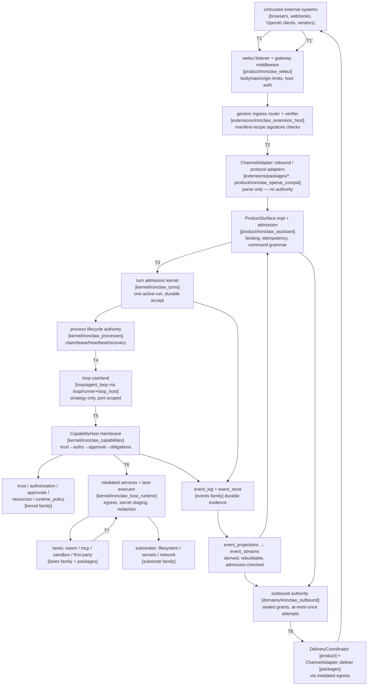
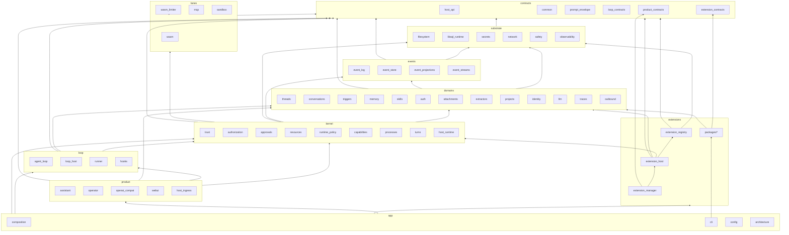

# Proposed Crate Architecture for IronClaw Reborn

> **Committed review copy.** This is the full evidence-backed proposal, authored 2026-07-29 against `origin/main` @ `dde662d5a` and an external architecture dossier (curated from current contracts, the July 2026 refactor train, and dated Slack/GitHub evidence). The executive overview lives in [README.md](README.md); per-family deep dives in [families/](families/); the completion checklist in [CHECKLIST.md](CHECKLIST.md); the execution plan in [PLAN.md](PLAN.md). File:line citations reference the **refresh baseline** below — re-verify against HEAD before acting on them.

**Status:** Proposal (architecture specification for a future restructuring plan — not a migration plan)
**Author:** architecture-lead agent session for Ben Kurrek, 2026-07-29
**Authored against:** worktree `puzzle-carpet` = `origin/main` @ `dde662d5a0e8a9f9595c0a0cab4916e0ae05f1a5` (clean). The dossier's snapshot checkout (`~/work/repos/github.com/nearai/ironclaw`, `main` @ `8da42cef7`) is 5 commits behind this; the delta adds/removes no crates.
**Refresh baseline:** `origin/main` @ `457088c8f` (2026-07-30) — 29 commits later, including the three foundations that landed after authoring (#6863, #6696, #6691; see §2.7). Every `CURRENT` measurement in §2 was re-derived at this commit; the decisions in §1 and §3–§13 are unchanged except where a dated amendment says otherwise. This document is a decision record: amendments are appended and dated, never applied silently.
**Dossier:** this directory (`AGENTS.md` reading order followed; all files + `sources/` read).
**Discovery note:** `bash scripts/codebase-graph.sh status` reported the graph **MISSING** for the validation worktree; per the repo's own fallback rule, all claims below were derived from live code, `cargo metadata`, architecture tests, and targeted `rg` — every load-bearing claim carries a `file:line` or test-name citation. Status vocabulary (`CURRENT`, `LANDED`, `IN FLIGHT`, `DIRECTION`, `INFERENCE`, `SUPERSEDED`) is used as defined by the dossier.

---

## 1. Executive decision

IronClaw Reborn keeps its capability-based microkernel model and gets a **physical layout that finally matches it**: a small set of **ownership family directories** under `crates/`, each containing **focused crates** whose boundaries are earned by contract, dependency barrier, artifact isolation, or authority — never by symmetry or noun.

The decision, in one paragraph:

> Keep the mechanically enforced 7-layer ladder (`contracts → substrates → runtimes → kernel → loops → products → app`) exactly as it exists today in `[package.metadata.ironclaw] layer` and `reborn_dependency_boundaries.rs`. Physicalize ownership as ten family directories (`contracts/`, `substrates/`, `events/`, `domains/`, `kernel/`, `lanes/`, `loop/`, `extensions/`, `product/`, `app/`) that are **discoverability groupings, not new trust boundaries**. Create exactly **three new contracts crates** (`ironclaw_loop_contracts`, `ironclaw_extension_contracts`, `ironclaw_product_contracts`) — each one carved out of an existing crate where today's dependency graph proves upper-layer vocabulary has pooled in the wrong place. Narrow the four god crates (`composition`, `extension_host`, `host_runtime`, `runner`) by moving their inventoried behavior to named owners. Delete the dead crates and dead subsystems the audit verified (`dispatcher`, `embeddings`, plus a concrete dead-surface list). Colocate every installable extension package under `crates/extensions/packages/`. The result eliminates **all 20 standing `LAYER_MATRIX_EXCEPTIONS`** — the repo's own machine-tracked debt register — without adding a single new exception.

What this proposal is **not**: it is not a crate-count minimization (target = **64** workspace packages steady-state vs ✎ **65** today (2026-08-03: the WS3 sandbox merge deleted `ironclaw_scripts` and `ironclaw_process_sandbox` and added `ironclaw_sandbox`, so today's total fell 66 → 65 and two of the six planned deletions are discharged): 6 deletions — `dispatcher`, `embeddings`, `telegram_v2_adapter`, `first_party_extension_ports`, `scripts`, `process_sandbox` — plus the `projects`→`identity` merge, against 5 additions), not a kernel mega-crate (the kernel stays a 9-crate family), and not a rewrite. *(Recomputed 2026-07-30: the seventh deletion, `ironclaw_run_state`, landed with #6696, and `ironclaw_libsql_runtime` arrived with #6863 and belongs in the steady state — so today's total is unchanged at 66 while the steady-state target rises 63→64. §2.7 carries the arithmetic.)* ✎ **2026-08-05 (WS8): 66 → 65, measured by `scripts/ci/check-target-tree.py` rather than counted by hand.** `first_party_extension_ports` is dissolved (§9 row 55), which discharges the fourth of the six planned deletions; the remaining gap to the steady-state 64 is the `projects`→`identity` merge, which is the one row still holding an exception in that gate's table.
What this proposal is **not**: it is not a crate-count minimization (target = **64** workspace packages steady-state vs ✎ **65** today (2026-08-03: the WS3 sandbox merge deleted `ironclaw_scripts` and `ironclaw_process_sandbox` and added `ironclaw_sandbox`, so today's total fell 66 → 65 and two of the six planned deletions are discharged): 6 deletions — `dispatcher`, `embeddings`, `telegram_v2_adapter`, `first_party_extension_ports`, `scripts`, `process_sandbox` — plus the `projects`→`identity` merge, against 5 additions), not a kernel mega-crate (the kernel stays a 9-crate family), and not a rewrite. *(Recomputed 2026-07-30: the seventh deletion, `ironclaw_run_state`, landed with #6696, and `ironclaw_libsql_runtime` arrived with #6863 and belongs in the steady state — so today's total is unchanged at 66 while the steady-state target rises 63→64. §2.7 carries the arithmetic.)* ✎ *(Recomputed 2026-08-05, and this time measured rather than reasoned: `cargo metadata --no-deps` reports **65** workspace packages — the whole set, i.e. 63 under `crates/` plus `tools/ironclaw_stress` plus the workspace-root package — down from 66, because WS10 executed the `projects`→`identity` merge. **That merge term is now spent**, so the remaining arithmetic to the unchanged 64 target is 65 − 4 remaining deletions + 3 remaining additions. The successive "today" figures on this line and at §2 count differently from one another; the method is stated here so the next recount does not have to guess which.)*

Why this is the right decision (each argued in §4 and §6):

1. **The layer model already works; the filesystem doesn't.** The 7-layer matrix is `CURRENT`, mechanically enforced, and violated only through 20 dated exceptions that the code itself labels with target milestones (`W4.3`, `W6`, `W7`). A flat 65-directory `crates/` hides all of that. Families make the enforced model visible; the three new contracts crates make the exceptions deletable.
2. **The audit found vocabulary pooling, not missing layers.** `ironclaw_host_api` is 38% migrated product/channel/manifest vocabulary (its own module docs say so — `state.rs:4-6`, `channel_adapter.rs:12-14`); `ironclaw_turns` is "three crates wearing one name" (8-line `ids.rs` re-export shim, a ✎ 14.5k-line `run_profile/` contract tier, an 11k turn kernel — and after #6696 took its store engine, those two *are* the crate); `ironclaw_assistant` defines ~17 single-impl ports whose real implementations live in composition/extension_host/operator. The fix is to give the pooled vocabulary contract-layer homes — not to invent new conceptual layers.
3. **The god crates decompose along seams the code already names.** 59 of `extension_host`'s 78 files arrived from composition in two PRs (#6616 `3af839354`, #6669 `89275efc9`) and were never re-partitioned; composition's `local_dev/` tree (~11k lines) *is* the production path (`runtime.rs:3647`); `host_runtime` carries `first_party_tools/` (~7.3k) that the existing registrar pattern (`FirstPartyHandlerRegistrar`) already knows how to relocate.
4. **Moveability is respected.** Illia's stated constraint — "way too much existing code and tests that is hard to move" — is honored by making the expensive unit the *split*, not the *move*: family directories are `git mv` + manifest-path edits (cheap, semantic-free); only six crates require genuine splits, and each split lands on a seam with an existing test suite on both sides.

---

## 2. Evidence and current-state summary

### 2.1 Workspace shape (`CURRENT`, re-measured 2026-07-30 at `457088c8f`)

- **66 workspace packages**: 64 under `crates/`, `tools/ironclaw_stress`, and the workspace-root package `ironclaw_integration_tests` (tests only; root `Cargo.toml` states it "has no library or binary target of its own"). ~~`ironclaw_first_party_extension_ports` is a workspace member only *implicitly* (path-dependency inclusion; it is absent from the root `members` array).~~ ✎ **2026-08-05 (WS8): 66 → 65, and the implicit-membership caveat is retired with the crate.** WS0 made its membership explicit (#6936); WS8 dissolved it into `ironclaw_loop_host`, so the root `members` entry went with it. The live figure is the one `scripts/ci/check-target-tree.py` prints — 65 members, 63 under `crates/` — and it is a machine-checked claim, not a hand count.
- **The count is unchanged since authoring; the set is not.** `ironclaw_run_state` was deleted by #6696 and `ironclaw_libsql_runtime` was added by #6863 — a one-for-one swap that leaves 66 packages and 65 `members` entries. Every count downstream of this line was re-derived, not carried forward.
- ✎ **Amended 2026-08-01 (Wave 1 truth audit): the count has moved since this measurement — **67** workspace packages at `a50ad0638`,** 65 under `crates/` plus `tools/ironclaw_stress` and the workspace-root package. Arithmetic, all from work this document specifies: −2 from WS0's dead-crate deletions (`ironclaw_dispatcher`, `ironclaw_embeddings`, #6942) and **+3 from Wave 1's contracts crates** (`ironclaw_loop_contracts`, `ironclaw_extension_contracts`, `ironclaw_product_contracts`), all three flat under `crates/` because the family directories arrive in Wave 5. **The steady-state target of 64 is unchanged** — §13 and CHECKLIST WS12 recompute from a "today" figure, so read that arithmetic as 67 − 4 remaining deletions − the `projects`→`identity` merge + 2 remaining new crates (`extension_manager`, `sandbox`) = 64. The rest of §2's `CURRENT` measurements are still as-of `457088c8f` by design; only the ones Wave 1 moved are amended in place (see §2.3's `product → runner`/`loop_host` note and §6.1.1–§6.1.4's as-built inventories).
- ✎ **Amended 2026-08-01 (WS2.4):** this PR lands `ironclaw_extension_manager` — one of §9's five planned additions, row 53 — which moves the figure above by one, to **68** workspace packages / **67** `members` entries. The steady-state target is unchanged at 64; this is the restructure spending its budget as designed, not drift. Read the arithmetic above with `extension_manager` moved from "remaining new crates" to landed: 68 − 4 remaining deletions − the `projects`→`identity` merge + 1 remaining new crate (`sandbox`) = 64. (The three WS1 contracts crates were already inside the 67 above: they replaced no crate, and the deletions that pay for them are WS3–WS8 work that has not run yet.)
- **Excluded packages**: `crates/ironclaw_silk_decoder` (libclang isolation; zero in-tree callers), `crates/ironclaw_safety/fuzz` (live, 5 targets), root `fuzz/` (**orphaned** — depends on a root lib target that no longer exists), and six WASM tool sources under `crates/ironclaw_first_party_extensions/assets/*/wasm-src/` (github, google-docs/drive/sheets/slides, slack-user) — a real artifact boundary: built out-of-band by `scripts/build-wasm-extensions.sh` and committed as `.wasm`. ✎ **Re-derived 2026-08-05 (WS7 2/2): three of the four coordinates in this bullet have moved, and one class of it is gone.** The silk decoder is **`tools/ironclaw_silk_decoder`** (§12.13 D-O relocated it to its §5 home; "zero in-tree callers" is re-measured and still exact). The fuzz package is `crates/substrates/ironclaw_safety/fuzz`, and root `fuzz/` was **deleted** with the WS8 dead-crates PR rather than re-pointed. The six WASM guests are `crates/extensions/packages/*/wasm-src/` (WS2 package colocation), and the artifact boundary is now *enforced* rather than merely described: `scripts/ci/check-wasm-artifact-freshness.py` keys each committed `.wasm` to a digest of its guest's whole source tree.
- **The v1 monolith is gone.** No root `src/`; `ironclaw_engine`, `ironclaw_tui`, `ironclaw_gateway`, `ironclaw_oauth` no longer exist. Guidance citing them (root `CLAUDE.md`, `crates/AGENTS.md` [refreshed 2026-07-02], `crates/Architecture.md:44-53`, several `.claude/skills`) is drift, not fact. Seven nonexistent crates are still referenced by current guidance (`engine`, `tui`, `gateway`, `oauth`, `skill_learning`, `webui_v2`, `product_context`).

### 2.2 The enforced layer model (`CURRENT`)

Every workspace crate declares `[package.metadata.ironclaw] layer = "…"`; `reborn_workspace_crates_declare_layers_and_follow_layer_matrix` (`crates/ironclaw_architecture_tests/tests/reborn_dependency_boundaries.rs:49`) enforces a monotone ladder over `IRONCLAW_CRATE_LAYERS = [contracts, substrates, runtimes, kernel, loops, products, app, legacy]` (`:3497`), with a special rule that `ironclaw_agent_loop` may hold **contracts-layer normal deps only** (`:129`). No crate declares `legacy` — that variant is vestigial.

**20 `LAYER_MATRIX_EXCEPTIONS` (`:3557-3702`) are the repo's own debt register**, each with a `removes_in` milestone. *(Re-enumerated 2026-07-30: the list is edge-for-edge identical to the authoring baseline — the three landed foundations added, removed, and re-milestoned nothing. `processes → resources` survives #6696 and is still W7.)*

> ✎ **Amended 2026-08-02 (Wave 2 truth audit) — the count and every file:line citation in this § are stale, and the paragraph above is the one place the current figure is still written as 20.** Measured on `main` at `3be5f056e`: the register holds **13** entries at `reborn_dependency_boundaries.rs:4065-4157`, pinned by `const WS0_LAYER_MATRIX_EXCEPTION_BASELINE: usize = 13;` (`:4063`) and asserted shrink-only at `:4199`. §8.3's dated amendment already narrates the 20 → 15 → 13 arithmetic; this paragraph was never re-derived, so a reader who starts at §2 gets 20. The three citations in the sentence above it have all drifted with the file: `reborn_workspace_crates_declare_layers_and_follow_layer_matrix` is at **`:126`** (written `:49`), `IRONCLAW_CRATE_LAYERS` at **`:4010`** (written `:3497`), and the `agent_loop` contracts-only rule at **`:197`** (written `:129`). The bullet list below is likewise a snapshot of the 20-entry register, not of today's 13 — read §8.3 for the live list. **Wave 2 moved the register by zero**, which is the expected result and not a shortfall: every edge Wave 2 removed was `products → products`, a class the matrix cannot see at all (§8.1 reading rule 1's amendment).
- **W4.3** (7×): `event_projections/triggers/conversations/hooks/outbound/event_streams/agent_loop → turns` — "turn DTOs move to turn_contracts if the JIT split fires."
- **W6** (1×): `hooks → wasm_limiter` — "directory re-layout verifies runtime/substrate placement."
- **W7** (11×): `host_runtime → {extensions, first_party_extensions, skills}`, `capabilities → extensions`, `processes → resources`, `mcp/scripts → {extensions, resources}`, `runner → {agent_loop, loop_host}` — "kernel consolidation," "neutral dispatch boundary," "extension runtime descriptors move to a neutral contract."
- **follow-up** (1×): `auth → turns` — "neutral auth/turn gate host API port."

The proposal in §5–§9 resolves every one of them structurally (no exception survives in the target).

Other live enforcement (`CURRENT`): `boundary_rules()` blocklists (product, auth, openai_compat, first-party crates, config, webui, conversations, events, event_streams, memory-family allowlists, `reborn_identity` allowlist); `reborn_extension_specificity.rs` (`reborn_generic_code_names_no_concrete_extension` + `concrete_extension_crates_link_only_from_the_binary_and_tests`); `host_product_surface_method_set_is_frozen`; composition boundaries (`composition_public_api_is_service_shaped`, `composition_public_pub_use_surface_matches_snapshot`, `reborn_binary_main_is_thin_bootstrap`, `no_substrate_crate_depends_on_composition_root`); retired-taxonomy/DTO/memory-vocabulary pins; origin-gate-matrix, manifest-reparse, deployment-mode, telegram, authorized-seal, and struct-test-support ratchets.

> ✎ **Amended 2026-07-31 (#6930).** One gate joined this list and one was tightened, neither by restructure work. **New:** `reborn_registration_pipeline_boundary.rs` — a scanner-plus-shrink-only-allowlist gate in the shape of the specificity and retired-taxonomy siblings, holding that hosted-MCP *registration* vocabulary (`PreparationRequirement`, `initial_preparation`) stays inside the registration pipeline and never enters the shared install→activate→remove lifecycle (`:32` terms, `:36-39` owned prefixes, `:53` allowlist empty, `:57` baseline 0). **Tightened, not deleted:** `reborn_manifest_reparse_gate.rs` survives with its test `manifest_reparse_stays_within_the_compiler_and_bundled_paths` (`:155`); #6930 removed six now-stale allowlist entries (−36 lines) because it deleted the production reparses behind them, which is the shrink-only ratchet working as designed. Both gates key on hardcoded `crates/ironclaw_*/src/…` path prefixes — see the WS10 note in CHECKLIST for what that costs at the first family `git mv`.

### 2.3 Production dependency topology (`CURRENT`, normal-dep graph from `cargo metadata`)

Bottom→top (longest-path levels, re-derived 2026-07-30): `host_api`(fan-in 53, fan-out 0) / `common` / `safety` / `observability` / `prompt_envelope` / `wasm_limiter` / `reborn_config` / **`libsql_runtime`** → `events`/`trust`/`network`/`memory`/`filesystem`/`llm`/`runtime_policy`/… → domain stores (`secrets`, `threads`, `extensions`, `reborn_event_store`, `memory_native`, `authorization`, `resources`, `skills`, …) → `approvals`/`mcp`/`processes`/`scripts` → **`turns`** → `agent_loop`/`auth`/`capabilities`/`event_projections`/`hooks`/`triggers` → `conversations`/`outbound`/`first_party_extensions` → `host_runtime`/`event_streams` → `loop_host` → `runner` + `first_party_extension_ports` → `product` → `openai_compat`/`telegram_extension`/`operator`/`extension_host` → `composition`/`webui` → `ironclaw` (CLI).

Load-bearing facts this proposal is built on (each verified; ✎ = re-measured 2026-07-30):
- **`extension_host` sits *above* product today** (normal dep on `ironclaw_assistant`, ✎ 113 references), because the ports it implements (delivery resolver/reply-context/admission/pairing/preference-codec) are *defined in product*, and its ingress calls product's sealed host-auth mint.
- ✎ **`product` sits above `runner`/`loop_host`** — at authoring this was one pure-data import each (failure-summary formatters at `projection/turn_events.rs:34`; a prompt constant, now `:994`). #6691 added a **third, non-data** edge: the project-create capability it evicted from composition (`product/src/project_create_capability.rs:8`) imports `ironclaw_loop_host` for real behavior. The §6.9.1 shed ("`runner`/`loop_host` single-symbol deps → `host_api::failure` + a product-owned prompt asset") now has one more site to resolve, and it is behavior rather than a constant — noted, not re-designed. ✎ **Re-measured 2026-08-04 (WS6): it has *two* more, and the count everywhere in this document is low.** The live edge is **five production files across three seams**: the project-create capability, the attachment reader, and — recorded nowhere until now — an **input-queue enqueue seam** (`reborn_services.rs`, `steering.rs`, `inbound_turn.rs`) consuming five symbols that all come from `ironclaw_loop_host/src/input_queue.rs`. `RebornServices` holds an `Arc<dyn HostInputEnqueuePort>` and steering calls it, so that seam is a port inversion, not a move. Also: §6.4.11's stated destination for the project-create capability is unreachable as written — `ironclaw_projects` is `substrates` and `ironclaw_loop_host` is `loops`, so `projects → loop_host` is upward and matrix-illegal; the reachable owner was `ironclaw_first_party_extension_ports` (`loops`, then the holder of the sibling `skill_activation_capability.rs`; dissolved 2026-08-05 into `ironclaw_loop_host::skill_activation` — §9 row 55), and only after `ProjectService` leaves `ironclaw_assistant`. ✎ **Re-measured 2026-08-05 (tail batch): seven production files, same three seams — the input-queue seam gained `channel_workflow.rs:38`.** ✎ **Corrected 2026-08-05 (program closure, plan-conformance audit) — that recount was wrong on the same day it was written, in both terms: it is EIGHT importing files across FOUR seams, and the fourth seam is one this bullet has never named.** Measured on the batch base and unchanged by it (`rg -l ironclaw_loop_host crates/product/*/src --glob '!*test*'`): the input-queue seam is `reborn_services.rs`, `steering.rs`, `inbound_turn.rs`, `channel_workflow.rs`; `project_create_capability.rs`; `scoped_fs/attachment_reader.rs`; and — unrecorded until now — a **skill-activation-observer** seam, `projection.rs` and `projection/live_progress.rs`, both importing `SkillActivationObserver`/`SkillActivationObservedEvent`. Two further files name the crate only in doc comments (`scoped_fs/mod.rs`, `projection/turn_events.rs`), so a `rg -l` count returns ten. §6.4.7's own same-day ✎ already acknowledged "product's projection depends on `loop_host`", so this document was internally inconsistent with itself. **The recount history is now 3 → 5 → 6 → 7 → 8, wrong at four of five attempts, which retires the prose count as a method**: this bullet's own conclusion — that nothing mechanical stops a new product file naming `ironclaw_loop_host` — is the finding, and the sever slice should land a gate (an inventory ratchet like `SAME_LAYER_EDGE_INVENTORY`) before or with the move, not another number. Also: the precondition this bullet ends on is **satisfied** — `ProjectService` left `ironclaw_assistant` for `ironclaw_product_contracts` on 2026-08-05 (§12.13 D-P) — and it did **not** unblock the project-create capability. The capability's blocker was never the port; it is `ironclaw_loop_host` itself, so the loops-tier route named here — `first_party_extension_ports` when this correction was written, `ironclaw_loop_host::skill_activation` since the same-day WS8 dissolution (§9 row 55; corrected 2026-08-06) — is still the only one available and is still unattempted.
  - ✎ **Amended 2026-08-01 (Wave 1 truth audit, measuring PR #6982 / WS1.7): "single-symbol" was wrong on both edges, and only one of the two is gone.** **`product → runner` is SEVERED** — it was two modules, not one symbol (`projection/turn_events.rs` imported `failure_categories::CHECKPOINT_REJECTED_CATEGORY` *and* four items from `failure_summary`); the data moved to `ironclaw_host_api::failure::{categories, summary}`, `ironclaw_assistant`'s manifest no longer names `ironclaw_turn_runner` under `[dependencies]` (the dev-dep stays, and is now documented — product's harnesses legitimately build a full turn stack), and both runner modules are private. What could not follow, because `host_api` may hold no internal dependency: `checkpoint_rejection_host_explanation` (typed on `agent_loop`'s `CheckpointKind` and `loop_contracts`' `LoopSafeSummary`) and every classifier. **`product → loop_host` SURVIVES on two behavioral sites**, and the prompt clause is the only part done (`FAILURE_EXPLANATION_SYSTEM_PROMPT` and its `prompts/failure_explanation.md` asset are product-owned now; prompt *content* is out of charter for the loop tier, §6.1.4/§6.7.2). The two survivors are `project_create_capability.rs` (the #6691 arrival named above, six `SyntheticCapability*` symbols, owed a second hop to `identity::projects` per §6.4.11) and — **not previously recorded in any document** — `scoped_fs/attachment_reader.rs` (renamed from `attachment_landing.rs` when the lander moved), which consumes the `LoopAttachmentReadPort`/`LoopAttachmentReadError` port pair. Severing needs both owners moved: WS5's product narrowing and WS6's project re-shed. **Neither edge was ever a `LAYER_MATRIX_EXCEPTION`** (`products → kernel` and `products → loops` are matrix-legal), so this work cannot move the exception count — its value is dependency-graph narrowing and prompt-content placement, worth stating because the wave milestone is written in exceptions.
- ✎ **`turns` now sits *above* `processes` and `approvals`** (normal dep, added by #6696 when the turn store became a journal projection). Both ends are `kernel` in the target, so the edge is legal by the matrix and adds no exception — but it does mean `turns` is no longer a bottom-tier "domain store" in the topology, which is what §6.5.8 predicted would happen.
- ✎ **`libsql_runtime` is a true leaf** (fan-out 0, no workspace dependencies; consumed by `filesystem`, `triggers`, and `composition`) — the driver-admission runtime #6863 introduced.
- **`slack_extension` depends only on `host_api`** (the clean model); `telegram_extension` needs `product`+`turns` for one 228-line module because `PreferenceTargetCodec` lives in product; `telegram_v2_adapter` has exactly one consumer (its sibling).
- **Concrete extension crates are linked only by the binary** (enforced; the binding table is `ironclaw_reborn_cli/src/runtime/native_extensions.rs:26-41` via `RebornHostBindings::with_channel_extension_bindings`, `composition/src/input.rs:769`).
- **Dead in production**: `ironclaw_dispatcher` (14-line shim, zero production consumers; its replacement `RuntimeDispatcher` lives in `ironclaw_capabilities/src/dispatch.rs:123`) and `ironclaw_embeddings` (zero consumers; even the root dev-dep is unused).
- **The Script/Process lane is production-dead** (`with_script_runtime` called only from tests; `RuntimeLane::Process` always hits `fail_unconfigured_lane`, `host_runtime/src/services/runtime_adapters.rs:328-331`).

### 2.4 The four god crates (`CURRENT`, audited module-by-module; line counts are `src/**/*.rs`, ✎ re-measured 2026-07-30)

The four are still the four — but two of them **shrank** and two **grew**, and the mass that left composition and runner mostly landed in crates this proposal already names as its owners. That is the shape a healthy narrowing has; it does not change any target.

- **`ironclaw_composition`** (✎ **68.3k** lines, was 77.0k): still ~30% assembly / ~70% behavior. ✎ The tree formerly called `runtime/local_dev/**` is now `runtime/capability_host/**` + `capability_authorization` + `runtime_mounts` (#6691 retired the misnomer in the module names and the typename ratchet — CHECKLIST WS6 item, landed); it is ~11.6k lines and still the **production** capability/delivery/approval/skill path — `RuntimeSubstrate` still has only `None|ProductionShaped` variants and ✎ **`runtime.rs:3095`** (was cited here as `:3016`; re-measured 2026-08-03 at `0f897e9366`) still hardcodes `let local_runtime = Some(&services);` — and the *variable* is the smallest part of what survived the rename: `local_runtime` appears **191 times** in this crate's `src`, including six public API symbols and the public type `RebornLocalRuntimeIdentity`. §6.10.1 carries the full correction; the rename is tracked as **#7098**. Behavior inventory still resident, with owners named in §9: approval/authorization policy (`capability_authorization`), trigger poller + trusted submit (~4.3k across `automation/trigger_poller*`, `trigger_fire_access.rs`, `trigger_creation_assembly.rs`), admin-user directory (322), trace capture (1.2k + a 350-line hooks projection), system-prompt assembly and seeding (`root/default_system_prompt.rs` — its four *content* assets moved to `ironclaw_loop_host/prompts/` on 2026-08-03; the module is now assembly plus `std::fs` seeding of the user-editable `SYSTEM.md`), HTTP route mounts (`llm_admin/{openai_compat_serve,nearai_login_serve}.rs`), project filesystem reader (453), blocked-auth resume fan-out, Google OAuth secret store (155), NEAR-AI MCP (336). §6.10.1 carries the eviction reconciliation. `build_reborn_services` — still cited by `crates/Architecture.md` — **does not exist**.
- **`ironclaw_extension_host`** (✎ **50.7k** lines, ✎ 88 files, was 45.5k/78, no guidance file): a generic lifecycle/binding core (#6116) + channel ingress router/verifier (vendor-blind, manifest-recipe driven — the system's cleanest seam) + delivery/egress transports + the product-serve wiring landed from composition (#6616/#6669) + non-extension strays (`skill_learning.rs`, `bundled_skills.rs`+`build.rs`, Axum pairing routes). ✎ It grew again in #6691, which handed it the generic bundled-skill tree migration and composition's extension capability surface — more evidence for the §6.8.3 split, not less. Unpoliced `include_str!` edges into `../ironclaw_first_party_extensions/assets/…`. ✎ **Re-measured 2026-07-31 at `2e6522580`: 56,940 lines / 93 files** — of which #6930 contributed **+3,367 / +4 files**, a whole new sub-owner: the hosted-MCP *registration pipeline* (`hosted_mcp_admission.rs`, `hosted_mcp_manifest.rs`, `hosted_mcp_preparation.rs` — declared private at `lib.rs:60,62,63` — plus the public `mcp_catalog_safety.rs` at `:74`, beside the pre-existing `hosted_mcp_discovery_authority.rs`). See §6.8.2 for what that means for the split. ✎ **Re-measured 2026-08-02 at `3be5f056e` (Wave 2 truth audit): 48,791 lines / 75 files** — WS2.4 carved `ironclaw_extension_manager` out of it (§6.8.3), so this entry's peak figure of 56,940/93 is now the *pre-split* high-water mark, not the current state. It is still a god crate by mass and still first in this list; the split took the product face, not the bulk.
- **`ironclaw_host_runtime`** (✎ **48.5k** lines, was 46.5k; 31 internal deps incl. `libsql`, `deadpool-postgres`, `bollard`, `rcgen`): kernel pipeline construction (sole `CapabilityHost` construction site) + closed lane executor + mediated egress/secret staging/obligations (✎ `obligations.rs` 3,097, fuses three owners — ✎ **superseded 2026-08-03 (WS3 obligations/builder PR): the file was 3,122 lines at `0f897e9366` and no longer exists.** It is `obligations/{mod,handler,staged_handoffs,process_store,tests}.rs` at 217/1,276/500/586/650, one module per chartered owner, and the `arch-exempt: large_file` waiver it carried is deleted rather than moved — every module is under the 1,500-line gate. The remaining god-module in this crate is `first_party_tools/`, which the WS3 first-party row owns.) + `first_party_tools/` (incl. the `trace_commons` product feature) + pure assembly + an unwired Docker/CA sandbox subsystem ("ships unwired until W6").
- **`ironclaw_turn_runner`** (✎ **33.1k** lines, was 38.3k): ✎ #6696 took the scheduler — `turn_scheduler` fell from 2,003 lines to **292**, and what remains is explicitly "an agent-turn projection over the generic process supervisor" (`ironclaw_processes::ProcessSupervisor`). ✎ The `subagent/` tree fell 7.7k → 4.9k, but **`subagent/await_edge/` survives at 2.9k** — the await-edge machinery was reworked, not deleted (see §2.7 and §6.7.3). Still resident: a ✎ 28-`with_*` loop-host factory and `runtime.rs` `build_*` functions composition reaches into. ✎ **The model gateway (3.9k) and tool disclosure (5.6k) are gone as of 2026-08-03 (WS3 runner sheds) — both moved to `ironclaw_loop_host`, taking `model_routes`, the driver-host port adapters, and the crate's whole `ironclaw_llm`/`ironclaw_common`/`base64`/`jsonschema` dependency set with them. The crate is **22.0k**, was 33.2k; `ironclaw_loop_host` is **49.7k**, was 38.5k.**

### 2.5 Contract-vocabulary pooling (`CURRENT`)

- `ironclaw_host_api` (✎ 25.8k lines, 63 files, 46 modules — essentially untouched by the three merges; 45 wildcard-re-exported as a "contract prelude", `lib.rs:85-132`): ~9.8k lines (38%) are product/channel/manifest vocabulary (`product_adapter/` 6,178; `product_surface.rs` 608 — `ProductSurface` trait :352 with 2 production impls; `channel.rs` 732; `recipe.rs` 935; `package_lifecycle.rs` 650; `state.rs` 187; `operator_llm.rs` 140), several with behavior (rendering/parsing/`tracing::error!`/a `tokio::sync::mpsc` channel) that violates the crate's own charter. ✎ **Re-measured 2026-07-31 at `2e6522580`: 27,898 lines / 67 files / 50 modules, and the wildcard prelude is gone** (`rg "pub use .*::\*" crates/ironclaw_host_api/src/lib.rs` → 0; the file is 97 lines and states the no-prelude rule at `:87-95`) — that half is WS0/#6934, not #6930. #6930's share is **+372 lines / +1 module**: `hosted_mcp` (`lib.rs:54`), the hosted-MCP wire vocabulary. It lands the charter finding one more time rather than fewer: `hosted_mcp.rs` carries scheme/length/control-char validation and a `WWW-Authenticate` header parser (`:23-51`, `:84-99`) alongside its newtypes, so the "behavior in a contracts crate" list grows by one module. It also mutually references `package_lifecycle` (`hosted_mcp.rs:11` imports `LifecyclePackageId`; `package_lifecycle.rs:16` imports `RegisterHostedMcpRequest`), which is free intra-crate today and is why the §6.1.2 carve-out has to take both modules together.
- `ironclaw_turns` (✎ **26.0k** lines, was 33.7k — #6696 moved the whole `turn_state_row_store/**` engine into the process journal): `ids.rs` is **still 8 lines** and `scope.rs` **1 line** of `pub use ironclaw_host_api::…` — the canonical turn IDs already live in `host_api/src/turn.rs`. The same six consumers (`auth`, `event_streams`, `outbound`, `telegram_extension`, `triggers`, `event_projections`) still use turns for vocabulary only and already depend on `host_api` directly. ✎ `run_profile/` (**14.5k** lines, 11 `Loop*Port` traits, its own `CLAUDE.md`) is the real loop-contract tier — it did **not** shrink, so the contracts carve-out (§6.1.4) is now a *larger* share of a smaller crate, and the case for it is stronger than at authoring. ✎ 18 consumers today (was 17).
- `ironclaw_assistant` (✎ **57.0k** lines, was 51.6k — it gained composition's automation/communication/project-access orchestration in #6691): ✎ `reborn_services` cluster **17.5k** (31%); ~17 of 46 public traits have exactly one production impl, and those impls live in composition/extension_host/operator — ports exist to satisfy layering, and their *location* (product) is what forces `extension_host`/`operator`/`telegram` above product.

### 2.6 Verified dead surface (`CURRENT` — delete list)

*(Re-checked 2026-07-30: every item below still resolves and still has no production consumer; none of the three landed foundations removed one, and `approvals::ToolPermissionOverrideStorePort` in particular survived the `run_state` absorption. The list is unchanged.)*

> **Correction (2026-07-31, verified during WS8 execution).** Three entries in the paragraph below were wrong at the current base, found by re-verifying each item with `rg` immediately before deleting it (PR #6943) — the entries are left in place and corrected here rather than silently rewritten:
>
> - **`llm::reasoning` is half-live, not "re-exported, unreferenced".** `ironclaw_turn_runner`'s model gateway calls `clean_response`, `contains_codex_text_tool_call_syntax`, and `recover_codex_text_tool_calls_from_tool_names` on the live model-response path (`crates/ironclaw_turn_runner/src/model_gateway.rs:26`), and those three pull in a long chain of private helpers. The dead half is real and enumerated in PR #6943; deleting it needs its own freshly verified, scoped PR.
> - **`outbound::RouteCurrentRunFinalReply` has a production impl**, so "0 impls" is wrong: `UnavailableRunFinalReplyRouter` in `host_runtime`'s first-party tools (`crates/ironclaw_host_runtime/src/first_party_tools/mod.rs:501`), dispatched through `Arc<dyn …>` by the outbound-delivery tool. It is a wired seam, not dead surface.
> - **`approvals::ToolPermissionOverrideStorePort` has zero *named* impls (as stated) but 39 `dyn` sites** across 18 files in composition, product, and extension_host. Removing it is a mechanical collapse/rename onto `CapabilityPermissionOverrideStorePort`, not a deletion, and belongs with the deliberate `approvals` narrowing. ✎ **DONE 2026-08-05 by WS8, not by the narrowing row.** 44 sites in 18 files (39 `dyn` + 5 imports) plus the blanket `impl`/trait pair in `ironclaw_approvals/src/lib.rs`. The alias was a *trait*, so it minted a second `dyn` vtable identity for one behavior; the seven sibling `pub type ToolPermission*` aliases are a different class and stay for the narrowing row.
>
> One further correction of a *conditional*, not an entry: the `event_projections` trio was **not** the only justification for that module's `turns` dep edge. `ProjectionError::TurnEventRebaseRequired` carries `ironclaw_turns::EventCursor` and `event_streams` matches the variant in production, so `memory` dropped with the trio but `turns` did not. See CHECKLIST WS8. ✎ **Superseded 2026-08-05: the correction is itself now stale, and the edge is gone.** A Waves 0–4 contracts extraction moved `EventCursor` into `ironclaw_host_api::turn`, so `event_projections` stopped naming `ironclaw_turns` without any row claiming it; WS8 then deleted the unconstructible variant and the production match arm that remained. Neither `ironclaw_event_projections/Cargo.toml` nor `LAYER_MATRIX_EXCEPTIONS` (which is `&[]`) carries anything for this edge today.

Crates: `ironclaw_dispatcher`, `ironclaw_embeddings`. Subsystems/modules with zero production consumers: `ironclaw_llm::reasoning` (4,503 lines, re-exported, unreferenced); `ironclaw_skills::{registry, catalog, v2, gating}` (~3,985 lines, default-features-on, zero external callers); `ironclaw_auth::loopback_oauth` (455 lines; its "sole consumer," the v1 binary, no longer exists) and ungated `fakes.rs` (1,490 lines shipping in release builds); `event_projections::{EventStreamManager (name-collides with the real one in event_streams), PendingGateProjection (#[allow(dead_code)], 0 sink impls), DurableMemoryAuditSink}` — the module's `memory` and `turns` dep edges are justified *only* by this dead code; `events::{parse_jsonl, replay_jsonl}`; `outbound::RouteCurrentRunFinalReply` (0 impls); `approvals::ToolPermissionOverrideStorePort` (marker trait, 0 named impls); `memory_native::EmbeddingProvider` (0 impls; near-verbatim duplicate of `ironclaw_embeddings`'; vector search silently degrades to FTS); `common::trust_boundary` (395 lines, `#[allow(dead_code)]`); `trust::{SignedRegistry (inert), DevTrustOverride, BundledRegistry (unwired)}`; `composition::root::product_live_adapters` public exports (integration-harness-only); `filesystem::HsmBackend` (self-described non-security placeholder); `runner::production_readiness` (no production caller); secrets `placeholder` subsystem and host_runtime sandbox CA (both self-documented as unwired pending W6); unused dep edges `composition→event_streams` and `memory_native→prompt_envelope`; `reborn_identity::{lookup, bind, adopt_migrated_identity}` (0 production callers; open issue #5618); root `fuzz/` (unresolvable).

### 2.7 Landed foundations (`LANDED` — amended 2026-07-30)

> **Amendment, 2026-07-30 (refresh against `457088c8f`).** All three PRs this section originally tracked as `IN FLIGHT` merged on 2026-07-29/30, *after* this document was authored. The authoring-time record is preserved verbatim under each entry; what follows each "**Landed:**" line is what the merged diff actually contains, measured at the refresh baseline. Nothing in §5–§11 was rewritten to match a merge — where the merged code and the target diverge, the divergence is named and left for review, not silently resolved.

- **PR #6691** ("Refactor composition assembly into focused builders") — **MERGED 2026-07-30, `d46fdc9b8`.**
  *Authored-at-the-time record:* "OPEN, non-draft, `REVIEW_REQUIRED`, head `c1ea0232b`. Composition net −9,421 lines; moves automation/communication/project-access/blocked-auth orchestration → product, indexed blocked-auth lookup → turns, bundled-skill migration → extension_host. Directionally identical to this proposal's composition contract; nothing here presumes its exact code."
  **Landed:** composition −8,705 lines against its merge parent (the PR reports −9,421 against the older base it was cut from). Owners gained what composition shed: `product` +4,863, `loop_host` +2,962, `extension_host` +753, `first_party_extension_ports` +356. It also **retired the `local_dev` misnomer** in the module names and the typename ratchet (`runtime/local_dev` → `runtime/capability_host`, `local_dev_authorization` → `capability_authorization`, `local_dev_mounts` → `runtime_mounts`, `local_dev_boot` → `standalone_boot`, `reborn_localdev_typename_ratchet` → `reborn_standalone_typename_ratchet`) — a CHECKLIST WS6 item, now done. Direction confirmed; §6.10.1's shed inventory is reconciled item-by-item there, and roughly half of it remains.
- **PR #6696** ("Collapse lifecycle state into the row-native process journal") — **MERGED 2026-07-29, `bed3f6805`** (+31,677/−81,499 across 374 files).
  *Authored-at-the-time record:* "OPEN **draft**, `CHANGES_REQUESTED`, head `94c6abdbf`… This proposal adopts the *ownership* direction (processes = lifecycle authority; run_state dissolves; runner narrows) and marks every dependent mapping entry as **contingent on #6696-or-equivalent landing**."
  **Landed, against the four contingencies this document gated on:**
  1. **`run_state` deletion — LANDED as specified.** `crates/ironclaw_run_state` is gone; `run_state/src/lib.rs` became `approvals/src/approval_store.rs` and its three contract suites moved with it.
  2. **`approvals` widening — LANDED as specified.** `approvals` now owns the approval-request and gate record stores. ✎ 7 consumers (was 6).
  3. **`processes` widening — LANDED, and larger than specified.** `processes` went 2.7k → **12.8k** lines and now holds the row-native journal (`journal.rs`, `journal_store/**` with command/migration/observer/rows/state/validation), `supervisor.rs` (1,698 lines), `invocation_state.rs`, `capability_process.rs`, and `result_store.rs`. ✎ 8 consumers. §6.5.7's `DIRECTION` marking is discharged.
  4. **`runner`'s scheduler/await-edge shed — LANDED IN PART; one half diverges.** The scheduler *did* invert onto `processes::ProcessSupervisor`: `turn_scheduler` is now 292 lines whose own module doc reads "agent-turn projection over the generic process supervisor." But **runner's await-edge machinery was not deleted** — `subagent/await_edge/` survives at 2,885 lines (resolver 2,128, store 511, mod 152, boot_recovery 94); `roster.rs` and `goal_store.rs` went, and the rest was reworked onto process edges rather than removed. **⚠ This is the one place the merged code contradicts a claim in this document** (§2.4 and §6.7.3 both said #6696 deletes it). Flagged, not resolved: §6.7.3 keeps the await-edge shed as target work, now *ungated* and owned by the loop tier rather than waiting on someone else's PR. Whether the surviving 2.9k is genuinely reducible to journal edges is a design question for the turn_runner narrowing, not bookkeeping. ✎ **Resolved 2026-08-05 by measurement (§12.13 D-S, delegated authority at owner direction; flagged for the #6696 author's post-hoc review): the contradiction is closed without deleting anything.** The surviving 2.9k splits 1,459 production / 1,448 `#[cfg(test)]`; its store half is measured to be exactly the journal projection #6696's note promised (that shed happened *inside* the merge), and its resolver half is measured non-expressible in journal edges — a genuine loop-tier responsibility. §6.7.3 is amended accordingly and no longer contradicts the merged code.
  Two consequences worth recording because they are structural, not cosmetic: `turns` shed its whole `turn_state_row_store/**` engine (33.7k → 26.0k lines) and became a consumer of `processes` — exactly the "store/scheduler halves become projections/adapters over `processes`" that §6.5.8 predicted, including its dependency-order effect (§2.3).
- **PR #6863** ("fix(libsql): serialize writers and recover transient contention") — **MERGED 2026-07-29, `934a6540d`.** Not tracked at authoring; it landed the same day and **adds a workspace crate**, so the target must account for it. It introduces **`ironclaw_libsql_runtime`** (`[package.metadata.ironclaw] layer = "substrates"`): one shared read pool plus exactly one write-admission lane per composed physical libSQL database, with typed checkout-failure classification and provenance-proved targets. Composition opens the database once and wires the shared runtime; `filesystem`, `triggers`, the event log, and turn-state writes all traverse the same writer lane; backend crates keep their own transactions. Placement, contract, and the driver-rule reconciliation are §6.2.6, §9 row 12, and §11.2.6.
- **PR #6930** ("feat(extensions): register hosted MCP servers") — **MERGED 2026-07-31, `2e6522580`** (+15,002/−1,818 across 153 files). Not tracked at authoring; it is the first *feature* PR large enough to move this document's evidence base, and it lands entirely inside the extension family the restructure is about to reshape. **What it adds:** a user-registered hosted-MCP server pipeline — a WebUI route and registration modal, endpoint admission, synthesized manifests, live `tools/list` discovery, and the lifecycle that carries a registered-but-not-yet-discovered definition to an installed, publishing package. **Where the mass landed, and why each matters here:**
  1. **`ironclaw_extension_host` +3,367 lines / +4 files (→ 56,940 / 93).** A new, coherent sub-owner — the registration pipeline (§6.8.2, §2.4). It is *not* part of the manager half §6.8.3 splits out, so the split inventory now has a third destination question, recorded at §6.8.2 rather than decided here.
  2. **`ironclaw_extension_registry` +2,306 lines / +1 file (→ 11,631 / 14).** The registry gained a **new durable record class**: registered *package definitions* that persist with zero installations, with their own retention policy (`definition_admission.rs`, `installations.rs:802,816`). §6.8.1's "honest re-charter" gets one more record to be honest about.
  3. **`ironclaw_host_api` +372 lines / +1 module** (`hosted_mcp`) — with validation behavior in it, and mutually referencing `package_lifecycle` (§2.5, §6.1.1).
  4. **`ironclaw_mcp` +226 lines** (2,483 → 2,709, still one file) — the §6.6.3 split target grew (§6.6.3).
  5. **One new architecture gate** (§2.2, §11.1) and **one tightened** — the manifest-reparse gate lost six now-stale allowlist entries and was *not* deleted.
  **What it did not change:** no `LAYER_MATRIX_EXCEPTIONS` edit (`reborn_dependency_boundaries.rs` untouched), no new internal dependency edge except `extension_host → common`, `ironclaw_host_api` still holds zero `ironclaw_*` deps, and the four DTO names `ironclaw_mcp` reaches through the registry crate (`ExtensionPackage`, `ExtensionRuntime`, `HostedMcpDiscoveredTool`, `HostedMcpDiscoveredToolAnnotations`) are byte-identical as an import list — so the W7 `mcp → extensions` exception is the same edge, over a reshaped payload (CHECKLIST WS3).
- **PR #6253** (Illia's interactive architecture-simplification explorer): unchanged — models the 2026-07-17 design note that `main` already deleted as stale (#6670) and that this proposal supersedes; the explorer should be regenerated against this target or closed, **coordinated with its author**. This refresh deliberately does not touch, retarget, or close it.

### 2.8 Current-state conclusion

The dossier's assessment is confirmed with stronger evidence than it claimed: **intended ownership is cleaner than the physical layout**, the mechanical layer model is healthy, the mass sits in four god crates plus two pooled contract crates, and the debt is already itemized *by the code itself* (layer exceptions with milestones, `arch-exempt` markers with plan numbers, dead subsystems annotated "unwired until W6"). A credible target must therefore (a) preserve the layer model, (b) give the pooled vocabulary contract homes, (c) name an owner for every inventoried behavior in the god crates, (d) delete the verified-dead surface, and (e) make extension packages physically self-contained. That is what follows.

---

## 3. Non-negotiable invariants

These are restated from the dossier and current contracts; the target preserves all of them. Where the proposal *changes* a contract, the change is called out explicitly here and argued in §6.

1. **The kernel is a conceptual security/authority perimeter, not one crate** (`docs/internal/reborn/contracts/kernel-boundary.md:20`: "There is no requirement to create an `ironclaw_kernel` crate"). Target: kernel = a 9-crate family.
2. **Crate boundaries are not automatically trust boundaries.** The only loop-side trust membrane is `CapabilityHost` + host ports; trusted host internals share canonical types without mirror DTOs per hop.
3. **Product is first-party userland above the kernel and is not an extension.**
4. **Composition performs deployment selection and dependency wiring only** — no domain behavior or policy. (Today violated ~70/30; target restores it.)
5. **`ironclaw_host_api` is neutral, low-dependency authority vocabulary** — no execution, persistence, product workflow, or framework behavior. (Today violated by ~38% of its mass; target restores it via §6.1.)
6. **Authorization, approvals, obligations, resource reservation, dispatch, execution, and durable evidence remain distinct stages** even where they share canonical types (`Decision`, `Obligation`, `Authorized`).
7. **Filesystem, network, secrets, process lifecycle, and capability authority remain mediated host responsibilities**; loops, extensions, and products get scoped handles and requests, never ambient clients or raw secrets.
8. **Extensions are installable packages**; declarative metadata/lifecycle, generic hosting, concrete package behavior, and runtime execution are four separate responsibilities.
9. **Runtime kind is an execution mechanism, never product taxonomy** (`RuntimeKind`/`RuntimeLane` stay out of identity and UX).
10. **Vendor/protocol behavior stays out of generic kernel, product, composition, and extension-host crates** (enforced today by `reborn_extension_specificity.rs`; the target shrinks its allowlist toward zero).
11. **Durable events, projections, and transport streams remain three contracts**; projections are rebuildable and never a second write authority.
12. **A shipped loop or first-party extension does not bypass capability mediation** — first-party raises a policy ceiling, never grants permission.
13. **A crate boundary must be earned** (independent contract; real dependency/security/runtime/artifact barrier; multiple production implementations; release isolation; platform/compile isolation) — otherwise it's a module. Applied per-crate in §6; the crate-vs-module verdict is stated for every retained and created crate.
14. **Do not optimize for minimal crate count**; optimize for ownership clarity, safe dependency direction, discoverability, and removal of accidental boundaries.

**Deliberate contract adjustments this proposal makes (marked, with justification):**
- **A. Port relocation:** single-impl ports currently defined in `ironclaw_assistant` whose implementations live below/beside it (delivery resolution, admission, operator services, preference codecs, lifecycle vocabulary) move to `ironclaw_product_contracts`. This does not weaken any stage separation; it makes the existing dependency inversion explicit and removes three upward edges (`extension_host→product`, `operator→product`, `telegram_extension→product`). (§6.1.3)
- **B. Extension surface vocabulary becomes neutral:** `ChannelAdapter`/`ToolAdapter`/entrypoint/manifest-surface/recipe vocabulary moves from `host_api::product_adapter` to `ironclaw_extension_contracts`, resolving the W7 "descriptors move to a neutral contract" direction the exceptions already record. (§6.1.2)
- **C. Verified-inbound evidence minting is consolidated:** today two feature-gated mint families exist (`host_api::product_adapter::auth::mark_bearer_token_verified` and `product::auth::mark_request_signature_verified`). The target seals all inbound-verification evidence constructors in `ironclaw_extension_contracts` (channel/webhook evidence) and `ironclaw_host_api` (bearer/session evidence), minted only by the generic verifier/authenticator code paths. This is a security-boundary *tightening*; §12 carries it as a named risk with required tests.
- **D. Layer reassignments (metadata only, matrix unchanged):** `extensions` loops→substrates; `skills` loops→substrates; `extension_host` products→loops; `runner` kernel→loops; `hooks` substrates→loops; `processes` runtimes→kernel. Each is argued at its §6 entry; together with A/B they eliminate every standing matrix exception.

---

## 4. Alternatives considered

Three plausible structure strategies were developed far enough to compare honestly. The recommendation is Strategy B.

### Strategy A — "Flat tree + surgical consolidation only" (rejected)

Keep `crates/` flat; do no directory work; only delete dead crates, split the god crates, and fix dependency edges.

- **For:** smallest diff; zero path churn in manifests, CI selectors, and guidance; every improvement is purely semantic.
- **Against:** it abandons the one deliverable both Ben and Illia named — a *legible* map ("so agents don't get giga confused"). A flat 60-entry directory cannot express family membership, so ownership continues to live only in tribal knowledge and a routing table (`crates/AGENTS.md`) that measurably drifts (it was refreshed 2026-07-02 and already lists six crates that no longer exist). The audit showed guidance-file presence is the best predictor of crate discipline; a flat tree gives per-family guidance nowhere to live. It also leaves the `reborn_*` naming residue (meaningless now that v1 is gone) and the extension-package scatter (Illia's explicit July-23 complaint) unaddressed.
- **Verdict:** rejected — it optimizes diff size over the stated goal. Its good half (dead-code deletion, edge fixes) is contained in Strategy B.

### Strategy C — "Aggressive owner consolidation" (~12 mega-crates) (rejected)

Merge to roughly one crate per conceptual box: `ironclaw_kernel`, `ironclaw_substrate`, `ironclaw_loop`, `ironclaw_assistant`, `ironclaw_extension_registry`, `ironclaw_app`, etc.

- **For:** minimal crate count; no cross-crate DTO hops inside a mega-crate; fewer manifests; superficially matches "one trust boundary" rhetoric.
- **Against (fatal, in order):**
  1. **It erases mechanically enforced security seams.** Today `cargo` itself proves that `agent_loop` cannot reach `capabilities` (contracts-only rule), that `wasm` has no network/secret deps, that `memory`'s allowlist is `{host_api, prompt_envelope}`, that `outbound` has no HTTP client, and that `host_api` has zero internal deps. Merging converts each of these from a compiler guarantee into a code-review hope — exactly the "mass pooling inside a crate" failure mode the repo's own review skill names as the way this codebase actually decays.
  2. **It contradicts the dossier's non-goals verbatim** ("one monolithic kernel crate"; "merging authorization, approvals, secrets, network, and filesystem merely to reduce package count").
  3. **It destroys real dependency-cone isolation.** `events` consumers today compile no TLS/DB stack because `reborn_event_store` isolates `libsql`+`deadpool-postgres`+rustls; `host_api`'s 56 dependents compile no wasmtime/axum/reqwest. One substrate mega-crate would put wasmtime and Postgres in nearly every build path and worsen the compile times it claims to fix.
  4. **Review evidence argues against big-bang rewrites here**: the July train succeeded as owner-by-owner extractions; the one mega-change of the period (#6696, +31.7k/−81.5k across 374 files) spent its life in draft under `CHANGES_REQUESTED` precisely because collapsing lifecycle state is high-risk. ✎ It has since landed — and landed *incompletely* against its own design note (runner's await-edge machinery survived; §2.7), which is the argument's point restated rather than refuted.
- **Verdict:** rejected. Where consolidation is *earned* (dead shims, single-consumer splits like `telegram_v2_adapter`, three unwired sandbox fragments), Strategy B does it.

### Strategy B — "Family directories + focused crates" (recommended)

Physical family directories that mirror ownership; focused crates inside them; three new contracts crates where the dependency graph proves vocabulary pooled in the wrong layer; targeted narrows/splits of the four god crates; verified-dead deletion; extension packages colocated.

- **For:**
  1. **It builds on what is already enforced.** The 7-layer metadata + matrix stays byte-identical (one vestigial variant removed); families are discoverability, layers remain the dependency truth. Directory ≠ boundary is stated explicitly, satisfying the dossier's "physical tree makes ownership obvious without pretending every folder is a security boundary."
  2. **It clears the repo's own debt register.** All 20 layer exceptions resolve structurally (verified case-by-case in §8.3) — not by editing the allowlist but by making each exception's stated `removes_in` condition true.
  3. **Each new crate passes the crate gate** with named consumers and a named barrier (§6): `loop_contracts` (6 consumers stop depending on the turn kernel; gives `agent_loop`'s contracts-only rule a complete home), `extension_contracts` (lanes and hosts stop depending on the registry crate; channel packages depend on contracts only, matching the already-clean Slack shape), `product_contracts` (compile-enforces the "DTOs/descriptors only" discipline that `webui`'s guide demands but only review enforces; removes three upward edges).
  4. **Moves are cheap, splits are few.** ~45 of the mappings in §9 are pure moves/renames; only six crates split, each along an audited seam with existing tests on both sides (e.g. `extension_host`'s split follows the exact file lists of #6616/#6669; `turns`' split follows its own `run_profile/CLAUDE.md` boundary).
  5. **It gives Ben's per-root `AGENTS.md` plan a physical anchor** — one contract file per family root (§11.4), which the audit showed correlates with discipline.
- **Against (acknowledged):** path churn (every moved crate touches `members`, path deps, CI selectors, guidance); family membership can be mistaken for a trust claim (mitigated by §5's explicit legend + §11 tests); five new crates add manifests (bounded: net workspace count still drops 66→64 steady-state).
- **Verdict:** **recommended.**

---

## 5. Recommended target directory tree

Legend: `▣` = Cargo package (workspace member) · `▢` = directory only (family or grouping — **never a trust boundary by itself**) · `◇` = Cargo package excluded from the workspace (artifact/tooling isolation) · `(NEW)` = crate created by this proposal · `(narrowed)` = same crate, reduced charter · `(renamed)` = same code, new name. Layer metadata shown as `[layer]` — this remains the mechanically enforced dependency truth; family placement is ownership/discoverability.

```text
crates/
├── contracts/                        ▢ neutral vocabulary & ports (leaf tier)
│   ├── ironclaw_host_api             ▣ [contracts] (narrowed)   authority vocabulary: ids/scope/path/mount,
│   │                                                            capability/action/decision/approval/resource,
│   │                                                            Authorized + CapabilityDispatcher port, resolution/
│   │                                                            failure cluster, http-egress port, ingress descriptors,
│   │                                                            runtime/trust/runtime-policy vocab, turn vocabulary
│   ├── ironclaw_common               ▣ [contracts] (narrowed)   cross-domain primitives: identity newtypes, pkce,
│   │                                                            hashing, paths, timezone, env overlay, attachment fmt
│   ├── ironclaw_prompt_envelope      ▣ [contracts]              untrusted-snippet envelope (leaf)
│   ├── ironclaw_loop_contracts       ▣ [contracts] (NEW)        the loop-tier contract: Loop*Port set, driver/host
│   │                                                            contracts, run-profile vocabulary, LoopExit DTOs
│   ├── ironclaw_extension_contracts  ▣ [contracts] (NEW)        extension surface vocabulary: ChannelAdapter/ToolAdapter/
│   │                                                            entrypoint, manifest surface descriptors, auth recipes,
│   │                                                            installation/public state, verified-inbound evidence
│   └── ironclaw_product_contracts    ▣ [contracts] (NEW)        ProductSurface + caller + descriptors, product wire DTOs
│                                                                (incl. AppEvent), product-side ports (delivery resolution,
│                                                                admission, operator services, preference codecs)
├── substrates/                       ▢ privileged mechanism substrates (kernel-mediated)
│   ├── ironclaw_filesystem           ▣ [substrates]             RootFilesystem/ScopedFilesystem/mounts/CAS + backends
│   ├── ironclaw_documents            ▣ [substrates]             bounded structure-preserving OOXML transforms +
│   │                                                            deterministic HTML-subset PDF rendering
│   ├── ironclaw_libsql_runtime       ▣ [substrates]             shared libSQL connection admission: one read pool +
│   │                                                            one write lane per database (added 2026-07-30)
│   ├── ironclaw_secrets              ▣ [substrates]             encrypted secret store, leases, one-shot consumption
│   ├── ironclaw_network              ▣ [substrates]             network policy + hardened egress transport
│   ├── ironclaw_safety               ▣ [substrates]             injection detection, redaction, leak scanning
│   └── ironclaw_observability        ▣ [substrates]             latency-trace macros (cross-cutting leaf)
├── events/                           ▢ evidence → derived views → transport streams (three contracts)
│   ├── ironclaw_event_log            ▣ [substrates] (renamed)   typed redacted event/audit vocabulary + log traits
│   ├── ironclaw_event_store          ▣ [substrates] (renamed)   durable backend selection + fail-closed profiles
│   ├── ironclaw_event_projections    ▣ [substrates] (narrowed)  replay-derived read models (dead writers deleted)
│   └── ironclaw_event_streams        ▣ [substrates]             transport-neutral stream manager (admission/replay/lag)
├── domains/                          ▢ typed record/service domains behind the kernel
│   ├── ironclaw_threads              ▣ [substrates]             canonical transcript service
│   ├── ironclaw_conversations        ▣ [substrates]             external↔canonical binding, idempotency, pairing
│   ├── ironclaw_triggers             ▣ [substrates]             scheduled-trigger records + deterministic tick
│   ├── ironclaw_memory               ▣ [substrates]             provider-neutral memory contract + conformance suite
│   │                                                            (providers → extensions/packages/, amended 2026-07-29)
│   ├── ironclaw_skills               ▣ [substrates] (narrowed)  skill parsing/selection/management + pure learning
│   ├── ironclaw_auth                 ▣ [substrates] (narrowed)  product-auth flows + recipe-driven AuthEngine
│   ├── ironclaw_attachments          ▣ [substrates] (widened)   attachment landing routine + its ports
│   ├── ironclaw_extractors           ▣ [substrates]             pure bytes→text extraction
│   ├── ironclaw_identity             ▣ [substrates] (renamed)   external identity → stable UserId + user directory
│   ├── ironclaw_llm                  ▣ [substrates] (narrowed)  LlmProvider contract, providers, registry, decorators
│   ├── ironclaw_trace_commons        ▣ [substrates] (renamed)   Trace Commons client: envelope/redaction/queue/credits
│   ├── ironclaw_web_app             ▣ [substrates]             Web Push (RFC 8030/8291/8292) records, encryption,
│   │                                                            request planning (added 2026-08-08, browser channel)
│   └── ironclaw_outbound             ▣ [substrates]             metadata-only outbound policy/state (sealed grants)
├── kernel/                           ▢ the authority perimeter — nine crates, steady-state reached
│                                       (the transitional tenth, ironclaw_run_state, was deleted by #6696 on 2026-07-29)
│   ├── ironclaw_trust                ▣ [kernel]                 trust-class policy engine (sealed ceilings)
│   ├── ironclaw_authorization        ▣ [kernel]                 grant matching + capability leases
│   ├── ironclaw_approvals            ▣ [kernel] (widened)       exact-invocation approval resolution + policy stores
│   │                                                            (absorbed run_state's approval/gate records — landed #6696)
│   ├── ironclaw_resources            ▣ [kernel]                 reservation/reconcile/release + quotas
│   ├── ironclaw_runtime_policy       ▣ [kernel]                 pure deployment/profile→policy resolution + lane planning
│   ├── ironclaw_capabilities         ▣ [kernel]                 CapabilityHost workflows + RuntimeDispatcher
│   ├── ironclaw_processes            ▣ [kernel] (widened)       process lifecycle authority + supervisor
│   │                                                            (row-native journal + ProcessSupervisor — landed #6696)
│   ├── ironclaw_turns                ▣ [kernel] (narrowed)      turn admission kernel: coordinator, state store,
│   │                                                            exit validation/application, turn events
│   └── ironclaw_host_runtime         ▣ [kernel] (narrowed)      kernel service graph: obligations, mediated egress/
│                                                                secret staging, lane executor, dispatch composition
├── lanes/                            ▢ execution mechanisms for already-authorized work
│   ├── ironclaw_wasm                 ▣ [runtimes]               WASM component lane (wit/ lives inside the crate)
│   ├── ironclaw_wasm_limiter         ▣ [runtimes]               shared wasmtime ResourceLimiter
│   ├── ironclaw_mcp                  ▣ [runtimes]               MCP lane (host-mediated HTTP only)
│   └── ironclaw_sandbox              ▣ [runtimes] (NEW, by merge)
│                                                                sandbox/process lane: plan contract (ex process_sandbox)
│                                                                + Docker/broker/CA machinery (ex host_runtime/sandbox_process)
│                                                                + Docker script backend (ex ironclaw_scripts)
├── loop/                             ▢ the loop-hosting tier (userland strategy + its host adapters)
│   ├── ironclaw_agent_loop           ▣ [loops]                  canonical executor, sealed families/planner, state
│   ├── ironclaw_loop_host            ▣ [loops]                  host-port adapter implementations over kernel services
│   ├── ironclaw_turn_runner          ▣ [loops] (narrowed, renamed)
│   │                                                            agent-turn executor, driver registry, loop-host factory
│   └── ironclaw_hooks                ▣ [loops] (moved layer)    trust-tiered hook framework + wasm hook engine +
│                                                                Loop*Port middleware
├── extensions/                       ▢ everything "installable package"
│   ├── ironclaw_extension_registry   ▣ [substrates] (moved layer, renamed)
│   │                                                            manifests (v3 wire/v2 internal),
│   │                                                            registry, installation/membership records
│   ├── ironclaw_extension_host       ▣ [loops] (narrowed, moved layer)
│   │                                                            generic lifecycle/binding host, ingress
│   │                                                            router+verifier, egress transports, recipes resolver
│   ├── ironclaw_extension_manager    ▣ [products] (NEW, by split)
│   │                                                            product-side extension management: catalog,
│   │                                                            lifecycle commands/capabilities, channel config,
│   │                                                            pairing workflows, credential views
│   ├── ironclaw_extension_support    ▣ [loops] (renamed 2026-07-30, was first_party_extensions)
│   │                                   — shared native executors (gsuite, web-access, coding, skills,
│   │                                   + builtin tools absorbed from host_runtime/first_party_tools)
│   │                                   and the package inventory; sits beside the host, not inside packages/
│   └── packages/                     ▢ one directory per installable package (self-contained; every one first-party)
│       ├── slack/                    ▣ ironclaw_slack_extension [products] — protocol-only ChannelAdapter
│       │                               + manifest.toml, prompts/, schemas/, wasm/ + ◇ wasm-src/
│       ├── telegram/                 ▣ ironclaw_telegram_extension [products] — protocol-only ChannelAdapter
│       │                               (absorbs ironclaw_telegram_v2_adapter) + manifest + assets
│       ├── memory-native/            ▣ ironclaw_memory_native [products] — [memory] provider surface, native
│       │                               filesystem backend (moved from domains/, amended 2026-07-29)
│       ├── mem0/                     ▣ ironclaw_memory_mem0 [products] — [memory] provider surface, external
│       │                               mem0 REST backend (moved from domains/, amended 2026-07-29)
│       ├── mnesis/                   ▣ ironclaw_memory_mnesis [substrates] — [memory] provider surface,
│       │                               hosted-MCP Mnesis backend over published retrieval + memory
│       │                               lanes (added 2026-08-15)
│       ├── web-app/                 ▣ ironclaw_web_app_extension [products] — outbound-only browser-push
│       │                               ChannelAdapter + codec + target provider (added 2026-08-08)
│       └── <ext>/                    ▢ data-only packages (github, gmail, google-*, web-access, notion-mcp,
│                                       nearai-mcp, …): manifest.toml, prompts/, schemas/, wasm/, ◇ wasm-src/
├── product/                          ▢ first-party userland above the kernel
│   ├── ironclaw_assistant            ▣ [products] (narrowed, renamed)
│   │                                                            ProductSurface implementation, workflow/
│   │                                                            admission, bindings, idempotency, delivery, projections
│   ├── ironclaw_operator             ▣ [products] (narrowed)    deployment-operator control plane (LLM admin, logs,
│   │                                                            service lifecycle) implementing product_contracts ports
│   ├── ironclaw_openai_compat        ▣ [products] (renamed)     OpenAI-compatible ingress adapter over ProductSurface
│   ├── ironclaw_webui                ▣ [products]               WebChat v2 routes/gateway/serve/auth + SPA
│   └── ironclaw_host_ingress         ▣ [substrates] (moved layer) Axum route-mount carriers (keeps Axum out of contracts)
├── app/                              ▢ assembly & enforcement
│   ├── ironclaw_composition          ▣ [app] (renamed, narrowed)
│   │                                                            THE assembly root: deployment selection + wiring only
│   ├── ironclaw_cli                  ▣ [app] (dir renamed; package name stays `ironclaw`)
│   │                                                            binary: commands, serve,
│   │                                                            concrete-extension binding tables, registrars
│   ├── ironclaw_config               ▣ [app] (renamed, narrowed)
│   │                                                            boot config contracts (vendor sections removed)
│   └── ironclaw_architecture_tests   ▣ [app] (renamed)          the enforcement suite (test-only crate)
├── AGENTS.md                         (family map — regenerated as part of §11.4)
└── Architecture.md                   (updated to this model)

tools/
├── ironclaw_stress                   ▣ [app]                    diagnostic load harness (workspace member)
└── ironclaw_silk_decoder             ◇                          excluded helper binary (libclang isolation)

fuzz/ (root)                          ◇ DELETED or re-pointed — currently unresolvable (depends on a root lib
                                        target that no longer exists); ironclaw_safety/fuzz stays as-is
(workspace root package)              ▣ ironclaw_integration_tests — home of tests/integration; renamed ironclaw_integration_tests with the reborn_ batch
```

Directory-vs-crate discipline, stated once and enforced in §11:

- **A family directory is never itself a compilation or trust unit.** Every security claim in this document names a *crate* (its Cargo deps and its architecture-test rules), never a folder.
- **A package directory under `extensions/packages/` is the unit of self-containment** (manifest + assets + prompts + schemas + code + wasm-src together — the July-23 Slack-thread agreement, `sources/slack.md` §"Extension Package Placement"), but a package is a *crate* only when it needs one: (rule) a package gets its own crate iff it has a channel adapter (binary-only linking, enforced by `concrete_extension_crates_link_only_from_the_binary_and_tests`), a provider surface such as `[memory]` (amended 2026-07-29), or a heavy/isolated native dependency; pure-WASM/MCP/recipe packages are directories with assets only; shared native tool executors live as modules in `ironclaw_extension_support`.
- **Layer metadata stays on every crate** and remains the sole mechanical dependency truth. §11 adds a family⇄layer consistency check so a crate cannot sit in a family whose documented layer range excludes it.

---

### 5.1 Naming rule (adopted 2026-07-30, from the naming audit)

The tree above follows one rule, now stated so it can be enforced:

1. **Global prefix.** Every workspace package is `ironclaw_<name>` (collision-proofing against crates.io names in the same dependency graph; grep anchor; `RUST_LOG` targets). Sole package-name exceptions: the binary `ironclaw` and the root `ironclaw_integration_tests`.
2. **Subject rule.** `<name>` is the shortest head-final English noun phrase for what the crate *is*. The family word enters the name only as part of that phrase — as attributive modifier when the bare head would be meaningless or colliding out of context (`event_log`, `extension_registry`), never as a namespace prefix (`kernel_trust` and friends are rejected: family membership is the directory's job, and family moves must never force renames).
3. **Role-class rule.** Crates whose identity is "the X-class artifact for Y" put the class as head suffix — `<tier>_contracts`, `<vendor>_extension`, `<subject>_tests` — because those classes are mechanically enforced (port location, binary-only linking, tests-only) and the suffix keeps the class greppable.
4. **Provider rule.** Implementations of a domain contract are `<contract>_<backend>` (`memory_native`, `memory_mem0`) — the `sqlx-postgres` idiom.

**Type names follow the same rule (2026-07-30 type audit).** Public type names carry no `Reborn` discriminator in the steady state — the residue retires with each crate's rename wave. The audited inventory: `RebornServices`→`AssistantServices` (module `reborn_services.rs`→`services.rs`), the `Reborn*IdempotencyLedger` impls, composition's `RebornHostBindings`/`RebornRuntimeInput`/`RebornRuntime`→`HostBindings`/`RuntimeInput`/`ServiceGraph`, config's `RebornConfigFile`/`RebornHome`→`ConfigFile`/`Home`, the runner's `RebornTurnRunExecutor`→`AgentTurnExecutor`, identity's `RebornIdentityResolver` family, the event-store public surface (`RebornEventStoreConfig` and friends), the sandbox donor vocabulary (`RebornScopedSandboxCommandTransport`, `RebornSandboxConfig`, …), and the `operator_llm` DTO set moving into `product_contracts`.

**Watch item:** no new `host_*`/`*_host` coinage — five senses of "host" already exist (`host_api`, `host_runtime`, `host_ingress`, `loop_host`, `extension_host`); new crates pick a more specific head noun.

**Directory rule.** A crate's directory carries its full package name (`crates/events/ironclaw_event_log/` — one identifier per crate in every context: paths, `-p`, imports, logs). Two written exceptions: package directories under `extensions/packages/` are named by extension identity (`slack/`, `memory-native/`) with the crate inside rule-compliantly named; and `app/ironclaw_cli/` holds the package named `ironclaw`. Non-crate directories are short lowercase nouns without the prefix (`packages/`, `wit/`, `assets/`, `wasm-src/`) — a directory with a `Cargo.toml` starts with `ironclaw_`, a directory without one never does. Family directories are plural where members are instances of the noun (`contracts/`, `substrates/`, `events/`, `domains/`, `lanes/`, `extensions/`) and singular where they jointly compose one thing (`kernel/`, `loop/`, `product/`, `app/`). Singular attributives inside crate names (`event_log` under `events/`) are standard compound grammar, not inconsistency.

## 6. Family and crate contracts

Format — every crate entry answers the same ten questions:
**Path/name** · **Purpose** (one sentence) · **Owns** · **Must never contain** · **Public contracts** (ports/types) · **Allowed deps** (internal, normal) · **Forbidden deps** (beyond the layer matrix) · **Boundary role** (security/authority ∣ runtime/artifact ∣ domain-ownership ∣ module-only) · **Why a crate** (which crate-gate criterion) · **Fed by** (current crates/modules).

Family entries answer: role, what belongs, what does not, allowed layer range, and the family-root `AGENTS.md` obligations (§11.4).

### 6.1 `crates/contracts/` — neutral vocabulary and ports

**Family role:** the leaf tier every other family may depend on. A type belongs here iff (a) it names a concept crossing an authority/host/product boundary, (b) it is neutral across vendor/runtime/storage/deployment, (c) lower layers need it without importing an owner, and (d) it carries no execution, persistence, policy engine, or workflow (the four-part test from `docs/internal/reborn/contracts/host-api.md` §1, applied family-wide). **Does not belong:** impls of any port, HTTP clients, storage, rendering/parsing behavior, framework types (Axum lives in `product/ironclaw_host_ingress`). **Layer range:** `contracts` only. **Family AGENTS.md must state:** the four-part admission test, the no-wildcard-re-export rule, and "a new type here requires naming the two+ consumers that cannot both import an owner."

#### 6.1.1 `crates/contracts/ironclaw_host_api` — retain, narrow

- **Purpose:** the dependency-free authority vocabulary: identities/scopes/paths/mounts, capability/action/decision/approval/resource/audit shapes, the sealed dispatch port, sanitized resolution/failure vocabulary, HTTP-egress and ingress-descriptor vocabulary, runtime/trust/deployment-policy vocabulary, and turn vocabulary.
- **Owns (keeps):** `ids`, `scope`, `path`, `mount`, `error`; `capability`/`action`/`decision`/`approval`/`authorized` (sealed `Authorized` witness + `CapabilityAuthorizer`), `dispatch` (`CapabilityDispatcher` port), `invocation`/`lane` (closed `RuntimeLane`); the Slice-C result cluster (`resolution`, `result_meta`, `gate_record`, `failure`, `safe_summary`, `model_result_preview`, `host_remediation`, `credential_redaction`); `resource`, `audit`, `host_port`; `http` (`RuntimeHttpEgress` port); `ingress` (`IngressRouteDescriptor`/`IngressPolicy`/`ListenerClass`); `runtime` (`RuntimeKind`, `TrustClass` with serde-sealed privileged variants), `runtime_policy` vocabulary, `trust` (requested-trust); **`turn`** — which becomes the *complete* canonical turn vocabulary (absorbing `TurnStatus` and the handful of turn DTOs six vocabulary-only consumers still reach through `ironclaw_turns` for; today `turns/src/ids.rs` is already an 8-line re-export of this module). Failure-summary *data* (category→summary tables now in `runner/src/failure_summary`) joins the existing `failure` module so product stops depending on runner. ✎ **Amended 2026-07-31 (#6930):** the crate also holds **`hosted_mcp`** (`lib.rs:54`) — hosted-MCP wire vocabulary (`HostedMcpEndpoint`, `HostedMcpAuthSelection`, `RegisterHostedMcpRequest`, `McpAuthChallenge`, `McpAuthMetadataLocation`). Two consequences for the §6.1.2 carve-out, both structural: it is **not neutral of `package_lifecycle`** (`hosted_mcp.rs:11` ↔ `package_lifecycle.rs:16`), so whichever crate takes `package_lifecycle` takes `hosted_mcp` with it or the edge inverts; and it carries the *behavior* this entry's "Must never contain" list already prohibits — scheme/length/control-char validation (`:23-51`) and a `WWW-Authenticate` header parser (`:84-99`). The deep endpoint validation is correctly placed one crate up (`extension_host/src/hosted_mcp_admission.rs`); the shallow half is a new instance of the audited charter violation, not a new exception to it.
- **Must never contain:** anything vendor-named; adapter traits (→ `extension_contracts`); ProductSurface/product DTOs (→ `product_contracts`); loop-port traits (→ `loop_contracts`); rendering/parsing/classification helpers (the audited violations — `render_channel_auth_prompt`, `parse_product_slash_command`, `classify_channel_inbound_text`, `parse_interaction_resolution_text` — move to product); logging side effects (`tracing::error!` at `product_surface.rs:309` goes with its type); `tokio` runtime types; feature-gated evidence minting for channel verification (→ `extension_contracts`, §6.8.2); persistence ports (`user_identity` store traits → `ironclaw_identity`).
- **Public contracts:** the vocabulary above; sealed constructors for `Authorized` and bearer/session `ProtocolAuthEvidence` (minted only by the kernel authorizer and host authenticators respectively).
- **Allowed deps:** none internal (allowlist stays "no `ironclaw_*`", already enforced at `reborn_dependency_boundaries.rs:230-237`).
- **Forbidden deps:** all internal crates; `axum`/`reqwest`/`wasmtime`/DB clients (external).
- **Boundary role:** domain-ownership boundary for authority vocabulary; **security-relevant** because it holds the sealed `Authorized`/`TrustClass` constructors (serde `skip_deserializing` on privileged variants stays).
- **Why a crate:** criterion 1+2 — one neutral contract with 56 dependents and a mechanically enforced zero-dep barrier.
- **Fed by:** current `ironclaw_host_api` minus the §6.1.2/§6.1.3 carve-outs; plus `runner::failure_summary` tables; plus turn vocabulary consolidation from `ironclaw_turns`.
- **Prerequisite (mechanical):** replace the 45-module wildcard prelude (`lib.rs:85-132`) with module-qualified exports so the split has a compiler-visible seam; this is behavior-free and is the single cheapest enabling change in the whole proposal. *(Landed with #6934/WS0; the prelude is gone and `lib.rs` states the no-prelude rule at `:75-80`. Left as written because §2 records the same fact with its date — this is a decision record, not a live inventory.)*
- ✎ **As-built inventory, 2026-08-01 (Wave 1 truth audit, measured at `a50ad0638`) — and the #6930 amendment above is now stale.** `hosted_mcp` **left this crate**: #6977 (WS1.3) moved it to `ironclaw_extension_contracts` (`extension_contracts/src/lib.rs:48`) precisely because of the mutual reference this entry flagged — once `package_lifecycle` moved, leaving `hosted_mcp` behind would have required `host_api → extension_contracts`, which the zero-internal-dep allowlist forbids outright. The `WWW-Authenticate` parser and the shallow scheme/length validation moved with it; they are still a charter violation, now one crate up, and still owed to WS1's evict-behavior row. **What `host_api` holds today** (`crates/ironclaw_host_api/src/lib.rs`, 38 module declarations): `action`, `approval`, `attachment`, `audit`, `authorized`, `capability`, `capability_profile`, `credential_redaction`, `decision`, `dispatch` (+ `dispatch_test_support`, `test-support`-gated), `dotted_id`, `error`, `failure`, `gate_record`, `host_port`, `host_remediation`, `http`, `ids`, `ingress`, `invocation`, `lane`, `model_result_preview`, `mount`, `outbound`, `path`, `product_adapter`, `product_adapter_error`, `resolution`, `resource`, `result_meta`, `runtime`, `runtime_policy`, `safe_summary`, `scope`, `trust`, `turn`, `user_identity`. **Left as this entry planned:** `product_surface` (→ `product_contracts::surface`), `channel`, `recipe`, `memory`, `state`, `extension` (all → `extension_contracts`), plus `package_lifecycle` and `operator_llm` (→ `product_contracts`). **Arrived as planned:** the failure-summary data tables, now `failure::{categories, summary}` (#6982/WS1.7), and the completed `turn` vocabulary (#6967/WS1.1) — which also absorbed `GateKind`/`BlockedReason` (inseparable from `TurnStatus`'s single match table), `EventCursor`, `RunOriginAdapter`, `turns::origin`'s `ProductTurnContext`, and `GateResumeDisposition`. **Stayed against the plan, and the "Must never contain" line is not yet achievable for them:** `user_identity` (its store traits are still here — `identity` absorbs them in WS6) and `product_adapter_error`/`product_adapter::identity`, which could not leave because `host_api::user_identity` names `AdapterInstallationId` and `product_adapter::auth` names `ProductAdapterError`, and `host_api` may hold no internal dependency (#6980/WS1.4 disposition 5). §6.1.3's "fed by" naming `product_adapter_error` is unachievable while `auth` stays.

#### 6.1.2 `crates/contracts/ironclaw_extension_contracts` — NEW (carved from `host_api`, `product`, `turns`)

- **Purpose:** the neutral vocabulary of what an installable extension *is and exposes* — surfaces, adapters, recipes, states, and verified-inbound evidence — shared by lanes, hosts, packages, product, and the manager without any of them importing a registry or an owner.
- **Owns:** the split `ChannelIngress` / `ChannelReply` / `ChannelDelivery` contracts (three core translation methods plus one optional typed direct-target provisioning hook, with `VerifiedInbound`/`InboundOutcome`/`NormalizedInboundMessage`/`InboundAttachment`/`OutboundEnvelope`/`OutboundPart`/`DeliveryReport`/`DirectTargetProvisionRequest`/`ChannelError` and validators); `ToolAdapter` + `RestrictedEgress`; `Extension`/`ExtensionEntrypoint`/`ExtensionBindings`/`check_binding` (today split between `host_api::extension` and `extension_host::entrypoint`); channel manifest-surface descriptors (`ChannelDescriptor`/`ChannelIngressDescriptor`/`ChannelEgressDescriptor`/`ChannelPresentation` — today `host_api::channel`); auth recipe schema (`OAuth2CodeRecipe`, `PkceMode`, … — today `host_api::recipe`); memory manifest surface (today `host_api::memory`); `InstallationState` + `LifecyclePublicState` + `AuthAccountState` (today `host_api::state`); channel-identity hooks (`ChannelConnectionScopeSource` etc.); `PreferenceTargetCodec` + `ReplyTargetBindingRef` re-home (today the product/turns types that force `telegram_extension`'s upward edges); **sealed verified-inbound evidence** — the `mark_request_signature_verified`/`mark_shared_secret_header_verified` mint family (today `product::auth` behind `host-auth-mint`), constructible in production only by the generic ingress verifier — enforced by constructor visibility plus the workspace string-scan pin (§11.2.5).
- **Must never contain:** the registry or installation stores (→ `ironclaw_extension_registry`); any lifecycle execution, binding orchestration, or ingress routing (→ `ironclaw_extension_host`); vendor names (scanner-enforced); WASM/MCP mechanics; product workflow.
- **Public contracts:** the adapter traits + surface/recipe/state vocabulary + evidence types above.
- **Allowed deps:** `ironclaw_host_api`, `ironclaw_common`.
- **Forbidden deps:** everything else internal; no `axum`/`reqwest`/`wasmtime`.
- **Boundary role:** **security/authority boundary** (it defines the shape of the host↔extension membrane and owns inbound-verification evidence minting) and domain-ownership boundary for surface vocabulary.
- **Why a crate:** criterion 1+2 — it is the "extension runtime descriptors move to a neutral contract" target that four W7 exceptions (`mcp/scripts → extensions/resources` vocabulary need) and the channel packages' cleanliness rule both name; it lets `mcp`, `wasm`, `sandbox`, channel packages, `extension_host`, `assistant`, and the manager share one vocabulary with no registry/product edge. Without it, either lanes depend on the registry crate (today's exception) or packages depend on product (today's telegram shape).
- **Fed by:** `host_api::{product_adapter(channel/tool/egress/external parts), channel, channel_identity, recipe, memory, state, extension}`; `extension_host::entrypoint` (trait halves); `product::{PreferenceTargetCodec, auth mint fns}`; `turns::ReplyTargetBindingRef`.
- ✎ **As-built inventory, 2026-08-01 (Wave 1 truth audit, measured at `a50ad0638`).** The crate exists, landed across #6977 (WS1.3), #6980 (WS1.4), and #6981 (WS1.5), and holds **17 modules** (`crates/ironclaw_extension_contracts/src/lib.rs:41-58`): `auth_prompt`, `channel`, `channel_adapter`, `channel_identity`, `egress`, `extension`, `external`, `hosted_mcp`, `lifecycle_id`, `memory`, `preference_target`, `recipe`, `state`, `surface`, `test_support` (gated), `tool_adapter`, `verified_inbound`. Four corrections to the *Owns* list above, each forced by the code and each verified on merged `main`:
  1. **`AuthAccountState` is not here, and this entry's "(today `host_api::state`)" was wrong about it.** It is `ironclaw_auth::account_state`, beside the engine that drives it, and its own module doc says so deliberately. Moving the enum without `AuthAccountLastError` and `project_auth_account_state` would split a state machine from its projection — a domain call, not a contracts extraction. `state` here holds `InstallationState` and `LifecyclePublicState` only.
  2. **`ReplyTargetBindingRef` is not here either — it was already home.** It is a `bounded_ref!` in `host_api::turn`, i.e. WS1.1's canonical turn vocabulary; bringing it to the extension tier would undo that consolidation and force `loop_host`, `product`, and `composition` onto `extension_contracts` for *turn* vocabulary. This entry's stated rationale for naming it (the types that force `telegram_extension`'s upward edges) is satisfied without it: telegram reached `ironclaw_assistant` for `PreferenceTargetCodec`, which **is** here — and `ironclaw_telegram_extension` consequently dropped `ironclaw_assistant` outright, normal *and* dev dependency, with a boundary rule pinning it.
  3. **Five modules the *Owns* list does not name arrived, three of them from §6.1.3's side of the line.** `channel_adapter`/`tool_adapter`/`egress` are this entry's adapters, which could not move until WS1.4 freed `host_api::product_surface` (an ordering finding of the §12.1c class). `external` came with them and §6.1.3's "external product-halves" is **empty** at this base — all five `external` types, including `ProductAttachmentDescriptor`/`Kind`, are named by `ChannelAdapter`'s own cone. `auth_prompt` is §6.1.3's prompt-view family **split**: `ChannelAdapter::OutboundPart::AuthPrompt` carries `AuthPromptView` and both shipped channel packages call `render_channel_auth_prompt` from `deliver`, so the auth half crosses the membrane by an adapter signature and lives here; the **approval** half (`ApprovalPrompt*View`) is reached only by product and WebUI and stayed in `product_contracts::outbound`. One recorded cost: two ~15-line display-text validators now exist in both crates, because hoisting them would put a generic text validator in the extension membrane's public API to serve a product-tier caller. `verified_inbound` is the mint family §12.1a/§11.2.5 describe.
  4. **`package_lifecycle` passed through and went on to `product_contracts`, leaving `lifecycle_id` behind.** WS1.3 took it as a forced co-mover (it is typed on four §6.1.2 types); WS1.4 returned it to §6.1.3's home as this entry and that one both expected, splitting out `LifecyclePackageId` and `LifecycleBlockerRef` — which share a bounded-string template and are named structurally by `hosted_mcp` — into `extension_contracts::lifecycle_id`, imported from below by `product_contracts::package_lifecycle`. **`hosted_mcp` itself is here** (see §6.1.1's as-built note): putting the pair in `product_contracts` instead would have given `ironclaw_mcp` a product-tier edge, which is exactly what this entry exists to prevent.
  5. ✎ **Two modules arrived 2026-08-03 with WS3, and they are what four W7 exceptions were waiting on** — this entry's own "Why a crate" names them ("the four W7 exceptions (`mcp/scripts → extensions/resources` vocabulary need)"). `runtime` holds `ExtensionRuntime`, `ExtensionAssetPath`, and `ExtensionAssetPathError`; `hosted_mcp` gained `HostedMcpDiscoveredTool`/`HostedMcpDiscoveredToolAnnotations`. Both pass the `{host_api}` allowlist untouched. **`ExtensionPackage` did not come and must not**: it names `PackageRootBinding` (typed on `ironclaw_filesystem::VirtualPath`) and the whole `v2.rs` manifest tree, so taking it would force `extension_contracts → ironclaw_filesystem`, which §11.2.3 denies. It was never needed — the two lanes read `id`, `capabilities`, and `manifest.runtime` off it and nothing else, so the lane request structs now take those three directly. The "Must never contain" line holds unchanged: the registry and installation *stores* stayed in `ironclaw_extension_registry`. One orphan-rule cost, the same class as disposition 3 of the WS1.4 note: `ExtensionAssetPath::resolve_under` needs `VirtualPath` and became the free function `ironclaw_extension_registry::resolve_asset_under`.

  Two properties worth stating because they are decisions, not omissions: **no trait in this crate is sealed, deliberately** — every one exists to be implemented outside it (`PreferenceTargetCodec` by the channel packages, `Extension` and the `ChannelIdentity*` hooks by extension implementations and their hosts), so sealing would forbid the extensibility the unified extension model is built on; the crate guide records that so the absence reads as a decision. And the one closed thing here is **not a trait but a constructor**: `verified_inbound`'s mint family is gated by a witness (§12.1a), the opposite shape — this crate declares what an extension *may* implement and, separately, the one thing an extension may never do.

#### 6.1.3 `crates/contracts/ironclaw_product_contracts` — NEW (carved from `host_api`, `product`, `common`)

- **Purpose:** the neutral product-boundary vocabulary: the `ProductSurface` membrane, its caller/descriptor types, product wire DTOs, and the product-side ports whose implementations live beside/below product.
- **Owns:** `ProductSurface` + `BoundProductSurface` + `ProductSurfaceCaller` + invoke/query/stream DTOs + `ChannelInboundProductSurface` (today `host_api::product_surface`); command/view/capability **descriptor types** (`ProductSurfaceCommandDescriptor`, `ProductCapabilityDescriptor`, `ProductView` — the *types*, not product's 27/33/18 concrete constants, which stay in product as the frozen inventory ✎ *2026-08-01 (WS5 transport inversion): the three descriptor types landed here, and the carve-out is now enforced in both directions by `reborn_transport_product_boundary.rs`. Note the cost it buys: because a route handler holds the constant, this clause is single-handedly why `webui → product` and `openai_compat → product` survive §6.9.3/§6.9.4's "dep flips" — re-counted at `f4819bb50`, webui names 91 of them*); product wire DTO homes: `package_lifecycle` UI projections, `operator_llm` menu vocabulary, the 43-variant `AppEvent` wire enum (today `common::event`), inbound/ack/rejection/projection product DTOs from `host_api::product_adapter::{inbound,projection,external product-halves}`; **product-side ports**: delivery-resolution ports (`ChannelDeliveryResolver`, `DeliveryReplyContextSource`, outbound target provider vocabulary), admission ports (`ProductCommandAdmissionService` shape), operator service ports (`LlmConfigService`, `ActiveModelReader`, `OperatorLogsService`, `OperatorServiceLifecycleService`, `OperatorStatusService` + their DTOs), lifecycle-product service vocabulary (`LifecycleProductService` + `Lifecycle*` DTOs), auth/approval prompt-view DTOs, `AccountConnectionStatusSource`, `ChannelConfigProductService`.
  ✎ **Amended 2026-08-01 (WS2.2) — the Owns list also holds the product-side ports' *error*, and this entry never said who owned it.** The gap was load-bearing: `ironclaw_assistant::ProductSurfaceFailure` documented itself as "the internal error type used within the workflow crate" while simultaneously being `ironclaw_extension_host`'s own lifecycle error vocabulary in **19 production files**, and appearing in six port signatures. WS2.1 recorded it as the linchpin blocking half the residue. **Decision: a port's error type is part of the port, so the boundary half belongs here — `ironclaw_product_contracts::error::ProductOperationFailure`**, six variants (`BindingResolutionFailed`, `BindingAccessDenied`, `InvalidBindingRequest`, `ProviderInstanceNotConfigured`, `UnsupportedActionKind`, `Transient`), every payload a plain `String` or nothing, so the type names no kernel, domain, or workflow type and the allowlist above is unchanged. `ironclaw_assistant` keeps `ProductSurfaceFailure` — whose doc is now *true* — and absorbs the boundary error with a total, payload-preserving `From`, so `?` at a product call site is unaffected. **The split line was measured, not chosen:** those six are exactly what `extension_host` constructs in production; it constructs none of the kernel-typed variants, and its `TurnResumeRejected`/`TurnSubmissionRejected` uses are test-only.
  - **Why the alternatives lost.** (a) *Narrow `ProductSurfaceFailure` off `ironclaw_turns` and move it whole* — rejected on evidence: `auth_continuation.rs` matches all **eight** `TurnErrorCategory` values structurally in two functions and distinguishes `CapacityExceeded` from `AdmissionRejected`, which the existing neutral projection (`surface_rejection_kind` → `ProductSurfaceRejectionKind`) collapses; `map_auth_resume_error` additionally *constructs* by matching `TurnError::{InvalidTransition, LeaseMismatch}`, variants the category projection cannot express at all. Narrowing is therefore lossy in a live auth path, and making it lossless means moving `TurnError`/`TurnErrorCategory` into `host_api` — the §6.1.1 turn-vocabulary consolidation, a different row, and precisely the "widen what contracts may name" this entry forbids. (b) *Split the enum with a wrapper variant* (`ProductSurfaceFailure::Boundary(..)`) — same end state, but it rewrites ~145 product construction and match sites and makes product's own error harder to read, for no additional separation: the narrow-type-plus-total-`From` shape already gives each crate exactly the vocabulary it can produce. (c) *Leave the mapping duplicated* — rejected: the six discriminants' status choices are now a single table (`From<ProductOperationFailure> for ProductSurfaceError`), which product's `lifecycle_product_surface_error` delegates to, pinned by `lifecycle_projection_agrees_with_the_contract_projection_on_shared_variants`. Only the logging stayed with each caller, because a contracts crate may not log.
  - **What it unlocked, measured:** the trait residue went **6 → 5** ✎ *(and then 5 → **4** with the WS2.4 split, when `ExtensionCredentialSetupService`'s only implementation left the crate. Noted 2026-08-02 because this sentence reads as current and is one step behind: the live pin is `WS2_PRODUCT_DEFINED_TRAIT_RESIDUE_BASELINE: usize = 4` (`reborn_extension_host_port_inversion.rs:136`) over `AuthChallengeProvider`, `ChannelConnectionService`, `ConversationBindingService`, `ProductActorUserResolver`. §6.8.3 and CHECKLIST WS2.4 record the 5 → 4 step; this one did not.)* (`ProductConversationSubjectRouteResolver` inverted, with `ProductConversationRouteKey` and its request type ✎ *2026-08-07: since reshaped admission-only as `shared_admission::SharedConversationAdmission` — shared-route subjects retired; a run acts as its invoker*), and `extension_host`'s files naming product's workflow error went **19 → 2** — exactly the two implementing the ports that are still product-declared. The other two former error-blocked ports are blocked by their *own* vocabulary, not the error: `ConversationBindingService` by `ResolveBindingRequest`/`ResolvedBinding`, `ProductActorUserResolver` by `ironclaw_conversations::ExternalActorBindingEpoch`. Their residue reasons were corrected in the same change.
- **Must never contain:** the `ProductSurface` *implementation* (product), any handler/admission/delivery logic, HTTP anything, projections' reducers, vendor names beyond the LLM-vendor command-id strings already frozen on the wire (flagged §12.9). ✎ *Confirmed by measurement 2026-08-01 (WS2.2): the vendor-name rule bites in practice — the moved `ProductConversationRouteKey` carried a vendor example in its doc comment, the specificity scanner caught it on arrival in this crate, and the example was rewritten generically rather than carved. The `ironclaw_assistant` carve-out that had covered it is deleted, not repointed (allowlist 130 → 129).*
  ✎ **Amended 2026-08-01 (WS5 operator row) — the operator service ports listed in Owns are landed, and moving them surfaced a hole in §8.2's vendor rule.** Five ports (`LlmConfigService`, `ActiveModelReader`, `OperatorLogsService`, `OperatorServiceLifecycleService`, `OperatorStatusService`) and twenty-seven DTOs now live in `ironclaw_product_contracts::{llm_config, operator_service}` ✎ *Corrected 2026-08-02 (Wave 2 truth audit): the module is **`operator_llm`**, not `llm_config`, and only **one** of the two is new. `#7004` created `llm_config`; the consolidation in #7018 found that `main` (#7002) had already moved the same DTOs into the pre-existing `operator_llm`, deleted the duplicate module, and repointed its 18 import sites — so `LlmConfigService`/`ActiveModelReader` are declared at `crates/ironclaw_product_contracts/src/operator_llm.rs:57,48` and `llm_config` does not exist on `main` (`product_contracts/src/lib.rs:35-60`). The name survived in the PR narrative and propagated into four places: this sentence, CHECKLIST WS5's operator row, `crates/ironclaw_operator/CLAUDE.md`, and `crates/ironclaw_operator/AGENTS.md`. The port and DTO counts (5 and 27) are correct and pinned as `INVERTED_PORTS`/`INVERTED_PORT_DTOS` in `reborn_operator_port_inversion.rs`.*, and `ironclaw_operator`'s `ironclaw_assistant` dependency is gone from the manifest — the first of this section's three named edges (`extension_host→product`, `operator→product`, `telegram_extension→product`) to actually close. **Residue: zero**, which no earlier port inversion achieved; none of the five signatures ever named a type outside the `host_api` + `extension_contracts` allowlist, so the edge was pure inertia rather than a blocked type.
  - **The hole.** §8.2's vendor rule lists `packages/*`, `llm` providers, `operator`, `webui::auth` login providers, and recipes-as-data. It does not list the contracts family — yet `LlmConfigService` carries `start_nearai_login`, `complete_nearai_wallet_login`, `start_codex_login`, and six `NearAi*`/`Codex*` DTOs, and a port must be declared where its implementor can compile against it. The two names the specificity scanner can see (`NearAiAuthProvider::{Github, Google}`) were **repointed, not added** — allowlist steady at 129 — but the rule and the code now disagree, and the CHECKLIST WS5 `[decision]` row states the two ways out (narrow the port to a neutral provider-login shape, or amend §8.2 to name `product_contracts::operator_llm`). Recorded rather than decided: generifying three protocols behind one port is a design change with a live WebUI wire contract attached, and PLAN's operating principle 2 keeps semantic changes out of a move PR.
  - **A second confirmation of the error ruling above.** `LlmConfigServiceError`'s projection to `ProductSurfaceError` moved with the error and is defined once here, as `impl From`; product's call sites use `.map_err(ProductSurfaceError::from)` directly (the one-line delegate was deleted on review — #7004). Composition's `map_llm_config_error_to_openai` is deliberately *not* folded in — it projects the same error onto a different transport's taxonomy, which is a second target, not a second copy.
- **Public contracts:** everything above; all ports here follow the rule "defined here, implemented by exactly the crates the caller wires — product, operator, extension_host, extension_manager, composition." ✎ **Widened 2026-08-05 (§12.13 D-P): add `ironclaw_identity`.** The list read as if every implementor sits *at or above* product; `ProjectService`'s does not — `ironclaw_identity::projects::service` is `substrates`, beside the records it gates. That is not an exception to this rule but the sharpest case of it: the port's old `products`-tier home made its correct implementation site unnameable, so "defined here" is what *permitted* the implementor to be wired where it belongs. Read the rule as being about the caller's wiring, not the implementor's altitude.
- **Allowed deps:** `ironclaw_host_api`, `ironclaw_extension_contracts` (for channel-facing DTO reuse). ✎ *Corrected 2026-08-01 (WS5 transport inversion): this entry listed `ironclaw_common` as a third allowed dep, which disagreed with `families/contracts.md`'s "Depends on" line and with the enforced gate. The gate is the arbiter: `reborn_dependency_boundaries.rs`'s `product_contracts_allowed` is exactly `{host_api, extension_contracts}`, adding the edge would fail it, and the crate has never held it (`Cargo.toml` names neither `ironclaw_common` nor any other internal crate). WS2.1 annotated the contracts.md side; this is the other half, so the two documents now agree with each other and with the test.*
- **Forbidden deps:** everything else internal.
- **Boundary role:** domain-ownership boundary (product vocabulary) + the compile-time enforcement of "transports use DTOs/descriptors only".
- **Why a crate:** criterion 1+2+4 — it converts three review-enforced disciplines into Cargo facts: `webui`'s "DTOs/descriptors only" rule, `operator`'s inverted contract ownership (its ports/DTOs are currently defined in the crate it must sit beside), and channel/`extension_host` port implementations that currently force those crates *above* product. It removes the `extension_host→product`, `operator→product`, `telegram_extension→product` edges and lets `webui`/`openai_compat` compile against contracts instead of a 51.6k-line crate ✎ *(**57.2k** at merged `main` — §2.5 re-measured the same crate to 57.0k on 2026-07-30 and this sentence was not re-derived; the rationale strengthens with the number)*.
- **Fed by:** `host_api::{product_surface, package_lifecycle, operator_llm, product_adapter product-halves, product_adapter_error}`; `product::{delivery_coordinator ports, run_delivery port traits, reborn_services port traits + operator DTO groups, extension_account_setup, commands descriptor types}`; `common::event`.
- ✎ **As-built inventory, 2026-08-01 (Wave 1 truth audit, measured at `a50ad0638`).** The crate exists, landed with #6980 (WS1.4), and holds **8 modules** (`crates/ironclaw_product_contracts/src/lib.rs:35-43`): `inbound`, `interaction_commands`, `operator_llm`, `outbound`, `package_lifecycle`, `projection`, `surface`, `test_support` (gated). Four corrections to the *Owns* list, each measured on that base:
  1. **The `AppEvent` clause is refuted and the enum is deleted, not relocated.** This entry assigned the "43-variant `AppEvent` wire enum" here on the premise that a transport streams it to a client. Re-measured: `ironclaw_common/src/event.rs` was **1,234 lines with zero consumers outside `ironclaw_common` itself** — the only other live workspace references were *negative*, chiefly the architecture test asserting the Reborn OpenAI-compatible routes must **not** stream it. Moving it would have seeded a new contracts crate with dead weight and a §11.2.3 size-ceiling problem, so WS1.4 declined it as an inventory correction and #6982 (WS1.6) deleted it under the un-masking discipline (10 `event::tests::*` died, every one classified to a deleted symbol, no surviving test edited). Its `ForbiddenUse` entry is kept as a reintroduction pin with the reason updated to say the enum is gone. **This entry's product-wire-DTO charter is unchanged; it simply has one fewer member than written.**
  2. **The co-movement, not the `ProductSurface` trait, is the real content of this crate.** `host_api::product_adapter` was one connected component — `channel_adapter` names `inbound::ProductTriggerReason`, `inbound` names `channel_adapter::ChannelAttachmentRef` *and* `outbound::ProjectionCursor`, `projection` names both, `interaction_commands` names `inbound`, and `product_surface` names all of them — so `inbound`, `outbound`, `projection`, `interaction_commands`, and `surface` had to leave together with the adapters that went to §6.1.2.
  3. **`ProductTriggerReason` went to the extension tier, not here.** It is stamped by the adapter on every `NormalizedInboundMessage`, so leaving it in `inbound` would have made `extension_contracts` depend on `product_contracts` — the forbidden direction. It sits in `extension_contracts::channel_adapter` beside the field that carries it. The auth half of the prompt-view family left for the same class of reason (§6.1.2's as-built note); the approval half stayed here in `outbound`.
  4. **The product-side *ports* in the Owns list are deferred by design, not landed.** Delivery resolution, admission, the operator service set, `LifecycleProductService`, `AccountConnectionStatusSource`, and `ChannelConfigProductService` are sourced from `ironclaw_assistant`, not from `host_api`, and moving a port definition without repointing its implementor buys no dependency-edge removal — so CHECKLIST WS2's first row and WS6's `operator` row own them by name. #6980's body carries the per-port movability map: **11 of 15 movable with import repointing only**; `ProductOutboundTargetResolver`, `ProductCommandAdmissionService`, and `LifecycleProductService` are blocked on `ironclaw_outbound`/`ironclaw_turns` types those rows must move first. The command/view/capability **descriptor types** are in the same position.
  What the crate did buy immediately: four re-export chains that gave one trait two import paths are deleted (`ChannelAdapter` through `ironclaw_assistant` *and* through `ironclaw_composition`; `OutboundDeliverySink`/`ProtocolHttpEgress` and `ProjectionStream`/`ChannelInboundProductSurface` through `ironclaw_assistant`), each pinned by `reborn_product_contract_location_scan.rs` under §11.2.4.
- ✎ **As-built inventory superseded 2026-08-02 (Wave 2 truth audit, measured at `3be5f056e`). Read the Wave 1 block above as history: both of its headline claims are now false.**
  1. **"holds **8 modules** (`crates/ironclaw_product_contracts/src/lib.rs:35-43`)"** → the crate holds **24** public modules plus the `cfg`-gated `test_support` (`lib.rs:35-59`): `account_setup`, `action`, `admin_users`, `channel_config`, `command`, `delivery`, `descriptors`, `error`, `inbound`, `inbound_requests`, `interaction_commands`, `lifecycle_service`, `operator_llm`, `operator_service`, `operator_tools`, `outbound`, `package_lifecycle`, `product_wire`, `projection`, `prompt_source`, `subject_route`, `surface`, `views`, `workspace_views`. ✎ *2026-08-07: `subject_route` is since renamed `shared_admission`, its port reshaped admission-only as `SharedConversationAdmission` (shared-route subjects retired — a run acts as its invoker).* It tripled across Wave 2: 8 → 17 with WS2.1 (#6998), then the WS2.2 `error` module and the WS5 transport/operator sets. The crate is **13,362 lines / 28 files** — the largest of the four contracts crates after `loop_contracts`, and the reason §11.2.3's still-unbuilt line-count ceiling is now the ceiling that would bind.
  2. **"The product-side *ports* in the Owns list are **deferred by design, not landed**"** → **landed.** Delivery resolution, admission context, `LifecycleProductService`, `AccountConnectionStatusSource`, `ChannelConfigProductService`, the prompt-source pair and the subject-route resolver arrived with WS2.1/WS2.2 (#6998, #7018); the full operator service set arrived with WS5 (#7004 via #7018). The three dated amendments in the *Owns* list above already record this — this trailing block is the last place in the document that still says otherwise, and because it is the newest-looking dated note in the entry it is the one a reader trusts. What remains deferred is a shorter list: the command/view/capability **constants** (the frozen inventory, an open §6.1.3-vs-§6.9.4 decision on the CHECKLIST WS5 `webui` row) and the four ports still declared in `ironclaw_assistant` (`AuthChallengeProvider`, `ChannelConnectionService`, `ConversationBindingService`, `ProductActorUserResolver`), held shrink-only at `WS2_PRODUCT_DEFINED_TRAIT_RESIDUE_BASELINE = 4` (`reborn_extension_host_port_inversion.rs:136`).
  3. **One member of the crate now carries a `large_file` exemption with a tracked owner.** `product_wire.rs` landed at **1,923 lines** with the WS5 transport inversion and is **2,058** on `main`, over the 1,500-line threshold in `scripts/pre-commit-safety.sh`, so it carries an `// arch-exempt: large_file` annotation (`product_wire.rs:28`, which names the plan link inline). Per `.claude/rules/architecture.md` ("an exempt without a plan link is a violation, not an exception") the owner is **#7008**, which records the natural seams, the nine members that could **not** follow (their fields name crates outside the `host_api` + `extension_contracts` allowlist), and the orphan-rule cost any further carve pays. Not a WS-row item yet — it is contracts hygiene the WS5 `product` row will meet.

- ✎ **Amended 2026-08-02 (delegated authority — §12.11 D-B, D-D, D-E). Three changes to the *Owns* list and one confirmation.**
  1. **The frozen-inventory carve-out is upheld, and its counts are wrong.** This entry's parenthetical — "the *types*, not product's **27/33/18** concrete constants, which stay in product as the frozen inventory" — keeps its ruling but not its arithmetic: the live inventory is **26 commands / 35 capabilities / 37 views = 98**, the view figure missing the 13 `RebornViewDescriptor` constants declared in `reborn_services/` submodules. The carve-out survives the §6.1.3-vs-§6.9.4 decision intact (§12.11 D-B) on a reason this entry never stated: the constants are values of *generic* descriptor types whose parameters name the response DTOs, so moving them means moving product's wire-response surface — which this entry's "Must never contain" forbids and which `the_frozen_operation_inventory_stays_in_product` (`reborn_transport_product_boundary.rs:577`) enforces.
  2. **`ProductCommandAdmissionService` leaves the Owns list.** The "admission ports (`ProductCommandAdmissionService` shape)" clause is **withdrawn**: the port has three implementors and one call site, all inside `ironclaw_assistant`, and no crate outside it names the trait — so it carries no dependency edge and fails the family's own two-consumer admission test (§12.11 D-D). The as-built note above ("blocked on `ironclaw_outbound`/`ironclaw_turns` types") is also wrong for this port — its signature names neither; its only blocker is `ProductCommand`, a §6.9.1 grammar question — and the same note's `LifecycleProductService` entry is stale, since that port moved (`lifecycle_service.rs:42`). Only `ProductOutboundTargetResolver`'s entry stands.
  3. **The vendor tension in `operator_llm` is resolved, and the entry's "Must never contain" clause narrows accordingly.** §8.2 now sanctions LLM-vendor administration vocabulary in `ironclaw_product_contracts::operator_llm` specifically (§12.11 D-E). Note that this entry's existing exception — "vendor names beyond the LLM-vendor command-id strings already frozen on the wire (flagged §12.9)" — never covered the actual violation: those strings live in `ironclaw_assistant`, not here (see §12.9's own 2026-08-02 correction). The clause now reads: no vendor names in this crate **except** LLM-vendor administration vocabulary in `operator_llm`, bounded at the current six DTOs and three methods.

#### 6.1.4 `crates/contracts/ironclaw_loop_contracts` — NEW (carved from `ironclaw_turns::run_profile` + `loop_exit` DTO half)

- **Purpose:** the loop-tier contract — how any loop, hook, or host adapter talks to the turn kernel — without importing the kernel.
- **Owns:** the 11 `Loop*Port` traits (`LoopCapabilityPort`, `LoopModelPort`, `LoopPromptPort`, `LoopTranscriptPort`, `LoopContextPort`, `LoopInputPort`, `LoopRunInfoPort`, `LoopCancellationPort`, `LoopCompactionPort`, `LoopProgressPort`, `LoopCheckpointPort`) + the blanket `AgentLoopDriverHost`; `AgentLoopDriver`; run-profile vocabulary (`RunProfileRequest`/`ResolvedRunProfile`/`RunProfileResolver` trait/capability-surface/context/checkpoint policy shapes); prompt/model/skill/instruction/milestone contract types; `LoopExit` and its evidence-ref DTOs; `CheckpointStateStorePort`; loop-side error vocabulary (`AgentLoopHostError*`, `LoopSafeSummary`, `CapabilityInputRef`).
- **Must never contain:** the coordinator, state store, exit *applier*, or any impl of these ports; model-gateway implementations; prompt *content*.
- **Public contracts:** as above — this is almost purely trait+DTO.
- **Allowed deps:** `ironclaw_host_api`, `ironclaw_common`, `ironclaw_prompt_envelope`.
- **Forbidden deps:** everything else internal (notably NOT `ironclaw_turns` — the direction inverts: turns implements/validates against these contracts).
- **Boundary role:** **security-relevant contract boundary** — it is the typed membrane between untrusted/replaceable loop userland and the kernel; `agent_loop`'s "contracts-layer deps only" rule becomes fully satisfiable through it.
- **Why a crate:** criterion 1+2 — six consumers (`agent_loop`, `loop_host`, `hooks`, `capabilities`, `extension_host`, `host_runtime`) need exactly this tier and today reach it through the kernel crate, producing seven W4.3 exceptions and the `hooks`-implements-kernel-vocabulary oddity; the repo already treats `run_profile/` as a distinct contract (own `CLAUDE.md`, ✎ ~14.5k lines). The name resolves the "turn_contracts JIT split" milestone: ID vocabulary goes to `host_api::turn` (where it already canonically lives), port/profile vocabulary comes here.
- **Fed by:** `turns::run_profile/**`, `turns::loop_exit` (DTO half), `turns::checkpoint_state` (port half).
- ✎ **As-built inventory, 2026-08-01 (Wave 1 truth audit, measured at `a50ad0638`).** The crate exists, landed with #6975 (WS1.2), holds 23 modules over **13,950 lines** in `src/`, and delivered its headline property: `ironclaw_agent_loop`'s manifest now names `{ironclaw_common, ironclaw_host_api, ironclaw_loop_contracts}` and its `ironclaw_turns` dependency is **gone, not waived** — the contracts-only rule resolves with zero exceptions. Four corrections and two live rule tensions, all recorded:
  1. **The two `HostManagedLoop*Port` implementations did not move**, correctly: this entry's "Must never contain" forbids a contracts crate from implementing its own ports and §6.7.2 assigns them to `loop_host`, so `prompt.rs` and the impl half of `model.rs` stayed in `turns::host_managed_ports` awaiting the WS4 `loop_host` re-charter. Only the *contract* half of `model.rs` came.
  2. **`turns::origin` had to move to `host_api::turn`, not here** — `LoopRuntimeContext` carries `Option<ProductTurnContext>`, which is turn-scoped vocabulary consumed by kernel, substrates, loops, and products, i.e. §6.1.1's charter. `GateResumeDisposition` followed it.
  3. **`CheckpointStateStorePort` was only half-movable.** `RedactedCheckpointPayload` and its ceiling came; the `LoopCheckpointStore` trait did not, because its methods return `TurnError` and its record carries `TurnTimestamp`, neither of which this entry assigns here. The ceiling is a literal here with an equality pin against `ironclaw_processes::MAX_PROCESS_CHECKPOINT_PAYLOAD_BYTES` asserted in `turns`.
  4. **`LoopExit::validate` split from its DTO** — the claim vocabulary came, the validation (policy, violation taxonomy, applier) stayed, and because both exit enums are `#[non_exhaustive]` the kernel's exhaustive-match guards could no longer be exhaustive, so compiler-checked variant guards now live beside the enums here.
  **Two live tensions against this entry's own text, recorded rather than waived:** (a) **the crate holds prompt content** — `instruction_bundle.rs:29` embeds `prompts/capability_surface_usage_policy.md` via `include_str!`, which "Must never contain … prompt *content*" forbids. It came anyway because `ironclaw_hooks` consumes `InstructionMaterializationStore`, and leaving the module in the turn kernel would have kept the `hooks → turns` exception alive — i.e. the breach bought an exception deletion. The resolution §6.7.2 points at is hoisting `InstructionBundleBuilder` (the behavior) to `ironclaw_loop_host` and leaving the bundle/store *types* here; it is a **WS4 item** and is on the CHECKLIST's `loop_host` re-charter row. Today it is visible only in the crate's own `CLAUDE.md` "Known debt". (b) **`ironclaw_loop_contracts` gained an `ironclaw_extension_contracts` dependency**, because `LoopRuntimeContext` carries `Option<ChannelPresentation>` and `render_presentation_hint` reads it; §8.2's contracts row sanctions it ("others: host_api/common ± extension_contracts") and this entry's **Allowed deps** list predates the extension tier existing, so the allowlist was amended in place with that evidence rather than waived. Also carved with evidence: a `tokio` dependency with the `rt` feature only, for the single `JoinHandle` in `CommunicationContextFetch::Spawned` — §11.2.3's "no `tokio` beyond sync-free usage where feasible" is explicitly waived for it in the manifest and pinned by the contracts-purity allowlist, which denies every other framework outright.

#### 6.1.5 `crates/contracts/ironclaw_common` — retain, narrow

- **Purpose:** domain-free cross-cutting primitives with persisted-compatibility guarantees.
- **Owns:** `identity` (`CredentialName`/`ExtensionName`/`McpServerName`/`ExternalThreadId` with the documented `#[serde(transparent)]`+`from_trusted` compatibility exception), `pkce`, `hashing`, `paths`, `timezone`, `util`, `env_helpers`, `attachment` + `attachment_format` (after resolving the `AttachmentRef` name collision — the channel-facing one in `extension_contracts` gets renamed, e.g. `VendorAttachmentRef`).
- **Must never contain:** wire protocols (`event.rs`/`AppEvent` → `product_contracts`), LLM domain data (`llm_costs`/`provider_transcript`/`model_selection` → `ironclaw_llm`), prompt-construction data (`platform` → its consumer), budget-policy constants (→ `ironclaw_resources`), dead scaffolding (`trust_boundary` — delete), automation vocabulary (→ owner).
  > ✎ **Amended 2026-08-01 (Wave 1 truth audit) — executed 2026-07-31 by PR #6982 (WS1.6), and five of the six destinations named above are wrong.** The crate now matches this entry's *Owns* list exactly, plus three named exceptions, but only two clauses resolved as written. **Deleted rather than relocated, each re-verified zero-consumer on that base:** `event.rs` (all seven exported symbols had zero consumers outside `ironclaw_common`; the §6.1.3 assignment rested on a transport streaming `AppEvent`, and no transport does — the only live workspace references are *negative* ones, chiefly the architecture test asserting the Reborn OpenAI-compatible routes must not stream it); `platform` (`PlatformInfo` has zero references tree-wide, so "→ its consumer" is unsatisfiable — its `to_prompt_section` served the v1 CodeAct prompt builder); and the four budget constants (zero consumers workspace-wide — `ironclaw_resources` already governs the concern with a live, differently-shaped mechanism, `ResourceLimits::max_wall_clock_ms`, that references none of them, so "→ `ironclaw_resources`" would have seeded dead surface beside a working governor). **Already done before the row ran:** `trust_boundary` (deleted in #6943) and the `AttachmentRef` collision (the channel-facing type is already `extension_contracts::channel_adapter::ChannelAttachmentRef`). **Moved as written:** the automation vocabulary, to `ironclaw_triggers`. **And the three LLM-data evictions are refuted by pinned rules and stay — the one substantive disagreement with this entry, recorded rather than forced:** `provider_transcript` is called by `ironclaw_agent_loop`, whose boundary rule admits contracts-layer normal dependencies only, and `ironclaw_llm` is `layer = "substrates"` — the move would either break the zero-exception property WS1.2 bought or need a new `LAYER_MATRIX_EXCEPTION`, which the ratchet forbids; `model_selection` is **forbidden outright** to `ironclaw_openai_compat` by its boundary rule and is *unused* by `ironclaw_llm`, so the move would place a symbol where nothing reads it to serve two crates that may not reach it; `llm_costs`' real consumers are `turn_runner`, `composition`, and `product` (`RunCost`, a product wire DTO whose §6.1.3 home cannot depend on `llm` either), so moving it hands `ironclaw_assistant` — the crate §6.9.1 exists to narrow — a `reqwest`/`rig-core`/Bedrock cone for a pricing table. **The `llm_costs` seam already exists and is the real work:** `ModelCostTable` in `ironclaw_loop_host`, already an injectable override in composition. Routing the static table behind that port is a design change, it belongs with the WS4 runner/`loop_host` sheds, and **it has no owner** — see CHECKLIST WS4. ✎ **Corrected and decided 2026-08-02 (delegated authority — §12.11 D-F): the two sentences immediately above are both wrong.** `ModelCostTable`'s composition override is `#[cfg(any(test, feature = "test-support"))]` (`runtime_input.rs:416-417`, doc: "Test-only hook") and is compiled out of production, so it is **not** "already an injectable override in composition"; and it is not the seam, because its lane is dead — `build_cost_table()` has zero callers since #6174 hardcoded `None` at `model_gateway_assembly.rs:110`, leaving production budget enforcement off (escalated at §12.11 D-J). It could not carry the live lane in any case: wrong key (`ModelProfileId` vs raw model id), no cache-read/cache-creation notion, `None`-means-free against `price_usage`'s deliberate `default_cost` fallback, and a `ZeroCostTable` default that would report `$0` on the wire everywhere. **Ruling: `RunCost` and `price_usage` route behind a read-only pricer port declared beside `ActiveModelReader` in `ironclaw_product_contracts::operator_llm`, implemented in `ironclaw_operator`, at the call site that already prices the run (`reborn_services.rs:4411-4419`) — zero new manifest dependencies. Owner is WS5 (`product` narrowing + `operator`), not WS4.** And the consequence reverses this entry's retirement: once the pricer lands, every surviving `llm_costs` consumer may hold an `ironclaw_llm` dependency, so **this entry's original "`llm_costs` → `ironclaw_llm`" eviction becomes reachable and is reinstated as the end state**, sequenced after the pricer. Two measurement corrections: `ironclaw_llm` has **4 production** call sites and 2 test ones, not "4 of 7 in tests"; and the refusal was a cost judgement, not a pinned rule — `ironclaw_assistant`'s boundary rule does not forbid `ironclaw_llm` and `products → substrates` is matrix-legal, unlike the `provider_transcript` and `model_selection` cases recorded beside it. The measurements are also written into `crates/ironclaw_common/AGENTS.md` so the next agent does not re-litigate them.

- **Public contracts:** the primitives above; the newtype template contract from `.claude/rules/types.md` continues to be anchored here.
- **Allowed deps:** none internal. **Forbidden:** all internal.
- **Boundary role:** domain-ownership (cross-domain primitives) + persisted-wire-compatibility authority for the two legacy identity newtypes.
- **Why a crate:** criterion 1 — 17 consumers for genuinely domain-free primitives; the persisted-compat exception needs one home.
- **Fed by:** current `ironclaw_common` minus evictions.

#### 6.1.6 `crates/contracts/ironclaw_prompt_envelope` — retain as-is

- **Purpose:** the one primitive that wraps untrusted model-visible snippets with closed-vocabulary trust markers, hijack rejection, and byte caps.
- **Owns:** `wrap_untrusted{,_with_limit}`, `EnvelopeSource{Memory,Hook,Skill}`, `EnvelopeTrust`, `EnvelopedContent`, the marker denylist. **Must never contain:** model routing, policy, free-form labels, additional sources without contract review.
- **Allowed deps:** none internal. **Boundary role:** security-relevant leaf (prompt-injection fence). **Why a crate:** criterion 2 — its leaf-ness *is* the guarantee (its 3 consumers are exactly its 3 sources); folding into `safety` would hand its consumers a 6.3k-line regex/Aho-Corasick cone. The overlap with `safety::wrap_external_content` (two wrapping pipelines, two denylists) is a real duplicate-pipeline finding; resolution direction (safety delegates to this crate's denylist) is recorded as unresolved decision §12.10 rather than forced here. Fix its manifest (description currently inside `[package.metadata]`; add a guidance file).
- **Fed by:** itself.

### 6.2 `crates/substrates/` — privileged mechanism substrates

**Family role:** durable/reusable *mechanisms* the kernel mediates: storage fabric, database-connection admission, secret storage, network policy+transport, safety scanning, cross-cutting tracing. **Belongs:** backend-generic mechanism, containment, fail-closed local invariants. **Does not belong:** authority decisions (kernel family), domain record grammar (domains family), product/vendor behavior. **Layer range:** `substrates`. **Family AGENTS.md:** each crate states its mediation story — who may call it directly (kernel services, composition) and which callers must instead go through host mediation. **Six crates as of 2026-07-30** (§6.2.6 was added when #6863 landed the shared libSQL runtime).

#### 6.2.1 `crates/substrates/ironclaw_filesystem` — retain

- **Purpose:** the universal storage-dispatch fabric: `RootFilesystem`, `ScopedFilesystem`+`MountView` enforcement, the mount catalog, CAS floor, and the disk/libSQL/Postgres/in-memory backends.
- **Owns:** trait + backends + `CompositeRootFilesystem` routing + `cas_update` + record/index vocabulary. **Must never contain:** domain DTOs/policy, TLS policy (stays with `event_store`/composition), backend selection *decisions* (composition), the transitional `db.rs`/legacy bytes plane forever (slated removal stays on the books), demo backends in prod (`HsmBackend` → feature-gate or delete, §2.6).
- **Public contracts:** `RootFilesystem` (~24 methods; wide-trait risk flagged §12), `ScopedFilesystem`, `MountDescriptor`, `cas_update`, `Entry`/`CasExpectation`, `IndexSpec`.
- **Allowed deps:** `host_api`, `observability`, `safety` (single documented predicate `is_sensitive_path`, `local.rs:490` — keep, with the §12.10 option of hoisting `sensitive_paths` noted). **Forbidden:** everything above substrates.
- **Boundary role:** **security/authority** (path containment + mount authority is a kernel-listed responsibility executed here) and runtime/artifact (DB driver cone).
- **Why a crate:** criteria 1,2,4 — one contract, 30+ consumers, multiple production backends, driver isolation.
- **Fed by:** itself.

#### 6.2.2 `crates/substrates/ironclaw_secrets` — retain, narrow

- **Purpose:** scoped encrypted secret metadata/storage, one-shot leases, and the credential broker.
- **Owns:** `SecretStorePort` (`lease_once`/`consume` CAS one-shot), `SecretStore<F>`, `CredentialBroker`, crypto/AAD, OS keychain master-key integration. **Must never contain:** runtime injection (host_runtime obligations own staging/handoff), provider HTTP, product/vendor flows; the unwired `placeholder` egress-proxy subsystem is deleted-until-built (§2.6). ✎ **Amended 2026-08-03 (WS3 secrets slice):** the products tier reaches this crate through `ironclaw_product_contracts::operator_secrets::OperatorSecretValueStore`, implemented in `ironclaw_composition`. That port is deliberately *not* a re-export of `SecretStorePort`: it takes no `ResourceScope` (the implementor fixes the operator scope), exposes no lease/consume protocol, and returns only a stable classification string rather than `SecretStoreError`. A future products-tier consumer joins that port or gets its own equally narrow one; widening this one back toward the substrate's shape would undo what the row bought.
- **Public contracts:** `SecretStorePort`, `CredentialAccountStore`, `CredentialSessionStore`, lease vocabulary.
- **Allowed deps:** `filesystem`, `host_api`. **Forbidden:** above-substrate crates.
- **Boundary role:** **security/authority** (secret custody; the "raw value appears only at one-shot consumption" invariant).
- **Direct-consumer rule (tightened):** today `auth`, `webui`, `operator` reach the store directly beside the kernel path. Target keeps `auth` (the engine is the documented owner of token custody flows) and **removes the `webui` and `operator` direct edges** — their secret needs route through `product_contracts` ports implemented by composition-wired services. Enforced by a new boundary rule (§11.2).
- **Why a crate:** criteria 1,2 — custody contract + keeps crypto/keychain deps out of everything else. **Fed by:** itself.

#### 6.2.3 `crates/substrates/ironclaw_network` — retain, narrow

- **Purpose:** the network policy boundary and hardened outbound transport: target/method policy, DNS/private-IP enforcement, redirect/limit hardening.
- **Owns:** `StaticNetworkPolicyEnforcer`, URL hardening, `NetworkHttpEgress`/`NetworkHttpTransport`/`NetworkResolver` + `ReqwestNetworkTransport`. **Must never contain:** credential injection (host_runtime obligations), lane behavior, vendor allowlists (manifest data). The production-compiled `test_rewrite.rs` transport moves behind `test-support` (composition's use of `default_policy_http_egress()` as the production constructor is corrected).
- **Allowed deps:** `host_api`. **Forbidden:** all higher. **Boundary role:** **security/authority** (egress policy). **Why a crate:** criteria 1,2 — sole egress-policy owner; keeps `reqwest`/TLS out of the kernel's dependents except through one seam. Consumption stays: only `host_runtime` calls it in production; composition constructs. **Fed by:** itself. Note: the root-`CLAUDE.md` `NetworkPolicyDecider` trait does not exist — guidance fix §11.5.

#### 6.2.4 `crates/substrates/ironclaw_safety` — retain

- **Purpose:** dependency-light prompt-injection detection, validation, leak scanning, credential detection, display redaction.
- **Owns:** `SafetyLayer`, `Sanitizer`, `Validator`, `LeakDetector`, `credential_detect`, `sensitive_paths`, display redaction; fuzz harness stays. **Must never contain:** sandbox execution, credential storage, network policy, dispatch. Internal duplicate-pipeline cleanup (two redaction families + overlap with `prompt_envelope` and `host_api::credential_redaction`) is §12.10.
- **Allowed deps:** none internal normal (dev pin on `secrets` placeholder prefix stays documented). **Boundary role:** security mechanism substrate. **Why a crate:** criteria 1,2 — 16 consumers; isolates the regex/Aho-Corasick cone. **Fed by:** itself.

#### 6.2.5 `crates/substrates/ironclaw_observability` — retain as-is

- **Purpose:** zero-cost-when-off latency-trace macros over the `ironclaw_latency` target.
- **Owns:** the 3 macros + helpers (+`pub use tracing` documented as a deliberate macro-hygiene tradeoff). **Must never contain:** state, policy, sinks; `json_value_bytes` moves to its caller (gravity-well hygiene). **Allowed deps:** none internal. **Why a crate:** criterion 2 (leaf macro surface; 7 consumers). **Fed by:** itself. Add the missing guidance file.
  > ✎ **Executed 2026-08-03 (WS6). Both clauses are done, and the eviction's *reason* was wrong — the ruling survives on a better one (delegated authority — §12.12 D-K).** `json_value_bytes` and its `JsonByteCounter` writer are localized into `ironclaw_host_runtime::latency` and `ironclaw_extension_support::latency`, the two consumers; `serde_json` left the manifest with them, so **this crate now holds exactly one dependency, `tracing`** — which is the charter sentence made mechanical, and the tripwire the new `AGENTS.md` states: a change here that needs a second dependency is a change that belongs somewhere else. The stated rationale, "gravity-well hygiene", implied an unrelated utility parked in a convenient leaf. Measured, it was worse than that in one way and better in another: **of the five call sites in `ironclaw_extension_support`, three feed `ResourceUsage::set_output_bytes` — resource accounting, not a trace field** (`web_access.rs:352,432` accounting only; `gsuite/handlers.rs:508` both), so the function was not an observability helper at all in its dominant consumer; but the sharing also bought **no invariant**, because `output_bytes` is already measured three different ways in production — this counter, `output.stdout.len()` (`ironclaw_scripts/src/lib.rs:316`), and `Value::to_string().len()` (`ironclaw_loop_host/src/tool_disclosure_port.rs:1556`). Each producer measures what it produced; the shared copy was the outlier. Cost paid deliberately: ~18 lines duplicated in two crates, and the crate's two unit tests duplicated with them so neither copy is unguarded (2 → 4). The **"Must never contain"** clause is restated generally rather than by item: *a function that merely produces a value a trace happens to record does not belong here.* One adjacent defect found and **not** fixed in that PR — `coding/mod.rs:212` computes the JSON byte count before checking whether latency tracing is on, so the zero-cost-when-off property holds for the *trace* but not for that *field* — filed as its own issue (#7103).

#### 6.2.6 `crates/substrates/ironclaw_libsql_runtime` — retain as-is (added to the target 2026-07-30, from #6863)

- **Purpose:** the shared libSQL connection-admission runtime — one bounded reader pool plus exactly one writer lane per composed physical database, so every adapter that writes the same file queues behind the same admission point instead of forming its own writer group.
- **Owns:** the runtime handle and its two pools (read pool with `query_only` pragmas, single-slot write pool), typed read/write connection leases that expose only their lane's capability, connect retry/backoff and connection recycling, non-reentrant writer acquisition, target provenance (`open` records what it was opened for; `target_matches` proves it), and the redacted checkout/connection error vocabulary adapters map without parsing text.
- **Must never contain:** SQL, schema, migrations, or transactions (backend crates own those); record grammar or domain policy; backend *selection* (composition decides); PostgreSQL pooling (unchanged and separately owned); anything that would let a caller obtain a raw connection outside a lease.
- **Public contracts:** `LibSqlRuntime` (`open`/`new`/`read`/`write`/`target_matches`), `LibSqlReadConnectionLease`, `LibSqlWriteConnectionLease`, `LibSqlLane`, `LibSqlCheckoutFailureReason`, `LibSqlRuntimeError`.
- **Allowed deps:** **none internal** — it is a true leaf (fan-out 0), holding only `libsql`, `deadpool`, `thiserror`, `tokio`, `tracing`. **Forbidden:** every workspace crate, permanently; a dependency here would drag the driver cone into the dependent's dependents.
- **Boundary role:** **runtime/artifact** (the libSQL driver cone, isolated) with a **fail-closed local invariant** of exactly the kind this family is defined by: one writer, leases that cannot be escalated, and a runtime that refuses to serve a target it cannot prove it was opened for. It decides nothing about *who* may write — only that no two writers proceed at once.
- **Why a crate:** criteria 2 and 6. Its consumers — `filesystem`, `triggers`, and `composition` — sit in three different families and must share one admission point per database; a module inside any one of them would either duplicate the lane (the bug #6863 fixed) or force the other two to depend on that crate wholesale. The single-writer invariant is only enforceable where the pool is singular, and that place has to be reachable from all three without being owned by any.
- **Fed by:** itself. It has no target-state work: it is already leaf, already narrow, already named for what it is — it moves into `substrates/` unchanged.
- **Relationship to `ironclaw_filesystem` (§6.2.1):** filesystem stays the storage *fabric* — paths, mounts, containment, CAS, record grammar, and the backend implementations. `libsql_runtime` sits strictly beneath it and answers a different question: not "where do these bytes go" but "which connection, on which lane, may run this statement now." Merging them would put the driver-admission invariant inside a 30-consumer trait crate and hand `triggers` and `composition` the whole fabric to reach a pool.

### 6.3 `crates/events/` — evidence, derived views, streams

**Family role:** the three-contract split the dossier mandates: canonical durable evidence (`event_log` + `event_store`) → rebuildable derived read models (`event_projections`) → transport-neutral delivery (`event_streams`). **Does not belong:** transports (webui), product view assembly (product), workflow. **Layer range:** `substrates`. **Family AGENTS.md:** restates "projections never write authority; streams never invent state; store isolates drivers."

#### 6.3.1 `crates/events/ironclaw_event_log` — retain, rename (from `ironclaw_event_log`)

Purpose: redacted event/audit vocabulary + sink/log traits, no drivers. Owns: `RuntimeEvent`/security-audit vocabulary, `EventSink`/`AuditSink`/`DurableEventLog`/`DurableAuditLog`, cursors/replay, in-memory reference impl. Never: storage drivers, projection policy, transports; dead `parse_jsonl`/`replay_jsonl` exports deleted. Deps: `host_api`. Boundary role: authority (canonical evidence grammar). Why a crate: criteria 1,2 — 11 producers with no DB/TLS cone. Fed by: itself. **Rename (amended 2026-07-29):** the family directory made `events/ironclaw_event_log` read as `events/events`; `event_log` also says what the crate actually is — the log's vocabulary and traits, beside `event_store`/`event_projections`/`event_streams`.

#### 6.3.2 `crates/events/ironclaw_event_store` — retain, rename (from `ironclaw_event_store`)

Purpose: durable backend selection + fail-closed production profile policy for event/audit logs. Owns: `RebornEventStoreConfig`→builders, JSONL + filesystem-routed adapters, TLS/driver cone (`libsql`, `deadpool-postgres`, rustls). Never: projections, transports, workflow; fix stale feature-gating docs; ~~stop leaking `deadpool_postgres::Pool` in the public API (wrap)~~ — **done 2026-08-03**, and "wrap" resolved to three things rather than one. **Half of it was dead**: `open_postgres_pool` / `open_postgres_pool_with_max_size` and their sole consumers in composition (`open_reborn_postgres_pool{,_with_max_size}`) formed a four-function pass-through chain with **zero** end callers, deleted rather than wrapped (rosters unchanged in both crates, so nothing was masking it). **The carrier is `ironclaw_filesystem::PostgresConnectionPool`, not an event_store type** — it has to be nameable by `event_store`, `auth` and `composition` without a new edge, and the filesystem crate is the Postgres substrate where the driver is chartered (§11.2.6) rather than leaked. **Composition still names the driver and that is correct**: §11.2.6 permits it the driver, and `PostgresRootFilesystem::new` has 13 call sites across 5 crates plus the integration harness, so pushing the carrier below composition is its own slice. Pinned by `reborn_persistence_driver_boundary.rs`. Deps: `event_log`, `filesystem`, `host_api`, `common`. Boundary role: runtime/artifact (dependency-cone isolation) + fail-closed deployment policy authority. Why a crate: criterion 6 — verified: merging it would put a TLS+DB stack into every event producer's build. Fed by: itself.

#### 6.3.3 `crates/events/ironclaw_event_projections` — retain, narrow

Purpose: replay-derived, metadata-only read models with scope/cursor/rebase semantics. Owns: `EventProjectionService`/`AuditProjectionService` + replay folds + checkpoint cache. Never: writing any log (delete `DurableMemoryAuditSink`), a second stream manager (delete the name-colliding `EventStreamManager`), dead projections (`PendingGateProjection`). **After the deletions its internal deps shrink to `event_log` + `host_api`** — the current `memory`/`turns` edges were justified only by dead code; the pending-gate need re-enters, if ever, via `host_api::turn` vocabulary. Boundary role: authority *consumer* (derived state, never a writer — now also true in code). Why a crate: criterion 1 (distinct rebuildable-view contract consumed by product/host_runtime). Fed by: itself minus deletions.

#### 6.3.4 `crates/events/ironclaw_event_streams` — retain

Purpose: transport-neutral stream manager — authorization, RAII admission, bounded buffers, live/replay stitching, lag/rebase, and outbound push-candidate lookup (no sends). Owns: `EventStreamManager` + its 5 injected ports. Never: SSE/WS framing, sends, durable stores. Deps: `event_projections`, `host_api`, `outbound` (single documented method `push_candidates_for_update` — the watch-vs-push authorization split), turn vocabulary via `host_api`. Boundary role: security-relevant (subscription authorization + redaction validation before delivery). Why a crate: criterion 1+2 — strictest boundary rule in the workspace, verified clean. Fed by: itself. (Composition's unused dep edge on it is dropped.)

### 6.4 `crates/domains/` — typed record/service domains

**Family role:** domain owners: each owns its record grammar, invariants, and service contract over `ScopedFilesystem` (backend-neutral), exposing typed ports that kernel/product wire. **Belongs:** record schemas, domain services, domain factories. **Does not belong:** backend selection, authority decisions, HTTP surfaces, vendor branches (except inside the two explicitly vendor-scoped domains: `llm` providers and `auth` recipes-as-data). **Layer range:** `substrates`. **Family AGENTS.md:** the `storage-placement.md` hybrid rule + "domain stores never branch on backend" + the persistence-idiom rule (§11.2.6: `ScopedFilesystem` is the floor; hand-written SQL requires an ADR — today only `triggers` and `hooks` violate this).

Compact entries (all: layer `substrates`; forbidden = anything ≥ kernel unless stated; boundary role = domain ownership unless stated):

- **6.4.1 `ironclaw_threads`** — retain. Canonical transcript service (`SessionThreadService`, filesystem/in-memory impls). Never: turn lifecycle authority, delivery policy. Deps: `common`, `filesystem`, `host_api`, `safety`. Why a crate: contract w/ 5 consumers + 2 impls. **Naming fix obligation:** the `conversations` collision (§6.4.2). ✎ **Discharged 2026-08-01 (WS5 naming traps):** the collision was **five** names, not four — `ThreadMessageRecord` collided too — and every one was renamed on the *conversations* side, so this crate's vocabulary is unchanged. `reborn_conversations_threads_attachments.rs` now compares the two crates' declared names by discovery, so a new collision fails at introduction.
- **6.4.2 `ironclaw_conversations`** — retain, rename internals. External↔canonical binding, actor pairing, accepted-message/turn-submission idempotency, trusted-trigger submitter. Never: payload parsing, transcript content. **Contract fixes:** rename its `SessionThreadService` (→ `InboundConversationService`) and its same-named DTO trio — the audited worst naming trap; unify `ExternalActorRef`/`ExternalConversationRef` with the `host_api` pair (one canonical definition, the other deleted; product's field-by-field translators removed). ✎ **Amended 2026-08-01 (Wave 1 truth audit): "the `host_api` pair" is stale, and the duplication is lossier than "one canonical definition, the other deleted" implies.** WS1.4 (#6980) moved the counterpart out of `host_api`, so the two declarations today are `ironclaw_conversations/src/ids.rs:48,72` and **`ironclaw_extension_contracts/src/external.rs:69,144`** (`ironclaw_product_contracts` only *imports* them, at `inbound.rs:13-15` and `projection.rs:11-13`). Both sites are hand-written `pub struct`s, not `bounded_ref!` output. **They are not field-compatible:** conversations' `ExternalActorRef` is `{kind, id}` while extension_contracts' adds `display_name`; conversations' `ExternalConversationRef` is `{space_id, conversation_id, thread_id, message_id}` against extension_contracts' `{space_id, conversation_id, topic_id, reply_target_message_id}`, and the error types differ (`InboundTurnError` vs `ProductAdapterError`). So the "translators" are lossy and inconsistent, not mechanical: `product/src/conversation_binding.rs:818-821` **silently drops `display_name`**, `:826-835` maps `topic_id → thread_id` and `reply_target_message_id → message_id`, and `product/src/workflow.rs:595-606` is a **second, differently-behaving** translator that hardcodes `None` for the fourth field, with five more ad-hoc constructions inline at `product/src/run_delivery/gate_routes.rs:40,48,59,68,77`. The unification therefore has to pick a field set and a `None`-semantics before it can delete anything. The finding is already pinned in-tree as a deliberate exemption — `reborn_extension_contract_location_scan.rs:120-136` carries both names in `COLLISION_EXEMPT` and calls them "the same concept, declared twice … a real duplicate-surface finding, not a false positive" — so the scan will not regress it, but it will not close it either. Tracked on CHECKLIST WS5's `conversations`/`threads` row. ✎ **Done 2026-08-01 (WS5 naming traps), with three corrections.** (a) The trio is a **quartet**: `ThreadMessageRecord` collided as well (`src/types.rs:243`), so the renames are `InboundConversationService`, `AcceptConversationMessageRequest`, `AcceptedConversationMessage`, `AcceptedConversationMessageReplay`, `AcceptedConversationMessageLookup`, `ConversationMessageRecord`. (b) **"with the `host_api` pair" is stale**: WS1.4 moved `external.rs` to `ironclaw_extension_contracts` (`src/external.rs:69,144`), which is where the unification landed; this crate's target deps gain `extension_contracts` (`substrates → contracts`, no layer exception). (c) The duplicate was **field-divergent**, and the divergence that mattered was *equality* — conversations' derived `PartialEq`/`Hash` included the per-event message id that the canonical type deliberately excludes, so the same route compared equal or unequal depending on which copy the caller held. The durable record grammar (`thread_id`/`message_id`, no `display_name`) is preserved by `ironclaw_conversations::stored_refs`, in the crate that owns the records rather than the crate that owns the type — ✎ **and as of the 2026-08-02 review correction that means preserved on the *write* side too**, not only accepted on read; see the CHECKLIST WS5 row for why the original one-way shape was a mistake; the delivered-gate-route *fingerprint* format does change, and self-heals inside its 48-hour TTL (CHECKLIST WS5 records the exposure). Move the safety-scanning of trusted trigger prompts behind the triggers/kernel seam it guards (module move). Deps: `filesystem`, `host_api`, `safety`, `triggers` + turn vocabulary via `host_api`. ✎ **Done 2026-08-04 (WS6), and the dep list this sentence carries is now wrong by one.** The sentence above says the move is a *module move* and then lists `safety` among this crate's target deps; those two clauses cannot both hold, because the scan was this crate's **only** use of `ironclaw_safety` (`src/inbound.rs:4`, four imported symbols, one call site). Moving it out drops the dependency, so read the dep list as **`extension_contracts`, `filesystem`, `host_api`, `triggers` + turn vocabulary via `host_api`** — `safety` is struck, and `extension_contracts` was already added by the WS5 unification above. **What moved, and the seam it moved behind.** The scan was not a free-standing module — it was three lines inside `ConversationTrustedTriggerSubmitter::submit_trusted_trigger_fire`, one of the two implementations of `ironclaw_triggers::TrustedTriggerFireSubmitter`, holding its own `Arc<dyn InjectionScanner>` built from `Sanitizer::new()`. That placement is the defect, not just the location: **a guard that lives inside one implementation of a port is lost the moment a second implementation exists**, and nothing in the tree forced a new submitter to re-run it. The seam the scan guards is `TrustedTriggerFireSubmitter`, whose sole input is the sealed `TrustedTriggerSubmitRequest`, which §6.4.3 already makes this crate's *minting* counterpart the only producer of. The scan therefore moved to the mint: `ironclaw_triggers::worker::ports::TrustedTriggerSubmitRequest::new` now returns `Result<Self, TriggerError>` and calls the new `ironclaw_triggers::prompt_safety` module first, so **“this prompt passed the trusted-prompt scan” is an invariant of the type rather than a step a submitter performs**. `new_for_test` delegates to `new`, so the test-support seal bypasses visibility only, never the scan. Severity policy did not move: `ironclaw_safety::validate_trusted_trigger_prompt` still owns high/critical-rejects/medium-is-audit-only; triggers owns the scanner instance (a `LazyLock<Sanitizer>`, since `Sanitizer::new` compiles an Aho-Corasick automaton plus a regex set) and the mapping to `TriggerError::InvalidMaterialization`. **Behaviour is unchanged at the fire level and strictly wider at the port level.** The rejection point, error variant, and poller disposition are identical — `InvalidMaterialization` classifies Permanent in both `classify_failure` and `classify_submit_failure`, which differ only on `NotFound` — and composition's own pre-materialization scan (`automation/trigger_poller_trusted_submit.rs:172`) is untouched, so the two-scan defence in depth survives with the second scan relocated. What changes is coverage: the second scan now applies to *every* `TrustedTriggerFireSubmitter`, not to whichever one composition happens to wire. **Enforcement.** `ironclaw_triggers`' boundary rule stops forbidding `ironclaw_safety` (a same-layer, I/O-free `substrates` leaf — a peer edge, not a reach upward) and a **new** `BoundaryRule` for `ironclaw_conversations` forbids it, so the fail-open cannot be re-introduced by re-adding the dependency; the same new rule pins `ironclaw_threads` (§6.4.2's “Never: … transcript content”), which was unruled until now. Reachability is proven at the caller tier, not on the helper: `tick_rejects_injection_prompt_before_any_trusted_submitter_is_reached` drives the real `TriggerPollerWorker::tick_once` with a materializer that does **not** scan and a submitter configured to *accept*, and asserts the submitter is never reached; its companion pins that a medium-only warning still submits, so the mint cannot silently become a blanket filter. **Rejected alternatives:** (a) scanning in `due_fire.rs` before the mint — same effect today, but leaves a second mint site free to skip it, and the mint is `pub(crate)` precisely so this crate can add one; (b) scanning *before* materialization, which would additionally stop an unsafe prompt from being recorded into a thread by a non-scanning materializer — strictly stronger, but it changes composition-owned ordering and would make composition's own scan dead, so it is a composition-tier decision, not this row's (the exposure is unchanged from before this move: composition scans first in production, so no shipped path records an unsafe prompt); (c) inverting the scan into a `TrustedTriggerPromptScanner` port wired by composition — rejected as a new trait with one real implementation whose no-op wiring would be the same fail-open in a new place. Why a crate: distinct identity/idempotency authority consumed by extension_host/product/composition. ✎ **This entry contradicts itself, measured 2026-08-04 (WS5 sever slice) — [decision owed].** Its charter sentence retains the **trusted-trigger submitter** in this crate; its Deps clause drops the turn coordinator that submitter holds (`ConversationTrustedTriggerSubmitter` wraps `InboundTurnService`, generic over `C: TurnCoordinator`, calling `submit_turn`). Both cannot hold. The resolution §8.3's 2026-08-02 amendment and CHECKLIST WS5 both wrote — *move the inbound submit orchestration to the product tier* — is **refuted by §8.2's own retained named rule**, "untrusted-ingress paths never construct trusted trigger submitters": `untrusted_ingress_paths_cannot_submit_host_trusted_inbound` lists `crates/ironclaw_assistant/src` as an untrusted root and forbids all four trusted-submitter symbols there, and `conversation_trusted_trigger_submitter_stays_conversation_or_composition_owned` independently names conversations/composition as the only owners. Moving it into `ironclaw_assistant` relaxes a security boundary rather than repointing a path-keyed gate. Note also that the product tier *already* owns its own inbound submit orchestration — `ironclaw_assistant::DefaultInboundTurnService` calls `TurnCoordinator::submit_turn` directly and never routes through this crate's `InboundTurnService`, whose untrusted entry point has zero callers outside its own crate and test file — so what is actually left here is the **trusted-trigger** submitter alone, i.e. precisely the thing §8.2 excludes from that destination. **Discharged in the same slice:** the vocabulary half of this Deps clause is now real — the ten `host_api`-owned turn names this crate uses are imported from `ironclaw_host_api::turn` instead of through the `ironclaw_turns` re-export hop, leaving exactly two turn-crate-owned names (`SubmitTurnResponse`, `TurnError`) plus the orchestration. The owner call — strike the charter clause and move the submitter to composition, or strike the Deps clause and keep it here — is recorded with full measurements, sizing and both candidate costs on the CHECKLIST WS5 `conversations -> turns` row. ✎ **Resolved 2026-08-04 (delegated authority): this entry's "product tier" clause is STRUCK.** The submitter moves to `ironclaw_composition`, the co-owner both enforcing gates already sanction and which already constructs it. Execution is blocked one step earlier, and the blocker is measured on the CHECKLIST row: the untrusted `handle_inbound_turn` entry is production-uncalled (zero callers outside its own crate and test file) but **not dead** — 22 regression tests reach the orchestration only through it, including `untrusted_trigger_adapter_records_product_inbound_not_scheduled_trigger`, the sole executable proof that an untrusted adapter cannot spoof `TrustedTrigger` classification. Deleting it surfaces 37 `E0599`s and the compiler's own `variant Untrusted is never constructed`. The workable shape moves both entry points and all 22 tests, gating the untrusted one behind composition's existing `test-support` feature, at ~540 production + ~2,224 test lines — and needs `SubmitTurnResponse` to descend to `host_api::turn` first, because it is in the *retained* ledger contract, not in the moved code. ✎ **Superseded the same day — final shape is PORT INVERSION, and this entry's Deps clause is reachable without moving any behaviour.** Relocating orchestration into composition was rejected (composition's charter is wiring and its mass gates exist to shrink it). Instead `ironclaw_conversations` keeps the orchestration and declares a **one-method submission port** — the coordinator handle is touched at exactly one call site — which composition implements with the handle it already constructs; that adapter is the sanctioned home for the `TurnCoordinator` handle. Both pre-build gates passed: the minting gate polices `TrustedTriggerSubmitRequest`, not `SubmitTurnRequest`, and `TurnErrorCategory`/`adapter_status_code` are named only in this crate's tests, so the port error carries three equivalence classes rather than the kernel denial cone. **`SubmitTurnResponse` has descended to `ironclaw_host_api::turn` (zero new dependencies, re-exported through `ironclaw_turns`' already-documented facade), so this crate's retained ledger contract — `traits.rs`, `types.rs`, `memory.rs`, `conversation_state_store.rs` — no longer names the kernel at all.** The residue is the orchestration in three files, which the port removes. ✎ **BUILT 2026-08-04 — this entry's Deps clause is now literally true, and its charter sentence is intact.** `ironclaw_conversations`' deps are `filesystem`, `host_api`, `safety`, `triggers`, `extension_contracts` + turn vocabulary via `host_api`, with **no** `ironclaw_turns` under `[dependencies]` and no coordinator anywhere in its production code; the `conversations -> turns` layer-matrix exception is deleted and the baseline lowered 4 → 3. The charter's *"trusted-trigger submitter"* stays exactly where it was: `src/turn_submission.rs` declares `ConversationTurnSubmitter` — one method, `submit_conversation_turn` — plus its `ConversationTurnSubmission` request, the `ConversationInboundClassification` trust value the orchestration derives from its own binding policy, and a `TurnSubmissionError` carrying `retry()` (the three-class rotate/retry/permanent partition) and `category()`/`adapter_status_code()` (identical statuses to the kernel's) over the host's verbatim rendered cause. `ironclaw_composition::automation::conversation_turn_submitter` implements it over the `TurnCoordinator` handle composition already constructed for the trigger poller and owns the total `TurnError` → port-error mapping and the `product_context::resolve_inbound` call; that adapter is **+158 net production lines** in composition, against the ~540 the struck relocation candidate would have cost it. Two corrections to the pre-build analysis, both recorded on the CHECKLIST row: the retry class is **not** derivable from the category (the `Conflict` category straddles retryable `TurnError::Conflict` and permanent `LeaseMismatch`/`InvalidTransition`/`RunNotRetryable`), so the port error carries two axes rather than one three-valued one; and `ironclaw_turns` is retained as a **dev**-dependency, documented in the manifest, so the crate's own fakes can stand in for the adapter on the real `SubmitTurnRequest` shape — which is what lets `untrusted_trigger_adapter_records_product_inbound_not_scheduled_trigger` stay byte-identical in its home while the composition-side half of the same guard is added at the real adapter. Dev-dependencies are not layer-matrix edges (`is_normal_dependency` filters them out of the `cargo metadata` walk), so the exception is gone rather than relocated.
- **6.4.3 `ironclaw_triggers`** — retain. Scheduled-trigger records, cron/timezone validation, deterministic fire identity, `TriggerPollerWorker::tick_once`, trusted-submit minting (`TriggerTrustedInboundBinding`). Never: poller *lifecycle* (composition), a parallel agent loop. **Persistence idiom flag:** its hand-written libSQL/Postgres repos (~~3,347~~ ✎ **3,372** lines at `89080c5160`) are the family's documented exception; ~~converge on the filesystem fabric or write the ADR (§12.6)~~ ✎ **ADR written 2026-08-04 and the exception is permanent — `docs/internal/adr/0003-triggers-keeps-hand-written-sql.md` (§12.12 D-L).** The claim/lease semantics are not expressible on the fabric, and both backends ship by profile. Boundary role: **security-relevant** (host-trusted ingress minting — the sealed trusted-submitter path stays here, pinned by the existing trusted-trigger tests). Why a crate: distinct domain + trusted-mint authority. ✎ **Widened 2026-08-04 (WS6):** the mint now also *validates*. `TrustedTriggerSubmitRequest::new` runs the trusted-trigger prompt safety scan (new `src/prompt_safety.rs`) before sealing, so the guard is an invariant of the sealed type instead of a step inside `ironclaw_conversations`' submitter, where a second `TrustedTriggerFireSubmitter` would have escaped it. This crate therefore gains `ironclaw_safety` — a same-layer, I/O-free `substrates` leaf, so a peer edge, and its boundary rule stops forbidding it while `ironclaw_conversations` gains a rule that does. §6.4.2 carries the full amendment and the rejected alternatives.
- **6.4.4 `ironclaw_memory` / 6.4.5 `ironclaw_memory_native` / 6.4.6 `ironclaw_memory_mem0`** — retain all three. The audited *justified* provider seam: neutral contract (allowlist `{host_api, prompt_envelope}`), two production providers, shared conformance suite, composition-only mem0 naming (dedicated test). Fixes: delete `memory_native`'s dead `EmbeddingProvider` port (restoring vector search is §12.10), delete its six path-preservation re-export shims, drop its unused `prompt_envelope` dep (the write-safety engine consumes envelope vocabulary via `ironclaw_memory`, which owns that dep). Why crates: criteria 1+4 (2 production impls) + 6 (mem0's HTTP cone off-by-default). **Amendment (2026-07-29, owner decision):** the two *providers* are extension packages, not domains crates — `ironclaw_memory_native` → `extensions/packages/memory-native/` and `ironclaw_memory_mem0` → `extensions/packages/mem0/`, at the same level, each declaring a `[memory]` manifest surface and linked only by the binary; the native package ships installed by default so memory stays always-on. `ironclaw_memory` (contract + conformance suite) stays here, and the kernel and composition keep consuming the contract only. The seam, the conformance suite, and every fix above are unchanged — what changes is where provider code ships. Mapping rows 21–22 updated; `families/domains.md` and `families/extensions.md` carry the amended layout.
- **6.4.7 `ironclaw_skills`** — retain, narrow. Skill parsing/validation/selection/management + pure learning (prompts as crate assets; `SkillInferencePort` stays the intended inversion port). Deletes: `registry`/`catalog`/`v2`/`gating` (~4k lines, zero consumers) or explicit revival with a consumer named; fully rewrite the stale v1 `lib.rs` doc. Layer: **substrates** (today `loops`; its consumers are kernel/hosting-tier — reassignment makes current reality legal). ~~Gains: `SkillActivationObserver` + observed-event type (from `first_party_extension_ports`) so product's projection needs only this domain.~~ ✎ **Withdrawn 2026-08-05 (WS8) — measured impossible, not skipped.** `SkillActivationObservedEvent` carries `LoopRunContext` and `SkillActivationRequest`, and the latter carries `SkillBundleId`/`SkillSourceKind`; all three are owned at or above `ironclaw_loop_host`, whose `loop_host → skills` edge is live. Moving the vocabulary here would require `skills → loop_host` — a cycle. It stays with the rest of the dissolved crate in `ironclaw_loop_host::skill_activation`, and product's projection depends on `loop_host` (which it already did) rather than on this domain. Reviving the intent means moving the *bundle* vocabulary down first; that is a separate design change, not a re-export.
- **6.4.8 `ironclaw_auth`** — retain, narrow. Product-auth flow/account/interaction/cleanup contracts + durable services + the recipe-driven `AuthEngine` (vendor differences are recipe data — the invariant stays). Deletes: `loopback_oauth` (dead, §2.6) + its `urlencoding` dep; gate `fakes.rs` behind `test-support` (today ships ungated in release builds — a real hygiene bug). Drops the `turns` dep via the gate-prompt port in `host_api` (the named follow-up exception). Internal two-engine split (engine vs product_auth) becomes two chartered top-level modules. Why a crate: credential-custody domain, 8 consumers, boundary rule already comprehensive. ✎ **Amended 2026-08-04 (WS6): the two-engine split is DONE, three of this entry's four other clauses were already discharged before it ran, and building the charter refuted the "two" in "two chartered modules".** (a) **The split was never structural.** `src/engine/` and `src/product_auth/` are already top-level modules and, measured on `89080c5160`, **neither names the other — zero references in both directions**. What was missing was the charter. Each `mod.rs` now carries one, and the severance is pinned rather than observed: `tests/module_charter.rs::the_two_engines_do_not_name_each_other` fails on the first cross-reference either way. (b) **⚠ Two owners cover only 2 of the crate's 13 top-level modules.** Counted symbol-by-symbol — the right instrument, because both engines import through the crate root's flat `pub use` list, so counting `crate::<module>::` paths reads zero — **6 of the 11 shared modules are named by _both_ engines** (`credential`, `provider`, `oauth`, `scope`, `ids`, `error`); charging them to either would make one engine the owner of the other's dependencies. Four are `product_auth`-only (`cleanup`, `domain`, `flow`, `interaction`) and one is `engine`-only (`account_state`). The enforced map in `crates/ironclaw_auth/CLAUDE.md` therefore has **four** owners: the two engines, `vocabulary`, and `test-support` — the same refutation §6.4.13's five-sub-owner claim met in the `llm` map, arriving independently. (c) **Already done, struck rather than left to be re-attempted:** `loopback_oauth` and its `urlencoding` dep are **gone** from the tree (both `CLAUDE.md` and `AGENTS.md` still called it a live "temporary exception"; corrected); `fakes.rs` **is** gated (`lib.rs:21-22`, `#[cfg(any(test, feature = "test-support"))]`); and the `turns` dep is **not present** — `ironclaw_turns` appears nowhere in `crates/ironclaw_auth/Cargo.toml`, so the gate-prompt-port clause has no work left. (d) **This clause moved no production code**, and says so rather than dressing a charter up as a move: the top-level item roster is **609 → 609 byte-identical including visibility**, and the unfiltered test list goes **288 → 291**, the +3 being exactly the new gate. The gate is sabotage-proved in five directions and self-guards against vacuity in four. (e) **One movability finding for a later slice**, recorded in the map with its blocker: `cleanup.rs`, `flow.rs` and `interaction.rs` could be `git mv`'d into `product_auth/` on the measurement above; `domain.rs` cannot without a rename, because `product_auth/durable/domain.rs` already holds that name.
- **6.4.9 `ironclaw_attachments`** — retain, widen. The single landing routine **plus its ports** (`InboundAttachmentLander`/`InboundAttachmentReader` move in from product; their composition impls move in as the default impl over `ScopedFilesystem`) — ending the 3-crate spread; one home for the size-ceiling constants (webui/openai_compat import them). Why a crate: single-authority landing path with 3 consumers. ✎ **Widened 2026-08-01 (WS5), with one carve-out and one correction.** Both ports, `AttachmentCleanupReport`, the default `ProjectScopedAttachmentLander`, and the advertised-ceiling pair (`AttachmentCapabilities` / `attachment_capabilities()`, moved out of `ironclaw_assistant`) now live here; WebUI reads its advertised ceilings from the crate that enforces them. **Correction:** "their composition impls" — the impls were never in composition, they were in `ironclaw_assistant::scoped_fs::attachment_landing`; composition only constructs them. **Carve-out:** `ProjectScopedAttachmentReader` **cannot** move — it also implements `ironclaw_loop_host::LoopAttachmentReadPort`, a `loops`-layer trait a `substrates` crate may not name, and moving the struct would orphan that impl. It stays in product and the gate pins it there. The ports keep erroring with `ProductSurfaceError`, so this crate names `ironclaw_product_contracts` (layer-legal, but a **[decision]** the CHECKLIST row records: narrowing the error would move the WebUI 404/403 status mapping, which is behavior).
- **6.4.10 `ironclaw_extractors`** — retain. Pure MIME→text with bomb caps. Fixes: typed error across the boundary (today `Result<String, String>`), remove the caller-less `extract_text` from the public surface, add a guidance file. Why a crate: pure leaf with heavy deps (pdf/zip) kept out of consumers.
  > ✎ **Executed 2026-08-03 (WS6). All three fixes landed, and the row understated the work in two ways worth recording rather than quietly absorbing.** (1) **`extract_text` was not the only caller-less public item — `TRUNCATION_MARKER` was too**, and it was the more dangerous of the pair: `ironclaw_agent_loop` (`executor/capability_helpers.rs:43`) and `ironclaw_mcp` (`lib.rs:1459`) each declare their **own** constant of that name with a *different* value (`" […truncated]"`, `"..."` vs this crate's `"\n[... truncated, document too long ...]"`), so a public one here invited a cross-crate mix-up for a value nobody imported. Both items are private now; the census that proves it is exact, because **no crate anywhere writes `use ironclaw_extractors::…`** — every consumer calls through the full path, so a path grep is complete. (2) **The typed error closed a live violation of the very invariant that motivated it.** The rule — *"carries the error reason for logging only; callers render a model-safe marker, never this string"* — lived as a doc comment on `DocumentExtraction::Failed(String)` and **only** there; the other boundary site, `extract_document_text_by_filename`'s `Result<_, String>`, carried no such comment, and `ironclaw_extension_support`'s `read_file` interpolated its raw string into a **model-facing safe summary** (`coding/file.rs:325-329`) — while carefully redacting the *path* one argument earlier. The new `ExtractionError`'s `Display` renders the classification and nothing else, so that call site became safe without changing, which is the argument for the type over the comment. The regression test lives **at the call site**, not on `Display`: the wrapper composing the summary is what leaked, and a unit test on the error type alone would not have caught it. Two further notes for whoever touches this next: the crate's private ZIP-safety enum was renamed `ExtractionError` → `ZipEntryError` to free the natural name; and the private extractors' "no text found in RTF/XLSX/PPTX/binary" outcomes still classify as `Failed`, not `Empty`, which is a pre-existing fidelity nit deliberately preserved (it changes model-facing text) and filed separately (#7104).
- **6.4.11 `ironclaw_projects`** — **merge into `ironclaw_identity`** as its `projects` module (decided 2026-07-30; the consolidation audit overturns the W2 retain: 842 lines, one wiring consumer, a dependency set byte-identical to identity's pinned allowlist, and no rule anywhere that distinguishes it). Migration: identity's pinned allowlist is unchanged — `{host_api, filesystem}` already covers the merged crate verbatim; the authorization-gating adapter (665 lines in composition today) moves in as the module's service half; the product port stays in `product_contracts`; "access resolution is never cached" becomes a module test. ✎ **Corrected 2026-08-04 (WS6): two of this entry's three load-bearing facts are stale, and the migration note is refuted.** (a) **The adapter is not in composition.** `git show d46fdc9b86^:crates/ironclaw_composition/src/support/fs/project_service.rs | wc -l` → **665**, exactly this entry's figure, and #6691 (`d46fdc9b86`) moved it into `ironclaw_assistant`, where it is `src/project_service.rs` at **737** lines; `runtime/local_dev/project_create.rs` (308) went with it as `project_create_capability.rs` (338). §6.10.1 and CHECKLIST line 349 flag the wrong landing zone, but this entry and §9 row 27 still describe a composition eviction. The clause is a **`product → projects/identity` re-shed**. (b) **"identity's pinned allowlist is unchanged" is false once the adapter travels.** It is true of `ironclaw_projects` as it stands (its only ironclaw deps are `host_api` + `filesystem`) and false the moment the adapter moves with it: `trait ProjectService` + `ProjectServiceError` live in `ironclaw_assistant` (`products`), `ironclaw_projects` is `substrates`, so the port must first move to `ironclaw_product_contracts` — a call `product_contracts/src/workspace_views.rs:1-12` already assigns to the WS5 `product` row — and the adapter then needs `ironclaw_product_contracts`, which `reborn_dependency_boundaries.rs:392-402` pins identity *against*. **This is a two-PR sequence, not a merge.** (c) "842 lines" is drift: `ironclaw_projects/src` is **883** (454 + 429). (d) `crates/ironclaw_projects/CLAUDE.md` still records the W2 decision this entry overturned *and* names `ironclaw_assistant::RebornProjectService` as the correct home — the crate's own guidance endorses where the code actually went, so it must be rewritten with the move, not after it. ✎ **EXECUTED 2026-08-05 (WS10) — the record half, which is the whole merge; the service half was never this entry's to give.** `ironclaw_projects` no longer exists: its 883 lines are `crates/domains/ironclaw_identity/src/projects{.rs,/store.rs}` with the contract suite at `tests/project_repository_contract.rs`, and the workspace is 65 packages. Each of this entry's four dated corrections was honoured rather than re-derived: (a) the adapter stayed in `ironclaw_assistant`, so nothing was moved out of composition; (b) **the allowlist claim is TRUE for the merge as executed and was re-measured to confirm it** — identity's workspace deps after the fold are exactly `{ironclaw_host_api, ironclaw_filesystem}`, unchanged, because only the records travelled; it would have become false the moment the adapter travelled, which is exactly why the adapter did not; (c) the line count is the corrected 883, not 842; (d) the crate's `CLAUDE.md` — the last place the overturned W2 "keep standalone" ruling still read as current — is deleted, its guardrails rewritten into `ironclaw_identity/CONTRACT.md` **with** the layer reason the gating half stays in product, so the next reader inherits the constraint instead of the contradiction. **The two-PR sequencing this entry called for still stands and PR 1 is now done.** PR 2 is the port hoist (`trait ProjectService` + `ProjectServiceError` → `ironclaw_product_contracts`, already assigned to the WS5 `product` row at `product_contracts/src/workspace_views.rs:1-12`) plus the one-entry widening of identity's pinned allowlist that the adapter would then need. Nothing about the record merge presumes that PR happens. ✎ **EXECUTED 2026-08-05 (tail batch, `tail/contracts-hoists`) — PR 2 is done and this entry's merge is now whole.** §12.13 **D-P** hoisted the port (measured first: the "~18 DTOs" clause is stale — WS1.4 had already moved every one of them to `product_contracts::workspace_views`, so the hoist was **two declarations, 96 lines**, not a DTO family) and **D-Q** widened the allowlist by exactly `ironclaw_product_contracts`. The gating adapter followed: `ironclaw_assistant/src/project_service.rs` (743 lines, 6 tests) is now `ironclaw_identity/src/projects/service.rs`, `pub use projects::RebornProjectService`, and `ironclaw_assistant` no longer exports it. Correction to clause (b) worth carrying: this entry and PR 1 both framed the allowlist claim as *true-for-the-records / false-for-the-adapter*; the accurate statement is that it was true for the records and **fixable by one entry** for the adapter — the widening is a contracts-layer, downward edge, so the "never reach upstream" guarantee it protects is untouched. Two things did **not** follow the adapter and both blockers are unchanged: `project_create_capability.rs` (names `ironclaw_loop_host`, `loops` — no `substrates` crate may hold it) and the composition-resident browse reader (see §6.10.1). **Cost:** identity's workspace deps go `{host_api, filesystem}` → `{host_api, filesystem, product_contracts}` and it re-declares the `tracing` dependency PR 1 shed, because the adapter logs backend causes behind sanitized product errors (`.claude/rules/error-handling.md`). No same-layer edge and no `LAYER_MATRIX_EXCEPTION` moved — `substrates → contracts` is neither. **Cost paid, stated not hidden:** `SAME_LAYER_EDGE_BASELINE` 72 → 71 (a decrement — `projects → filesystem` died into identity's existing `identity → filesystem`, and the fold added no edge), one `CRATE_LAYER_ORIGINS` row deleted under that gate's stated removal path for a departed crate, and `check-target-tree.py`'s exceptions row deleted because the table refused to let it outlive its delta.
- **6.4.12 `ironclaw_identity`** — retain, rename (from `ironclaw_identity`). External identity → stable `UserId` + minimal user directory; keeps its allowlist `{host_api, filesystem}`. Absorbs: `host_api::user_identity` store ports (persistence ports don't belong in the vocabulary crate) — resolving the audited "two parallel identity-binding stores" ambiguity in its CONTRACT (unresolved half → §12.10). Trim: the three zero-caller resolver methods per open issue #5618 or wire them. Why a crate: bottom-of-stack identity authority with machine-enforced never-reach-upstream rule.
- **6.4.13 `ironclaw_llm`** — retain, narrow. Provider contract + providers + registry + reliability decorators + recording. Gains: `llm_costs`/`provider_transcript`/`model_selection` from `common`. ✎ **Amended 2026-08-01 (Wave 1 truth audit): this crate gains none of the three — all three moves are refuted by pinned boundary rules and the modules stay in `ironclaw_common`** (measured by PR #6982/WS1.6; full reasoning at §6.1.5). The residual design work is not a move at all: `llm_costs`' static pricing table wants to route behind `ModelCostTable`, the port this crate's consumers already reach through `ironclaw_loop_host` and that composition already overrides — a WS4 shed item needing an owner, not a §6.1.5 eviction. Deletes: `reasoning.rs` (4.5k lines, zero external references — `SUPERSEDED` v1 engine remnant). Fixes: `providers.json` stops being an `include_str!` two levels above the crate (becomes a crate asset or composition-supplied data); stale v1 guidance rewritten; add its own boundary rule (today only consumers are ruled). Internal module charters for its five sub-owners (providers/auth-sessions/registry/decorators/recording); the three-OAuth-stacks finding is §12.10. Why a crate: provider cone isolation + 8 consumers. ✎ **Amended 2026-08-04 (Wave 4/WS6): the sub-owner map is DONE and lives in `crates/ironclaw_llm/CLAUDE.md`, enforced by `tests/module_charter.rs`. Two claims in this entry are refuted by building it.** (a) **"its five sub-owners" is short by five.** Measured across the tree, `providers`/`auth-sessions`/`registry`/`decorators`/`recording` own **28 of 48 files**; the other 20 — including `lib.rs`, `provider.rs`, `error.rs`, `config.rs` — fit none of them. The map adds `core-contract`, `normalization`, `model-catalog`, `transcription` and `test-support`, each for a stated reason (the trait and error taxonomy are *upstream* of every implementor; cross-provider wire hygiene is not one vendor's protocol; model facts are a different noun from the provider catalog; `TranscriptionProvider` is a different trait; `testing/` is a published feature with a compatibility obligation). (b) **"Deletes: `reasoning.rs` (4.5k lines, zero external references — `SUPERSEDED` v1 engine remnant)" is wrong on both figures and on the disposition.** The file is **1,299 lines** after #6964 deleted its dead half, and the survivor is **live**: `lib.rs:88-91` re-exports `clean_response`, `contains_codex_text_tool_call_syntax` and `recover_codex_text_tool_calls_from_tool_names`, which have **five production call sites** in `crates/ironclaw_loop_host/src/model_gateway.rs` (`:1617`, `:1619`, `:1634`, `:1807`, `:2156`). Note the caller also moved — this entry's cited `crates/ironclaw_turn_runner/src/model_gateway.rs` no longer exists. The module is charted under `normalization` and is not a deletion candidate. The same staleness in `AGENTS.md` ("legacy reasoning engine") is corrected with this amendment. (c) The remaining fix on this row, **`providers.json` ceasing to be an `include_str!` above the crate, is blocked rather than open**: of its 21 include sites the load-bearing one is `crates/ironclaw_cli/src/commands/config/init.rs:311`, which reaches five levels up precisely *because* the CLI may not depend on `ironclaw_llm` — so it needs a new mechanism, not a new path — and `ironclaw_cli` was occupied this wave. Its §11.2 gate is still `armed as an equality ratchet (17 cross-crate reach-ins; growth fails, shrink re-captures)` in `reborn_cross_crate_include_scan.rs`.
- **6.4.14 `ironclaw_trace_commons`** — retain, rename (from `ironclaw_trace_commons`; target name amended 2026-07-30 — the naming audit found `traces` promised trace machinery while the crate is the Trace Commons client, unresolvable beside `observability`), restructure internally. Trace Commons client: envelope schema, deterministic redaction, submission queue/holds/telemetry, credits, device-key onboarding. Fixes: split the 17,467-line `contribution.rs` into chartered modules (schema/redaction/queue/credits/credentials); take a `ScopedFilesystem` instead of raw `dirs`/env access; drop the boundary-laundering re-export modules (`recording`, `paths`) — consumers import the owners; add guidance files. The `trace_commons` model-callable tool moves to the first-party package (§6.8.4). Why a crate: distinct external-service domain with a security-critical redaction obligation. ✎ **Amended 2026-08-04 (Wave 4/WS6): the `contribution.rs` split is DONE; two figures in this entry are corrected and one of its four fixes is re-scoped.** (a) **"the 17,467-line `contribution.rs`"** measured 17,470 at `74778bab78` — the file drifted after this entry was written; it is now a directory module of 13 production submodules plus a mirrored `tests/` tree, largest file 1,290 lines, with the charter table in `src/contribution/mod.rs`. (b) **"chartered modules (schema/redaction/queue/credits/credentials)"** understates the owner count by more than granularity: two of those five are each *two* owners, and the split says why — redaction divides by **key** (`privacy` matches patterns over arbitrary text; `tool_payloads` matches tool-and-field names, and a rule belongs to whichever input it keys off), and the queue divides into **state** (`queue`), **wire** (`remote`), and the orchestration that is the only module permitted to call both (`submission`), which is what stops a transport change from silently becoming a queue-semantics change. (c) The entry's own `// arch-exempt: large_file` waiver (plan #6168) is **deleted rather than carried forward**, with no replacement — every file clears the 1,500-line ARCH-SPRAWL threshold, which `scripts/pre-commit-safety.sh` enforces with `exit 1`. The split is **API-invariant**: submodules are private and `mod.rs` glob-re-exports them, so `contribution::X` remains the single public path and **no consumer crate was edited**. Preservation was proved rather than asserted — 501 top-level items before and after (zero drift, diffed against `origin/main`) and 216 lib tests with identical leaf names. (d) **The remaining three fixes are not done, and the CHECKLIST's shorthand for one of them is worded backwards** — it reads "`ScopedFilesystem` … dropped", but this entry's instruction is *adoption*: `ScopedFilesystem` is `ironclaw_filesystem`'s type, absent from this crate entirely, and taking it means replacing ~91 raw `std::fs`/`tokio::fs` call sites in the contribution pipeline plus `dirs::home_dir()` and eight `std::env::var` reads, and dropping the direct `dirs` dependency. That is a persistence-plane behavior change and was deliberately kept out of the move PR, where mixing it in would have destroyed the roster and test-name evidence. Dropping the `recording`/`paths` shims is **blocked by crate occupancy, not difficulty**: all three call sites are in `ironclaw_cli`; `paths` is a dependency-section move, while `recording` needs a decision because the CLI has no `ironclaw_llm` dependency at all. ✎ **Discharged — verified 2026-08-05 (WS12 mapping audit, F3a): both shim modules are gone from `src/lib.rs`, and the CLI migrated rather than moved — `commands/traces/mod.rs::trace_contribution_dir` now delegates to `contribution::trace_contribution_dir_for_scope(None)`, recording the migration in its own doc comment; the surviving `::paths`/`::recording` mentions workspace-wide are historical doc comments describing the replacement seams, not references.** "Add guidance files" is partly discharged — the crate got its first (`CLAUDE.md`), recording the glob-re-export invariant and these gaps.

  > ✎ **`ScopedFilesystem` adoption re-measured 2026-08-04 (WS6): the blocker is discharged and the number is 39, not ~91 and not 18.** #7152 deferred this on the grounds that every call site sat inside the 17,470-line `contribution.rs` that #7124 was concurrently splitting; that split has landed, so the file no longer exists and the sequencing constraint is gone. Counted on the split tree with `rg -o 'std::fs::[a-z_]*|tokio::fs::[a-z_]*' crates/ironclaw_trace_commons/src` excluding `tests/`: **39 production call sites across 5 files** — `contribution/maintenance.rs` **16**, `contribution/queue.rs` **10**, `contribution/submission.rs` **4**, `contribution/notice.rs` **1**, `onboarding/device_key.rs` **8**. #7153's "11 in `contribution.rs` + ~7 in `device_key.rs`" was measured before the split and undercounts the contribution half by more than half; the correct figure is above. The `device_key.rs` caveat #7153 raises stands and is now the deciding question rather than a footnote: those 8 sites carry 0700-permission logic, and `ScopedFilesystem` has no permission vocabulary to express it — so this is not one conversion but two decisions (adopt for the 31 contribution sites; decide whether the device key stays on raw `std::fs` or the mount plane grows a mode concept). Not attempted in this slice: it is a persistence-plane behaviour change across 5 files, and folding it into an eviction PR would destroy exactly the roster evidence the split PR preserved.
- **6.4.15 `ironclaw_outbound`** — retain. Metadata-only outbound policy/state: notification opt-in, sealed claim→grant trust types, subscription cursors, at-most-once delivery-attempt reservation (CAS `Prepared→Sending`), resolution engine. Never: any transport send (verified), projection mutation. Deletes: `RouteCurrentRunFinalReply` (0 impls). The 20-method fat port is module-charter work, not a split. Boundary role: **authority** (sole writer of delivery-attempt state; sealed grant minting). Why a crate: distinct durable authority consumed by product/extension_host/streams.

### 6.5 `crates/kernel/` — the authority perimeter

**Family role:** the mediation stages of the effect pipeline plus the two admission/lifecycle authorities. This family *is* the conceptual kernel — deliberately nine crates, because each stage is an independently consumed contract with its own fail-closed rules, and merging them would trade compiler-proven stage separation for module discipline. *(2026-07-30: nine is now also the live count. The transitional tenth, `ironclaw_run_state`, was deleted by #6696 — its approval and gate record stores moved into `approvals` and its invocation state became a projection over the process journal, exactly as §6.5.10 specified. That entry is retired below.)* **Belongs:** decisions, leases, reservations, mediation, lifecycle authority, dispatch composition. **Does not belong:** product UX, loop strategy, vendor anything, lane mechanics, storage backends. **Layer range:** `kernel`. **Family AGENTS.md:** the pipeline diagram (§7), the "no stage skipping — first-party is a ceiling not a bypass" rule, and each crate's stage assignment.

- **6.5.1 `ironclaw_trust`** — retain. Requested→effective trust policy engine; sealed privileged constructors (serde-sealed `TrustClass` variants + `pub(crate)` mutators — the audit's best-governed pattern, keep verbatim). Trim-or-commit the inert `SignedRegistry`/`DevTrustOverride`/`BundledRegistry` sources (§12.10). Stage: trust-ceiling evaluation. Why a crate: authority engine w/ 9 consumers + `PolicySource` layering.
- **6.5.2 `ironclaw_authorization`** — retain. Default-deny grant matching + capability leases (`GrantAuthorizer`, `LeaseBackedAuthorizer`, `CapabilityLeaseStore`). Stage 3: the authorization decision (invoked inside `CapabilityHost::authorize`). Never: approvals resolution, dispatch, prompting. Why a crate: 3 production authorizer impls (incl. composition's profile-policy one — whose *policy content* moves to `runtime_policy`/`approvals` per §6.10.1) + a distinct lease authority correlated to approvals by fingerprint only.
- **6.5.3 `ironclaw_approvals`** — retain, widen (**widening LANDED 2026-07-29 via #6696**). Exact-invocation approval resolution (`ApprovalResolver`: persist approve-record → issue lease, fail-closed ordering) + persistent-approval/auto-approve/permission-override policy stores. ✎ The widening is done: `run_state`'s approval-request and gate record stores now live here as `approval_store.rs`, with their three contract suites. ~~Still to do: delete `ToolPermissionOverrideStorePort` (0 impls — re-verified, it survived the absorption).~~ ✎ **Deleted 2026-08-05 (WS8):** the blanket-impl trait alias is gone and all 44 sites name `CapabilityPermissionOverrideStorePort` directly. The seven sibling `pub type ToolPermission*` aliases are **not** covered by this and remain for the narrowing to decide — they are plain type aliases (one type, one identity), unlike the trait, which minted a second `dyn` vtable identity. Stage 3.5: human/policy resolution out-of-band. Why a crate: consent authority distinct from grant matching; ✎ 7 consumers.
- **6.5.4 `ironclaw_resources`** — retain. Reservation/reconcile/release + quotas + budget gates; the only multi-production-impl core trait in the kernel (`ResourceGovernor` ×3). Gains: the budget constants squatting in `common`. Never: dispatch, product workflow. Stage 5: reservation at dispatch + reconciliation after. The parallel `BudgetApprovalGate` state machine is chartered as "budget gate ≠ capability approval" in its docs (unify only with an ADR). Why a crate: costed-work authority, 9 consumers.
- **6.5.5 `ironclaw_runtime_policy`** — retain as-is. Pure `(DeploymentMode, RuntimeProfile, OrgPolicy) → EffectiveRuntimePolicy` + per-capability lane planning (`plan_capability`, deliberately relocated into `authorize()`'s reach). Monotone-safety rule stays verbatim. Why a crate: zero-I/O policy math consumed by kernel + host_runtime; cleanest crate in the audit.
- **6.5.6 `ironclaw_capabilities`** — retain. The caller-facing authority path: `CapabilityHost` (concrete struct; 6 workflows invoke/resume/auth-resume/decline/resume-spawn/spawn), the authorization fold, obligation seams (`CapabilityObligationHandler`), replay-payload store, process re-mint port, and `RuntimeDispatcher` (the sole `CapabilityDispatcher` impl). Never: lane mechanics, product workflow, approval resolution. Internal: ~~split the 4,534-line `host.rs` along its six workflows (module charter)~~ — **done (WS3 Row 2)**: `host.rs` (4,560 lines at the time, not 4,534) is now the directory module `src/host/`, ten production files plus the test module, largest production file 612 lines, and the `arch-exempt: large_file` waiver is deleted rather than carried. Stage: the membrane — every privileged effect crosses here. Why a crate: **the** loop/host security boundary; single construction site preserved (`host_runtime`).
- **6.5.7 `ironclaw_processes`** — retain, widen (**widening LANDED 2026-07-29 via #6696; the `DIRECTION` marking is discharged**). ✎ It is now the **general durable lifecycle authority** the target described: row-native journal (`journal.rs` + `journal_store/{command,migration,observer,rows,state,validation}`), `ProcessSupervisor` (claim/lease/heartbeat/recovery/panic containment/shutdown), process kinds as registered executors (`ProcessKind::AgentTurn` registered by the turn runner, capability invocation by host_runtime), checkpoint payload rows, immutable process input, `result_store`. 2.7k → 12.8k lines; ✎ 8 consumers. Never: scheduling *policy*, model behavior, approval authority (journal records "waiting on approval X", approvals decides). Stage: durable lifecycle + recovery authority. Why a crate: the one-lifecycle invariant needs one owner — now demonstrated rather than argued. ✎ Remaining target work is unchanged and unrelated to the collapse: the `processes → resources` W7 exception still stands and still dissolves by re-layering this crate to `kernel` (§8.3). ✎ **Discharged — verified 2026-08-05 (WS12 mapping audit, F3c): the re-layering happened. `crates/kernel/ironclaw_processes/Cargo.toml:8` declares `layer = "kernel"`, the exception register is empty (`LAYER_MATRIX_EXCEPTIONS = &[]`, baseline 0 — WS12 row 1), and CHECKLIST WS3 records the exception deletions.**
- **6.5.8 `ironclaw_turns`** — retain, narrow. The turn admission kernel: `TurnCoordinator` (accept/resume/cancel, one-active-run-per-thread, idempotency), `TurnStateRowStore`, `LoopExitApplier` + evidence validation, turn lifecycle events. Sheds: ID/scope vocabulary (already `host_api`'s), `run_profile/` (→ `loop_contracts`), `external_tool_catalog` (→ product, its self-described owner), the `product_adapter` compatibility re-export. ✎ **`external_tool_catalog` → product is REFUTED, measured 2026-08-05 (WS5 `product` narrows); the shed stands, the destination does not.** `ironclaw_assistant` names **zero** of the module's six exported symbols. Its production readers are `ironclaw_loop_host` (`src/external_tool_capability.rs`, four symbols above the `cfg(test)` line) and `ironclaw_composition`; `loop_host` is `layer = "loops"` and `ironclaw_assistant` is `products`, so the move needs a `LAYER_MATRIX_EXCEPTION` the WS0 ratchet forbids — the same refutation shape as §6.1.5's `provider_transcript`. `ironclaw_openai_compat` is not the product-side consumer this sentence implies either: it declares its own `OpenAiCompatExternalToolStore` port, names `ironclaw_turns` only as a *dev*-dependency, and its `BoundaryRule` forbids `ironclaw_loop_host` outright. The shed premise is sound — nothing in `ironclaw_turns` calls the module, it is a pure passenger — but a legal home must sit at or below `loops`, and `ironclaw_loop_contracts` (the candidate) means an in-memory store impl in a contracts crate, which is a design call rather than a placement move. Measurements recorded in `crates/ironclaw_turns/AGENTS.md`. ✎ **The predicted internal consolidation landed** (#6696): the `turn_state_row_store/**` engine is gone and the turn store is a projection/adapter over `processes` — 33.7k → 26.0k lines, and the crate did not move, as specified. Consumers drop from ✎ 18 to ~4 (assistant, composition, turn_runner, loop_host); the shed of `run_profile/` (✎ still 14.5k, unshrunk) is now the dominant remaining item. Why a crate: admission + exit-validation authority ("LoopExit is a claim, not truth" lives here).
- **6.5.9 `ironclaw_host_runtime`** — retain, narrow (the kernel service graph). Keeps: `DefaultHostRuntime` (+ the `HostRuntime` port for upper tiers), CapabilityHost construction, the closed `RuntimeLaneExecutor` + lane adapters, mediated egress pipeline (policy+secret staging+sanitize), `BuiltinObligationHandler` + staged handoff stores, process executors, memory-service resolution (provider-agnostic), invocation services. Sheds (with owners): `first_party_tools/` → first-party package (§6.8.4); skill-management *domain execution* → `skills` (+ manager adapter), while the thin builtin *tool handlers* that front it register from `first_party` like every builtin tool; catalog defaults → *downward*, each to the crate that owns the vocabulary it enumerates (`default_host_port_catalog` → `ironclaw_host_api::host_port`, `default_host_api_contract_registry` → `ironclaw_extension_registry`) — **not** `extension_host`, and extension *binding* is not shed at all (2026-08-04 amendment below); `sandbox_process/**` → `lanes/ironclaw_sandbox`; pure assembly (`builder.rs`/`production_wiring`) shrinks into composition-facing factories; `obligations.rs` splits internally into its three chartered owners (obligation handling ∣ staged handoffs ∣ process-obligation store). ✎ **Amended 2026-08-03 (WS3 obligations/builder PR): the obligations clause is executed; the assembly clause is half-refuted.** The split landed as `obligations/{handler,staged_handoffs,process_store}` behind a `mod.rs` that holds only `BuiltinObligationServices` (the assembly seam), with three `pub(super)` widenings as its whole cost and the crate's public names unchanged. **`production_wiring` does not belong in that clause**: it is 372 lines of readiness *diagnostics* that composition already consumes through `RebornReadinessDiagnostic::from_production_wiring_report`, with no assembly in it to move — the pairing with `builder.rs` was a misreading of what the file is. `builder.rs` itself measured 887 lines / 50 public builder methods / 602 call sites in 45 files, of which only three could be narrowed without either a `test-support` cargo feature (17 methods reachable only from the crate's own `tests/**`) or a redesign of the fluent surface (the 33 genuinely composition-facing ones); three more are narrowable-looking but simply callerless and belong to WS8. CHECKLIST WS3's amended row carries the per-method disposition. ✎ **Amended 2026-08-04 (WS3 row 3, catalog-defaults PR): the catalog clause is executed *downward*, and the binding clause is REFUTED and struck.** The shed list above previously read, verbatim: *"extension binding/catalog defaults → `extension_host`"*. **Catalog defaults — moved down, not up, because up does not compile.** `ironclaw_host_runtime` is itself a **production** consumer of both defaults (`src/memory_native_extension.rs:96` and `:101`, inside the bundled-memory package builder this same entry **keeps**), and `ironclaw_extension_host` is layer `products` already depending on `host_runtime` (`kernel`) — so moving the module up would have created an illegal `kernel → products` edge **and** a Cargo cycle. Each default went instead to the crate that owns the vocabulary it enumerates, which is the only destination legal from *every* call site including host_runtime's own: `default_host_port_catalog` — three `host_port` constants in a `Vec` — to `ironclaw_host_api::host_port`, where that crate's charter already sanctions "validation/serialization helpers" and the doc comment's own words ("the catalog is validation vocabulary only") say what it is; `default_host_api_contract_registry` — one `CapabilityProviderHostApiContract` — to `ironclaw_extension_registry::host_api`, beside the contract it registers. **Cost: zero.** No new crate dependency: all five consumer crates (`ironclaw_extension_host`, `ironclaw_extension_manager`, `ironclaw_host_runtime`, `ironclaw_composition`, root `ironclaw_integration_tests`) already depended on both destinations, so `LAYER_MATRIX_EXCEPTIONS` is unchanged at 4. No `pub use` shim (§11.3): all **89 references across 30 files** were repointed in the same change (a 31st file's only match is a test *name*), and `host_runtime` keeps only the `RootFilesystem`-bound discovery that *applies* the defaults — which is the part that was ever host-runtime's job. The unit test pinning the port set moved with the function. **Binding — refuted; the seam the clause asks for already exists and the clause would have destroyed it.** `ExtensionLaneToolBinder` is already an `Arc<dyn LanePackageBinder>` handle whose doc comment states the purpose: bind one package to its lane *"without exposing lane types, the registry, the filesystem, or the governor"*. The 212 lines behind it are parameterized on `RuntimeLaneExecutor` (`pub(super)`, `services/runtime_adapters.rs:252`) and `RuntimeLaneRequest` (`pub(crate)`, `:52`), and **neither name appears in any `.rs` file outside `crates/ironclaw_host_runtime/` — zero hits**. Moving the module to `extension_host` requires making both `pub`, which contradicts this entry's own **Keeps** clause, *"the closed `RuntimeLaneExecutor` + lane adapters"*. Only the ~20-line handle could travel, and it would need a new `PackageToolBinder` trait that **cannot** live in `ironclaw_extension_contracts` (`boundary_rules()` forbids that crate naming `ironclaw_extension_registry`, and `bind_package` takes `Arc<ExtensionPackage>`) — i.e. the same request-narrowing redesign the WS3 `mcp` slice performed, a semantic change rather than a move, and one with no boundary left to buy. The binder stays where it is. Never: vendor names, product features, DB drivers beyond what mediation itself needs. Why a crate: the privileged service graph — the thing `kernel-boundary.md` names as "the current concrete composition crate for kernel-facing services"; after narrowing it is exactly that and nothing else.
- **6.5.10 `ironclaw_run_state`** — ~~retain transitional, then delete~~ — **RETIRED 2026-07-30: the deletion landed.** *Kept as a dated tombstone because this document is a decision record and the entry was load-bearing for §9 and the CHECKLIST.* What it described (verified at authoring): `RunRecord`/`RunStatus` duplicating process statuses under the same `InvocationId` with one real consumer (capabilities); `BlockedApproval`/`BlockedAuth` duplicated verbatim in `TurnStatus`; three parallel "what is blocked" handles. #6696 resolved it exactly as specified — the crate is gone, its approval and gate record stores are `approvals::approval_store`, and invocation state is a projection over the process journal. The kernel family is nine crates in code as well as in the target; no successor entry is needed.

### 6.6 `crates/lanes/` — execution mechanisms

**Family role:** how an *already-authorized* invocation runs. Lanes receive sealed `Authorized` work + mediated services; they never authorize, never own product behavior, never hold ambient network/secrets. **Layer range:** `runtimes`. **Family AGENTS.md:** the lane contract (accept canonical invocation; mediated services only; normalized outcome + bounded failure classes; no parallel lifecycle) + the closed-lane-set rule (`RuntimeLane` enum; a new lane is a contract change, not a registry entry).

- **6.6.1 `ironclaw_wasm`** — retain. WASM component lane over its crate-local `wit/` (the directory moves inside the crate — `crates/lanes/ironclaw_wasm/wit/` — matching the spec's ownership claim and the wit-bindgen default, ending the invisible repo-root path coupling), deny-by-default host traits, fresh store per call, fuel/epoch/memory limits. ✎ **As built 2026-08-03 (Wave 3): `crates/ironclaw_wasm/wit/{tool,channel}.wit`** — this entry's claim is executed, in Wave-3 coordinates, and the WS7 family move carries the directory to the path written above with no further edit. Three as-built notes. (a) **The bindgen default is *not* used, and cannot be**: `tool.wit` is `near:agent@0.3.0` and `channel.wit` is `near:agent@**0.3.1**` — the same WIT package name at two versions — so handing bindgen the directory would collide; `src/bindings.rs` names the single file, `path: "wit/tool.wit"`. (b) **"Ending the repo-root path coupling" is only half-true of a naive move.** Four call sites read the ABI *text* through `include_str!`, two of them in `ironclaw_host_runtime`; moving the directory and repointing the literals would have converted two repo-root reach-ins into **cross-crate** ones (§11.2.7's strict class, 19 → 21). The coupling is actually ended by a single owner for the text — `pub const TOOL_WIT` in `src/config.rs` — with all four sites reading it: escaping include sites **133 → 129**, cross-crate unchanged at 19, zero `wit/` entries left. **A crate that owns an asset owns its `include_str!` too; exporting the bytes is what keeps ownership from turning into a reach-in.** (c) CHECKLIST WS4's row said `crates/lanes/wit/` — a sibling of the crate, not inside it — and was the sole doc site saying so; corrected there, and in `README.md`'s tree, which drew the same sibling. Deps: `host_api`, `extension_contracts` (surface vocab), `wasm_limiter`. Boundary role: **runtime/artifact isolation** (the sandbox). Why a crate: wasmtime cone + genuine trust environment. ✎ **Landed 2026-08-05 (WS7 2/2): the crate is at `crates/lanes/ironclaw_wasm`, the path this entry wrote, and `wit/` travelled inside it with zero further edits — as designed.** Two as-built notes worth keeping. (a) **The guests, not the host, pay for the move.** `src/bindings.rs` is crate-relative (`path: "wit/tool.wit"`) and needed no edit; the nine `wasm-src` guests reach the ABI across trees and all nine `path:` args were rewritten. That asymmetry is the price of crate-local ownership and is the right side to be on — the host's claim on its own asset is now unconditional, and the guests' coupling is visible in their own source instead of hidden in a repo-root convention. (b) **Two path-keyed gates would have gone dark on this move and were re-keyed with it**: `scripts/check-version-bumps.sh`'s WIT triggers (it resolved the version *constant* through the inventory but still grepped a literal path, so the whole version-parity gate would have passed vacuously on every future ABI change) and `.githooks/pre-commit`'s staged-path selector (now depth-agnostic, matching `platform-and-compat.yml`'s precedent, with its self-test resolving the prefix from the inventory so a *rename* still fails loudly).
- **6.6.2 `ironclaw_wasm_limiter`** — retain. Shared `ResourceLimiter` for the tool lane and the hook engine — the documented reason it exists (extracted from a cross-crate `#[path]` import so the edge is visible to tooling). Why a crate: criterion 6 (two wasmtime hosts share one limiter without depending on each other).
- **6.6.3 `ironclaw_mcp`** — retain. MCP lane: JSON-RPC over host-mediated HTTP only (verified no direct networking). Deps: `host_api`, `extension_contracts` (drops the registry-crate dep — its W7 exception), `resources` vocabulary via `host_api` (the `mcp → resources` exception dissolves by moving the shapes it needs into `host_api::resource`, where the estimate/usage vocabulary already lives). ✎ **Amended 2026-08-03 (WS3): the registry half of this entry is DONE; the `resources` half is refuted as phrased.** The estimate/usage vocabulary is already in `host_api::resource` *and the lane already imports it from there*, so "moving the shapes it needs" describes work that does not exist. The edge is held by `ResourceGovernor` (a 10-method kernel budget-authority trait; the lane calls 3 and implements none) and `ResourceError`'s denial cone — together `ResourceAccount`, `ResourceLimits`, `ReservationOutcome`, `AccountSnapshot`, `ResourceTally`, `ResourceDenial`, `ResourceApprovalNeeded`, `BudgetWarning`, `ResourceDimension`, `ResourceValue`. That is a kernel carve-out, not a vocabulary move, and this sentence must not be read as authorizing it; the resolution is a narrow reserve/reconcile/release port, owed its own slice. What *did* land: the registry-crate dep is gone (`ExtensionRuntime` + the hosted-MCP discovered-tool pair moved to `extension_contracts`; the lane request struct no longer names `ExtensionPackage`, which it only ever read three fields from), and `ResourceReceipt` was a §11.2.4 re-export hop through `ironclaw_resources` onto `host_api`'s own type, repointed for free. See CHECKLIST WS3. ✎ **Amended 2026-08-04 (#7067): the `resources` half is now EXECUTED — as an inversion, not the move this entry originally described.** Nothing relocated. `ironclaw_host_api::resource` declares a **port**, `RuntimeResourceBudget` (`reserve`/`reconcile`/`release` only, typed on shapes that crate already owned, plus a narrow classified error `RuntimeResourceError`/`RuntimeResourceErrorKind`); `ironclaw_resources` implements it over any `ResourceGovernor` as `GovernorRuntimeBudget` and owns the `ResourceError` projection, which is subtractive (`type-placement.md` §3) — `LimitExceeded` and `RequiresApproval` stay distinct, the account/limit/dimension *values* stop in the kernel. The lane's dependency is gone from `[dependencies]` (dev-only retained so the lane suites drive the port over the real governor), and the `mcp → resources` exception is **deleted, not waived**. Behavior-free at the effect level: same authority calls in the same order, and the `model_visible_cause` string is byte-identical because the projection carries the authority's own rendering. The same port closes `sandbox → resources` in the same change; register 4 → 2. Internal: split the ✎ **2,709-line** single file (re-measured 2026-07-31 at `2e6522580`; #6930 added +226 for `tools/list` pagination and catalog caps, and the `arch-exempt: large_file` marker at `lib.rs:1` still points at plan #4088). Why a crate: distinct protocol lane with production wiring. ✎ **Verified unchanged by #6930 (2026-07-31):** the "host-mediated HTTP only" invariant holds — `Cargo.toml` has no HTTP-client dependency and `src/lib.rs` names no `reqwest`/`hyper`/`TcpStream`; the registry-crate import list (`ExtensionPackage`, `ExtensionRuntime`, `HostedMcpDiscoveredTool`, `HostedMcpDiscoveredToolAnnotations`, `lib.rs:20-22`) is byte-identical, so the W7 exception this entry dissolves is the same edge. One addition to plan the flip around: the lane now also consumes `host_api::hosted_mcp::McpAuthChallenge` (`lib.rs:27`), so its hosted-MCP vocabulary spans two contracts modules rather than one — see §6.1.1. ✎ **Amended 2026-08-04 (WS6): the split is DONE, this entry's line figure was stale by 58, and its `lib.rs:NN` citations are now stale too.** The file measured **2,767** lines on `89080c5160`, not the 2,709 recorded above — a third value for one file, which is the argument for splitting it rather than re-measuring it again. It is now **seven private modules**, with the charter table in the `lib.rs` doc comment: `contract` (the vocabulary a caller names — config, DTOs, the `McpClient`/`McpExecutor` traits, the `McpError`/`McpClientError` taxonomy), `runtime` (reserve → call → reconcile/release, descriptor admission, the manifest credential context), `client` (the Streamable-HTTP `McpClient`: handshake, per-invocation session lifecycle, the `tools/list` paging loop), `jsonrpc` (the JSON-RPC 2.0 codec and response hygiene — framing, id matching, session-id and protocol-version validation, auth-challenge extraction, per-method credential routing), `discovery` (`tools/list` catalog admission — ceilings, per-tool classification, schema bounds, tool-name grammar), `egress` (the `McpHostHttp` port and the host-owned egress plan/planner), and `diagnostics` (every stable bounded failure token). Largest file 658 lines; the `// arch-exempt: large_file` marker naming plan #4088 is **deleted**, not replaced, because every file clears the 1,500-line threshold `scripts/pre-commit-safety.sh` enforces with `exit 1`. **Move-only, measured:** top-level item roster **105 → 105** name-for-name, **21 → 21** declared `pub`, unfiltered test list **75 → 75** with identical leaf names, twenty-eight items widened `priv` → `pub(crate)` and **zero** widened to `pub`, and every consumer compiled unedited. The submodules are private and `lib.rs` re-exports, so `ironclaw_mcp::X` stays the single import path — read this entry's import citations against `contract.rs`/`egress.rs` now, not `lib.rs`. **Neither dependency clause on this row is discharged by the split, and both were already done before it**: the imports this entry attributes to the registry crate now read `ironclaw_extension_contracts::{hosted_mcp, runtime}`, and the resource vocabulary already arrives through `host_api::resource`. One finding to carry past WS7: `reborn_dependency_boundaries.rs` guarded this lane by reading `crates/ironclaw_mcp/src/lib.rs` **as a single string**, so the split would have left it scanning a 61-line re-export list and passing for the wrong reason. It is repointed to the whole `src/` tree with a non-vacuity assertion — the **second** lane needing that repair, after the `ironclaw_sandbox` one three lines above it in the same test (WS3). Any gate that names a single `lib.rs` is a landmine for the crate it guards, and the survivors should be swept before the family `git mv`, not after.
- **6.6.4 `ironclaw_sandbox`** — NEW by merge (plan-contract from `ironclaw_process_sandbox` + Docker/broker/credential-firewall/CA machinery from `host_runtime/sandbox_process/**` + the Docker execution path from `ironclaw_scripts`). Purpose: the sandboxed process lane — typed `SandboxProcessPlan` validation and its execution backend behind the `SandboxCommandTransport` port — which moves to `host_api` so a runtimes-layer lane can implement what the kernel consumes (amended 2026-07-30, merge audit). ✎ **Amended 2026-08-03 (WS3 merge, landed): the "everything merged is currently unwired or test-only" claim below is FALSE and must not be re-used.** Three production paths cross the merged crate — plan parse/validate on `host_runtime`'s spawn path (`production.rs:1581`), the `process_executor` routing check (`:184`), and the saved-command-output scope digest (`process_output.rs:496`). The accurate, narrower statement is that there is no production **execution backend**: `with_script_runtime` and `RebornScopedSandboxCommandTransport::new` have zero production callers. The consolidation still changed no behavior — proven at the diff (11 of 26 moved files byte-identical, 9 more differing by a single import line, +63/−36 overall) rather than inferred from the deadness claim. *Original text follows.* Everything merged is currently unwired or test-only (`CURRENT`, §2.3/§2.6), so this consolidation changes no production behavior; it gives the W6 "egress proxy / sandbox" work one home with the `bollard`/`rcgen`/`libc` cone isolated. Never: ambient credentials (the credential-firewall design stays), direct `std::process` outside the transport seam (fixing scripts' bypass). Why a crate: criterion 6 (Docker/CA cone) + 3 (artifact/trust isolation). `ironclaw_scripts` and `ironclaw_process_sandbox` are then deleted. Two migration details (2026-07-30 merge audit): `PROCESS_SANDBOX_CAPABILITY_ID` moves to `host_api::capability` — it is loop_host's one production import of the plan crate, and the merged lane's Docker/CA cone must not enter the loop tier for a string constant; and the transport port's `host_api` home above is load-bearing, not cosmetic.

### 6.7 `crates/loop/` — the loop-hosting tier

**Family role:** replaceable loop userland and the adapters that host it. Nothing here is trusted with authority: everything privileged crosses `loop_contracts` ports into the kernel. **Layer range:** `loops`. **Family AGENTS.md:** the loop trust story ("a shipped loop is not trusted; ports are the membrane"), the sealed-strategy pattern as the house style, and the port-implementer census rule (one declared decorator order — today `LoopCapabilityPort` has 15 production impls across 5 crates; the family file lists the sanctioned chain).

- **6.7.1 `ironclaw_agent_loop`** — retain as-is (the exemplar). Canonical executor, sealed families/planner, resumable state. Deps become `{common, host_api, prompt_envelope?, loop_contracts}` — all contracts-layer, satisfying its special matrix rule with zero exceptions. Why a crate: the replaceable-loop artifact; its contracts-only rule is the loop-trust story made mechanical.
- **6.7.2 `ironclaw_loop_host`** — retain, re-charter. ✎ *The "Gains" clause landed 2026-08-03 (WS3 runner sheds); see the amendment after this entry.* Host-port adapter implementations over kernel services (`HostRuntimeLoopCapabilityPort`, thread-backed context/transcript/model ports, input queue, cancellation, compaction, checkpoint store, budget accountant, identity/skill context, subagent spawn port). Gains: runner's model-gateway adapter (a host-port adapter by charter) and runner's port adapters, so the port-implementer census shrinks. Sheds: the `TurnRunTransitionPort` decorator (kernel transition concern → turns/runner seam — its own AGENTS.md already forbids it). Internal: split the 11,093-line `capability_port.rs` along its five roles. Why a crate: the one place allowed to hold both `loop_contracts` and kernel handles — its existence is what keeps `agent_loop` pure.
  > ✎ **Amended 2026-08-03 (WS3 runner sheds).** The **Gains** clause is executed and it took more than it named. Landed here: the model-gateway adapter (`LlmProviderModelGateway`, `RoutedLlmProviderModelGateway`, `ThreadBackedLoopModelGateway`, `ThreadResolvingLoopModelGateway`, `LlmModelProfilePolicy`, `StaticModelRouteProviderPool`), the **model-route policy vocabulary** it resolves against (`ModelRoute`/`ModelSlot`/`ModelRoutePolicy`/`ModelRouteResolver`/…), the three driver-host port adapters (`HostManagedLoopCheckpointPort`, `HostManagedLoopProgressPort`, `NoExtraLoopInputPort`) and their `TurnError → AgentLoopHostError` mapper, and — **not anticipated by this entry** — the whole progressive **tool-disclosure** cluster, which is a capability-surface-filtering decorator and therefore already in this entry's "Owns" list by description if not by name. Three consequences worth stating:
  > 1. **This crate now holds a provider client, and that is by charter rather than drift.** It gained `ironclaw_llm` (`default-features = false`) and `ironclaw_common`. `families/loop.md`'s "Never contains: a provider client … beyond what a single port adapter strictly needs" is satisfied exactly — one adapter, no other module reaches it — and the crate guide now says so. The reciprocal result is the one the restructure wanted: **`ironclaw_turn_runner` no longer names `ironclaw_llm` at all**, so the `reqwest`/`rig-core`/Bedrock cone is out of the turn runner.
  > 2. **`model_routes` was not optional.** It reads as separable policy vocabulary with its own runner and composition consumers, but the gateway names eight of its types; leaving it behind would have made `loop_host → runner` a cycle. Conversely `model_failure_mapping.rs` — same prefix, same apparent cluster — had to **stay**, because its only callers are the two drivers that stay.
  > 3. **The `Loop*Port` implementer census shrank, which is what this entry predicted.** `NoExtraLoopInputPort`, `HostManagedLoopCheckpointPort` and `HostManagedLoopProgressPort` were `pub(super)` implementations inside the runner's driver host; they are now public implementations in the crate `families/loop.md` names as the base-adapter home.

- **6.7.3 `ironclaw_turn_runner`** (renamed from `ironclaw_turn_runner`, amended 2026-07-30 — the bare agent-noun read as a test/CI runner; the new name makes the turns-admits / runner-executes split legible from the crate list) — retain, narrow (**no longer gated on anyone else's PR — amended 2026-07-30**). Keeps: the agent-turn execution adapter (`RebornTurnRunExecutor`, ✎ which now registers the `ProcessKind::AgentTurn` executor with the supervisor), `DriverRegistry` + `PlannedDriver`/text driver, loop-host factory assembly (slimmed by the loop_host gains), failure-lane/retry disposition. Sheds — ✎ status re-derived at the refresh baseline:
  - **scheduler → `processes::ProcessSupervisor` — DONE (#6696).** `turn_scheduler` is 292 lines and self-describes as "an agent-turn projection over the generic process supervisor"; the 2,625-line scheduler contract suite moved with the mechanism. The dependency inversion this entry predicted (kernel defines the executor port; runner registers into it) is live.
  - **`subagent/` await-edge machinery — NOT done; ⚠ this entry's claim that #6696 deletes it was wrong.** The merge reworked it onto process edges and removed `roster.rs` + `goal_store.rs` (7.7k → 4.9k for `subagent/`), but `subagent/await_edge/` remains at 2,885 lines. The shed stays target work, now owned here rather than deferred: reduce the surviving resolver/store/boot-recovery to journal edges, or write down why an await-edge resolver is a loop-tier concern the journal cannot express. **This is a design question, not bookkeeping** — it is listed as such in §12.10. ✎ **Resolved 2026-08-05 (§12.13 D-S, delegated authority at owner direction; flagged for post-hoc review by Illia Polosukhin, #6696's author): measured, and the write-down this clause asks for exists — the shed list is amended, the resolver stays.** The *store* half is already the journal-edge reduction: `AwaitEdgeStore` holds only `Arc<dyn ProcessDependencyPort>`, edges open atomically inside child submission, and the projection claim is pinned by `tests/integration/subagent_await_edge.rs`. The *resolver* half is loop-tier by measurement — the four behaviors journal edges cannot express are owner recovery across turn/thread stores, child-transcript result materialization behind the untrusted-text fence, batch-gate drain with exactly-once parent resume, and the `BlockedDependentRunGate` resume-policy pin (full table in D-S). The kernel journal deliberately carries only sanitized terminal evidence — never child output — so "reduce the resolver to journal edges" would mean either copying LLM output into kernel rows or building a new kernel-owned settled-group callback; both refused. **Read this entry's shed list as: scheduler DONE, await-edge store DONE (projection), await-edge resolver KEEP** (charter: the trusted adapter between kernel work claims and loop userland). Mass for the record: the four modules are 2,907 lines, of which 1,448 are `#[cfg(test)]`; the resolver's production half is 901.
  - ✎ **Amended 2026-08-03 (WS3 runner sheds).** Prior text, quoted: *"Unchanged and untouched by the merges: model gateway + tool disclosure (→ loop_host / product prompt policy), `runtime.rs` `build_*` composition functions (→ composition), `production_readiness` (no production caller — delete or wire), failure-summary data (→ `host_api::failure`)."* Status now: **model gateway → loop_host DONE**; **tool disclosure → loop_host DONE and the "/ product prompt policy" alternative is refuted** — `loops → products` is an illegal upward edge, so the ~160 lines of prompt content in that cluster cannot *relocate* to product at all; they would need an injection seam, and they do not need one, because nothing forbids prompt content in the loop tier and `crates/ironclaw_loop_host/prompts/` already holds five such assets. **Read this clause as "tool disclosure → loop_host".** **`build_*` → composition DEFERRED with a measured design** (it costs seven `pub(crate)` → `pub` widenings in the crate this entry exists to narrow, and relocates the capability-port decorator *ordering* — which `families/loop.md` assigns to this crate — into the `app` layer; the resolution is one runner-owned `pub` factory constructor, a semantic change that PLAN principle 2 keeps out of a move PR). **`production_readiness` DEFERRED**, its zero-production-caller claim re-verified and its cascade into `driver_registry.rs` measured (five readiness types have no other consumer). **failure-summary data → `host_api::failure` was already done by #6982/WS1.7** and this line was stale in claiming otherwise. **The layer clause below is now live**: the crate declares `layer = "loops"` and both `runner →` exceptions are deleted (register 13 → 10, with `hooks → wasm_limiter`). Layer: **loops** (it hosts loop execution; with the supervisor inversion the kernel calls it only through the executor port — dependency inversion, kernel defines the port). This is what dissolves the two `runner → agent_loop/loop_host` W7 exceptions. Why a crate: the trusted-adapter artifact between kernel work claims and loop userland; its narrow charter is exactly the "neutral dispatch boundary" the exception text asks for.
- **6.7.4 `ironclaw_hooks`** — retain, move layer (substrates→loops). Trust-tiered hook framework: 4 trust classes fixed by source, sealed decision sinks, ordering/failure policy, predicate state, the wasm hook engine, and the `HookedLoop*Port` middleware (deliberately colocated with the dispatcher). Layer `loops` states what it is — loop-tier middleware implementing `loop_contracts` ports — and legalizes `hooks → wasm_limiter` (the W6 exception dissolves). Persistence: its folded libSQL/Postgres predicate backends are the second documented exception to the filesystem idiom (~~ADR'd or converged, §12.6~~ ✎ **ADR written 2026-08-04, decision KEEP — `docs/internal/adr/0004-hooks-keeps-its-predicate-state-backends.md` (§12.12 D-M). Note they are complete but *unwired*: composition hard-codes `InMemoryPredicateStateBackend`, so unlike `triggers` this is staged work against multi-host counters, not a shipped deployment shape.**). Why a crate: independent trust-tier contract + wasmtime cone + 2 consumers (runner installs, composition loads).

### 6.8 `crates/extensions/` — everything "installable package"

**Family role:** the four separated extension responsibilities, physically colocated: neutral surface vocabulary lives in `contracts/` (§6.1.2); this family holds **registry/records**, **generic hosting**, **product-side management**, and **concrete packages**. **Family AGENTS.md:** the unified model recap (extension = only installable product object; surfaces tool/channel/auth + provider surfaces such as `[memory]`; runtime kind is loading, never taxonomy; vendor behavior only under `packages/`), the package-directory self-containment rule, and the package⇒crate rule from §5.

- **6.8.1 `ironclaw_extension_registry`** (renamed from `ironclaw_extension_registry`, amended 2026-07-29 — the old name collapsed into the family directory as `extensions/extensions` and was ambiguous beside three `extension_*` siblings; the crate is the registry and records, so the name now says so) — retain, move layer (loops→substrates), re-charter honestly. Owns: manifest schemas (v3 wire / v2 internal / resolved + digest; reparse gate stays), the in-memory registry/catalog snapshots, and the durable installation/membership/credential-binding records with their CAS migrations (`installations.rs` — the charter stops claiming "side-effect free" for the record half; the registry half stays pure). Never: execution, secrets, trust decisions, vendor names outside `#[cfg(test)]`. Deps: `filesystem`, `host_api`, `extension_contracts`, `trust`-vocabulary via `host_api`. Layer substrates legalizes `capabilities → extensions` and `host_runtime → extensions` (two more W7 exceptions gone). ✎ **Executed 2026-08-03 (WS2 closeout PR), and the count in the sentence above is wrong by two.** **Four** exceptions fall, not two: `ironclaw_mcp → ironclaw_extension_registry` and `ironclaw_scripts → ironclaw_extension_registry` are the same edge under two more names, and the ratchet baseline goes **10 → 6**. None was waived — every one of the four is a kernel/runtimes-tier crate consuming the registry's manifest DTOs, the edges still exist, and the registry simply moved to a layer they may legally reach. This entry's `Deps` line was also the executable instruction for the one edge that blocked the move: `trust`-vocabulary via `host_api` is exactly what happened — `TrustPolicyInput` (the crate's only `ironclaw_trust` reference, one type used by one method, every field already `host_api` vocabulary) now lives in `ironclaw_host_api::trust` beside `PackageIdentity` and `RequestedTrustClass`, and consumers were repointed rather than shimmed. The **rename** half of this entry (`ironclaw_extension_registry` → `ironclaw_extension_registry`) and the honest re-charter are untouched and remain WS6/WS2 work. Why a crate: the installation-record *store* authority (the durable record of what is installed; the state-transition *writer* is `extension_host` alone) + manifest grammar, consumed by 7 crates.
  > ✎ **Amended 2026-07-31 (#6930).** The crate grew 9,325 → **11,631 lines / 14 files** and the "records half" now holds one more durable class than "installation/membership/credential-binding" covers: **registered package definitions** — rows that persist with *zero* installations, admitted through a single-row immutable CAS and governed by their own retention policy (`PackageDefinitionRetention::{RemoveWithLastInstallation, RetainInCatalog}` in `definition_admission.rs`; store methods `get_registered_package_definition`/`list_registered_package_definitions` at `installations.rs:802,816`). The honest re-charter this entry calls for should name that class explicitly: "what is installed" is no longer the whole record story. Manifest grammar also widened — `PackageRootBinding` (`resolved.rs:39`) replaced the persisted `root: Option<VirtualPath>` with a three-way `Materialized`/`Virtual`/`FabricateOnLoad` shape, `ManifestSource::UserRegistered` (`v2.rs:153`) joined the source enum, and `mcp-` became a reserved id prefix beside `ironclaw.` (`RESERVED_MCP_ID_PREFIX`, `v2.rs:70`). **Unchanged and re-verified:** the never-rules hold — no HTTP client, no `async fn`, no networking anywhere in `src/` (`hosted_mcp_discovery.rs` transforms an already-fetched tool slice; the fetch lives in `extension_host`), and the registry half stays side-effect free.
- **6.8.2 `ironclaw_extension_host`** — retain, narrow, move layer (products→loops). The **generic host**: `ExtensionHost` lifecycle writer + `ActiveSnapshot`/generations, loaders (`ExtensionLoader`, `NativeExtensionFactory`, WASM/MCP loaders), binding checks, activation transactions, install policy, removal cleanup, recipes→`AuthRecipeResolver` adapter, the vendor-blind **ingress router + verifier** (manifest-recipe-driven HMAC/shared-secret verification; mints the sealed verified-inbound evidence from §6.1.2), reply-context store, egress transports (`ChannelEgressTransport` over host mediation), delivery-port implementations (now implementing `product_contracts` ports — the product dep disappears), pairing *service* core. Sheds (owners named): product-serve/management wiring → `extension_manager` (§6.8.3); ~~Axum pairing routes → `webui`~~ ✎ **done 2026-08-02** (WS2 strays-and-follow-ups PR): `channel_pairing_serve.rs` → `crates/ironclaw_webui/src/channel_pairing.rs`. The pairing **service core** stayed here, as this same sentence reserves below, so `ironclaw_webui` took a normal dependency on this crate for the service/registry types — downward both today (`products → products`) and after the re-layer (`products → loops`). Composition stopped handing out the built mount because `ironclaw_webui` is only a *dev*-dependency there; it now exposes the registry and the binary builds the mount. Pinned by `reborn_transport_product_boundary.rs`: no production file of this crate may contain `/api/webchat/`, so what is left of its Axum surface is exactly the vendor-blind ingress router this charter names; `skill_learning.rs` seam → composition/skills; `bundled_skills.rs`+`build.rs` → CLI/composition asset step; `webui_extension_credentials` + capability handlers for admin/operator config → `extension_manager`; the `include_str!` asset reach-ins → package-supplied data through the binary (enforced by the new §11.2.7 scan); the `RETIRED_SLACK_USER_EXTENSION_ID` branch and `nearai_mcp` module → package-owned data/migration steps. Never (restored): "no concrete product name, protocol route, or behavior branch" — its own header, finally true. Why a crate: the generic hosting machinery with a real trust job (verification, binding, activation) and 3 consumers; its 30-trait surface shrinks with the port relocations.
  > ✎ **Amended 2026-07-31 (#6930).** The crate holds a **fourth responsibility this entry did not anticipate: the hosted-MCP registration pipeline** — endpoint admission and canonicalization (`hosted_mcp_admission.rs`), manifest synthesis for a user-supplied server (`hosted_mcp_manifest.rs`), the preparation/discovery lifecycle that carries a registered definition to a publishing package (`hosted_mcp_preparation.rs`), and remote-catalog safety screening (`mcp_catalog_safety.rs`, the one of the four that is `pub`). It sits correctly *here* by the crate's own charter — it is generic (no vendor name), it is a trust job (it decides what a remote server may publish), and it writes lifecycle state, which only this crate may do. Two open items it creates, recorded rather than decided: **(a)** the §6.8.3 split must say where registration goes. It is not product-management UX (so not the manager) and not a record store (so not the registry), which argues it stays with the host — but the WebUI route, the modal, and the catalog projection that drive it are manager-side, so the seam runs through the feature. **(b)** #6930 protected the boundary mechanically with `reborn_registration_pipeline_boundary.rs`, whose ownership rule is a **path prefix** (`crates/ironclaw_extension_host/src/hosted_mcp_`), so the split and the WS7 move must carry the gate's prefix list with them (§2.2, CHECKLIST WS10). Also new here: the crate's first `ironclaw_common` dependency, and `ExtensionLifecycleManager::new` now takes an aggregated `ExtensionLifecycleManagerDependencies` — worth knowing before the WS10 `ExtensionLifecycleManager`→`ExtensionLifecycleWorkflow` rename touches it.
  > ✎ **Amended 2026-08-01 (WS2.4).** Open item **(a)** above — "the §6.8.3 split must say where registration goes" — was not answered by the split, and the split found out *why* it is hard. The registration pipeline is not merely adjacent to the manager half: `hosted_mcp_preparation.rs` calls five `pub(crate)` helpers in `product_lifecycle.rs` across **16 sites** (`map_extension_installation_error`, `extension_ids_from_package_ref`, `activation_credentials_incomplete_response`, `lifecycle_package_from`, `ensure_lifecycle_package_registered`) and reads `AvailableExtensionCatalog`, while `product_lifecycle.rs` constructs `HostedMcpPreparationService` in return. The two are **mutually recursive**, so "registration stays with the host" and "the lifecycle workflow goes to the manager" cannot both hold. WS2.4 therefore kept *both* in the host — the reading this entry already argued for — and left the manager the surfaces that call them. That is a placement, not a resolution: the WebUI route, the modal, and the catalog projection that drive registration are still manager-side, so the seam still runs through the feature. **The decision is recorded as its own CHECKLIST row rather than settled here**, and open item **(b)** is untouched: `reborn_registration_pipeline_boundary.rs`'s `OWNED_PREFIXES` still names only `crates/ironclaw_extension_host/src/hosted_mcp_`, which is correct today and must move with the pipeline whenever it moves.
  > ✎ **Corrected 2026-08-02 (Wave 2 truth audit) — that last clause is wrong three ways, and #6996 had already fixed the defect it warns about.** Prior text, quoted: *"`reborn_registration_pipeline_boundary.rs`'s `OWNED_PREFIXES` still names only `crates/ironclaw_extension_host/src/hosted_mcp_`, which is correct today and must move with the pipeline whenever it moves."* On `main`: (1) the constant is **`OWNED_SCOPES`**, not `OWNED_PREFIXES`; (2) it names **two** scopes, not one — `("ironclaw_extension_host", "src/hosted_mcp_")` **and** `("ironclaw_extension_registry", "src/hosted_mcp_")` (`:71-74`); and (3) it is no longer a flat path prefix at all. #6996 rewrote it into `(crate name, in-crate path prefix)` pairs resolved through the crate inventory, and the constant's own doc comment (`:67-70`) now says *"The crate is resolved through the inventory, so **these survive a family move**; the in-crate half is the part a rename inside the crate must update."* So the WS7 `git mv` risk this note carries is **discharged**, and what actually travels with the pipeline is the in-crate `src/hosted_mcp_` half — a smaller obligation than "carry the gate's prefix list". PLAN's Wave-2 note (item 2) is the mirror image: it has the two prefixes right but still describes the gate as hardcoded and silently-green, which #6996's `measured_scan()` assertion closed. The WS10 loud/silent inventory row (CHECKLIST) is the one that records the fix; these two did not pick it up.
  >
  > ✎ **Amended 2026-08-02 (delegated authority — §12.11 D-C and D-A). Two things this entry left open are now decided, and one sentence above is refuted.**
  >
  > **(a) Registration stays here — chosen, not forced.** The paragraph above says the two are "**mutually recursive**, so 'registration stays with the host' and 'the lifecycle workflow goes to the manager' cannot both hold". Re-measured: the helpers are module-scope **free functions**; **none takes `&self`**; and the pipeline never names `ExtensionLifecycleManager`. There is no object-level cycle — only a module↔module reference inside one crate — so the placement was never forced, and it is now settled on this entry's own charter argument (generic, a trust job, writes lifecycle state). The coupling becomes a **declared edge** (§6.8.2 option (c)): four pure leaf helpers (75 lines) relocate to a leaf module both sides import downward, and the two genuinely stateful registry helpers (70 lines) move behind an injected 2-method port whose forwarders already exist at `hosted_mcp_preparation.rs:587-604`. Recount of the figures above: **6** helpers not 5 (`map_extension_error`, `product_lifecycle.rs:3069`), **19** call sites not 16, `product_lifecycle.rs` **4,505** lines not 4,152, and the pipeline is **5** modules not 4 (`hosted_mcp_discovery_authority.rs` shares the scope). The residual this framing hides — the shared `catalog` + `operation_lock` under the AB-BA lock-order invariant at `hosted_mcp_preparation.rs:87-92` — is recorded in §12.11 D-C and is **not** dissolved by the helper port.
  >
  > **(b) The gate constant is named wrongly here.** It is **`OWNED_SCOPES`** (`reborn_registration_pipeline_boundary.rs:71`), not `OWNED_PREFIXES` — a `(crate_name, src_prefix)` pair list — and it enforces *vocabulary containment* (`TERMS = ["PreparationRequirement", "initial_preparation"]`), not location. Its crate half already resolves at any depth through the crate inventory, so a family `git mv` is safe; only the in-crate `"src/hosted_mcp_"` prefix is literal, and it fails **loudly** (`fail_closed_when_an_owned_scope_matches_no_files`). CHECKLIST WS10 carries the same wrong name.
  >
  > **(c) `channel_host.rs` is decided, and this entry's shed list gains it.** The shed list above does not name `crates/ironclaw_extension_host/src/channel_host.rs`. **It stays in this crate** — it is the per-extension ingress reconciler this entry's *Owns* list already claims ("the vendor-blind ingress router + verifier", "binding checks", "delivery-port implementations"), not composition-shaped assembly: `GenericChannelHostAssembly::start` (`:454`) spawns a `SnapshotWatch` loop, `reconcile` (`:622`) drains and swaps registrations race-safely, and `Drop` (`:1127`) aborts it. What sheds is the **product-stack construction inside it**, behind a factory port declared in `ironclaw_product_contracts` and implemented in `ironclaw_assistant` — the same shape as the `ChannelWorkflowStateFactory` this file already declares and composition already wires. `channel_triggered_delivery.rs` sheds through the same seam. Full reasoning and the alternatives in §12.11 D-A.
  >
  > What §6.8.2 *did* shed to §6.8.3, verbatim from the shed list: `webui_extension_credentials` and the admin/operator capability handlers, plus the lifecycle capability/command/product-service cluster. What it kept, against the shed list's wording: the `ChannelConfigService` core (only its product projection moved — seven host modules consume the service), the `ChannelPairingService` core (§6.8.2 already reserved "pairing *service* core"; five host modules consume it), and `admin_configuration_service`/`admin_configuration_store` (consumed by `channel_host.rs` and `channel_subject_routes.rs` — §6.8.3 assigns the *handlers*, not the store). ✎ *2026-08-07: `channel_subject_routes.rs` is since renamed `channel_shared_admission.rs` — reshaped admission-only when shared-route subjects were retired (a run acts as its invoker); it now reads the store through the `ChannelConfigService` core.*
- **6.8.3 `ironclaw_extension_manager`** — NEW by split (products layer). The product face of extensions: available-extension catalog + import, lifecycle commands/capabilities (`extension_lifecycle_capabilities`, lifecycle product service, `SharedCommandSurface` — the second `ProductSurface` impl), channel-config product service, pairing workflow orchestration, credential views, admin/operator/skill-auto-activate capability handlers. Owns the extension-management UX semantics; never owns lifecycle *authority* (calls `extension_host`) nor verification. Deps: `product_contracts`, `extension_contracts`, `extension_registry`, `extension_host` — credential views and any host-runtime data arrive through ports those contracts define, not through direct `auth`/`host_runtime` deps. Why a crate: it is a coherent product sub-owner with its own surface (composition already composes it as a separate `ProductSurface` implementation today — the crate makes the existing seam physical) and it is the piece whose absence is why `extension_host` currently sits above product. Fed by: the §6.8.2 shed list (the #6616/#6669 arrival inventory).
  > ✎ **Amended 2026-08-01 (WS2.4, the split PR).** The crate exists now — `crates/ironclaw_extension_manager`, ≈10.1k lines across 19 files, `layer = "products"`. ✎ *Re-measured 2026-08-02 at merged `main` `3be5f056e` (Wave 2 truth audit): **20 files / 12,315 lines** of `src`. The figure above was true at the WS2.4 slice tip (`4bb24accb`: 19 files / 10,527) and went stale inside the consolidation that landed it — the review commits on #7000/#7003 added a 20th module (`terminal_render.rs`) and ~1.8k lines of tests before #7018 merged. Three in-repo figures now disagree about the same crate and all three are honest about a different unit: this line, `tests/integration/coverage-floor.toml:229-232` ("the new crate ships **9,979** across 19 files", source lines at the slice tip, alongside **5,440** instrumented lines, which is the unit that file actually gates), and #7018's own "**9,671**-line carve", which is the source-line delta out of the host. Take the gates as the pin — they freeze file inventories, never line totals — and re-measure rather than quote any of them.* **Five of the nine inventory items arrived; four could not, and the reason is structural in every case.** ✎ *Corrected 2026-08-02 (raised in review on #7000): this read "Six … three", which the same sentence then contradicts — "four of its entries are entangled with the half that stays" — and which the CHECKLIST WS2.4 row's own two lists refute (five arrived, four did not).* Recording it here because the arrival list above reads as if the inventory were separable by name, and at the code level four of its entries are entangled with the half that stays.
  >
  > **Arrived:** lifecycle commands/capabilities (`extension_lifecycle_capabilities`, `extension_lifecycle_command`), the lifecycle product service (`ExtensionHostLifecycleProductService`), the channel-config product service (`RebornChannelConfigProductService`, extracted from `channel_config.rs` — 100 lines out of 1,408), credential views (`webui_extension_credentials`), and the admin/operator/skill-auto-activate capability handlers. Two items this entry did not name arrived with them because they belong by charter and could not stay: `ironhub` (the extension hub's search/info/install capabilities — extension-management UX by any reading, and the only remaining host-side consumer of the lifecycle fixture) and that fixture itself (`test_support/lifecycle.rs`, which builds the *product-face* service bundle).
  >
  > **Did not arrive, with the measurement:**
  > - **`product_lifecycle` (`ExtensionLifecycleManager`, 4,152 lines).** This entry's own charter says the manager "never owns lifecycle *authority* (calls `extension_host`)" — and `ExtensionLifecycleManager` **is** what it calls: it holds the operation lock, drives activation transactions through `lifecycle_restore`, and is the sole caller of `install_policy`/`removal_cleanup`/`active_publication`. Independently, it is **mutually recursive** with §6.8.2's registration pipeline: `hosted_mcp_preparation.rs` calls five of its `pub(crate)` helpers across 16 sites, and `product_lifecycle.rs` constructs `HostedMcpPreparationService` in return. A cycle like that cannot cross a crate boundary in either direction without an inversion. **CHECKLIST's inventory line — "the #6616/#6669 arrival inventory: `product_lifecycle`, `available_extensions`+import, …" — contradicts this entry's own charter line, "never owns lifecycle *authority* (calls `extension_host`)"**, and the charter is right. The inventory line is corrected in place at CHECKLIST WS2 with the same date rather than silently executed.
  > - **The available-extension catalog + import.** `AvailableExtensionCatalog` is read by the host's `lifecycle_restore` (boot-time lifecycle restoration — authority, not UX), by `hosted_mcp_manifest`, and by `hosted_mcp_preparation`. It is infrastructure the host needs, not only a product view.
  > - **Pairing workflow orchestration.** There is no separable orchestration module: what `extension_host` holds is the pairing **service core** §6.8.2 explicitly keeps, and five host modules (`channel_connection`, `channel_host`, `extension_ingress`, `run_delivery_ports`, `test_support`) consume `ChannelPairingService`/`Registry`/`ConsumeOutcome`.
  > - **`SharedCommandSurface`.** It is a *private* struct inside `channel_host.rs` — the file the open `[decision]` row owns. It cannot move before that decision does. (§6.8.3 calls it "the second `ProductSurface` impl"; it is, and it is also 26 product symbols deep in composition-shaped assembly.)
  >
  > **What the split still bought, measured:** `ironclaw_extension_host` production files naming `ironclaw_assistant` went **20 → 12** ✎ *(→ **10–11** at merged `main`, re-measured 2026-08-02: WS2.2's error split and the WS5 strays took one or two more after this line was written. The exact figure depends on whether `channel_host/e2e_auth_challenge.rs` — the `cfg(test)`-only fixture wearing a production filename — is counted, which is the same ambiguity the review pass resolved once already. **Nothing pins this number**: `reborn_extension_host_port_inversion.rs` freezes the trait residue and the two-file `ProductSurfaceFailure` list, not the general product-symbol file count, so it can drift in either direction without CI noticing. Treat it as a progress narrative, not a gate.)* (first counted as 13; the review pass taught the gate's scanner to resolve `#[cfg(test)] mod` chains, which reclassified the `channel_host/e2e_auth_challenge.rs` fixture out of the production set), and the crate went 56.9k/93 files to 47.7k/75 ✎ *(file count still exact at merged `main`; the line figure is **48,791** there — see the re-measurement note on the arrival count above, and §2.4)*. One port-inversion residue row cleared (`ExtensionCredentialSetupService`, whose only implementation moved — the manager now carries it, pinned by its own trait-residue freeze). The manager arrives with its own seven-file `ironclaw_assistant` residue — DTOs, capability-id constants §6.1.3 assigns to `product_contracts`, and two port-inversion residues; none a workflow call — frozen shrink-only by `reborn_extension_manager_split.rs`.
- **6.8.4 `crates/extensions/packages/`** — the colocated package family.
  > **Amendment (2026-07-29, review feedback):** the original text below placed the `ironclaw_first_party_extensions` crate *inside* `packages/` as `packages/first_party/` with every non-channel package's assets nested under it. That contradicted the family's own one-directory-per-package rule and misread on the tree (everything under `packages/` is first-party; a sibling named `first_party/` is incoherent). Amended layout: **every** installable extension gets its own directory under `packages/` (slack/ and telegram/ carry their adapter crates; github/, gmail/, google-*/, web-access/, notion-mcp/, nearai-mcp/ are data-only directories with their manifests, prompts, schemas, wasm, and excluded `wasm-src/` beside them), and `ironclaw_first_party_extensions` moves **up beside the host** as `crates/extensions/first_party/` — the shared support crate holding the package inventory and the native executors/builtin tools that serve many packages, not itself a package. Everything else in the entry (what it absorbs, the W7 resolution, the never-rules) is unchanged. The family spec (`families/extensions.md`) carries the amended layout.
  - **`ironclaw_extension_support`** (renamed from `ironclaw_first_party_extensions`, amended 2026-07-30; path `crates/extensions/ironclaw_extension_support/`) — retain, rename, move path, widen. The old name named a set its sibling packages belong to and it does not — every package is first-party; `extension_support` completes the family's `extension_*` line and restores the crate-dirs-carry-full-names convention. The sanctioned vendor-name home (scan-exempt), holding: the package inventory (`PACKAGES` table, ids, trust-effects), the native executors (gsuite, web-access, coding, skills), **and the builtin first-party tool handlers absorbed from `host_runtime/first_party_tools`** (http, shell, time, json, echo, schemas, outbound-delivery, memory tools, trigger management, skill management/url-install, trace_commons, spawn-subagent stub) — registered through the existing `FirstPartyHandlerRegistrar` pattern the binary already uses for gsuite/web-access. Per the amendment, package `assets/<ext>/` trees move to their own `packages/<ext>/` directories. This resolves the remaining W7 host_runtime exceptions and moves ~7.3k product-feature lines out of the kernel. Never: loop-facing types (the cycle that forced `first_party_extension_ports` disappears once host_runtime no longer depends on this crate — after which that ports crate dissolves, §9).

    > ✎ **Amended 2026-08-03 (WS3, first tool family landed) — "the builtin first-party tool handlers absorbed from `host_runtime/first_party_tools`" is under-specified, and read literally it contradicts two other pins.** The sentence above says the *handlers* move here. A `FirstPartyCapabilityHandler` is a trait `ironclaw_host_runtime` owns, taking a `FirstPartyCapabilityRequest` that carries `InvocationServices` — so a literal reading requires `extension_support → ironclaw_host_runtime`, which **§8.2's row for this crate forbids** ("kernel: ✗ (ports only)") and which `reborn_dependency_boundaries.rs` already denies by name in this crate's `BoundaryRule`. Both cannot hold.
    >
    > **Resolution (no rule weakened): the seam splits executor from adapter, exactly as the gsuite and web-access tools already ship.** `extension_support` receives the *executable* half — parsing, network fetching through the host-declared `RuntimeHttpEgress` port, extraction, domain calls — behind a neutral request/error pair it owns (`GsuiteDispatchRequest`, `WebAccessDispatchRequest`, and now `SkillUrlFetchContext`). The `FirstPartyCapabilityHandler` implementation, the `CapabilityManifest` declarations, and the registry wiring stay on the host side of the seam: today in `host_runtime/first_party_tools/`, and in the binary's `FirstPartyHandlerRegistrar` for any family whose registration moves there. That is what "registered through the existing `FirstPartyHandlerRegistrar` pattern the binary already uses for gsuite/web-access" means when the pattern is read off the shipped code rather than the name.
    >
    > **Consequence for the W7 estimate in this entry.** "This resolves the remaining W7 host_runtime exceptions and moves ~7.3k product-feature lines out of the kernel" is therefore only true of the executable half; the declaration/adapter half is not going anywhere, and `host_runtime → ironclaw_extension_registry` (the `CapabilityManifest`/`ExtensionPackage` vocabulary the builtin package is *declared* in) is not reachable by this row at all — it needs the manifest vocabulary in `extension_contracts`, which is a different row. Of the three W7 `host_runtime →` exceptions this entry claims, this row can close two: `→ ironclaw_skills` and `→ ironclaw_extension_support`.
    >
    > **Landed 2026-08-03 — family 1 of the enumerated set: skill management / url-install.** `skill_url_install.rs` + its `bundle`/`github`/`zip_bundle` submodules and the install-input normalizer moved to `ironclaw_extension_support::skills::{url_install, resolve_install_input}`; `host_runtime` kept the five manifests, the registry wiring, and a 20-line adapter. `host_runtime`'s `ironclaw_skills` dependency became **dev-only**, so the `host_runtime → ironclaw_skills` exception is deleted and the ratchet drops 13 → 12. Two vendor carve-outs left `PATH_TERM_COLLISIONS` (the installer's files now sit inside a `SANCTIONED_SCAN_EXEMPT_CRATES` crate). Test accounting: 1398 → 1398 across both crates, the two moved unit tests renamed by module path only. **`host_runtime → ironclaw_extension_support` did not fall and cannot fall family-by-family** — it is held by `first_party_tools/mod.rs`'s use of `extension_support::coding`, so it clears only when the *last* family with an executor half moves. The remaining families, in the order their dependencies suggest: trace_commons (→ `ironclaw_trace_commons`, `ironclaw_secrets`), trigger management (→ `ironclaw_triggers`), outbound-delivery + reply-attachment (→ `ironclaw_outbound`, `ironclaw_attachments`), memory tools (**not a move** — §8.2's memory-provider residue records it as a port inversion), and the `BuiltinFirstPartyTools` core (echo/time/json/http/shell/spawn_subagent + the coding dispatch). Each needs its domain edge added to this crate's `BoundaryRule` in its own PR; §8.2's charter list ("auth, extractors, skills, memory, traces, triggers") is the sanctioned set and `outbound`/`attachments` are **not** in it — whichever PR moves that family owes an amendment here or a different home.
  - **`packages/slack/` = `ironclaw_slack_extension`** — retain, move path. Protocol-only `ChannelAdapter` (payload/mrkdwn/delivery/preference-codec) depending on `extension_contracts` only. Already the model citizen; its assets move beside it from `first_party/assets/slack/`.
  - **`packages/telegram/` = `ironclaw_telegram_extension`** — retain, move path, absorb `ironclaw_telegram_v2_adapter` (single-consumer split with no artifact boundary — a module, per the crate gate). With `PreferenceTargetCodec`/`ReplyTargetBindingRef` in contracts, its deps become `extension_contracts` only — telegram reaches slack-parity. The stale `ProductAdapter` naming (crate description, AGENTS files) is corrected in the same move. ✎ **Correction (2026-08-02, WS2.6 — measured, not argued): `extension_contracts`-only is not achievable, and Slack, the crate this sentence holds up as the target, does not meet it.** Slack names four ironclaw crates — `host_api`, `product_contracts`, `extension_contracts`, `attachments` — and PROPOSAL §5's own `ReplyTargetBindingRef` note explains why one of them cannot be dropped (the bounded ref lives in `host_api::turn`, and moving it to the extension tier would undo that consolidation). The rule this row actually wants, and what the merged Telegram package now satisfies, is **dependency-set equality with Slack**: the same four contract-tier crates and no `ironclaw_assistant`, registry, or extension-host edge.
  - **`packages/memory-native/` = `ironclaw_memory_native`** (amended 2026-07-29, moved from `domains/` — owner decision, §6.4.4) — retain, move path. The bundled `[memory]` provider package: the `MemoryService` implementation, filesystem/in-memory repositories, full-text search, and the prompt-write-safety engine; installed by default so memory stays always-on. Deps: `memory`, `filesystem`, `safety`, `host_api`, ~~`extension_contracts`~~; linked only by the binary, like every package crate ✎ **Corrected 2026-08-05 (guidance program, measured): `ironclaw_memory_native` holds no `ironclaw_extension_contracts` dependency of any kind — its workspace deps are exactly `{filesystem, host_api, memory, safety}`. The sibling `ironclaw_memory_mem0` is narrower still (`{host_api, memory}`). A `[memory]` provider package declares its surface in its manifest and implements a `domains` trait, so it never needs the extension-surface vocabulary — which is why both crates can and do declare `layer = "substrates"` rather than `products`.**.
  - **`packages/mem0/` = `ironclaw_memory_mem0`** (amended 2026-07-29, moved from `domains/` — owner decision, §6.4.4) — retain, move path. The alternative `[memory]` provider package over an external mem0 service: the REST mapping and its hardened transport seam; installed per deployment in place of the native provider. Deps: `memory`, `host_api`, `extension_contracts`; its HTTP cone stays isolated to the package.

### 6.9 `crates/product/` — first-party userland

**Family role:** the supported product experience above the kernel. **Belongs:** ProductSurface implementation, admission/workflow, bindings, delivery semantics, projections-to-views, transports, operator control plane. **Does not belong:** authority decisions, lane mechanics, vendor protocol (packages), assembly. **Layer range:** `products`. **Family AGENTS.md:** the frozen-surface rule (`host_product_surface_method_set_is_frozen`), the "transports consume contracts, not owners" rule, and the trusted-ingress prohibition (product code never mints trusted inbound).

- **6.9.1 `ironclaw_assistant`** (renamed from `ironclaw_assistant`, amended 2026-07-29 — the personal assistant *is* the product, and the rename keeps the family's central crate from collapsing into `product/product`) — retain, narrow, rename. The `ProductSurface` implementation (`RebornServices`) + workflow/admission (`ChannelInboundProductSurface` impl, command grammar — including the parsing/rendering helpers evicted from `host_api`), conversation/target binding, idempotency ledger, delivery **semantics** (`DeliveryCoordinator` + run-delivery drivers), product projections/views assembly, approval/auth interaction services. Sheds: port/DTO definitions → `product_contracts` (its ~120-symbol re-export facade over `host_api::product_adapter` dissolves; consumers import contracts); `adapter_registry`'s manifest-section parsing → `extension_contracts`/`extension_registry` (resolving its guidance-vs-code contradiction on the `ironclaw_extension_registry` dep); operator vocabulary → contracts; `runner`/`loop_host` single-symbol deps (→ `host_api::failure` + a product-owned prompt asset) ✎ **partly landed 2026-07-31 (#6982/WS1.7) and the phrase "single-symbol" is retired — see §2.3: `runner` is severed (it was two modules of failure-summary/category data), `loop_host` is not, and the two behavioral sites that hold it up are `project_create_capability.rs` (→ `identity::projects`, §6.4.11/WS6) and `scoped_fs/attachment_reader.rs`'s `LoopAttachmentReadPort`/`LoopAttachmentReadError` pair (→ this shed, WS5). Plan the WS5 narrowing around two owners, not one constant.**; slack/telegram token heuristics (`xoxb-` prefixes etc.) → the packages that own them. Internal: the `reborn_services` god-object keeps its freeze ratchet and gains a module-charter map (the audited ≥11 sub-owners). ✎ **Amended 2026-08-05 (WS5 `product` narrows, tail slice) — the facade and the charter map are BUILT, the token-heuristic shed is REFUTED.** (a) The facade was **148** symbols, not ~120, and it had stopped being a `product_adapter` facade in spelling only: WS1.3/WS1.4/WS1.5 split that one module across `host_api::product_adapter` (19), `ironclaw_extension_contracts` (42) and `ironclaw_product_contracts` (87), and product re-exported all three groups. `crates/ironclaw_assistant/src/lib.rs` now declares **zero** foreign `pub use`, pinned by `product_declares_no_foreign_re_export_facade`. Only **28** of the 144 distinct names had an out-of-crate consumer — 116 re-exports were dead — so "repointing ~13 crates", the estimate that justified deferring this since WS1.4, was an over-count; the real sweep was 32 files, nearly all tests. 193 foreign re-exports survive in *private* modules and are deliberately out of scope: they are §12.11 D-B's inventory carve-out, pinned shrink-only as `WEBUI_PRODUCT_SYMBOL_BASELINE`. (b) The charter map is `crates/ironclaw_assistant/CLAUDE.md` + `tests/reborn_services_module_charter.rs` — **517 items, 19 sub-owners, zero source lines changed**, same shape as §6.9.4's `handlers.rs` map. One difference worth carrying: webui's handlers are top-level `fn`, so a column-zero walk saw everything; here 324 of the methods live inside `impl RebornServices`, so the map charts top-level items, assigns the object itself to `dispatch`, and makes "a method that grows into a concern becomes a `reborn_services/` submodule" the rule the gate then enforces by file. (c) **"slack/telegram token heuristics → the packages that own them" is withdrawn.** The heuristic (`looks_like_inline_secret`, now in `ironclaw_extension_registry::host_api::product_adapter`) is a safety **denylist** whose eleven shapes include five — `sk-`, AWS, JWT, PEM, URI userinfo — that belong to no package, so sourcing it from the inventory would weaken it; and `registry` is `substrates` while the packages are `products`, so the move is matrix-illegal in the named direction, with inversion strictly worse (the guard parses manifests before any package is loaded). The three specificity rows moved from the shrink-only `ALLOWLIST` to `PATH_TERM_COLLISIONS` with that reason (baseline **122 → 119**), and the value-shape half of the guard — which had **no test at all**, the existing one tripping the key-name rule instead — is now pinned by `inline_secret_guard_is_a_safety_denylist_not_package_inventory`. Why a crate: the product authority (bindings, admission, delivery semantics, product gates) — the dossier's product contract, now with the mass that belongs to it and nothing else.
- **6.9.2 `ironclaw_operator`** ✎ *(the contracts flip, the route-carrier clause, and the guidance/boundary-rule clause all landed 2026-08-01; see the note after this entry)* — retain, narrow. Deployment-operator control plane implementations: LLM provider admin (registry write-side, keys, active model, NEAR-AI/Codex logins), operator log ring, OS service lifecycle — now implementing `product_contracts` ports (its product dep flips to a contracts dep; ownership un-inverts). Its Axum route fragments move behind `host_ingress` carriers wired by composition (it stops owning routers). Gets: guidance files + a boundary rule (today it has neither). Why a crate: distinct operator authority with a vendor-integration cone (this *is* the LLM-vendor admin layer), consumed only by app-family crates.
  ✎ **Landed 2026-08-01 (WS5 operator row), with two corrections to this entry's wording.** (1) *"Its Axum route fragments move behind `host_ingress` carriers wired by composition (it stops owning routers)"* — the carriers already existed and operator had **duplicated** them: `OperatorPublicRouteMount`/`OperatorProtectedRouteMount` were field-identical copies of `ironclaw_host_ingress::{PublicRouteMount, ProtectedRouteMount}`, and the duplicate forced a composition-side shim whose whole body converted one into the other. The clause was satisfied by *deleting* both the local carriers and the shim, not by moving a route; the protected copy had no consumer at all. Operator still owns the one route it has (the public NEAR AI login callback) and hands it back as a host-owned mount — which is what "stops owning routers" should say: it never mounts, it never nests, it hands back a carrier. (2) *"Gets: guidance files + a boundary rule (today it has neither)"* — done, and the absence turned out to be causal rather than cosmetic. `ironclaw_operator` and `ironclaw_assistant` are both `products`-layer, so `products → products` is legal by the matrix and **invisible to every existing gate**; with no `BoundaryRule` and no crate guidance, nothing in the workspace could have reported the edge. It now has `AGENTS.md`, `CLAUDE.md`, a `BoundaryRule`, and a purpose-built gate (`reborn_operator_port_inversion.rs`) that proves the manifest edge gone through `cargo metadata` rather than a literal path, so WS10's move of this crate into `product/` fails loudly instead of silently scanning nothing.
- **6.9.3 `ironclaw_openai_compat`** — retain, rename (drop `reborn_`). The OpenAI-shaped ingress adapter: route descriptors, wire DTOs, sanitized error envelope, ref/idempotency store, workflows over `BoundProductSurface`. Change: depends on `product_contracts` (+`extension_contracts` where channel DTOs are shared) instead of `ironclaw_assistant`; stale feature-gating guidance corrected. ✎ *2026-08-01: both edges landed with the WS5 transport inversion — 23 → 3 product symbols, the three survivors being the same frozen command constants that keep webui's edge alive. The `extension_contracts` edge carries exactly one type, `ProductTriggerReason`.* ✎ **Amended 2026-08-02 (delegated authority — §12.11 D-B): unlike webui's, this crate's edge *can* close, and it now has a named owner.** `ironclaw_openai_compat` names **3 constants and zero DTOs** (`responses_workflow.rs:42`, `chat_workflow.rs:39`); two are already clean, and the entire remaining blocker is one response type, `RebornCreateThreadResponse` → `ironclaw_threads::SessionThreadRecord`, reachable through `CREATE_THREAD_COMMAND`'s type parameter. Resolving that single DTO drops `ironclaw_assistant` from this crate outright. Treating the two transports as one problem — which §6.9.3, §6.9.4 and the WS5 rows all did — is what hid the difference; this is a WS5 item on this crate's row, independent of webui's permanent edge. Open modeling question (adapter-as-extension?) stays §12.10 — not forced. Why a crate: a protocol surface with its own wire-stability contract and the tightest honored guardrails in the audit.
- **6.9.4 `ironclaw_webui`** — retain. Route surface + descriptor table (✎ ~~**92**~~ ~~**93**~~ **97** routes, contract-locked ✎ *(re-counted 2026-08-07, #7306 merge reconciliation: `rg -c 'pub const WEBUI_V2_ROUTE_' crates/product/ironclaw_webui/src/webui_v2/descriptors.rs` → 97; #7236's four operator inspector routes landed after the 2026-08-05 recount — the contract lock working as intended, again)* *(re-counted 2026-08-05, guidance program: same program → 93; #6780's IronHub deep-link route landed after the 2026-07-31 recount)* — re-counted 2026-07-31 at `2e6522580`: `rg -c 'pub const WEBUI_V2_ROUTE_' crates/ironclaw_webui/src/webui_v2/descriptors.rs` → 92, was 91; #6930 added `WEBUI_V2_ROUTE_REGISTER_HOSTED_MCP_EXTENSION` with its frozen-table row and updated the crate's own `CLAUDE.md` route table in the same PR — the contract lock working as intended), gateway middleware order, serve loop, host authentication (Env/Session/OIDC/composite + `/auth/*` login), product-auth HTTP routes, embedded SPA. Changes: `ironclaw_assistant` dep → `product_contracts` (the one non-DTO import, the bearer-evidence mint, moves to `host_api`'s sealed evidence home, deleting the `host-auth-mint` feature plumbing) ✎ **Corrected 2026-08-01 (WS5 transport inversion): "the one non-DTO import" is wrong by 91.** Beyond the mint (which left with WS1.5), webui names **91 concrete command/view/capability constants** — the frozen inventory §6.1.3 keeps in product — plus 11 wire DTOs whose fields name `ironclaw_attachments`/`threads`/`auth`/`common`/`loop_contracts`. Measured at `f4819bb50`: 228 product symbols before the inversion, 102 after. ✎ *Corrected 2026-08-02 (Wave 2 truth audit): **9** DTOs and **100** symbols at merged `main`. The row predicted its own invalidation and nobody applied it — the WS5 `attachments widened` slice in the very same PR moved `ProductAttachmentCapabilities`/`product_attachment_capabilities` into `ironclaw_attachments` (they are `AttachmentCapabilities`/`attachment_capabilities()` now), which the transport gate's own comment records: "102 when the WS5 transport inversion landed; **100** after the WS5 `attachments widened` row". The pin is `WEBUI_PRODUCT_SYMBOL_BASELINE: usize = 100` (`reborn_transport_product_boundary.rs:212`) over a 100-entry exact-match list. **91 constants is unchanged and exact**, as is "92 routes". The stale pair propagated to three other places — CHECKLIST WS5's `webui` row, its "eleven survivors" sub-finding, and `crates/ironclaw_webui/CLAUDE.md` — all corrected in this audit.* **The dep therefore does not flip in this row**; ✎ **and as of 2026-08-02 it does not flip at all — decided (delegated authority, §12.11 D-B): `webui → ironclaw_assistant` is a charter-sanctioned permanent edge, not a pending flip.** The clause this replaces read "*whether the inventory follows the descriptor types into contracts is the open §6.1.3-vs-§6.9.4 decision recorded on the CHECKLIST row*". It is decided against moving the inventory, because the constants are generic over the DTOs (so it is not a separable move) and because webui independently names **9** wire DTOs — the flip would need 17 product-local types plus the `ironclaw_threads` record family relocated into the contracts crate, which §6.1.3 forbids. Three corrections to this entry's own numbers: the DTO residue is **9**, not 11 (the two dropped were `ProductAttachmentCapabilities` and a *function*, `product_attachment_capabilities`); the foreign crates are **4** — `threads`, `auth`, `common`, `loop_contracts` — and **`ironclaw_attachments` is named by zero DTO fields** (the `AttachmentRef` at depth 3 is `ironclaw_common`'s, via `ironclaw_threads/src/contract.rs:2`); and "the one non-DTO import, the bearer-evidence mint" no longer exists at all, WS1.5 having moved it. Superseded text kept for the record: ~~gains the pairing routes from `extension_host`~~ ✎ **done 2026-08-02** (WS2 strays-and-follow-ups PR) — `src/channel_pairing.rs`, exported as `channel_pairing_route_mount`, mounted by the binary through the shared `ProtectedRouteMount` seam; the three route patterns are a separate mount and do **not** join the frozen 92-row `webui_v2/descriptors.rs` table, which stays the count it was. The routes arrive with a new normal dependency on `ironclaw_extension_host` (the pairing service core stays there by §6.8.2), which is this crate's first edge onto the extension host and the reason §6.9.4's boundary rule should be re-derived rather than assumed — it happens to pass unchanged today. Its second OAuth stack (host login) stays by charter (documented, distinct concern) — §12.10 records the consolidation question. Why a crate: the transport/presentation artifact (axum + SPA cone) with a comprehensive boundary rule. ✎ **Amended 2026-08-04 (WS6): this entry gains the internal-charter clause it never had.** CHECKLIST WS6's module-charters row names a "webui `handlers.rs` charter map (§6.9.4)", but **§6.9.4 contained no such clause** — the definition had to be reconstructed from §6.9.1 ("module-charter map … the audited **≥11** sub-owners") and §6.4.15 ("module-charter work, **not a split**"). It is written down here so the next reader does not have to reconstruct it again. **As built:** `src/webui_v2/handlers.rs` is **4,593 lines** and gains a **19**-sub-owner module-charter map in `crates/ironclaw_webui/CLAUDE.md`, enforced by `tests/handlers_module_charter.rs` — `session`, `threads`, `admin-users`, `workspace-fs`, `projects`, `attachments`, `streaming`, `runs`, `commands`, `automations`, `traces`, `outbound`, `skills`, `extensions`, `admin-config`, `dispatch`, `operator`, `llm-admin`, `run-artifact`. Four things worth carrying: (a) **The `// arch-exempt: large_file` waiver stays and is now pinned.** It names a live pending plan (#5985, the WebUI route split) that a charter map does not discharge, so a test fails if the waiver is deleted *or* if it stops naming the plan number — the opposite disposition to §6.4.14's `contribution.rs` waiver, which was deleted, and the difference is precisely that this plan has not landed. (b) **⚠ Owners are conceptual, not positional, and the row's own "not a split" constraint forced that.** Banner-delimited regions with one region per owner is unbuildable here without moving code: `threads` holds two regions (`:265-303` and `:591-654`) split by the admin-users block. The gate is therefore **item**-granular — every top-level item maps to exactly one owner, positions irrelevant. (c) **Zero source lines changed**: `git diff --stat` over `crates/ironclaw_webui/src` against the base is empty, so the item roster is unchanged by construction; coverage is **219 of 219** items in `handlers.rs` plus the 5 in `handlers/run_artifact.rs`, and the test list grows by exactly the +4 new gate. (d) **This does not shrink the file.** What it buys is that #5985 inherits a decided seam list — each of the 19 rows is one candidate module — rather than re-litigating boundaries when the split is attempted. ✎ **Re-derivation DONE 2026-08-04 (WS6): the rule passed unchanged, but it was also nine entries short. Zero removals, nine additions, all no-op ratchets** (webui's ten normal workspace deps are `host_api`, `product_contracts`, `extension_contracts`, `extension_host`, `host_ingress`, `auth`, `attachments`, `common`, `product`, `reborn_openai_compat`; none of the nine appears in any dependency kind). Added: `ironclaw_composition` (§8.2 **app ✗** — and the edge runs the other way; it was on 15 other rules and on every products-layer rule but `ironclaw_assistant`'s), `ironclaw_wasm_limiter`, `ironclaw_slack_extension`, `ironclaw_telegram_extension`, `ironclaw_event_projections`, `ironclaw_event_streams`, `ironclaw_extension_support`, `ironclaw_first_party_extension_ports`, `ironclaw_storage`. **`ironclaw_wasm_limiter` is the only one no other gate covered** — a lane crate no `BoundaryRule` in the workspace named, whose sole gate checks its *outbound* deps. Deliberately not added: `ironclaw_assistant` (§12.11 D-B) and `ironclaw_extension_host` (this entry's own pairing amendment). The rule must stay **normal-deps-only**: `ironclaw_secrets`, `ironclaw_loop_host`, `ironclaw_threads` and `ironclaw_turns` are live *dev*-deps of `ironclaw_webui`, so the `ironclaw_host_ingress`-style all-kinds tightening would go red on four counts. ⚠ Two adjacent gaps stay open and are recorded on the CHECKLIST row rather than closed here: `crates/ironclaw_webui/src` is still absent from `reborn_product_api_crates_do_not_bind_http_ingress`'s roots (its `KNOWN GAP` comment survives, though §8.2's 2026-08-02 amendment already decided the fix), and `families/product.md`'s webui entry still says webui never depends on "hosting crates", which this entry's pairing amendment overrode. Its second OAuth stack (host login) stays by charter (documented, distinct concern) — §12.10 records the consolidation question. Why a crate: the transport/presentation artifact (axum + SPA cone) with a comprehensive boundary rule.
- **6.9.5 `ironclaw_host_ingress`** — retain as-is (107 lines, exactly one job): Axum route-mount carriers pairing prebuilt routers with `host_api` descriptors. Why a crate: criterion 2 in its purest audited form — it exists so contracts stay Axum-free.

### 6.10 `crates/app/` — assembly and enforcement

**Family role:** deployment selection, wiring, the binary, boot config, and the architecture tests. **Belongs:** builders-of-owners, profile/backend selection, binding tables, command surfaces. **Does not belong:** any domain behavior, policy content, prompts, vendor flows, HTTP handlers. **Layer range:** `app`. **Family AGENTS.md:** the composition charter below + "the binary is the only crate that names concrete extension packages."

- **6.10.1 `ironclaw_composition`** — retain, rename (from `ironclaw_composition`), radically narrow. Keeps (the ~30% that matches its charter): deployment config-as-data, `RebornHostBindings`/`RebornRuntimeInput` (with `ChannelExtensionBinding.extension_id` becoming the typed `ExtensionId`), storage catalog + backend selection, owner-factory invocation, readiness, service-graph handles (`RebornRuntime` slimmed to service methods — the ~40 `_for_test` substrate accessors move behind `test-support`), background-task start/stop. Sheds (each to its named owner). ✎ **Reconciled 2026-07-30 against merged #6691** — the eviction list was written while that PR was open, and roughly half of it is now done. Struck items landed; the rest is the real remaining inventory:
  - ~~automations panel service → `assistant`~~ — **done**: `composition/src/automation/service*` → `product/src/automation_product_service*`.
  - ~~communication-context orchestration → `assistant`~~ — **done**: `composition/src/root/communication_context.rs` → `product/src/communication_context.rs`.
  - ~~project access gating (service half) → its owner~~ — **partly done**: `support/fs/project_service.rs` and `runtime/local_dev/project_create.rs` moved to `product`. ⚠ Note the destination: they landed in **product**, not in `projects`/`identity` as §6.4.11 targets, and `project_create_capability.rs` brought a new `product → loop_host` behavioral edge with it (§2.3). Re-shedding them onto the merged `identity::projects` module stays target work. ✎ **Sever re-measured 2026-08-04 on the waves-0-4 batch union (post the WS6 evictions + extension-host residue folds), correcting the earlier "5 files / 3 seams" figure:** the `product → loop_host` surface is **6 production files across 4 distinct seams** — (1) the `HostInputEnqueuePort` input-enqueue seam (`steering.rs:24`, `reborn_services.rs:67`, `inbound_turn.rs:25` — with `RejectingInputEnqueue`, `EnqueueQueuedMessageRequest`, `HostInputQueueError`); (2) `scoped_fs/attachment_reader.rs:23` *implementing* `ironclaw_loop_host::LoopAttachmentReadPort`; (3) `project_create_capability.rs:16` importing the synthetic-capability family (`SyntheticCapability*`, `CapabilityResultWrite`, `DurablePersistence`); (4) `projection/turn_events.rs:871`, a doc-comment-only mention of `FAILURE_EXPLANATION_SYSTEM_PROMPT` (zero code dependency). `products → loops` is a downward edge, so no armed gate fires — the debt is design-rule only. Severing means hoisting or re-homing three port families, which is a design slice, not a mechanical move; carried over past the Waves 0–4 close with this measurement as its scope.
  - ~~capability-surface + skill-activation + external-tool/result-read/surface-disclosure/synthetic-capability adapters~~ — **done**: to `extension_host`, `first_party_extension_ports`, and `loop_host` respectively.
  - ~~the `local_dev` misnomer~~ — **done**: module names and the typename ratchet renamed to `capability_host`/`capability_authorization`/`runtime_mounts`/`standalone_boot`. One residue: the local variable in `runtime.rs:3016` is still `local_runtime`. ✎ **Corrected 2026-08-03 (WS6).** The sentence quoted verbatim — *"One residue: the local variable in `runtime.rs:3016` is still `local_runtime`."* — understates the residue by two orders of magnitude. At `origin/main` @ `0f897e9366` the variable is at `runtime.rs:**3095**` and `local_runtime` appears **191 times** in `crates/ironclaw_composition/src`, including six *public* API symbols (`local_runtime_build_input`, `local_runtime_build_input_with_options`, `with_local_runtime_identity`, `with_local_runtime_workspace_root`, `with_local_runtime_confirmed_host_home_root`, `requires_local_runtime_confirmed_host_home_root`), the public type `RebornLocalRuntimeIdentity`, and the `extension_host_assembly` field `local_runtime`. `reborn_standalone_typename_ratchet` governs *type* names only, which is why it stayed green. Tracked as **#7098**; it is a pure-rename PR, not a residue.

    > ✎ **Authoritative recount, 2026-08-04 (WS6). Neither this entry nor #7152's re-scope was right; each was right about the half the other got wrong, and both undercounted.** Measured on `ws/waves-0-4-batch` @ `89080c516` with `rg -o 'local_runtime[a-zA-Z_]*' crates --glob '*.rs'`:
    >
    > - **326 occurrences across 50 files workspace-wide**, of which **194** are in `crates/ironclaw_composition/src`. This entry's "191 times in `crates/ironclaw_composition/src`" was close for composition and silent about the other 132 — the `local_runtime_storage_root` / `local_runtime_storage_subdir` family alone is **47** occurrences living in `ironclaw_cli` and `ironclaw_config`, outside anything either document scoped.
    > - **24 distinct identifier spellings**, not #7152's 14. The long tail is real, not noise: `local_runtime_skill_management` (8), `local_runtime_allows_unsafe_raw_http_diagnostics` (8), `local_runtime_volume` (7), `local_runtime_workspace_root` (9), `local_runtime_policy` (3).
    > - **Public API: this entry is right and #7152 is wrong.** Six public symbols exist exactly as listed here (`deployment.rs:621,636`; `input.rs:396,518,537,556`), plus a **seventh neither document counted** — `ironclaw_config::RebornProfile::local_runtime_storage_subdir` (`profile.rs:80`), public on a crate with a machine-enforced zero-workspace-dep rule, i.e. the operator-facing boot contract.
    > - **The type: #7152 is right and this entry is wrong.** `RebornLocalRuntimeIdentity` is `pub(crate)` at `input.rs:250`. "the public type `RebornLocalRuntimeIdentity`" above is struck.
    >
    > **Not executed here, on two independent grounds.** (a) #7153 records that the *sanctioned* exit is Slice B — deployment mode becomes a `DeploymentConfig` value — and that `reborn_deployment_mode_typename_ratchet` already inventories this family by name in its frozen `Local*` allowlist; a rename would satisfy neither ratchet's intent. (b) #7152 renames the composition crate wholesale (4,806 occurrences across 901 files, plus the crate directory), so a 326-site identifier sweep landing beside it collides on nearly every file this touches. The residual is recorded here for #7152's refresh rather than attempted.
  - ~~approval/authorization/trigger-fire policy → `approvals`/`authorization`/`runtime_policy`+`triggers`~~ — **done 2026-08-04 (WS6)**, and the three-way destination list resolved to two owners. The approval gate (`profile_approval_authorization.rs` + `runtime_profile_approval_policy.rs`, 2,178 lines) is now `ironclaw_approvals::{profile_gate, profile_gate_policy}` — **not** `authorization`, because §6.5.2 forbids that crate from doing "approvals resolution" and this module's whole subject is approvals resolution. The fire-time trigger-access contract and its two backend-free checkers are now `ironclaw_triggers::fire_access`. `runtime_policy` needed nothing: `production_runtime_policy.rs` is a smart constructor over composition's own error type, and `builtin_capability_policy.rs` is **pinned at composition's crate root** by `reborn_composition_boundaries.rs`, which asserts the module declaration by name. Two pieces of the trigger half deliberately stayed — the deployment `TriggerFireAccessPolicy` (this entry's own Keeps list names config-as-data) and the identity-directory checker (an adapter over a backend composition selects). **Cost:** `approvals → trust` and `approvals → runtime_policy`, two new same-layer kernel edges, `SAME_LAYER_EDGE_BASELINE` 72 → 74, both unavoidable at the destination (the gate implements a trait whose signature names `TrustDecision`, and consumes the `MinimalApprovalBypass` classification §4.4 pins to `runtime_policy`). The trigger half cost zero edges. Composition production LOC **45,127 → 42,688** on its own branch; ✎ on the batch union with the WS6 service-cluster eviction the joint figure is **40,499** (disjoint deltas, they add exactly).
  - **Still resident, still owed to their owners:** trigger poller lifecycle stays but its trusted-submit *logic* → ~~`triggers`/`conversations`~~ — ⚠ **both named destinations are refused by a stated rule (measured 2026-08-04, WS6; not attempted).** The module is 2,268 lines of which only ~470 are production; that production surface writes the transcript (`record_trigger_prompt`) and so needs `ironclaw_threads` and one `ironclaw_assistant` helper. `ironclaw_conversations`' own crate doc forbids it — *"It is not the transcript. `ironclaw_threads` owns canonical threads and their message content … Keep it that way"* — and `ironclaw_triggers` would need four or five new same-layer substrates edges to host an adapter that is composition-shaped. This clause needs a **destination decision** (a different owner, or the materializer inverted behind a port as #7159 did for the coordinator handle), not an eviction; ✎ **Resolved 2026-08-04 (delegated authority): the trusted-submit materializer stays in composition; the clause is closed, not owed.** Decided rather than escalated because it is a placement call, not an empirical claim. Both named destinations are refused by stated rules — `ironclaw_conversations` by its own charter (it owns the binding, not the transcript, and `record_trigger_prompt` writes the transcript) and `ironclaw_triggers` by cost (four or five new same-layer substrates edges to host a composition-shaped adapter). Composition is the one crate whose charter already licenses an adapter over `threads` + a product helper for trigger assembly, and §6.10.1's own Keeps list names the deployment grant as config-as-data. The five security gates named above stay armed and pin the ownership. ~~admin-user directory → `assistant`~~ — **done 2026-08-04 (WS6)**: `ironclaw_assistant::admin_user_directory` (322 LOC), with `AdminApiTokenMinter` re-declared in `ironclaw_product_contracts::admin_users` and `AdminSecretProvisioner` declared beside its caller in product; composition keeps `FilesystemAdminSecretProvisioner`, whose whole content is building a per-target-user `MountView` — deployment shape, so it is the half that belongs here. ~~trace capture → `trace_commons` + the turn-runner observer seam~~ — **done 2026-08-04 (WS6)**, and both destinations were load-bearing rather than a hedge: `ironclaw_trace_commons::capture` takes the consent gate, envelope build, Submit/Held/Skipped disposition, queue, immediate flush and the 300s flush worker, keyed on a scope string plus its own `ConversationMessage`; `ironclaw_turn_runner::trace_capture` keeps the `TurnEventSink`, the `load_context_window`-backed history port and the record→message adaptation. The traces crate is `substrates` and `ironclaw_turns` is `kernel`, so the sink provably cannot live with the pipeline; `ironclaw_turn_runner` is `loops` and already holds both `ironclaw_turns` and `ironclaw_threads`, which is what makes it the observer seam. All 15 tests moved with identical leaf names. ✎ **"(+ its hooks projection)" is retracted as a miscount, 2026-08-04.** The 350-line figure §2 pairs with the 1.2k is `composition/src/observability/hooks/projection.rs` (356 LOC) — installed-extension `[[hooks]]` manifest discovery, admission and path-containment. It shares a directory with trace capture and nothing else; neither `trace_commons` nor the turn-runner observer seam can receive it, and its plausible owner (`ironclaw_hooks`, §6.7.4) is not named anywhere in this clause. It needs its own entry; do not carry it under this one. ✎ **The plausible owner is measured and refused, 2026-08-05 — `ironclaw_hooks` cannot take it.** The module's six production workspace imports are `ironclaw_extension_registry`, `ironclaw_host_runtime`, `ironclaw_filesystem`, `ironclaw_extension_host`, `ironclaw_host_api` and `ironclaw_composition` (for `RebornBuildError`). **The first three are named verbatim on `ironclaw_hooks`' armed `BoundaryRule` forbidden list** (`reborn_dependency_boundaries.rs:4490` — *"must not pull in runtime adapters or dispatcher concretions … prevents the framework from acquiring authority it should not have"*), and filesystem-rooted package discovery is precisely the authority that rule excludes; the move is therefore refused by the gate's purpose, not only its letter. Behind it: `RebornBuildError` makes the module name an `app` crate, so `loops → app` is matrix-illegal, and `ironclaw_extension_host` is `loops`, so that import would add a new same-layer edge and baseline entry. Under the rule the movable residue is ~30 LOC of pure `VirtualPath` work (`tenant_extension_root` + `enforce_root_containment`) — neither a home nor a discharge. **The reachable owner is `ironclaw_extension_host`** (`loops`; already holds all three forbidden-for-hooks crates as normal dependencies, so the move costs zero new edges); the alternative is an inversion — a hook-projection port declared in `ironclaw_hooks` with the discovery adapter left in composition. Both are **destination decisions**, so the entry stays open with this measurement as its scope rather than being executed against §6.7.4 as written.; ~~system-prompt content → prompt assets in the loop/product owner~~ — **done 2026-08-03**: `crates/ironclaw_loop_host/prompts/{default_system,tool_disclosure_protocol,self_knowledge,benchmarking_mode}.md` + `system_prompt_assets.rs`; the resolved owner is the **loop** half, not the product half — `HostIdentityContextSource` is a `loop_host` port and that crate already ships `prompts/`. Composition keeps assembly and the boot-time seeding of the on-disk `SYSTEM.md`, which could not travel: it is `std::fs` work on a real host path and `ironclaw_loop_host` has zero `std::fs` uses. Pinned by `reborn_composition_boundaries.rs::composition_root_embeds_no_prompt_content`; OpenAI-compat + NEAR-login route mounts → `openai_compat`/`operator` factories behind `host_ingress` — ✎ **re-scoped 2026-08-04 (WS6) after measuring both halves.** The NEAR-login half is **already discharged**: `nearai_login_serve.rs` lives in `ironclaw_operator/src/llm_admin/`, `ironclaw_operator::nearai_login_callback_mount` already returns the host-owned `PublicRouteMount`, and what composition retains (`runtime.rs::nearai_login_callback_mount`, 20 lines) reads runtime-private session/reload/boot handles — assembly by definition. The OpenAI-compat half **cannot move as written**, and the obstacle is one of this programme's own armed gates rather than effort: `ironclaw_openai_compat`'s `BoundaryRule` forbids `ironclaw_threads`, `ironclaw_turns` and `ironclaw_event_streams`, and ~1,240 of `openai_compat_serve.rs`'s 1,471 LOC are adapters (`OpenAiChatCompletionThreadProjectionReader`, `OpenAiResponsesThreadProjectionReader`, `OpenAiCompatRuntimeExternalToolStore`, `OpenAiCompatRuntimeExternalToolResume` and their mappers) that name those crates. Those adapters implement the *owner crate's own ports*, which is precisely the inversion the gate exists to enforce — so composition holding them is the target state, not debt, and amending the rule to allow the move would trade a real boundary for a mass number. What is genuinely owed is the ~230-LOC residue reachable with `product_contracts` + `host_ingress` alone: `model_entries_from_snapshot` + `LlmConfigModelCatalog` + `map_llm_config_error_to_openai` (an `OpenAiCompatModelCatalog` implementation over a `product_contracts` service), `product_surface_caller_from_openai_scope`, `OpenAiCompatRuntimeProjectionStreamer` + `decode_product_outbound_events` (`ProductSurface` only), and the router-state assembly re-expressed as a factory over a ports params struct. Re-scope this clause to that residue. project filesystem reader → `identity::projects` — ✎ **blocked, measured 2026-08-04 (WS6), and the blocker is upstream of the move.** The composition-resident reader is `support/fs/mount_filesystem_reader.rs` (505 LOC), implementing `ironclaw_assistant::FilesystemBrowseReader` over `ironclaw_assistant` DTOs; `ironclaw_projects` is `substrates` and may not name a `products` crate. The **second hop** this entry asks for below is blocked one step earlier still: `RebornProjectService` imports only `crate::…`, `host_api` and `ironclaw_projects` — it would move cleanly — but the port it implements, `ProjectService`, is declared in `ironclaw_assistant/src/reborn_services/projects.rs`, **not** in `product_contracts` as §6.4.11's "the product port stays in `product_contracts`" assumes; and §6.4.11's companion claim that "identity's pinned allowlist is unchanged — `{host_api, filesystem}` already covers the merged crate verbatim" is **false** for an adapter implementing a product-tier port, since `reborn_identity_allowed` is an armed allowlist of exactly `{reborn_identity, host_api, filesystem}`. Two prerequisites, both decisions: hoist `ProjectService` + its ~18 DTOs into `product_contracts`, and widen the identity allowlist by that one entry. `project_create_capability.rs` has a third blocker of its own — it names `ironclaw_loop_host` (`loops`), which no `substrates` crate may hold, so its `product → loop_host` edge cannot be shed by this hop at all. ~~blocked-auth resume fan-out → `assistant`/`auth`~~ — **done 2026-08-04 (WS6)**: `ironclaw_assistant::blocked_auth_resume` (574 LOC). The `auth` half of the disjunction is not available and should be struck: `ironclaw_auth` is `substrates`, the fan-out queries `ironclaw_processes` and drives `ironclaw_turns` (both `kernel`), and both crates are on `ironclaw_auth`'s own forbidden list. `process_gate_turn_view.rs` (56 LOC) travelled with it — `turn_scope_from_process_gate` has no other consumer, and the two aggregators composition still calls are the same projection, so duplicating them would have been the only alternative. Google OAuth secret store and the NEAR-AI MCP module → package/auth recipes — ✎ **reported, not moved, 2026-08-04 (WS6); one is mis-routed and one has no destination.** (a) `GoogleOauthSecretStore` (155 LOC) is a one-handle wrapper over `SecretStorePort`; its live consumer is `ironclaw_cli`'s `config set google.client_secret`, and §6.10.3's own 2026-08-04 amendment already rules the Google half moves "with §6.10.2's CLI shed or not at all". This clause and that one are the same slice; keeping both open double-counts it. ✎ **The joint slice was measured and stopped 2026-08-05 (§6.10.2): the package-owned destination exists and is already declared by all six Google packages, but its only writer is the WebUI, so shedding now deletes the sole headless configuration path. Three seams are owed first — an env source and a CLI writer for `[admin_configuration]` credential handles, and a resolver-aware `google_oauth_configured`.** (b) `llm_admin/nearai_mcp.rs` (341 LOC) is first-boot provisioning — project the extension, decide reuse-vs-submit against existing credential accounts, submit the manual token, install, then activate behind the credential gate. **No package-owned mechanism exists to receive it.** The v3 manifest has no bootstrap/auto-activate recipe (`rg 'auto_activate|auto_install|bootstrap' crates/ironclaw_extension_contracts/src` returns nothing), and `[admin_configuration]` governs an *installed* extension's live configuration, not provisioning that runs before an installation exists. Building that recipe is a feature with its own design and security surface, not an eviction; this clause owes a mechanism decision before it can name a destination. Env reads consolidate behind `ironclaw_config`. The re-export wall shrinks to the composition-boundary snapshot (every survivor keeps its consumer+test doc, per the house rule). Why a crate: the assembly root — criterion 1 by definition (the only crate allowed to see everything), with `composition_public_api_is_service_shaped` + the mass ratchet keeping it honest. ✎ **Resolved and re-measured 2026-08-05 (tail batch): both prerequisites are decided and executed (§12.13 D-P, D-Q), the `RebornProjectService` half of this clause is DONE, and the *reader* half is now a firm STOP with four named blockers rather than one.** `RebornProjectService` moved to `ironclaw_identity::projects::service` exactly as this note predicted ("it would move cleanly"). `mount_filesystem_reader.rs` (505 LOC) **did not and cannot**, and the single blocker this note records ("implementing `ironclaw_assistant::FilesystemBrowseReader` over `ironclaw_assistant` DTOs") is only one of four — and its DTO half is wrong, since `FsMount`/`ProjectFs*` are `product_contracts` types `ironclaw_assistant` merely re-exports. The live import set is: (1) **`ironclaw_assistant` (`products`)** — for `trait FilesystemBrowseReader`, which D-P deliberately did **not** take (§6.1.3's port list does not name it and its implementor stays in composition, so hoisting removes no edge), *and* for five substrate→port mapping helpers (`file_name_of`, `guard_readable_file`, `map_filesystem_error`, `map_kind`, `mime_for_path`) that live in `assistant::scoped_fs` beside the project reader they are shared with; (2) **`ironclaw_attachments`** (`DEFAULT_MAX_ATTACHMENT_BYTES`) and (3) **`ironclaw_safety`** (`sensitive_paths::is_sensitive_path_str`) — both `substrates`, so each would be a *new same-layer edge* and a new `SAME_LAYER_EDGE_BASELINE` row, which D-Q's one-entry widening does not license; (4) **`ironclaw_composition::runtime_mounts::{BROWSE_MEMORY_ALIAS, WORKSPACE_ALIAS}`** — `app`, upward, and matrix-illegal at any allowlist. Blocker 4 is the decisive one and it is not a placement question: those aliases are the composition's *choice of which mounts it serves*, which is deployment shape, so the reader is correctly composition-resident and this clause should be re-scoped or struck rather than re-attempted. Note this crate's own `workspace_views.rs` already warns "Never here: … any mount alias". ~~blocked-auth resume fan-out → `assistant`/`auth`~~ — **done 2026-08-04 (WS6)**: `ironclaw_assistant::blocked_auth_resume` (574 LOC). The `auth` half of the disjunction is not available and should be struck: `ironclaw_auth` is `substrates`, the fan-out queries `ironclaw_processes` and drives `ironclaw_turns` (both `kernel`), and both crates are on `ironclaw_auth`'s own forbidden list. `process_gate_turn_view.rs` (56 LOC) travelled with it — `turn_scope_from_process_gate` has no other consumer, and the two aggregators composition still calls are the same projection, so duplicating them would have been the only alternative. Google OAuth secret store and the NEAR-AI MCP module → package/auth recipes —
- **6.10.2 `ironclaw_cli`** (directory renamed from `ironclaw_cli`; **package name stays `ironclaw`**) — retain. The binary: command surface, serve wiring, binding tables (`native_extensions.rs` — the sanctioned concrete-extension linker), first-party registrars, credential-visibility policy, token minter (`AdminApiTokenMinter` impl — the sanctioned inversion). Sheds: the ~200-line Google-OAuth resolution + `reject_legacy_slack_config` → package-owned config/migration steps surfaced through generic seams. Why a crate: the shipped artifact; DEL-7 rule anchors here. ✎ **`reject_legacy_slack_config` discharged 2026-08-04** (it is `reject_retired_config_sections`, a call into `ironclaw_config`'s retired-section table). ✎ **The Google half is measured and STOPPED, 2026-08-05 — the receiving seam is generic and already declared; what is missing is the operator-facing writer.** Client material reaches the engine through `EngineClientCredentialsSource::resolve(vendor, RecipeClientCredentials)`, and composition's implementation already resolves handles from **either** `with_vendor_oauth_client` static registration **or** `[admin_configuration]` via `ComposedExtensionAdminConfigurationResolver::credential_handle_value` — which walks available as well as installed manifests, so it works pre-install. All six Google packages already declare `group_id = "vendor.google"` with the handles `google_oauth_client_id` / `google_oauth_client_secret`, and their `[auth.google]` recipes already name them under `client_credentials`. The blocker is that the **only writer** for those handles is the WebUI route `replace_extension_admin_configuration`: `crates/app/ironclaw_cli/src` holds zero admin-configuration references and `ironclaw_extension_host`/`ironclaw_extension_manager` hold zero `env::var` reads. Shedding the CLI resolution today would delete the sole headless configuration path (documented in `deploy-reborn-cli-docker.md`, `.env.example`, `docs/extensions/google/oauth-setup.md`, and used by `live-canary.yml`). **Owed first, and each is a feature:** an env source for admin-configuration credential handles; a CLI writer for admin-configuration groups; and a resolver-aware replacement for `google_oauth_configured` (`factory.rs:548`), a composition-time boolean that `GsuiteFirstPartyHandler` uses to short-circuit dispatch and that would be permanently `false` once resolution becomes per-request.
- **6.10.3 `ironclaw_config`** — retain, rename (from `ironclaw_config`), narrow. Boot config contracts: home/profile/boot, `config.toml` schema, seeding, budget env defaults, inline-secret rejection — **minus vendor sections** (`SlackSection`/`TelegramSection`/`GoogleSection`, the Google update pipeline, `update_slack_enabled`) and **minus `capability_remediation.rs`** (100% Google copy) — both become package-owned admin-config schema/data flowing through the manifest `[admin_configuration]` model that already works for Slack. Compatibility window for existing operator `config.toml` files is a named constraint (§12.3). Keeps its zero-workspace-dep rule. Why a crate: the operator-facing boot contract with a machine-enforced no-deps rule. ✎ **`SlackSection`/`TelegramSection`/`update_slack_enabled` deleted 2026-08-04** behind the generic retired-section table (`retired_sections.rs`), and the amendment there rules that a retired section stays in this crate rather than becoming package-owned. ✎ **`GoogleSection` re-measured 2026-08-05 — it is genuinely live and cannot be retired on its own.** Readers: `ironclaw_cli::runtime::resolve_google_oauth_config_from_env` (boot, merging the section with eight env vars and `GoogleOauthSecretStore` into `with_vendor_oauth_client`) and `resolve_google_oauth_config_state_from_env` (`ironclaw status`). Writers: `update_google_oauth_config` / `begin_google_oauth_config_update` behind `config set google.client_id|.redirect_uri`. Retiring the section before the reader is gone would silently disable a configured operator's Google product-auth, so the sequencing recorded here holds: **the Google half moves with §6.10.2's CLI shed or not at all**, and that shed is itself stopped on three missing seams (see §6.10.2). ⚠ **One field is already dead and should not be carried forward when the slice runs:** `GoogleSection::hosted_domain_hint` (env `IRONCLAW_REBORN_GOOGLE_HOSTED_DOMAIN_HINT` / `GOOGLE_ALLOWED_HD`) fills `OAuthClientConfig::hosted_domain_hint`, which no production code reads — the engine's authorize parameters come from the manifest recipe's `extra_authorize_params`, which carries no `hd`. `docs/internal/reborn/contracts/auth-product.md` and `.env.example` claimed otherwise and were corrected 2026-08-05. `capability_remediation.rs` is unchanged and still **not dead** (five functions, consumers in four crates).

  > ✎ **Amended 2026-08-04 (delegated authority) — the Slack/Telegram half is done, and "become package-owned admin-config schema/data" was the wrong destination for it.** Decided rather than escalated because it is an architectural placement call, not an empirical claim about production state (§12.11's escalation line).
  >
  > **Ruling: a retired `config.toml` section stays in `ironclaw_config` as a gravestone, expressed as data in one `retired_sections.rs` table. It does not become package-owned.** A boot-time migration check runs at config-parse time, *before any extension exists to own it*, and this crate may hold no IronClaw workspace dependency (its own machine-enforced rule, and the reason it is a crate at all). The manifest `[admin_configuration]` model this entry points at governs an extension's **live** configuration; there is nothing live left to govern here. The division that actually holds: **a package owns its live admin configuration; the config crate owns the retired keys it once defined itself.** Retiring a future section costs one row.
  >
  > **What the premise got wrong, measured on live `main` before anything was touched.** The entry reads as if all three sections were live surface needing a new home. `SlackSection` and `TelegramSection` had **zero runtime readers**: their only consumers were `reject_legacy_slack_config` (which exists to reject them), `config list`'s display expansion, and `update_slack_enabled`. The enablement gate they fed — `[slack].enabled` / `IRONCLAW_REBORN_SLACK_ENABLED` and the Telegram equivalents — was **deleted by #6116** (2026-07-21, which removed `serve_slack.rs`/`serve_telegram.rs` outright) and nothing replaced it; the ingress route is generic and always mounted, gated only by signing-secret registration (503 until registered, 401 on mismatch). The user-visible consequence, live until this change: `ironclaw config set slack.enabled true` printed `slack.enabled: saved` and changed nothing, while `docs/internal/reborn/setup-slack-for-reborn-binary.md` called it the binary's "one gate" and offered a troubleshooting step that could never fix anything. So this was a **deletion with a compatibility window**, not a move — and the row's phrasing would have sent an implementer looking for behaviour to relocate that does not exist.
  >
  > **Alternatives rejected.** (a) *Delete the sections outright.* `RebornConfigFile` is `deny_unknown_fields`, so every existing operator file carrying `[slack]` would stop parsing — breaking exactly the population §12.2 exists to protect. (b) *`#[serde(flatten)]` catch-all for retired keys.* Serde silently disables `deny_unknown_fields` under `flatten`, trading a live typo-catcher for a gravestone; the file's own `recipe.rs` already documents that the two are mutually exclusive. (c) *Two-pass parse for every file.* Rejected on measured evidence, not taste: routing a document through `toml::Table` before deserializing **loses the line/column span** on unknown-field errors (`TOML parse error at line 5, column 1` + caret becomes a bare `unknown field ... in \`boot\``). The shipped form splits retired sections off the raw document but re-parses the **original text** whenever none is present, so every file that is not already carrying a retired section keeps the better diagnostics; the degraded span is confined to files already being told to remove a section. Pinned by `unknown_field_errors_keep_their_span_when_no_section_is_retired`.
  >
  > **What the compat window now does** (widened, not merely preserved): an existing file still parses; a retired **setup** key still fails `serve` closed with the same message; an inert section still boots **and now says so** rather than being silently ignored; inline-secret rejection over retired sections goes from nine hardcoded keys to every string at any depth. Extension-specificity allowlist **126 → 124**, baseline lowered to match — the two surviving vendor tokens are the TOML table names an operator typed, quarantined in `retired_sections.rs`. (✎ 2026-08-04, #7139: this read *"**127 → 125**"* when measured against `origin/main` @ `1e2a294083`; #7094 deleted an entry on `main` first, so the same two removals now land on 124. Read off the ratchet with the baseline set to `0`, not counted by eye.)
  >
  > **Still open on this entry, and why they are one slice, not two:** `GoogleSection` + the Google update pipeline are genuinely live (read by the CLI's ~200-line OAuth resolution), so they move with §6.10.2's CLI shed or not at all. `capability_remediation.rs` is **not dead** — the *filename* greps to two files, but its five functions have real consumers in four crates (`ironclaw_extension_manager`, `ironclaw_extension_host` ×2, `ironclaw_cli` ×3), so moving it is a four-crate change, not a file move.
- **6.10.4 `ironclaw_architecture_tests`** (renamed from `ironclaw_architecture_tests`, amended 2026-07-30 — the workspace's one tests-only package no longer hides its kind, matching the integration-tests convention; zero importers, so the cost is CI lane names and muscle memory only) — retain. Test-only enforcement; gains the §11 additions. Why a crate: test-only isolation by definition.

**`tools/`**: `ironclaw_stress` — retain as excluded-from-default-work diagnostic (workspace member, app layer; §12.8 notes the option of `default-members` exclusion); `ironclaw_silk_decoder` — retain excluded ✎ **(decided 2026-08-05, §12.13 D-O — and the relocation this paragraph implies is now executed: the crate is at `tools/ironclaw_silk_decoder`, not `crates/`)**; root `fuzz/` — delete or re-point (unresolvable today); `ironclaw_safety/fuzz` — retain. **Workspace root** `ironclaw_integration_tests` — retain; renamed `ironclaw_integration_tests` with the `reborn_` batch (the last remaining `reborn_` package name; the harness's crate-name churn is tallied in §12.7).

---

## 7. Security and authority boundary model

The kernel remains a **conceptual perimeter implemented by the kernel family** plus the substrates it mediates. Crate boundaries mark ownership; the *trust* transitions below are the only places authority changes hands, and each names its mechanical seal.



Walkthrough of every trust transition (all `CURRENT` mechanisms unless marked):

- **T1 — external → authenticated request** (`webui`): listener + fixed middleware order (ws-origin → body limit → bearer/session/OIDC auth → rate limit → handler). Output: an authenticated caller; bearer/session evidence is minted **only** by the host authenticator via the sealed constructor (target home: `host_api`; removes today's `host-auth-mint` feature reach-through). Public webhook routes (T1′) skip host auth by declared `ListenerClass::PublicWebhook` policy and flow to T2.
- **T2 — raw webhook → verified inbound** (`extension_host` ingress router/verifier): manifest-recipe signature verification (HMAC/shared-secret; replay window; constant-time compare), body bounds, then — and only then — the sealed **verified-inbound evidence** is minted (`extension_contracts` sealed constructor; the vendor adapter *never* constructs trust). The `ChannelAdapter::inbound` call that follows is pure parsing into `NormalizedInboundMessage`; a malicious adapter can lie about content but cannot forge verification or scope.
- **T3 — product request → durable admitted work** (`assistant` → `turns`): binding resolution, replay/idempotency, command admission, then `TurnCoordinator` persists the turn/run under the one-active-run lock. Trusted-trigger ingress is the one *host-minted* inbound path and stays sealed in `triggers`/`conversations` (worker-owned minting; untrusted paths are string-scanned away by the existing trusted-trigger tests).
- **T4 — queued work → claimed execution** (`processes`/`runner`): lease claim with heartbeat + terminal lease-expiry (no auto-retry of side-effecting work). The loop receives only `loop_contracts` ports scoped to the claimed run.
- **T5 — loop request → authority decision** (`capabilities`): the membrane. Context validation → trust ceiling (`trust`, sealed) → credential pre-flight → authorization (`authorization`, default-deny) → exact-invocation approval when required (`approvals`, fingerprinted lease) → obligations prepared (`host_runtime`: audit/redaction/mount-narrowing/secret-stage/network-policy/resource reservation via `resources`) → the **sealed `Authorized` witness** (constructible only here) is handed to dispatch. Loop exits are *claims*: `LoopExitApplier` (turns) validates host-minted evidence refs before any durable transition.
- **T6 — authorized dispatch → lane execution** (`host_runtime` closed lane executor): lane selected by `runtime_policy` planning, sealed in the witness; unconfigured lanes fail closed. Lanes receive narrowed mounts, staged one-shot secrets (TTL'd `take()`), policy-scoped egress — never stores or raw values.
- **T7 — lane outcome → safe evidence** (`host_runtime` sanitize + obligations complete): redaction/output limits/leak checks, resource reconciliation, model-visible sanitized outcome; durable typed events + audit envelopes append (`event_log`→`event_store`). Raw payloads/host paths/secrets never persist in turn state (unchanged contract).
- **T8 — decision to speak → external delivery** (`outbound` → product `DeliveryCoordinator` → package adapter): outbound authority mints sealed access grants and reserves the **single** `Prepared→Sending` egress drive (CAS, crash-recovering); the adapter renders and calls the vendor **only** through mediated egress with host-injected credentials; provider-issued evidence lands back in the attempt record. Watch-authorization (streams) and push-authorization (outbound) remain separate decisions.

**Where untrusted data becomes safe:** validated at T1/T2 (bounded, verified, typed), authenticated at T1, authorized at T5, safe-to-persist at T7 (redacted evidence only), safe-to-project at PROJ (scope-checked, redaction-validated, rebuildable), safe-to-deliver at T8 (sealed grant + mediated egress). Family placement changes none of these mechanisms; it relocates only *code ownership* around them — the three changes that do touch security surfaces (evidence-mint consolidation, secrets direct-consumer tightening, verifier/evidence colocation) are individually risk-tracked in §12.1.

---

## 8. Allowed and forbidden dependency model

### 8.1 Allowed direction (normal deps; arrows mean "may depend on")



Reading rules (these, plus the matrix, are the whole model):

1. **The 7-layer matrix is unchanged and total**: `contracts < substrates < runtimes < kernel < loops < products < app`, each layer may use itself and below. Family arrows above are a *projection* of it — the matrix, not the picture, is what CI checks.
   > ✎ **Amended 2026-08-02 (Wave 2 truth audit) — "each layer may use itself" is the whole of Wave 2's blind spot, and this rule states it as a permission without stating its cost.** `layer_allows_dependency` is **reflexive at every layer** (`reborn_dependency_boundaries.rs:4294`, and for products at `:4307-4310`), and the caller only consults the exception register *inside* the `if !layer_allows_dependency(...)` branch (`:196`). So a same-layer edge never reaches the violation branch and **no `LAYER_MATRIX_EXCEPTION` can ever exist for one**. ✎ **Enforced 2026-08-04 (#7149) — the plane is no longer unpoliced.** `reborn_same_layer_edge_inventory.rs` inventories every same-layer edge with an owner and a deciding workstream, fails on a new one, fails on a stale one, and pins the count as an equality so deletions are banked rather than left as headroom; a companion rule makes any **downward re-layer** carry a frozen consumer-side pin, since moving a crate down widens its reach and this matrix reports that widening as an improvement. Recounted on `origin/main` @ `676d86ce02`: **73**, not 72 (34 substrates, 15 kernel, 10 products, 7 loops, 5 contracts, 1 runtimes, 1 app) — the kernel and loops buckets moved. On `main` that leaves **72 same-layer edges entirely outside the matrix** — 34 substrates→substrates, 18 kernel→kernel, **10 products→products**, 5 contracts→contracts, 4 loops→loops.
   >
   > **Why this matters more than it reads.** Every edge Wave 2 exists to kill is in that unpoliced plane: `extension_host → product`, `webui → product`, `openai_compat → product`, `operator → product`, `extension_manager → product`. All five crates declare `layer = "products"`. That is why Wave 2's milestones could never have moved the exception count, why each removal needed a **purpose-built** gate instead (§11.1's amendment lists them), and why `ironclaw_operator` carried an inverted dependency for months with, in that PR's words, *"nothing watching"* — no `BoundaryRule`, no guidance, and a matrix structurally incapable of reporting it. **The exception register is not a progress metric for any wave whose work is intra-layer.** Read the per-edge residue baselines in §11.1's scan list instead.
   >
   > Four `products → products` edges are policed by nothing at all today — `extension_host → host_ingress`, `webui → host_ingress`, `operator → host_ingress`, and `webui → openai_compat` (plus `telegram_extension → telegram_v2_adapter`, which §6.8.4 dissolves by merging the crates). The first four are sanctioned by §8.2's `product/` "siblings" cell and are genuinely fine; they are listed so the next audit does not rediscover them as findings.
2. **Target layer assignments** (the only deltas from today): `extensions`→substrates, `skills`→substrates, `extension_host`→loops, `runner`→loops, `hooks`→loops, `processes`→kernel; new crates: `loop_contracts`/`extension_contracts`/`product_contracts`=contracts, `sandbox`=runtimes, `extension_manager`=products.
3. **Intentional dependency inversions (ports defined low, implemented high)** — each is deliberate and documented at the port site: `CapabilityDispatcher` (host_api → capabilities' `RuntimeDispatcher`); `ProcessExecutor` + supervisor executor registration (processes → runner/host_runtime); the `Loop*Port` set (loop_contracts → loop_host/runner/hooks); `SkillInferencePort` (skills → manager/composition adapter); `ChannelAdapter`/`ToolAdapter` (extension_contracts → packages); `ProductSurface` + product-side ports (product_contracts → product/operator/extension_host/extension_manager/composition); `AdminApiTokenMinter` (composition → CLI); memory `MemoryService` (memory → the two provider packages); `RootFilesystem` (filesystem → domain adapters). A neutral port is *justified* exactly when the lower layer must invoke behavior whose implementation cannot live below the caller — every port above meets that test; single-impl ports that do not are deleted in §2.6/§9.
4. **Vendor rule**: only `packages/*`, `llm` providers, `operator` (LLM-vendor admin), `webui::auth` login providers, and recipes-as-data may contain vendor names; the specificity scanner's allowlist shrinks to exactly that set.
5. **Binary rule**: only `ironclaw_cli` (and tests) links concrete package crates; composition receives bindings as input (unchanged, enforced).

### 8.2 Forbidden-edge matrix (beyond the layer matrix — the high-signal prohibitions CI pins)

| From ↓ may never normally depend on → | contracts additions | substrates | kernel | loops | products | app | external |
|---|---|---|---|---|---|---|---|
| any `contracts/` crate | other contracts crates only as listed in §6.1 (host_api: none; others: host_api/common±extension_contracts) | ✗ all | ✗ | ✗ | ✗ | ✗ | no axum/reqwest/wasmtime/DB |
| `substrates/` crates | — | siblings only where charted (filesystem→safety, filesystem→libsql_runtime, secrets→filesystem; `libsql_runtime` itself takes **no** internal dep) | ✗ | ✗ | ✗ | ✗ | network owns reqwest; others no HTTP; libSQL driver + pool only in `libsql_runtime` (§11.2.6) |
| `events/` crates | — | per §6.3 | ✗ | ✗ | ✗ | ✗ | DB/TLS only in event_store |
| `domains/` crates | — | allowed | ✗ kernel (incl. no `capabilities`/`host_runtime`) | ✗ | ✗ | ✗ | HTTP only in llm/traces/auth-engine via their charters (mem0's HTTP cone lives with its package) |
| `kernel/` crates | — | allowed | siblings per §6.5 | ✗ loops (supervisor invokes executors via its own port) | ✗ | ✗ | bollard/rcgen only in lanes/sandbox — **not** host_runtime |
| `lanes/` crates | extension_contracts yes; product/loop contracts ✗ | ✗ (mediated services arrive by injection) | ✗ | ✗ | ✗ | ✗ | wasmtime only wasm/wasm_limiter; no reqwest anywhere |
| `loop/` crates | — | allowed | allowed | siblings | ✗ products | ✗ | agent_loop: contracts-only (special rule stays) |
| `extensions/ironclaw_extension_registry` | — | allowed | ✗ | ✗ | ✗ | ✗ | — |
| `extensions/ironclaw_extension_host` | — | allowed | allowed | siblings/loop | **✗ product** (the restored invariant) | ✗ | ✗ axum |
| `extensions/packages/*` | extension_contracts (+domains their charter names: auth for gsuite recipes, `memory` for the `[memory]` provider packages) | per charter | ✗ | ✗ (ports only) | **✗ product & product_contracts** for channel packages | ✗ | vendor SDKs allowed here only |
| `extensions/ironclaw_extension_support` | allowed (+domains its charter names: auth, extractors, skills, memory, traces, triggers) | allowed | ✗ (ports only — see the note below the table) | ✗ | **✗ product & product_contracts** | ✗ | vendor names sanctioned (scan-exempt); invoked only via capability dispatch |
| `product/` crates | — | allowed | allowed (product still ✗ host_runtime/dispatch/lanes — rule retained) | allowed | siblings | ✗ | webui owns axum; **product/operator lose direct `secrets`** (§6.2.2) — ✎ *enforced for `operator` 2026-08-03 (WS3); `webui` was already enforced and never had a normal edge; `extension_manager` still holds one and is tracked in #7095* |
| `app/` crates | any | any | any | any | any | siblings | config: zero workspace deps (rule retained) |

> ✎ **Amended 2026-08-03 (WS3) — what "kernel: ✗ (ports only)" means for `extension_support`, stated because §6.8.4 read the other way.** The cell is **not** satisfied by naming a kernel trait: `ironclaw_extension_support`'s `BoundaryRule` forbids `ironclaw_host_runtime` outright, and WS3's first-party-tool row keeps that rule intact rather than widening it. "Ports only" here means *contracts-layer* ports the kernel also consumes — `ironclaw_host_api::http::RuntimeHttpEgress`, `ironclaw_filesystem::RootFilesystem`, `ResourceScope`/`ResourceUsage`/`CapabilityId` — handed in per invocation by whoever adapts the host's dispatch input. A tool that moves here brings its executor and leaves its `FirstPartyCapabilityHandler` behind; the manifests it is declared by stay with the declaring package, because `ironclaw_extension_registry` is on this crate's forbidden list too. Same shape as `extensions/packages/*` one row up, and the reason both rows read `✗ (ports only)`.

> ✎ **Amended 2026-08-04 (WS3 closeout) — the note above is unchanged and correct; what it did not say is that it settles this crate's *layer*, and the layer it was declared at contradicted it.** If a tool leaves its `FirstPartyCapabilityHandler` in `ironclaw_host_runtime`, then `host_runtime → extension_support` is a **designed** edge, not a transitional one — and `ironclaw_extension_support` was declaring `layer = "loops"`, two rungs above the kernel that is designed to call it. That contradiction is what `LAYER_MATRIX_EXCEPTIONS`' last surviving entry had been recording as "activation wiring" since 2026-07-09. The declaration is the half that was wrong: the crate is now **`runtimes`**, the least demotion that legalizes a kernel consumer, and the layer its row in this very table already describes in posture (mediated services by injection, kernel ✗, invoked only through capability dispatch — the `lanes/` cell verbatim). Measured both directions first: all seven normal dependencies (`auth`, `extractors`, `filesystem`, `observability`, `safety`, `skills` — `substrates`; `host_api` — `contracts`) **and** every domain its charter reserves (`memory`, `traces`, `triggers` — `substrates`) fit the narrower row, and all five consumers (`host_runtime` kernel; `extension_host`, `extension_manager` products; `reborn_composition`, `ironclaw` app) are `kernel` or above, so the move forbids no existing edge and creates **zero** same-layer edges — `substrates`, the demotion its two family siblings took, would instead have hidden six of its seven dependencies from the matrix. **None of the ✗ cells in this row moves**: the crate still may not name `ironclaw_host_runtime`, `ironclaw_extension_registry`, `ironclaw_assistant` or `ironclaw_product_contracts`, and the reach the demotion buys is frozen by a `DowngradePin` (§11.2.2's companion, issue #7149). With that entry gone the register is **empty** — §11.2.2's end state and CHECKLIST WS12's gate condition — which is why this is recorded here rather than only in the CHECKLIST row. What it does **not** close is the `first_party_tools` shed itself: five of that row's six executor families are still host-side, and it stays open on its own terms.

Plus the retained named rules: no crate outside the provider packages and the binary names a memory provider (amended 2026-07-29 from "only composition names `memory_mem0`" — composition consumes the contract only; the binary links providers); no substrate depends on the composition root; product-API crates never bind sockets **except `ironclaw_webui`, which is the host transport and owns the listener** (amended 2026-08-02, see below); untrusted-ingress paths never construct trusted trigger submitters; concrete extension crates link only from the binary.

> ✎ **Amended 2026-08-02 (delegated authority — §12.11 D-H; issue #6999).** The retained-rule line above previously read, flatly: *"product-API crates never bind sockets"*. That contradicted **this same section's `product/` row three lines above it** ("webui owns axum"), and five other § texts besides — `families/product.md:42` ("`ironclaw_webui` **alone** is the crate meant to own a web framework as a listener-binding concern"), §6.9.4's *Owns* list ("serve loop"), §11's transition diagram and T1, and the crate's own guidance. The exception is now stated in the rule. Mechanically: `crates/ironclaw_webui/src` joins `reborn_product_api_crates_do_not_bind_http_ingress`'s roots with an `exempt` for `src/lib.rs` (the 43-line `serve_webui_v2` helper at `:212-254`), and `collect_forbidden_uses` routes through the file's existing `source_without_cfg_test_modules` so the seven test-only hits clear without per-file exemptions. The rule's purpose is unchanged and unweakened: it keeps the *lower* product/API tier socket-free and pushes lifecycle up to the host. Two findings recorded with the amendment: `ironclaw_operator/src` is **not** covered by this rule despite an in-tree comment asserting it is (`llm_admin/provider_admin.rs:1009-1018`) and should join the roots; and `ironclaw_llm/src/gemini_oauth.rs:576` binds a production loopback listener for the Gemini OAuth redirect, covered by no root and wanting its own assessment.

> ✎ **Amended 2026-08-02 (delegated authority — §12.11 D-E).** The vendor rule this section states — vendor names may appear in `packages/*`, `llm` providers, `operator`, `webui::auth` login providers, and recipes-as-data — did not name the **contracts** family, while `ironclaw_product_contracts::operator_llm` carries three vendor-named methods (`start_nearai_login`, `complete_nearai_wallet_login`, `start_codex_login`) and six vendor-named DTOs (`NearAi*` ×5, `CodexLoginStart`). **The list gains one bounded entry: LLM-vendor administration vocabulary in `ironclaw_product_contracts::operator_llm`, that module and nowhere else in the contracts family.** It is bounded three ways: no seventh vendor name joins the six; a *fourth* provider login must arrive as a package or behind a shape that adds no vendor-named method or DTO; and because `reborn_extension_specificity.rs` cannot see this surface at all (`nearai` is globally carved by `TERM_COLLISIONS` as the assistant's own backend id, `codex` is not a derived term in any package manifest), a targeted vendor-name census over `operator_llm.rs` is owed with the amendment — otherwise the bound is review discipline rather than enforcement. ✎ **Landed 2026-08-04 (#7150), and it falsified this ruling's own boundary.** The census is `crates/ironclaw_architecture_tests/tests/reborn_contracts_vendor_census.rs`, scoped to the whole contracts family rather than to `operator_llm.rs` alone — "nowhere else in the contracts family" is a claim about the family, and a census scoped to one file cannot check it. D-E's three bounds are enforced as numbers **and** as an exact roster (6 DTOs / 3 methods / 2 distinct vendors), so a rename swapping one vendor for another cannot pass with the counts unchanged. ⚠ **"Nowhere else" is not true today**: `ironclaw_common::llm_costs` is a second LLM-vendor surface in the family — a per-model price table naming **9 vendors across 91 occurrences** (`claude`, `gpt`, `sonnet`, `opus`, `haiku`, `codex`, `mistral`, `deepseek`, `llama`) — invisible to `reborn_extension_specificity.rs` for exactly the reason this ruling gives for `operator_llm`, which is why nobody had seen it. It is held as a named, frozen, shrink-only residue pending an owner call; moving the cost table beside the `llm` providers, which §8.2 already sanctions, is the obvious candidate.

> ✎ **Amended 2026-08-02 (Wave 2 truth audit) — three corrections to what this matrix claims CI pins.** The § header says these are "the high-signal prohibitions **CI pins**", which is the claim being checked.
>
> 1. **"product-API crates never bind sockets" has a hole exactly where it would bite, and it is tracked in #6999.** The rule is a list of `src` roots in `reborn_dependency_boundaries.rs` forbidding `TcpListener::bind` / `Server::bind` / `axum_server::bind`. The list ends with a comment describing a WebChat v2 entry — *"Without this entry the contract fails open for the new route crate"* — **and the entry is not there**, so `crates/ironclaw_webui/src` is not covered at all. It is also the one crate that would fail: `webui/src/lib.rs:220` binds and `:238` serves. Adding the entry turns the gate red, so closing it is an architecture call, not a repoint: either webui should hand bind/serve to composition (families/product.md's reading — "only `ironclaw_webui` binds a listener" says the opposite), or the entry lands with an `exempt` and the rule stops describing an enforcement it does not perform. #6996 made the surrounding list fail closed (every named root must resolve) and left the gap recorded as a `KNOWN GAP` comment in the file (`:2396-2402`) rather than erasing the evidence. **Until #6999 closes, read this clause as a target, not a pin.**
> 2. **The `extensions/ironclaw_extension_host` row's "✗ product (the restored invariant)" is a ratchet, not an invariant.** There is **no `boundary_rules()` entry for `ironclaw_extension_host` at all** — the products-layer rules are `product`, `reborn_openai_compat`, `webui`, `operator`, `telegram_extension`, `extension_manager`, `slack_extension` — and the layer matrix cannot see the edge (§8.1 rule 1's amendment). What holds it is `reborn_extension_host_port_inversion.rs`'s shrink-only residue freeze: a monotone ratchet *toward* the invariant. Nothing forbids the edge today, and nothing would forbid it after the residue reaches zero either. **The re-layer to `loops` is what finally makes the matrix able to enforce this row** — which is a second, independent reason WS2's ordering constraint (§12.1c) is load-bearing, and the reason the CHECKLIST WS2 verify row resolves the manifest through `cargo metadata` rather than trusting the matrix.
> 3. ~~**There is no row for `extensions/ironclaw_extension_manager`.**~~ ✎ **Superseded 2026-08-03 (WS3 secrets slice, caught in review): the row exists** at `reborn_dependency_boundaries.rs:3543-3556`, forbidding `ironclaw_host_ingress`, `ironclaw_operator`, `ironclaw` (the CLI by package name), `ironclaw_composition`, `ironclaw_openai_compat` and `ironclaw_webui`. What is still true is the *substance* of the caveat below — the dependency **set** is not fully pinned — and the concrete instance is now named: the rule does not forbid `ironclaw_secrets`, and the crate holds a normal edge to it (#7095), which this section's own product row forbids. Prior text, quoted: *"There is no row for `extensions/ironclaw_extension_manager`. The crate landed with WS2.4 and is covered only by the generic `product/` row."* §6.8.3 states its dep set in prose and `families/extensions.md` says outright that "the dependency *set*, unlike the direction, is not yet enforced" — so the gap is known, but this matrix is the document that should carry it. Its direction **is** pinned (`reborn_extension_manager_split.rs`: the host never depends on the manager, any dependency kind, dev-dependencies included) and its `ironclaw_assistant` residue is frozen at seven files; what is unpinned is everything else it may name. Add the row when the crate gets its `BoundaryRule` — the WS10 new-crate-adds-rule discipline already owes it one.

### 8.3 Proof: every standing `LAYER_MATRIX_EXCEPTION` dissolves

| Exception (today) | Resolved by |
|---|---|
| `event_projections/triggers/conversations/hooks/outbound/event_streams/agent_loop → turns` (7×, W4.3) | turn vocabulary completed in `host_api::turn` (already its canonical home — `turns/src/ids.rs` is an 8-line re-export today) + `loop_contracts` for the port tier + deletion of `event_projections`' dead pending-gate module (its only real turns need) |
| `hooks → wasm_limiter` (W6) | `hooks` re-layered to loops (it is Loop*Port middleware); loops→runtimes is legal |
| `host_runtime → extensions` / `capabilities → extensions` (W7) | `extensions` re-layered to substrates (registry/records are records) |
| `host_runtime → first_party_extensions` / `→ skills` (W7) | builtin tools + skill-management execution move to the first-party package / manager; host_runtime keeps only the registrar port |
| `processes → resources` (W7) | `processes` re-layered to kernel (lifecycle authority is kernel); kernel→kernel legal |
| `mcp → extensions` / `scripts → extensions` (W7) | lanes consume `extension_contracts` (contracts) instead of the registry crate; `scripts` itself dissolves into `sandbox` |
| `mcp → resources` / `scripts → resources` (W7) | ✎ **Refuted as phrased 2026-08-04; corrected here to match §6.6.3's 2026-08-03 amendment, which measured it.** Replaced text: *"the estimate/usage vocabulary lanes need lives in `host_api::resource` (it already does); the governor stays kernel-injected"*. That sentence describes work that does not exist: the estimate/usage vocabulary is already in `host_api::resource` **and the lane already imports it from there**, so there is nothing to move and this row proved nothing. The edge is actually held by `ResourceGovernor` — a 10-method kernel budget-authority trait the lane calls 3 of and implements none of — together with `ResourceError`'s denial cone (`ResourceAccount`, `ResourceLimits`, `ReservationOutcome`, `AccountSnapshot`, `ResourceTally`, `ResourceDenial`, `ResourceApprovalNeeded`, `BudgetWarning`, `ResourceDimension`, `ResourceValue`). That is a **kernel carve-out, not a vocabulary move**, and this row must not be read as authorizing one. Resolution: a narrow reserve/reconcile/release port, owed its own slice — tracked as **#7067**, and explicitly *not* a Wave 3 move. `scripts` itself dissolved into `sandbox`, so only the `mcp` and `sandbox` lane edges survive. |
| `runner → agent_loop` / `runner → loop_host` (W7) | `runner` re-layered to loops — it *is* the loop-hosting adapter; the kernel reaches it only through the processes executor port (the "neutral dispatch boundary" the exception text asks for) |
| `auth → turns` (follow-up) | the gate-prompt seam becomes a `host_api` port; auth consumes vocabulary from `host_api::turn` |

Target exception count: **zero**. §11 adds a ratchet forbidding new exceptions without a `removes_in` milestone and an owning issue.

> ✎ **Amended 2026-08-01 (Wave 1 truth audit) — row 1 is wrong about one of its seven, and the wave milestone written on top of it was wrong by construction.** The first row bundles seven `→ turns` edges and resolves all of them with "turn vocabulary completed in `host_api::turn` + `loop_contracts` for the port tier". Six **of row 1's seven** behaved that way in the merged wave: `event_projections`, `triggers`, `outbound`, and `event_streams` in WS1.1 (#6967), `hooks` and `agent_loop` in WS1.2 (#6975). The register itself fell 20 → 15 → **13**, i.e. **seven** edges removed, not six — the extra one is `auth → turns`, which WS1.1 also took but which is **row 9**, not row 1. The seventh, **`conversations → turns`, is not vocabulary and no contracts crate can dissolve it**: `InboundTurnService` is generic over `C: TurnCoordinator`, holds `Arc<C>`, and calls `submit_turn(SubmitTurnRequest { … })`, while `trusted_trigger.rs` classifies `TurnError`/`AdmissionRejectionReason`. That is turn **admission authority**. It clears when the inbound submit orchestration moves to the product tier — which §6.4.2 already anticipates, listing conversations' target deps as `filesystem`/`host_api`/`safety`/`triggers` "+ turn vocabulary via `host_api`", with no coordinator — so its exception now reads `removes_in = "WS5"` on `main`. Consequence for the register above: Wave 1's documented milestone of **12** was never reachable in Wave 1 (PLAN's Wave 1 entry and its "Suggested first five PRs" item 5 both carry the superseded figure; PLAN's Wave 1 ✎ note records the correction), and the true Wave 1 end-state is **13**. The remaining 12 are all WS2/WS3 lane work and the ratchet holds them shrink-only. **Target exception count is unchanged at zero** — this corrects *when* one row falls, not *whether* it falls. Evidence and the per-slice re-verification: CHECKLIST WS1's verify row and its "Wave 1 exit state" block.

> ✎ **Amended 2026-08-02 (Wave 2 truth audit) — the register is still 13, and one entry's milestone has now been passed without it falling.**
>
> - **Wave 2 removed zero exceptions, by construction and not as a shortfall.** Re-verified at `3be5f056e`: 13 entries, `WS0_LAYER_MATRIX_EXCEPTION_BASELINE = 13`, and `git log -G"LayerMatrixException \{"` shows only #6936 (20), #6967 (20→15) and #6975 (15→13) ever touching the list. None of #6977/#6980/#6981/#6982/#6996/#6998/#7002/#7018 did. Every edge Wave 2 killed was `products → products`, which the matrix cannot see (§8.1 rule 1's amendment) — so the four port inversions are invisible here by design. **Do not read a flat exception count as a stalled wave.**
> - **⚠ `conversations → turns` carries `removes_in = "WS5"`, and WS5 has now partly landed without it falling.** WS5's shipped slices were `webui`/`openai_compat` (#7002), `operator` (#7004) and the naming-trap/attachments pair (#7005) — none of them the inbound-submit orchestration this exception waits on. The milestone is therefore *stale rather than missed*: the amendment above assigned it to WS5 on the strength of §6.4.2's target dep list, and the WS5 row that would actually discharge it is the still-open `product` narrows row. The ratchet does not care (it forbids growth, not lateness) and `exception_tracking_defect` only rejects placeholder text, so **nothing in CI will notice the date passing**. Two ways out, both cheap, neither taken here because it is a code change: re-milestone the entry to the row that owns it, or split WS5's row so the milestone names a slice rather than a wave. Whoever closes the WS5 `product` row should do one of them in the same PR.
> - **The table above still shows the authoring-time 9 rows and is not the live register.** Rows 1 (seven `→ turns`) and 9 (`auth → turns`) describe work that has landed; only `conversations → turns` survives from row 1. ✎ **Re-measured 2026-08-03 (WS3 runner sheds + WS4 re-layer): the live count is 10, not 13.** The `hooks → wasm_limiter` and both `runner → {agent_loop, loop_host}` rows are **deleted** — rows 5 and 8 of the table above are discharged exactly as they predicted, by re-layering rather than by re-plumbing. The live 10 are: `host_runtime → {extensions, extension_support, skills}`, `capabilities → extensions`, `processes → resources`, `conversations → turns`, `mcp → {extensions, resources}`, `scripts → {extensions, resources}`. (Note also that the pre-amendment sentence named `first_party_extensions`, a crate renamed to `extension_support` by #7037.) The table is kept as the authored proof, not as a status board.
> - **"§11 *adds* a ratchet" is stale by one wave: it landed in WS0 (#6936)** and is live at `reborn_dependency_boundaries.rs:4196-4226`. Its `removes_in` half is enforced (blank and `tbd`/`todo`/`unknown`/`n-a`/`none`/`?`/`-` are all rejected); **the owning-issue half is still not a field**, which the test's own doc comment says "arrives with WS10". §11.2's item 2 carries the matching correction.

> ✎ **Amended 2026-08-04 — row 7's proof is refuted, and the live register is 6.**
>
> - **Row 7 ("`mcp → resources` / `scripts → resources`: the estimate/usage vocabulary lanes need lives in `host_api::resource`") names the wrong blocker.** Measured during #7065 and recorded in #7067: that vocabulary already lives in `host_api::resource` **and both lanes already import it from there**. What actually holds the edges is `ResourceGovernor` — a 10-method kernel budget-authority trait of which each lane calls exactly `reserve`/`reconcile`/`release` — plus the `ResourceError` denial cone; relocating those into `host_api` would move kernel budget authority into the contracts tier, a carve-out and not the vocabulary move row 7 promises. Resolution (a narrow lane-facing reserve/reconcile/release port) and its open questions are owned by **#7067**; the in-flight WS3 consolidation (#7141) re-keys both entries' `removes_in` to that issue and renames the `scripts` entry to `sandbox` with the lane merge. ✎ **2026-08-04: #7067 is executed and both entries are deleted.** Its two open questions are answered on evidence. *(1) What error?* A narrow struct in `host_api::resource` carrying a closed `RuntimeResourceErrorKind` plus the authority's own rendered reason — classification preserved whole, structure withheld. Measured on the tree: **no caller above either lane reads the inner cone**; `runtime_adapters.rs` matches `McpError::Resource(_)`/`ScriptError::Resource(_)` and maps both to the single `RuntimeDispatchErrorKind::Resource`, and the one consumer that does classify `RequiresApproval` vs `LimitExceeded` (`loop_host::budget_accountant`) calls the governor **directly**, not through a lane. The classification is kept anyway, because a port that could not express "pause" would be a semantic narrowing even with no consumer today. *(2) Which crate?* `host_api::resource` — §6.1.1's charter already sanctions ports there (`dispatch`'s `CapabilityDispatcher`, `http`'s `RuntimeHttpEgress`), and a port is not the budget *authority* the amendment above refuses to move. Register 4 → 2 on that branch.
> - **The live register is 6 as of 2026-08-04, not the 10 the 2026-08-03 bullet reports.** The WS2 closeout (#7094) re-layered `ironclaw_extensions` to `substrates`, discharging all four `→ extensions` entries — via row 3's mechanism, which also covered row 6's two lane entries (the lanes still consume the registry crate, now legally; their flip to `extension_contracts` remains WS3 work but is no longer an exception). The live 6: `host_runtime → {extension_support, skills}`, `processes → resources`, `conversations → turns`, `mcp → resources`, `scripts → resources`. `conversations → turns` now has an owning CHECKLIST WS5 slice row (added 2026-08-04) and its register entry names it — the re-milestone the 2026-08-02 bullet above asked for.

---

## 9. Complete current-to-target crate mapping

Every current workspace package (66) plus excluded packages. Disposition vocabulary: **retain** / **retain-narrow** / **move** (family path change only) / **merge** / **split** / **rename** / **delete-after-migration** / **legacy-v1** / **excluded-tooling**. "Shims/bridges" and "accidental seams" are called out inline. ✎ **Read "(66)" as of this table's own measurement date below, not as of today (noted 2026-08-01, Wave 1 truth audit).** The live figure is **67** (§2.1's dated amendment: −2 WS0 deletions, +3 Wave 1 contracts crates). The table is **not** re-measured here on purpose — its 74 rows and their numbering are load-bearing cross-references, and the three new crates are already in it as rows 4–6, entered at authoring time as **new**. The two WS0 deletions (`ironclaw_dispatcher`, `ironclaw_embeddings`) are recorded as executed on the CHECKLIST WS8 rows that own them. ✎ **Updated 2026-08-02 (Wave 2 truth audit): the live figure is now **68** — WS2.4 landed `ironclaw_extension_manager`, which is already in this table as **row 53** ("new (by split)"), so again no row is added or renumbered. Four of the five planned new crates now exist (rows 4, 5, 6, 53); only `sandbox` (row 74's lane merge) remains. The same holds for the dispositions Wave 2 executed against existing rows — row 52 (`extension_host` "retain-narrow + split + move") has had its **split** half done and its narrow/move halves not; row 57 (`operator`) has had its contracts flip done. Those are recorded on their §6 entries and the CHECKLIST rows that own them, not by editing this table, for the same numbering reason.**

*(Refreshed 2026-07-30. Nothing here is conditional on unmerged work any more — the four `[#6696]`-tagged rows are resolved: three landed, one landed in part, each now reading as **LANDED** or as ungated remaining work with its owner named. The table still has 74 rows: `ironclaw_run_state` left as row 40 when its deletion landed, and `ironclaw_libsql_runtime` entered as row 12 with #6863, so rows 12–39 shifted by one and rows 41–74 kept their numbers. The retired `run_state` disposition is preserved as a dated tombstone at §6.5.10, not as a phantom row for a crate that no longer exists.)*

*(✎ Source-column correction, 2026-08-05 (program closure, review triage): WS6's rename sweep (#7152) mechanically rewrote this table's **Current crate** column to the post-rename names, which turned the 12 renamed rows — 13, 14, 28, 30, 49, 51, 59, 61, 64, 66, 67, 70 — into apparent no-op `rename` dispositions (e.g. row 49 read `ironclaw_turn_runner` → `loop/ironclaw_turn_runner`). The pre-restructure names are restored: this column is the crate as it existed when the mapping was authored. The 13th rename, row 54's `ironclaw_first_party_extensions` → `ironclaw_extension_support`, was never swept and always displayed correctly.)*

| # | Current crate | Disposition → target | Justification / notes |
|---|---|---|---|
| 1 | `ironclaw_host_api` | **retain-narrow + split** → `contracts/ironclaw_host_api` (+ carve-outs to `extension_contracts`, `product_contracts`) | §6.1.1; de-wildcard prelude first; behavior evictions listed there |
| 2 | `ironclaw_common` | **retain-narrow** → `contracts/ironclaw_common` | §6.1.5; `event.rs`→product_contracts, llm data→llm, `trust_boundary` deleted (dead) |
| 3 | `ironclaw_prompt_envelope` | **retain + move** → `contracts/` | §6.1.6; add guidance; fix manifest metadata bug |
| 4 | — | **new** `contracts/ironclaw_loop_contracts` | §6.1.4; fed by `turns::run_profile` + loop-exit DTOs |
| 5 | — | **new** `contracts/ironclaw_extension_contracts` | §6.1.2; fed by host_api product_adapter channel half, recipes, state; product mint fns |
| 6 | — | **new** `contracts/ironclaw_product_contracts` | §6.1.3; fed by host_api product half, product ports/DTOs, common::event |
| 7 | `ironclaw_filesystem` | **retain + move** → `substrates/` | §6.2.1; `HsmBackend` gated/deleted; `db.rs` removal stays scheduled |
| 8 | `ironclaw_secrets` | **retain-narrow + move** → `substrates/` | §6.2.2; placeholder subsystem deleted-until-built; direct-consumer tightening |
| 9 | `ironclaw_network` | **retain-narrow + move** → `substrates/` | §6.2.3; test transport behind `test-support` |
| 10 | `ironclaw_safety` | **retain + move** → `substrates/` | §6.2.4; redaction-family unification tracked §12.10 |
| 11 | `ironclaw_observability` | **retain + move** → `substrates/` | §6.2.5; evict `json_value_bytes`; add guidance |
| 12 | `ironclaw_libsql_runtime` | **retain + move** → `substrates/` (added to the mapping 2026-07-30) | §6.2.6; arrived on `main` with #6863 after this table was first drawn; already leaf, already narrow, already rule-compliantly named — a pure family move with no narrowing owed. Becomes the sole libSQL driver/pool home under the §11.2.6 rule |
| 13 | `ironclaw_events` | **retain + rename + move** → `events/ironclaw_event_log` (amended 2026-07-29) | §6.3.1; kills the `events/events` stutter; delete dead jsonl helpers |
| 14 | `ironclaw_reborn_event_store` | **rename + move** → `events/ironclaw_event_store` | §6.3.2; fix stale feature docs; wrap the leaked `Pool` type |
| 15 | `ironclaw_event_projections` | **retain-narrow + move** → `events/` | §6.3.3; delete 3 dead subsystems → deps shrink to event_log+host_api |
| 16 | `ironclaw_event_streams` | **retain + move** → `events/` | §6.3.4 |
| 17 | `ironclaw_threads` | **retain + move** → `domains/` | §6.4.1 |
| 18 | `ironclaw_conversations` | **retain + move**, internal renames → `domains/` | §6.4.2; `SessionThreadService` collision fix is mandatory; DTO unification with host_api |
| 19 | `ironclaw_triggers` | **retain + move** → `domains/` | §6.4.3; persistence-idiom ADR-or-converge |
| 20 | `ironclaw_memory` | **retain + move** → `domains/` | §6.4.4; contract + conformance suite only — providers leave the family |
| 21 | `ironclaw_memory_native` | **retain + move** → `extensions/packages/memory-native/` (amended 2026-07-29) | §6.8.4; becomes the bundled `[memory]` provider package, installed by default; delete dead embedding port + 6 path-shims; drop unused prompt_envelope dep |
| 22 | `ironclaw_memory_mem0` | **retain + move** → `extensions/packages/mem0/` (amended 2026-07-29) | §6.8.4; becomes the alternative `[memory]` provider package; add guidance files |
| 23 | `ironclaw_skills` | **retain-narrow + move** → `domains/` (layer→substrates) | §6.4.7; delete ~4k dead lines; absorb activation-observer vocab |
| 24 | `ironclaw_auth` | **retain-narrow + move** → `domains/` | §6.4.8; delete `loopback_oauth`; gate `fakes.rs`; drop turns dep via port |
| 25 | `ironclaw_attachments` | **retain-widen + move** → `domains/` | §6.4.9; absorbs its product ports + composition impls (ends a 3-crate accidental seam) |
| 26 | `ironclaw_extractors` | **retain + move** → `domains/` | §6.4.10; typed error; guidance file |
| 27 | `ironclaw_projects` | **merge** → `domains/ironclaw_identity` (module `projects`; decided 2026-07-30) — ✎ **LANDED 2026-08-05 (WS10)** | §6.4.11; absorbs its service adapter — ✎ 2026-08-04: the adapter is in **`ironclaw_assistant`**, not composition (#6691), and the identity allowlist does **not** widen verbatim — the `ProjectService` port must move to `product_contracts` first. See §6.4.11's dated correction. ✎ 2026-08-05: the **record** half is merged (`src/projects/`, contract suite in `tests/`), the crate is deleted, and identity's allowlist is confirmed unchanged at `{host_api, filesystem}` *because* the service adapter deliberately did not travel. The adapter clause remains owed and is blocked on the WS5 `product` port hoist, not on this row. ✎ 2026-08-05 (tail batch): **the adapter clause is now DONE too** — §12.13 D-P hoisted the port and D-Q widened the allowlist to `{host_api, filesystem, product_contracts}`, so `RebornProjectService` is `src/projects/service.rs`. This row is fully discharged; the two project-adjacent things still in `product`/`composition` (the create capability, the browse reader) were never this row's. |
| 28 | `ironclaw_reborn_identity` | **rename + move** → `domains/ironclaw_identity` | §6.4.12; absorbs host_api user-identity store ports; resolve dual-binding-store ambiguity |
| 29 | `ironclaw_llm` | **retain-narrow + move** → `domains/` | §6.4.13; delete `reasoning.rs` (dead); fix providers.json reach; add boundary rule |
| 30 | `ironclaw_reborn_traces` | **rename + move + restructure** → `domains/ironclaw_trace_commons` (amended 2026-07-30) | §6.4.14; ~~split 17.5k-line file~~ ✎ **done 2026-08-04 (WS6)**; ~~drop re-export laundering (blocked — all 3 call sites in `ironclaw_cli`)~~ ✎ done — verified 2026-08-05 (ws12-mapping-audit F3a: modules gone, CLI migrated); adopt ScopedFilesystem (**adoption, not removal** — see §6.4.14 amendment) |
| 31 | `ironclaw_outbound` | **retain + move** → `domains/` | §6.4.15; delete 0-impl trait |
| 32 | `ironclaw_trust` | **retain + move** → `kernel/` | §6.5.1; decide inert sources §12.10 |
| 33 | `ironclaw_authorization` | **retain + move** → `kernel/` | §6.5.2 |
| 34 | `ironclaw_approvals` | **retain-widen + move** → `kernel/` | §6.5.3; widening **LANDED 2026-07-29 (#6696)** — run_state's approval/gate records now live here; ~~still owed: delete the 0-impl marker trait~~ ✎ deleted 2026-08-05 (WS8) — §6.5.3's dated note; zero `ToolPermissionOverrideStorePort` hits workspace-wide |
| 35 | `ironclaw_resources` | **retain + move** → `kernel/` | §6.5.4; absorbs budget constants from common |
| 36 | `ironclaw_runtime_policy` | **retain + move** → `kernel/` | §6.5.5 |
| 37 | `ironclaw_capabilities` | **retain + move** → `kernel/` | §6.5.6; internal host.rs split |
| 38 | `ironclaw_processes` | **retain-widen + move** → `kernel/` (layer runtimes→kernel) | §6.5.7; widening **LANDED 2026-07-29 (#6696)** — row-native journal + `ProcessSupervisor`; ~~still owed: the layer move that dissolves `processes → resources`~~ ✎ done — verified 2026-08-05 (ws12-mapping-audit F3c: `layer = "kernel"` live, register empty) |
| 39 | `ironclaw_turns` | **retain-narrow (split out contracts)** → `kernel/` | §6.5.8; store half **LANDED as a journal projection (#6696)**; still sheds run_profile→loop_contracts, vocab→host_api, external_tool_catalog→product |
| 40 | `ironclaw_host_runtime` | **retain-narrow (multi-way shed)** → `kernel/` | §6.5.9; sheds first_party_tools→package, sandbox→lane, assembly→composition-facing factories |
| 41 | `ironclaw_dispatcher` | **delete-after-migration** (immediate) | zero production consumers (verified); port vocab already in host_api; 1 dev-dep + 3 test files to re-point. *Compatibility shim class* |
| 42 | `ironclaw_wasm` | **retain + move** → `lanes/` (wit/ moves inside the crate) | §6.6.1 |
| 43 | `ironclaw_wasm_limiter` | **retain + move** → `lanes/` | §6.6.2 |
| 44 | `ironclaw_mcp` | **retain + move** → `lanes/` | §6.6.3; ✅ registry dep **dropped 2026-08-03** via `extension_contracts`; the `→ resources` edge survives (see §6.6.3's amendment) |
| 45 | ~~`ironclaw_scripts`~~ | ✅ **merged 2026-08-03** → `ironclaw_sandbox` (flat; `lanes/` awaits WS7) | production-dead lane — re-verified at merge time: `with_script_runtime` has zero production callers. Its Docker backend moved verbatim; the `std::process` bypass is **not** yet routed through the transport seam (crate `CLAUDE.md` "Known debt") |
| 46 | ~~`ironclaw_process_sandbox`~~ | ✅ **merged 2026-08-03** → `ironclaw_sandbox` | plan-contract half; no production execution backend today — but plan validation **is** production-live on `host_runtime`'s spawn path, contrary to §6.6.4's "unwired" claim (see its amendment) |
| 47 | `ironclaw_agent_loop` | **retain + move** → `loop/` | §6.7.1; deps become contracts-only via loop_contracts |
| 48 | `ironclaw_loop_host` | **retain-recharter + move** → `loop/` | §6.7.2; gains runner port adapters/model gateway; sheds transition-port decorator |
| 49 | `ironclaw_runner` | **retain-narrow + rename + move** → `loop/ironclaw_turn_runner` (layer kernel→loops; amended 2026-07-30) | §6.7.3; scheduler→`processes::ProcessSupervisor` **LANDED (#6696)**; ⚠ `subagent/await_edge` (2.9k) **survived** — ~~shed is now ungated loop-tier work, §12.10~~ ✎ 2026-08-05 decided (§12.13 D-S): store half already journal edges, resolver retained as loop-tier responsibility, §6.7.3 amended; build_* → composition |
| 50 | `ironclaw_hooks` | **retain + move** → `loop/` (layer substrates→loops) | §6.7.4; persistence ADR-or-converge |
| 51 | `ironclaw_extensions` | **retain-recharter + rename + move** → `extensions/ironclaw_extension_registry` (layer loops→substrates; amended 2026-07-29) | §6.8.1; kills the `extensions/extensions` stutter; honest charter (records half is stateful) |
| 52 | `ironclaw_extension_host` | **retain-narrow + split + move** → `extensions/` (layer products→loops) | §6.8.2; sheds manager half + strays; product dep removed via ports; add guidance (today none) |
| 53 | — | **new (by split)** `extensions/ironclaw_extension_manager` | §6.8.3; fed by the #6616/#6669 arrival inventory in extension_host |
| 54 | `ironclaw_first_party_extensions` | **retain-widen + rename + move** → `extensions/ironclaw_extension_support/` (amended 2026-07-29 and 2026-07-30) | §6.8.4; absorbs host_runtime first_party_tools; slack/telegram assets move to their packages |
| 55 | `ironclaw_first_party_extension_ports` | ✎ **DONE 2026-08-05 (WS8) — dissolved into `ironclaw_loop_host` as `src/skill_activation/`** (was: **delete-after-migration (dissolve)**) | its ✎ **5.8k** lines exist to break the `first_party_extensions → loop_host → host_runtime → first_party_extensions` cycle; the cycle's last edge disappears with §6.5.9's shed, then: activation machinery → loop_host/skills, observer vocab → skills, bundle assets reader → package. Also: make it an explicit workspace member until then (it is only an implicit one today). *Accidental-seam class* — ✎ **the cycle premise held and the three-way split did not.** At dissolution the cycle was already gone (`extension_support` no longer depends on `loop_host` at all), and **all** of it went to `loop_host`, adding zero dependency edges because the crate's five workspace deps were already `loop_host`'s. The other two destinations are unreachable, not skipped: observer vocab → `skills` needs `skills → loop_host` (a cycle against the live `loop_host → skills`), and asset reader → package needs `extension_support` (layer `runtimes`) to reach `loop_host` (layer `loops`) upward. The crate's `BoundaryRule` did **not** die with it — nine of the 24 crates it forbade are legitimate `loop_host` dependencies, so it was re-expressed as an equality over the module's actual imports (`dissolved_ports_module_keeps_its_crate_boundary`). Its name stays in every other crate's `forbidden` list as a reintroduction pin. |
| 56 | `ironclaw_slack_extension` | **retain + move** → `extensions/packages/slack/` | §6.8.4; already the model |
| 57 | `ironclaw_telegram_extension` | **retain-widen + move** → `extensions/packages/telegram/` | absorbs #58; ✎ deps reach dependency-set equality with Slack — the same four contract-tier crates (`extension_contracts`-only was refuted 2026-08-02, §6.8.4; cell synced 2026-08-06); stale ProductAdapter naming fixed |
| 58 | `ironclaw_telegram_v2_adapter` | **merge** → into #57 | single-consumer split, no artifact boundary — module by the crate gate. *Accidental-seam class* |
| 59 | `ironclaw_product` | **retain-narrow + rename (ports/DTOs out)** → `product/ironclaw_assistant` (amended 2026-07-29) | §6.9.1; kills the `product/product` stutter — the assistant is the product |
| 60 | `ironclaw_operator` | **retain-narrow + move** → `product/` | §6.9.2; contracts flip; gains guidance + boundary rule (today has neither) |
| 61 | `ironclaw_reborn_openai_compat` | **rename + move** → `product/ironclaw_openai_compat` | §6.9.3 |
| 62 | `ironclaw_webui` | **retain + move** → `product/` | §6.9.4; ✎ the product dep does **not** flip — `webui → ironclaw_assistant` is a charter-sanctioned permanent edge (§12.11 D-B, 2026-08-02; cell synced 2026-08-06); mint via host_api (landed WS1.5); gained the pairing routes (2026-08-02) |
| 63 | `ironclaw_host_ingress` | **retain + move** → `product/` | §6.9.5 |
| 64 | `ironclaw_reborn_composition` | **rename + retain-narrow (multi-way shed)** → `app/ironclaw_composition` | §6.10.1; the shed inventory is the section's list, **reconciled 2026-07-30 against merged #6691** — roughly half done, remainder itemized there. Also now the one app-layer crate permitted a database driver (§11.2.6): it opens each database once and wires the shared runtime |
| 65 | `ironclaw` (dir `ironclaw_reborn_cli`) | **retain; dir rename** → `app/ironclaw_cli`, package name unchanged | §6.10.2 |
| 66 | `ironclaw_reborn_config` | **rename + retain-narrow** → `app/ironclaw_config` | §6.10.3; vendor sections/remediation copy → packages (compat window §12.3) |
| 67 | `ironclaw_architecture` | **retain + rename + move** → `app/ironclaw_architecture_tests` (amended 2026-07-30) | §6.10.4 + §11 additions; the tests-only crate says so |
| 68 | `ironclaw_embeddings` | **delete-after-migration** | zero consumers incl. the unused root dev-dep (verified); both embedding ports dead; revival = re-wire via memory-native port with a consumer, else gone. *Legacy-v1 orphan class* |
| 69 | `ironclaw_stress` (tools/) | **retain** → `tools/` (excluded-tooling) | §6.10 tools note; drift risk vs composition noted §12.8 |
| 70 | `ironclaw_reborn_integration_tests` (workspace root) | **retain + rename** → `ironclaw_integration_tests` (with the `reborn_` batch) | home of `tests/integration`; rename churn cost in §12.7 |
| 71 | `ironclaw_silk_decoder` | **excluded-tooling, RETAIN excluded** — ✎ **decided and landed 2026-08-05 (§12.13 D-O); moved `crates/` → `tools/ironclaw_silk_decoder`** | zero in-tree callers re-measured at HEAD; carrying cost is zero in every denominator; the WeChat parity row that would consume it is 🚧/P2 |
| 72 | `ironclaw_safety/fuzz` | **excluded-tooling, retain** | live |
| 73 | root `fuzz/` | **delete-after-migration** | unresolvable (depends on removed root lib target) |
| 74 | `assets/*/wasm-src/*` (6 packages) | **excluded-tooling, move with their packages** | artifact boundary preserved; build scripts re-pointed |

✎ **Amended 2026-08-04 — row 29's "delete `reasoning.rs` (dead)" is refuted by its own execution and must not be re-run as written.** WS8 executed the deletion as **the dead half only** (#6964: `reasoning.rs` 4,503 → 1,299 lines, every deleted name re-verified zero-consumer first), and the surviving half is live on `main`: `crates/ironclaw_llm/src/lib.rs` declares `mod reasoning;` and re-exports from it (`pub use reasoning::{…}`). Acting on this row's original wording today would delete production surface — the outage class §2.6's "verified, not vibes" rule exists to prevent. The same stale phrase appears in the Legacy-v1 classification below (`llm::reasoning`) and in §12.4's compile-time item, both corrected by this amendment; §6.4.13's own entry is amended by the in-flight WS6 docs slice (#7128). Read every remaining "delete" in this table against CHECKLIST WS8's per-item execution notes — they, not this table, record what was actually dead.

**Legacy-v1 classification:** with the enclave already deleted from `main`, the only v1 remnants are *inside* live crates and are handled as deletions above: `auth::loopback_oauth`, `llm::reasoning`, `skills::{registry,catalog,v2,gating}` + its v1 lib.rs doc, `ironclaw_embeddings`, and the stale v1 references across guidance (§11.5). Nothing else qualifies.

**Explicitly identified anti-pattern inventory (per the deliverable checklist):** compatibility shims — `dispatcher`, `turns::{ids,scope,product_adapter}` re-exports, memory_native's six path shims, traces' two re-export modules, product's ~120-symbol facade; transitional bridges — ~~`run_state`~~ (✎ deleted 2026-07-29 with #6696), ~~`first_party_extension_ports` (until W7 shed)~~ (✎ **dissolved 2026-08-05, WS8** — into `ironclaw_loop_host::skill_activation`; the cycle it bridged was already gone), ~~config's parse-only `SlackSection`~~ (✎ 2026-08-04: deleted with `TelegramSection`/`SlackChannelRouteSection`; the parse-only shim is now a generic retired-section table, §6.10.3); god-crate modules — composition `runtime.rs`/`factory.rs`/✎`runtime/capability_host/**` (ex `local_dev/**`), extension_host's #6616/#6669 arrivals, host_runtime ~~`obligations.rs`~~ (✎ split into its three owners 2026-08-03, WS3)/`first_party_tools/`, runner ✎`subagent/await_edge`+`model_gateway`+`tool_disclosure`, product `reborn_services/**`, loop_host `capability_port.rs`, ~~traces `contribution.rs`~~ (✎ split 2026-08-04, WS6 — 13 chartered submodules, waiver deleted), webui `handlers.rs`; backend duplication — ~~product/openai-compat LibSql/Postgres newtype wrappers over the already-backend-neutral fabric (collapse to the generic form)~~ (✎ **collapsed 2026-08-04, WS6**: both pairs were byte-identical modulo the concrete filesystem type; openai-compat's had **zero** construction sites repo-wide and were strictly less capable than the generic form, product's had zero *production* sites and 26 test-only ones. 229 lines deleted; the product half needed three delegating root constructors first, because the generic type exposed only the *scoped* family. Both pairs arrived with #5540 as fossilized per-backend sub-crate boundaries), triggers/hooks hand-written SQL (ADR-or-converge); vendor fragmentation — slack across 3 locations, telegram across 2 crates + CLI googlisms + config vendor sections (all resolved into `packages/`); accidental trait/DTO seams — the ~17 single-impl product ports (relocated, not deleted — they are real inversions in the wrong crate), `ToolPermissionOverrideStorePort` & `RouteCurrentRunFinalReply` & memory-native `EmbeddingProvider` (deleted — no inversion), the `ExternalActorRef`/`ExternalConversationRef`/`AttachmentRef`/`SessionThreadService`/`EventStreamManager` name collisions (renamed/unified).

---

## 10. Feature-placement proofs

Each proof lists **every crate/family touched** and why no other layer changes. (These mirror the dossier's worked examples, now with physical paths.)

### 10.1 A new channel: Discord

1. `crates/extensions/packages/discord/` — new package directory: `manifest.toml` (v3: `[channel]` ingress recipe + `[channel.config]` + egress allowlist + presentation; `[auth.discord]` recipe data), prompts/schemas.
2. `crates/extensions/packages/discord/` crate `ironclaw_discord_extension` (earns a crate by the channel-adapter rule): `impl ChannelAdapter` — parse gateway/webhook payloads → `NormalizedInboundMessage`; render/deliver via `RestrictedEgress`; preference-target codec. Deps: `ironclaw_extension_contracts` only.
3. `app/ironclaw_cli` — one `ChannelExtensionBinding { "discord", adapter, codec }` entry in the binding table.
4. Tests: package protocol tests in-crate; one integration scenario through the generic ingress router.

**Untouched, and why:** `extension_host` (verification is recipe *data*; router/verifier are generic — proven by Slack's 15-line TOML seam), `extension_contracts`/`host_api` (Discord has no genuinely new generic requirement; adding one would be the flagged exception), `assistant` (binding/admission/delivery semantics are channel-agnostic), kernel/substrates (egress policy comes from the manifest allowlist), `composition` (receives bindings as input — enforced). The specificity scanner keeps "discord" out of everything but the package.

### 10.2 Final-answer delivery through Discord

Covered by 10.1 §2's `deliver` + `list_targets`: `outbound` (domains) already owns opt-in/attempt authority; `assistant`'s `DeliveryCoordinator` already owns semantics/retry; `extension_host` egress transport already carries mediated sends with host-injected `discord_bot_token`. **Zero non-package code changes** — that is the ownership table from BOUNDARIES.md §Channel, physicalized.

### 10.3 A model-callable `discord.send_message` tool

1. `packages/discord/manifest.toml` — `[[tools]]` entry: schema, effects (`Network`, `ExternalWrite`), `origin_gate_matrix` (ratchet-enforced), credential requirement (`discord_bot_token` via `[auth.discord]`).
2. Package crate — `impl ToolAdapter::invoke` (or a WASM tool under `wasm-src/`; runtime kind is loading, not taxonomy).
3. Nothing else: discovery/publication (`extension_registry`), binding (`extension_host`), authorization/approval/obligations/resources (kernel), egress+credential injection (`host_runtime`+`network`+`secrets`), evidence (events family) are all generic paths. Approval-if-required comes from the effect kinds + policy — no bypass because it's first-party (invariant 12).

### 10.4 A new product command ("archive conversation")

1. `contracts/ironclaw_product_contracts` — only if a new wire DTO is unavoidable (an `ArchiveThreadRequest`); the descriptor *types* already exist.
2. `product/ironclaw_assistant` — the command descriptor constant + handler wiring in `RebornServices` (the frozen-surface ratchet forces the generic `invoke` path, not a new facade method) + the durable mutation call into `domains/ironclaw_threads` (the record authority: an `archived_at` state on `SessionThreadRecord`).
3. `product/ironclaw_webui` — one descriptor row + handler + SPA affordance.
4. Untouched: composition (no new handle — the generic surface carries it), kernel (no new authority kind), host_api (nothing neutral is new). This is exactly the anti-"three facades" outcome the ProductSurface train bought.

### 10.5 A new durable background process kind (extension repo-index)

**[journal-shaped — ✎ the shape #6696 landed]** 1. `kernel/ironclaw_processes` — nothing structural: a new `ProcessKind` value + registered executor. 2. The owning package/domain — the executor implementation (receives mediated filesystem/network/resource services; e.g. the github package registers `github.repo_index`). 3. `events/`+`product` — progress projection over emitted typed events. Untouched: turns/turn_runner (not a turn), composition (executor registration is input), approvals/resources (generic stages already applied at spawn). ✎ The proof was written to hold with or without the journal; the journal landed, so the registered-executor path is now the live one and the `CapabilityHost::spawn_json` fallback is history rather than a parallel world. Default owner split: agent-behavior-shaped background work (reflection, self-improvement) is a loop-family concern — a driver/strategy scheduled as a process — while record-shaped jobs live with the owning domain.

### 10.6 A new projection/read model ("extension health")

1. `events/ironclaw_event_projections` — the fold over installation/process/auth/delivery events (rebuildable, scope-checked). 2. `contracts/ironclaw_product_contracts` — the view DTO. 3. `product/ironclaw_assistant` — the `ProductView` constant + assembly from the projection + readiness sources. 4. `product/ironclaw_webui` — descriptor+handler+screen. Untouched: `event_log`/`event_store` (no new evidence kind needed), `event_streams` (transport-generic), all authorities (the screen's cache can't become authority — projections have no write ports, now also true in code after §2.6 deletions).

### 10.7 A new storage backend (e.g. FoundationDB)

1. `substrate/ironclaw_filesystem` — one new `RootFilesystem` impl + its driver cone (feature-gated if heavy). 2. `app/ironclaw_composition` — backend selection arm + mounts. 3. `events/ironclaw_event_store` — a config variant if it should back `/events` (profile policy applies). 4. Conformance: the existing contract suites (`filesystem_contract`, per-domain store contracts, `db_root_filesystem_contract`) run against it — the parity obligation. Untouched: every domain crate (they are backend-neutral by the persistence idiom — the reason §6.4's ADR rule matters), product, kernel, lanes.

### 10.8 A genuinely new runtime lane (e.g. a MicroVM lane)

Justified only for genuinely distinct execution/artifact semantics (invariant 9; a vendor integration is an extension, not a lane). Touches: 1. `contracts/ironclaw_host_api` — one new `RuntimeLane`/`RuntimeKind` variant (a *contract change*, reviewed as such — the closed set is the point). 2. `lanes/ironclaw_microvm` — the lane crate (mediated services only; deny-by-default). 3. `kernel/ironclaw_host_runtime` — one arm in the closed `RuntimeLaneExecutor` + builder registration. 4. `kernel/ironclaw_runtime_policy` — planning/backing selection. 5. `app/ironclaw_composition` — wiring. Untouched: extensions family (packages declare the runtime kind as data), product, loop tier, domains. The closed enum means forgetting a stage is a compile error, not a silent fallback.

---

## 11. Mechanical enforcement plan

Split into **(A) already enforced today — keep** and **(B) added by this proposal**. Everything in (B) is implementable in `ironclaw_architecture_tests` with the existing metadata/cargo-metadata machinery.

### 11.1 Keep (already enforced, `CURRENT`)

Layer metadata + monotone matrix; agent_loop contracts-only rule; per-crate boundary blocklists/allowlists (updated names); extension specificity scanner + binary-only concrete-extension linking; ProductSurface method freeze + retired-local-surface pin; composition service-shape + pub-use snapshot + thin-binary-main + no-substrate-depends-on-composition + registrar-only installs; retired taxonomy/DTO/failure/memory-vocabulary pins; origin-gate-matrix, manifest-reparse, deployment-mode branching/typename, localdev-typename, telegram gates, authorized-seal, struct-test-support ratchets; the trusted-trigger minting scans; composition mass + production-struct dead-code ratchets; frozen `webui` route-table contract test. ✎ **Add (2026-07-31, #6930):** the registration-pipeline boundary gate (`reborn_registration_pipeline_boundary.rs`), which keeps hosted-MCP registration vocabulary out of the shared extension lifecycle — §2.2 carries the description and the WS7 path-keying caveat.

> ✎ **Amended 2026-08-02 (Wave 2 truth audit) — this "Keep" inventory is a snapshot of the pre-restructure gate set and names none of the eleven scans the program has itself built since.** Every one is live on `main` in `crates/ironclaw_architecture_tests/tests/` (29 test files, 182 `#[test]`s, plus the shared `ratchet_support` module). They are the enforcement that Wave 1 and Wave 2 actually shipped, and §11.2's "Add" list below double-counts several of them as still-pending — so the two halves of this § disagree. Inventory, with what each pins and the slice that built it:
>
> | Scan | Pins | Landed by |
> |---|---|---|
> | `reborn_loop_port_location_scan.rs` | `Loop*Port` declared only by its owner; no cross-crate `pub use` of one | WS1.2 #6975 |
> | `reborn_extension_contract_location_scan.rs` | `ChannelAdapter`/`ToolAdapter`/`external.rs` types only in `extension_contracts`; re-export guard; `COLLISION_EXEMPT` | WS1.3 #6977 |
> | `reborn_product_contract_location_scan.rs` | the `ProductSurface` family only in `product_contracts`; re-export guard; duplicate-name detection | WS1.4 #6980 |
> | `reborn_sealed_evidence_mint_ratchet.rs` | grant-trait sole-implementor census, mint-fn name census, re-export guards, `host-auth-mint` absence across manifests/scripts/workflows | WS1.5 #6981 |
> | `reborn_extension_host_port_inversion.rs` | product-declared traits `extension_host`/`extension_manager` still implement (shrink-only, **baseline 4** + 1); inverted ports pinned to contracts **with their implementor crate**; the `ProductSurfaceFailure` file residue (**2**) | WS2.1 #6998, extended WS2.2/WS2.4 |
> | `reborn_transport_product_boundary.rs` | `webui`/`openai_compat` product-**symbol** residue exact-match and shrink-only (**100** / **3**); 32 moved boundary types pinned in contracts; 5 frozen-inventory constants pinned to stay *in* product | WS5 #7002 |
> | `reborn_operator_port_inversion.rs` | operator's product-trait residue at **0**; the manifest edge proven gone through `cargo metadata`, not a literal path; 5 ports + 27 DTOs | WS5 #7004 |
> | `reborn_extension_manager_split.rs` | host never depends on manager (**any** dependency kind, dev-deps included); each half kept its job, checked both directions; manager's product residue frozen at **7** files; walker panics on I/O error so it cannot pass vacuously | WS2.4 #7003 |
> | `reborn_conversations_threads_attachments.rs` | conversations/threads share no declared type name (**discovered, not enumerated**); the external-ref pair declared only by `extension_contracts`; attachment ports + ceilings live in `ironclaw_attachments`, and it never acquires a `loop_host` dep | WS5 #7005 |
> | `reborn_restructure_baselines.rs` | the two shell-gate ratchets stay *armed* and their manifests stay where the gates key on | WS0 #6936 |
> | `reborn_cross_crate_include_scan.rs` | §11.2.7's escaping-include inventory — **warn mode**, 62 escaping / 19 cross-crate | WS0 #6936 |
>
> **The shape worth carrying forward:** six of these eleven exist *because* the layer matrix could not see the edge in question (§8.1 rule 1's amendment). A wave that works inside one layer buys its enforcement one purpose-built shrink-only gate at a time, and each one is a **ratchet toward** an invariant rather than the invariant — so "the gate is green" and "the rule holds" are different statements until the residue is zero and the layer flip lands.
>
> **Also enforced today and named nowhere in this §: coverage.** Three live gates, all behind the required `Tests (Reborn)` check, and §11 contains no occurrence of the word: the per-crate/aggregate floor ratchet (`tests/integration/coverage-floor.toml` + `scripts/ci/reborn-coverage-ratchet.sh`), the changed-line gate (`scripts/ci/reborn_changed_coverage.py`), and the exemption manifest that carries the changed-line **policy** (`tests/integration/changed-coverage-exemptions.toml`). CHECKLIST WS10's ratchet row owns the governance question; the fact that §11 does not inventory them at all is why the policy change in #7013 reached `main` with no docs reflection anywhere. See CHECKLIST WS10's dated coverage-policy note for the current numbers and their fail-closed semantics.

### 11.2 Add (new mechanical rules)

> ✎ **Amended 2026-08-02 (Wave 2 truth audit) — five of these ten "Add" items are wholly or partly LANDED and reading them as pending mis-plans WS10.** Verified item by item at `3be5f056e`; the ones not listed here are accurately still to build (1 family⇄layer, 8 vendor-scope shrink to the rule-4 set, 9 `unreachable_pub`/`dead_code` flip, 10 package-shape check, §11.2.11 naming assertions). ✎ **Corrected 2026-08-05 (WS10 enforcement tail): the `legacy` deletion clause is DONE and its two line-number citations had rotted.** The variant is gone from `IRONCLAW_CRATE_LAYERS` and from `layer_allows_dependency`, together with the whole second dependency pass that rejected a normal dep on a legacy-layer crate — all three were unreachable, because **zero** of the 66 workspace packages declare `layer = "legacy"` (measured through `cargo metadata`). CHECKLIST WS10's §11.3 row carries the full disposition. Note also what this sentence taught twice over: a citation into `reborn_dependency_boundaries.rs` by **line number** is stale on arrival (both `:4010` and `:4318` were wrong before this correction), which is the same lesson the exception-ratchet row recorded after its own citation rotted twice — name the constant, never the line.
>
> - **Item 2 (exception ratchet) — LANDED in WS0 (#6936)**, at `reborn_dependency_boundaries.rs:4196-4226`, with positive and negative fixtures. Shrink-only ceiling ✅ (13); non-placeholder `removes_in` required ✅; **owning-issue field ✗ — it does not exist**, and the test's own doc says it "arrives with WS10". That residue is the only part of item 2 still open. See §8.3's amendment for the milestone-staleness this leaves unguarded.
> - **Item 3 (contracts purity) — SPLIT; ✎ CLOSED 2026-08-05, the missing size-ceiling clause landed as `reborn_contracts_crates_carry_a_checked_size_ceiling` (CHECKLIST WS10).** The external-framework deny is **landed** (`reborn_contracts_crates_hold_no_framework_dependencies`, 14 denied crates × 6 contracts crates, with the documented `tokio` `rt` carve-out), and so are the internal allowlists (`product_contracts_allowed` = exactly `{host_api, extension_contracts}`; `host_api` zero-internal-dep). **The "checked size ceiling (a line-count ratchet raised only by explicit review)" does not exist anywhere** — and it is now the clause that would bite: `product_contracts` is **13,362 lines / 28 files** and `loop_contracts` **13,950 / 35**, i.e. the two crates this § calls "thin" are each the size of a mid-weight domain crate. Build it before, not after, the next contracts widening.
> - **Item 4 (port-location rule) — FULLY LANDED as three scans**, and this is the single most misleading entry in the list: `reborn_extension_contract_location_scan.rs`, `reborn_product_contract_location_scan.rs`, `reborn_loop_port_location_scan.rs`, each carrying the `no_crate_re_exports_*` half that closes the two-import-paths trap this item describes. The re-export guard also gained a **braced-form** fix in the WS2 consolidation (a `pub use path::{Trait, Other};` form the first implementation missed).
> - **Item 5 (sealed-evidence rule) — the landed-marker's test count is stale: the file holds 17 `#[test]`s, not the 10 recorded.** The rule and its named strength limits (line-oriented substring census; import-alias and multiline-`impl` evasions; fail-open `unwrap_or_default()` reads) are all still accurate and still owed to WS10.
> - **Item 7 (cross-crate `include_str!` scan) — stale in *both* directions. ✎ Re-measured 2026-08-05: 104 escaping / 17 cross-crate; still `armed as an equality ratchet (17 cross-crate reach-ins; growth fails, shrink re-captures)`, but the cross-crate half is now an equality ratchet at 17 so it cannot grow (CHECKLIST WS10).** The scan **exists** (WS0 #6936), so "Add" is wrong; but it runs in **warn mode** (`armed as an equality ratchet (17 cross-crate reach-ins; growth fails, shrink re-captures)`), so "relative paths escaping the crate root **fail**" is also wrong today. Live inventory: 62 escaping sites, 19 of them reaching into another workspace crate. CHECKLIST WS10's §11.2.7 row states this correctly; this line does not.

1. **Family⇄layer consistency:** each `crates/<family>/` prefix maps to an allowed layer set (contracts→{contracts}, substrate/events/domains→{substrates}, kernel→{kernel}, lanes→{runtimes}, loop→{loops}, extensions→{substrates,loops,products *per §6.8 assignments*}, product→{products}, app→{app}); a crate in the wrong family fails. Also: every crate path must be under a known family (no new top-level strays), and `members` must list every package explicitly (fixing the implicit-member gap).
2. **Exception ratchet:** `LAYER_MATRIX_EXCEPTIONS` starts empty in the target; adding one requires `removes_in` + an owning issue, and the stale-exception check (already present) stays.
3. **Contracts purity:** the three new contracts crates + host_api/common/prompt_envelope get allowlists (internal deps per §6.1) plus a deny on external framework crates (`axum`, `reqwest`, `wasmtime`, `libsql`, `deadpool-postgres`, `tokio` beyond `sync`-free usage where feasible) — turning §6.1's family test into CI. Each contracts crate also carries a checked size ceiling (a line-count ratchet raised only by explicit review) alongside its purity allowlist.
4. **Port-location rule:** a scan asserting the relocated port sets stay put — e.g. `ChannelAdapter`/`ToolAdapter` defined only in `extension_contracts`; `ProductSurface` only in `product_contracts`; `Loop*Port` only in `loop_contracts`; the re-export-path trap (two import paths for one trait) is closed by forbidding cross-crate `pub use` of these traits outside their owner.
5. **Sealed-evidence rule:** verified-inbound/bearer evidence constructors callable only from the verifier/authenticator modules (visibility + a string-scan pin like the existing authorized-seal ratchet); the `host-auth-mint` cargo feature disappears and a test pins that it stays gone. ✎ **LANDED 2026-07-31 (#6981) as `reborn_sealed_evidence_mint_ratchet`, 10 tests, and the rule is stronger than written**: visibility alone was never the seal (§12.1a — the feature was open in every workspace-wide build), so the mechanism is *grant-gated construction* — a zero-sized witness obtainable only by implementing a sole-implementor trait — with the string-scan pin holding the implementor census at exactly one per grant, the mint definitions frozen to their owning crate by name, and the feature's absence checked across **every** `Cargo.toml` plus `scripts/` and `.github/workflows/`. There is no `compile_fail` harness in this workspace (no `trybuild` anywhere), so "constructor visibility **plus** the workspace string-scan pin" is the literal implementation, as this § text says. Two behavioral seal suites sit beside the ratchet (`host_api/tests/protocol_auth_evidence_seal.rs`, `extension_contracts/tests/verified_inbound_seal.rs`), and inline `#[cfg(test)]` doubles are *not* exempt from the scan — the ratchet caught the seal's own test doubles and they moved to `tests/`, following the `authorized.rs` precedent, so an inline test module cannot become a hiding place for a grant source. **✎ **CLOSED 2026-08-05 (program closure, WS12 second-reviewer audit — this paragraph now *understates* the seal and is kept only as the record of what was fixed).** All four named weaknesses below are gone: `assert_sole_implementor` resolves imports and aliases and handles multiline `impl` headers; the reads fail **closed** on an I/O error instead of `unwrap_or_default()`; `collect_production_rs` skips `node_modules`; and the census derives its scan roots from `[workspace] members` (so `tools/` is covered) and resolves each file's owning crate through the crate inventory rather than a path prefix. Two fail-closed floors were added that the WS10 row never asked for — `files.len() > 500` and `headers_seen > 1000` — so a normalizer that silently stopped parsing reds the build instead of reporting a clean census. The suite is **23** tests (was 10 at #6981, 17 at the WS10 tail, +2 here for the test-seam mint pins and their self-tests). Historical text follows. Known strength limit, re-verified 2026-08-01 at `a50ad0638` and owed to WS10:** `assert_sole_implementor` is a *line-oriented substring* scan — it builds `needle = format!("{trait_name} for")` (`reborn_sealed_evidence_mint_ratchet.rs:319`) and tests `line.contains(&needle)` over comment/string-stripped lines. Two evasions follow mechanically, and the grant traits' minting methods are **provided** on public, unsealed traits (`host_api/src/product_adapter/auth.rs`), so any workspace crate that implements one inherits a grant: an **import alias** (`use …::ChannelIngressVerifier as V; impl V for Local {}`) and a **multiline `impl` header** both produce zero matches while `permitted_impls == 1` still holds. The reads also fail open — `fs::read_to_string(file).unwrap_or_default()` at `:323`, `:382`, `:435`, `:487` turns an unreadable file into empty content — and `collect_production_rs` (`:129-137`) skips only `tests|examples|benches|target`, not `node_modules`, unlike its sibling `collect_manifests`. None of this weakens the *idiom* (the module doc is honest that cross-crate type-sealing is not expressible in Rust and that the seal is compiler-half + scan-half); it bounds the scan half, which is the half this § specifies. Hardening it — resolve imports/aliases, handle multiline heads, fail closed on unreadable paths — belongs with WS10's "every new scanner lands with positive + negative regression fixtures" row and should not wait for the tree move.
6. **Persistence idiom rule (✎ reconciled 2026-07-30 with #6863's shared libSQL runtime).** The rule now has two halves, because #6863 split *driver ownership* from *driver use*:
   - **Connection admission is singular.** Only `substrates/ironclaw_libsql_runtime` may construct a libSQL pool or hand out a connection. Nothing else in the workspace may build one — the single-writer invariant is only enforceable where the pool is singular, and a second pool over the same database is exactly the defect #6863 fixed. A test pins the pool-construction site the way the `CapabilityHost` single-construction-site rule is pinned today.
   - **Driver *dependencies* stay on a closed, shrink-only allowlist.** No crate may hold a normal dep on `libsql`/`deadpool`/`deadpool-postgres`/`tokio-postgres` outside: `substrates/ironclaw_libsql_runtime` (owns the libSQL driver + pool), `substrates/ironclaw_filesystem` and `events/ironclaw_event_store` (own their backends' transactions and the PostgreSQL cone), and `app/ironclaw_composition` (opens each physical database exactly once and wires the shared runtime — an assembly-root act by charter, and the reason composition legitimately holds `libsql`). Seeded additionally with the two ADR-or-converge exceptions `{triggers, hooks}` (§12.6). Measured at the refresh baseline, four crates sit outside that target set — `auth`, `host_runtime`, `turn_runner`, and `stress` — each of which sheds its driver dep through work this proposal already specifies (host_runtime's narrowing, auth's store access via ports, the runner shed) or is tooling; the allowlist starts at the measured set and ratchets down, never up.
   - Unchanged either way: backend crates own their own transactions, no domain store branches on backend, and PostgreSQL pooling behavior is untouched.
7. **Cross-crate `include_str!`/`include_bytes!` scan:** relative paths escaping the crate root fail (kills the extension_host→assets and product-test→runner-source reaches; `providers.json` and `/wit` fixes make this pass).
8. **Vendor-scope shrink:** the specificity allowlist is reduced to the §8.1 rule-4 set; CI keeps it shrink-only (mechanism already exists).
9. **Dead-surface ratchets:** after the §2.6 deletions, `unreachable_pub`+`dead_code` workspace lints flip from opt-in to on for all `crates/**` (the mechanism exists; the blocker was the noise this proposal deletes).
10. **Conformance suites (kept + extended):** filesystem/backend contracts, memory provider suite, hooks predicate parity, channel-adapter conformance (`extension_contracts` gains the shared suite the test_support conformance already sketches), event-store profile tests, and — new — a package-shape check (every `packages/<ext>/` has manifest + declared surfaces consistent with its crate/assets).

#### 11.2.11 Naming-rule assertions (NEW)

Two assertions added to the family⇄layer test keep §5.1 mechanical: for every non-package crate, the manifest's parent directory name equals the package name; and under any family directory, a subdirectory containing a `Cargo.toml` starts with `ironclaw_` while one without never does. The assertions encode §5.1's documented exceptions explicitly (`app/ironclaw_cli` holds package `ironclaw`; package directories under `extensions/packages/` carry extension ids; the workspace root). With the layer set now closed, the vestigial `legacy` variant is deleted from `IRONCLAW_CRATE_LAYERS` and `layer_allows_dependency` in the same change. Every new scanner or ratchet in this section lands with positive and negative regression fixtures, and CI runs the architecture suite whenever the enforcing files themselves change.

### 11.3 Cargo-level rules

Workspace: explicit `members` per family path; `default-members` = the CLI (unchanged); optional `tools` exclusion from default builds (§12.8). Renamed crates ship with no `pub use` compatibility shims (type-placement rule) — consumers are repointed in the same change; `[package.metadata.ironclaw] layer` stays mandatory; the `legacy` layer variant is removed from the valid set (nothing declares it).

### 11.4 Guidance layer (the per-root `AGENTS.md` plan)

One `AGENTS.md` at each family root with the §6 family contract verbatim: what belongs, what does not, allowed layer range + dependency direction, the family's named ports, and the "before adding a crate here" gate. Crate-local guides keep the current convention (AGENTS/CLAUDE/CONTRACT), and the **eight crates the audit found guidance-less** (`extension_host`, `operator`, `attachments`, `traces`, `mem0`, `prompt_envelope`, `observability`, `extractors`, plus `triggers`' missing CLAUDE and `hooks`' missing AGENTS) get files as part of their move — the audit's clearest correlation was guidance-presence ↔ discipline. `crates/AGENTS.md` becomes a thin family index pointing at family roots (ending the drifting 200-line hand-maintained table).

### 11.5 Guidance-drift fixes shipped with the restructure (not optional)

Root `CLAUDE.md`/`crates/AGENTS.md`/`crates/Architecture.md` rewritten to the family model (removing the v1-enclave section, `build_reborn_services`, `NetworkPolicyDecider`, `ironclaw_skill_learning`, hooks-backend crates, `ProductAdapter` phrasing); the `.claude/skills` set re-pointed (orientation/architecture-review/extension-surfaces name files that moved or never existed); stale-feature references (`storage`/`libsql`/`postgres` in openai_compat+product, event_store's AGENTS) corrected; `openwiki` regenerates itself. §9's per-crate notes carry the crate-local fixes.

---

## 12. Risks, compatibility constraints, and unresolved decisions

*(Constraints and prerequisites only — sequencing/backlog is explicitly out of scope.)*

1. **Security-boundary changes (3, each small but real).** (a) Evidence-mint consolidation (§6.1.2/§11.2.5) touches the webhook-verification and bearer-auth trust seams — prerequisite: the existing ingress/auth contract tests move with the constructors and a refute-style test proves adapters/products cannot mint. ✎ **LANDED 2026-07-31 with PR #6981 (WS1.5), and it was a tightening, not the relocation this entry describes.** The premise underneath the whole item — that the `host-auth-mint` cargo feature sealed the mint family and consolidation merely moved it — is **false, and was measured false before anything was touched**. Cargo unifies features across the packages selected in one invocation, so `ironclaw_webui`'s `ironclaw_assistant = { features = ["host-auth-mint"] }` (→ `ironclaw_turns/host-auth-mint` → `ironclaw_host_api/host-auth-mint`) compiled `ironclaw_host_api` **once, with the gate on**, for every other crate in the same build. The two-command probe (a test in `ironclaw_agent_loop`, whose manifest names `ironclaw_host_api` with no features, calling `mark_bearer_token_verified("attacker")`): `cargo test -p ironclaw_agent_loop` fails to compile — *"the item is gated behind the `host-auth-mint` feature"* — while `cargo test -p ironclaw_agent_loop -p ironclaw_webui` **compiles and mints a verified bearer claim**. Every workspace-wide build (`cargo test`, `cargo check --all-targets --all-features`, CI) is the second case, so the seal was open in every build that mattered. **The replacement is the repo's existing witness-token idiom** (`host_api::authorized`), which no other crate's manifest can switch on: two distinct zero-sized grants — `HostAuthenticationGrant` ← `HostProtocolAuthenticator` (sole production implementor `ironclaw_webui`, on the module-private `AuthLayerState`) and `VerifiedInboundGrant` ← `ChannelIngressVerifier` (sole production implementor `ironclaw_extension_host`, on `VerifiedEvidenceMint`, the recipe the router just executed) — because one grant would let either minter forge the other's claim shape. Enforcement is 19 refute/seal tests: `reborn_sealed_evidence_mint_ratchet` (10, §11.2.5) plus `host_api/tests/protocol_auth_evidence_seal.rs` (5) and `extension_contracts/tests/verified_inbound_seal.rs` (4). **Recorded residual, not hidden:** `ProtocolAuthEvidence::seal_verified_inbound` accepts a full `AuthRequirement`, so a `VerifiedInboundGrant` holder could attest a bearer-shaped requirement; that holder is the generic ingress verifier — trusted host code by charter — and narrowing it needs a second enum duplicating `AuthRequirement`'s channel half, which was judged worse than the residual. The property this item exists for — **a package or a product handler cannot mint at all** — is unaffected. **Second residual, added by this audit rather than by the slice: the seal's scan half has named evasions.** ✎ **DISCHARGED 2026-08-05 (program closure): both evasions and the fail-open reads are fixed — see §11.2.5's dated note. The WS12 second reviewer re-attacked this seam by planting a rogue grant using *both* recorded evasions at once (import alias + multiline `impl` header, both grant traits) and the census caught it with exact file:line for each. A third residual was found and recorded in its place, at one remove: `ProtocolAuthEvidence::test_verified`/`::test_verified_for_tenant` were ungranted mint constructors governed only by the `test-support` cargo feature — the very shape §12.1a proved is not a privilege boundary. Not live (the shipped binary is feature-free), and now pinned by two gates: production call sites of either constructor are offenders, and `test-support` may appear in no `[dependencies]`, `[build-dependencies]`, `[target.*]`, or `[workspace.dependencies]` table, nor be forwarded by any other feature. Both sabotage-verified red. Remaining residual, stated rather than hidden: the first gate polices call sites, not the constructors' own `#[cfg]`, so deleting that gate with zero callers would not red.** Because pure cross-crate type-sealing is not expressible in Rust, the seal is deliberately two halves — the compiler enforces "no minting without a grant", and `reborn_sealed_evidence_mint_ratchet` enforces "only one crate may implement each grant trait". The second half is a line-oriented substring scan, and both grant traits mint through *provided* methods on public, unsealed traits, so an import alias or a multiline `impl` header evades that census while it still reports `permitted_impls == 1` (file:line detail and the fail-open reads at §11.2.5). It is hardening rather than a live hole because a grant is only half a forgery: the sibling call-site census `mint_functions_are_named_only_by_their_owners_and_sanctioned_minters` matches the eight frozen mint-function names on word boundaries over the same stripped sources, so an aliased import or a split call still writes the name on some line and is caught. A rogue *workspace* crate is the threat model this bounds — not a package or a handler, which hold no grant either way — and hardening the scan is WS10 work, listed on that wave's guardrail-regression row with the two evasions named. It is recorded here because this item's risk statement should not read as stronger than what shipped. **Generalizable finding for the rest of the program:** treat "a cargo feature gates this" as an unproven claim until measured with the two-command probe above; a feature that any sibling manifest can unify on is not a privilege boundary. §12.1(b)'s secrets tightening and §12.1(c)'s ordering constraint are untouched by this and remain open. (b) Secrets direct-consumer tightening (webui/operator) must not silently reroute a working credential path — prerequisite: enumerate their current call sites (audited: webui session/keys, operator key store) and land the port replacements first. ✎ **LANDED 2026-08-03 (WS3 secrets slice), and the enumeration this item asked for corrects it in two places.** First, **there was no webui edge to reroute**: `ironclaw_secrets` has been a `[dev-dependencies]` entry of `ironclaw_webui` since the commit that introduced it (#6619, `e074a39c16` — added under `[dev-dependencies]`, and `git log -G` over that manifest returns that commit alone), both `src` mentions are inside `#[cfg(test)]` modules, and the crate's `boundary_rules()` entry already forbade `ironclaw_secrets`. The "webui session/keys" call sites this clause records were never production. Second, the operator edge was **one production file** (`llm_admin/llm_key_store.rs`), now on `ironclaw_product_contracts::operator_secrets::OperatorSecretValueStore` with `ironclaw_composition::RuntimeOperatorSecretValueStore` as the implementor — the `OperatorStatusService` placement, for the same reason. The ordering constraint held and shaped the diff: port → adapter → all 17 `LlmKeyStore::new` sites → manifest entry dropped → boundary rule added. **The tightening is larger than the edge**: the port takes no scope (the implementor fixes `ResourceScope::system()`, where the caller used to pass one), exposes no lease/consume protocol, and carries only a `&'static str` classification instead of the substrate's error `Display`. **The residue is a crate this clause could not have named**: `ironclaw_extension_manager` (layer `products`, landed with WS2.4/#7018) still holds a normal `ironclaw_secrets` dependency in `admin_configuration.rs`/`admin_configuration_capability.rs`, and it is not a like-for-like swap — the substrate is in `AdminConfigurationService`'s type parameters. Filed as #7095; after this slice it is the only `products`-layer crate with the edge ✎ **Corrected 2026-08-05 (WS12 second-reviewer audit, measured): false by one — `ironclaw_assistant` (`layer = "products"`) also carries `ironclaw_secrets` as a normal dependency. It is **not** a value-reach bypass and so does not weaken this clause's security claim: the single production use site (`src/admin_user_directory.rs`) names `SecretMaterial`/`SecretMetadata`/`SecretStoreError` purely as vocabulary in the `AdminSecretProvisioner` port declaration — `list` returns metadata, `put` accepts material, `delete` returns a bool, and the crate calls `expose_secret` nowhere. This is the same class of finding the clause is itself made of ("the residue is a crate this clause could not have named") and should join #7095's inventory.**. (c) Re-layering `extension_host` below product removes its ability to call product's minting/admission directly — the port inversions must land *before* the layer flip or the crate won't compile; that ordering constraint is the sharpest edge in the whole restructure.
2. **Persistence and migration compatibility.** Family moves and renames touch no storage paths. The risky classes are (i) ✎ **retired as a forward risk** — the journal import of `/turns/rows/v1`, `/turns/state.json`, and `/run-state/**` landed with #6696 under that PR's own rollback contract; this proposal added no schema motion on top and still adds none, so what remains is operational (deployments that have not yet run the import), not architectural, (ii) `config.toml` vendor-section removal (§6.10.3) — constraint: a deprecation window where old sections parse into migration guidance (the existing `reject_legacy_slack_config` shape, relocated) ✎ **discharged for `[slack]`/`[telegram]` on 2026-08-04; still binding for `[google]`.** The window is built and generic: retired sections are split off the raw document before the typed parse (so the schema keeps `deny_unknown_fields` without naming a retired key), a retired **setup** key fails `serve` closed with a migration pointer, and an inert section boots with a deprecation notice instead of silence. `reject_legacy_slack_config` is now `reject_retired_config_sections`, a call into `ironclaw_config`'s one retired-section table — the relocation this clause specified, with the vendor knowledge as data rather than as CLI code. ✎ **Re-measured for `[google]` 2026-08-05: the window is still owed and still cannot be opened.** `[google]` has live readers and writers (§6.10.3), and the CLI shed that would remove them is stopped on three missing seams (§6.10.2) — an env source and a CLI writer for `[admin_configuration]` credential handles, plus a resolver-aware replacement for the composition-time `google_oauth_configured` readiness boolean. Adding a `retired_sections.rs` row before those land would fail a working operator's boot closed with a migration pointer to a path that does not exist for them. **The constraint was also under-stated for the case it just covered:** it protects operator files, but the same removal touched a *documented* surface — `docs/internal/reborn/setup-slack-for-reborn-binary.md` and four sibling docs instructed operators to set a flag that had had no reader since #6116, so "compatibility" here meant correcting guidance as well as keeping files parsing. Any future section retirement should assume the same: grep the docs, not just the code, (iii) trigger/hook SQL convergence if chosen (ADR path exists precisely so this is not forced), (iv) ✎ **new:** the shared libSQL runtime is now a *runtime* invariant as well as a code one — any change that moves a libSQL-backed store between crates must keep it on the one admission lane for its database (§11.2.6), or it silently reintroduces the competing-writer defect #6863 fixed.
3. **Process-journal work — ✎ merged 2026-07-29; the contingency is discharged, one item survives as ordinary target work.** All four formerly `[#6696]`-tagged rows are resolved: `processes` widening, `run_state` deletion, and `approvals` widening landed as specified; the `runner` shed landed only in its scheduler half. The residual risk is no longer "an external PR may not land" but the ordinary kind: **runner's `subagent/await_edge` (2.9k lines) is still there**, so any plan that assumed it was gone must be re-costed, and the WS4/WS9 sequencing that waited on this gate can now run in any wave. Do not treat the journal schema as re-openable — it is live and carries production data.
4. **Compile times and feature unification.** Expected net win: contracts crates cut the `product`-sized dependency cones for webui/openai_compat/channel crates; `event_store`/`sandbox` isolation keeps TLS/Docker cones narrow; deleting `reasoning.rs`/dead skills trims a leaf that 8 crates rebuild behind. Watch-items: the three new contracts crates must stay thin (mass ratchet per §11.2.3) or they become new gravity wells; `--all-features` unification already compiles mem0/bedrock — unchanged. ✎ *Amended 2026-08-04: the `reasoning.rs` clause is stale — #6964 deleted only the dead half (4,503 → 1,299 lines) and the surviving module is live (`mod reasoning;` + re-exports in `llm/src/lib.rs`); the compile-time win was realized by that partial deletion, and no further `reasoning.rs` deletion is pending (§9 row 29's matching amendment).*
5. **Public API churn.** Internal-only workspace (nothing publishes; `skills` is the one manifest missing `publish = false` — fix). The real churn is import paths: bounded by doing renames without compatibility re-exports (house rule) in move-sized PRs; the integration harness and `.claude` guidance are first-class churn consumers to update in the same changes (§11.5).
6. **libSQL/PostgreSQL parity.** Unchanged for every fabric-routed domain (parity lives at `RootFilesystem` + conformance suites). The two hand-SQL crates (`triggers`, `hooks`) keep their own parity suites until the ADR-or-converge decision; §11.2.6's allowlist keeps the set from growing. ✎ **Amended 2026-07-30:** parity is now *asymmetric by design* — #6863 gave libSQL a shared single-writer admission runtime (`ironclaw_libsql_runtime`) that PostgreSQL deliberately does not have and does not need, because SQLite admits one writer and PostgreSQL does not. Parity therefore means "same observable contract," not "same connection machinery": the conformance suites must keep asserting commit/rollback, ordering, and error classification across both, while writer-admission behavior (queueing, retryable contention, non-reentrant writers) is a libSQL-only contract owned by §6.2.6 and tested there. A future backend gets the same treatment — its own admission crate if its concurrency model demands one, never a second lane over an existing database.
7. **Reviewability / oversized refactors.** Constraint (not a plan): every §9 row is independently landable; the four multi-way sheds (composition, extension_host, host_runtime, runner) must land owner-by-owner exactly like the July train did, never as one PR; the de-wildcard of host_api's prelude is the single prerequisite most other rows lean on and is behavior-free. Illia's "hard to move tests" concern: the big test suites (composition 27.8k, runner 25.8k, turns 27.2k test lines) move *with* their owners; suites that pin cross-owner behavior live in `tests/integration` already and mostly need import repoints.
8. **Extension artifact packaging.** The excluded `wasm-src` packages move with their package directories; `scripts/build-wasm-extensions.sh`, `include_bytes!` paths, and the committed-`.wasm` freshness gap (no build.rs — a stale binary ships silently) are named constraints; a digest check comparing committed `.wasm` to `wasm-src` source hash is the cheap guard to add. `/wit` moves under `lanes/` with the bindgen path updated. ✎ **All three clauses landed 2026-08-05 (WS7 2/2), and the freshness gap this item named as "the cheap guard to add" was added first (#7080) and then *paid* here.** The `wasm-src` packages moved with their package directories in WS2; `build-wasm-extensions.sh` and the `include_bytes!` paths are inventory-keyed; and `wit/` is at `crates/lanes/ironclaw_wasm/wit/` — inside the crate, not beside it, which is why the family move carried it for free. The digest guard behaved exactly as designed: it refused the nine `path:` edits until all six artifacts were rebuilt. What it could not know is that the rebuilds came out **byte-identical**, so the guard cost a rebuild and zero artifact churn.
9. **Lost-parity risk during deletion.** Every §2.6 deletion was verified zero-production-consumer *at HEAD*, but the July-28 lesson (deletions removed useful behavior needing parity restoration) stands: each deletion lands with the "removing a redundant layer un-masks behavior" discipline from the review rules (full unfiltered suites; failures are candidate behaviors, not test edits). The LLM-vendor command-id strings frozen into `product_contracts` (`llm.nearai.login` etc.) are wire-compatibility constraints — renaming them is out of scope. ✎ **Corrected 2026-08-02 (delegated authority — §12.11 D-E): the home named here is wrong, and the correction matters because §6.1.3's "Must never contain" clause inherits this clause's scope.** `LLM_NEARAI_LOGIN_COMMAND_ID`, `LLM_NEARAI_WALLET_LOGIN_COMMAND_ID` and `LLM_CODEX_LOGIN_COMMAND_ID` live in **`ironclaw_assistant/src/reborn_services.rs:444/449/454`** — part of the frozen inventory §6.1.3 deliberately keeps in product (see §12.11 D-B) — **not** in `product_contracts`. So this carve-out shelters strings that are not in the contracts crate, while the three vendor-named *methods* and six vendor-named *DTOs* that are (`product_contracts::operator_llm`) were never covered by it. The carve-out and the violation were disjoint; §8.2's amendment above is what actually sanctions the latter. The wire-compatibility constraint on the strings themselves is unchanged and still binding.
10. **Unresolved decisions (explicitly not decided here):** *(✎ 2026-08-02: this list is untouched by §12.11 below, which resolves a **different** set — the eight architecture questions Wave 2 raised. Two of §12.11's items are escalated rather than decided and remain genuinely open.)*
    - ~~✎ **NEW (2026-07-30, surfaced by the #6696 refresh): what happens to `turn_runner`'s surviving await-edge resolver.** #6696's design note said child dependencies become process edges and runner's await-edge machinery is deleted; the merge reworked it and kept 2,885 lines (`subagent/await_edge/{resolver,store,mod,boot_recovery}`). Either the journal's process edges can express what the resolver does — in which case the shed is mechanical target work under §6.7.3 — or they cannot, in which case await-edge resolution is a genuine loop-tier responsibility and §6.7.3's shed list is wrong and should be amended. **This refresh does not decide it**; it needs the author of #6696 and the turn-runner owner in the same thread. It is the only place in this document where merged code contradicts a stated claim.~~ ✎ **RESOLVED 2026-08-05 (§12.13 D-S) — by measurement, in-batch, under delegated authority at owner direction rather than the "same thread" this bullet asked for; flagged prominently in D-S for Illia Polosukhin's post-hoc review.** The measured answer is *both branches at once*: the journal's edges already express everything persistence-shaped — the store is a pure `ProcessDependencyPort` projection, so that half of the shed happened inside #6696 itself — and they cannot express the resolver's settle-consequence semantics (owner recovery, sanitized result materialization into the parent transcript, batch-gate resume-once drain, the `BlockedDependentRunGate` resume-policy pin), which are genuinely loop-tier. §6.7.3's shed list is amended accordingly (scheduler DONE / store DONE / resolver KEEP); this document no longer contradicts the merged code. Full expressibility table, alternatives, and pins in D-S.
    - the `prompt_envelope`⇄`safety` wrapping-pipeline unification direction (§6.1.6);
    - `sensitive_paths` hoisting vs the documented filesystem→safety edge;
    - trust's inert `SignedRegistry`/`DevTrustOverride` — commit (signed-package roadmap) or delete;
    - the three-OAuth-stacks question (auth engine ∣ webui login ∣ llm provider sessions) — deliberate today, consolidation unscoped;
    - `openai_compat` modeled as an installed extension vs a product surface (today: hardcoded adapter id);
    - ~~`identity`'s dual binding-store (host_api `RebornUserIdentityBindingStore` vs identity's resolver) — one must become canonical (issue #5618);~~ ✎ **RESOLVED 2026-08-04 (§12.12 D-N).** Neither becomes canonical, because they are not the same thing: the `host_api` ports front **post-OAuth channel binding** and the resolver fronts **principal identity**. What was genuinely duplicated — the resolver's `lookup`/`bind` + `ExternalIdentityKey`, with zero production callers — is deleted, closing #5618.
    - ~~trigger/hook SQL convergence vs ADR;~~ ✎ **RESOLVED 2026-08-04 — both ADR'd, both keep (§12.12 D-L, D-M; `docs/internal/adr/0003`, `docs/internal/adr/0004`).** Note the two are *not* one case, as this list and §12 item 6 implied: `triggers` ships both backends by profile, `hooks` ships **neither** (composition hard-codes the in-memory backend), so they keep their SQL for different reasons.
    - ~~`silk_decoder` wiring-or-removal;~~ ✎ **RESOLVED 2026-08-05 (§12.13 D-O) — retain, excluded, relocated to `tools/`.** Neither of the two named options won: there is nothing to wire it to (its only caller died with the v1 monolith and Reborn has no WeChat channel), and removing the repo's only SILK v3 decoder to save a carrying cost that measures zero would trade a real asset for nothing.
    - layer-name cosmetics (`loops`→`hosting`) — zero mechanical benefit, pure vocabulary, default is keep;
    - renames are **decided, no longer severable** (2026-07-29 owner review + 2026-07-30 naming audit): the three stutter kills (`ironclaw_event_log`→`ironclaw_event_log`, `ironclaw_extension_registry`→`ironclaw_extension_registry`, `ironclaw_assistant`→`ironclaw_assistant`); the full `reborn_` batch (composition/config/cli-dir/openai_compat/event_store/identity + `ironclaw_trace_commons`→`ironclaw_trace_commons` + root `ironclaw_integration_tests`→`ironclaw_integration_tests`) — the naming rule (§5.1) cannot be stated while a discriminator word discriminates nothing; and four fidelity renames from the audit (`ironclaw_architecture_tests`→`ironclaw_architecture_tests`, `ironclaw_first_party_extensions`→`ironclaw_extension_support`, `ironclaw_turn_runner`→`ironclaw_turn_runner`, plus the trace_commons retarget above). Explicitly rejected despite friction: `host_api`, `common`, `capabilities`, `outbound` renames (each trades one distortion for a worse one or costs ~42-consumer churn).
    - **Consolidation audit outcomes (2026-07-30, three adversarial passes over the 62 `crates/` members — tooling, the workspace root, and transitional `run_state` out of scope; ✎ `libsql_runtime` arrived after the audit ran and was assessed separately at §6.2.6, where it passes criteria 2 and 6 on three cross-family consumers):** the prompt-envelope/safety unification question is **closed — keep separate** (a contracts crate cannot depend on substrates-layer safety, and the memory contract's enforced allowlist would have to admit safety's pattern cone; the duplicate hijack denylist unifies by adding a legal `safety → prompt_envelope` edge instead). One merge was the audit's sole clear verdict and is **decided (2026-07-30, owner rule: gray areas keep their crates; only clear cases merge): `projects` → `identity`** (842 lines, one wiring consumer, dependency set identical to identity's pinned allowlist, no distinguishing rule anywhere). One further merge is mechanically free but gray, so it stays split per the same rule: `observability` → `host_api` (all seven consumers already hold host_api; kept by the contracts-purity charter). Ten separations survive only as WEAK-KEEP — held by pinned rules or invariants rather than the dependency graph (`extension_manager` split, `turn_runner`/`loop_host`, `runtime_policy`/`capabilities`, `authorization`+`approvals`, `threads`+`conversations`, `trust`+`runtime_policy`, `observability`, `mcp`/`wasm`, `network`/`host_runtime`, `event_streams`/product) — the first two convert to KEEP via the enforcement tests now in the CHECKLIST; the rest are recorded keep-with-cited-pin. Everything else attacked survived on named mechanical grounds.

### 12.11 Decision log — the open Wave 2 architecture decisions (2026-08-02)

> **Provenance: delegated authority.** Every ruling in this subsection was decided **by an agent under explicit owner delegation** (Ben Kurrek, 2026-08-02: "resolve all the blocked items and act as me"), not by an owner sign-off. They carry the same force as the rest of this document — §12.10's items above and CHECKLIST's `[decision]` rows are resolved by them — but a future reader should be able to tell them apart from an owner ruling, so they are marked and dated here rather than folded into the § text they amend. Each entry states the ruling, the alternatives and why they lost, and the evidence it rests on. Where a call was close, the entry says so and states the other side. **Measurements were re-derived against `origin/main` @ `3be5f056ef` (2026-08-02); several rows of this document were refuted in the process and each refutation is recorded below rather than silently corrected.**

#### D-A. `crates/ironclaw_extension_host/src/channel_host.rs` — ownership (CHECKLIST WS2; raised by #6998, re-confirmed by #7000)

**Ruling: the file stays in `ironclaw_extension_host`. The product-stack construction inside it inverts behind a factory port declared in `ironclaw_product_contracts` and implemented in `ironclaw_assistant`, supplied through the `GenericChannelHostDeps` bundle composition already builds. `channel_triggered_delivery.rs` is covered by the same ruling.** This unblocks the `products → loops` layer flip — §12.1(c)'s "sharpest edge in the whole restructure".

**Why option (a), move it to `ironclaw_composition`, lost.** Three measured reasons, in descending weight.

1. **It is not boot wiring.** `GenericChannelHostAssembly::start` (`channel_host.rs:454`) `tokio::spawn`s a watch loop over `SnapshotWatch`; `reconcile` (`:622`) diffs desired-against-reconciled per extension, unregisters and `spawn_drain`s on removal, and swaps registry entries race-safely; `Drop` (`:1127`) aborts the loop. Between those it derives **per-extension policy from the resolved manifest**: the evidence-mint shape from the ingress verification recipe (`evidence_mint_for_verification`, `:98`), the identity policy (`provider_identity_lookup`, `:868` — vendor OAuth vs `WebGeneratedCode` pairing vs the operator-actor default), and shared-channel subject-route admission (`:958-979`). That is §6.8.2's charter verbatim ("the vendor-blind ingress router + verifier", "binding checks"), and it is behaviour, which §6.10's family charter forbids app from holding ("app may contain nothing but wiring — no domain behavior"; `families/product.md:38` says the same from the other side).
2. **The move-closure is four files, not one.** `channel_outbound_targets.rs:78` and `channel_triggered_delivery.rs:48` both hold `Arc<GenericChannelHostAssembly>`, and `extension_host → composition` is illegal at every layer — so they move too: **2,225 production + 5,469 test lines** into the crate WS6 exists to empty (#6691 shed ~8.7k; this returns ~2.2k of it) and whose mass ratchet is shrink-only.
3. **It relocates the coupling instead of removing it, and degrades §10.1.** Composition may name product's concrete types legally, so the *edge* disappears while the *design* problem survives in a crate none of the `extension_host` boundary gates scan. And the Discord-proof ("a new channel touches one package dir + one binding line") gets worse: adding a channel would touch composition's reconcile logic.

**Why option (b)'s stated cost was refuted.** CHECKLIST framed it as "a new port family for a single caller, which the contracts admission test's 'two or more consumers' rule makes hard to justify as written". Both halves are wrong:

- **The pattern already exists in this exact file and composition already wires it.** `ChannelWorkflowStateFactory` (`:152-159`) is a `Arc<dyn>`-injected factory whose doc (`:149-151`) reads *"Injected so this module names no concrete backend"* — the precise rationale (b) needs — and its implementation `FilesystemChannelWorkflowStateFactory` is constructed by composition at `extension_host_assembly.rs:475`. (b) is not a new family; it is finishing one the file already declares. It was applied to the storage half and stopped there.
- **The "two or more consumers" test is satisfied, on its own wording.** `families/contracts.md:21` states it as "needed by two or more consumers **that must not import one another**". For a dependency-inversion port the two consumers are the declaring caller (`extension_host`) and the implementing owner (`ironclaw_assistant`), and not importing one another is the entire point. `.claude/rules/type-placement.md` says it directly — *"Dependency inversion — a port defined in a lower crate, implemented by a higher one. Single-impl BY DESIGN; 'only one implementor' is the wrong metric here"* — and §6.1.3's own Public-contracts line already anticipates this shape ("implemented by exactly the crates the caller wires — product, operator, extension_host, extension_manager, composition"). Three precedents in this wave: WS2.1 (#6998), WS2.2 (#7000), and WS5's operator inversion (#7004, five ports, **zero** residue).

**The seam is narrow, which is why this is cheap.** The whole product cone produces exactly three values host code consumes: `Arc<dyn ChannelInboundProductSurface>` (already `product_contracts`), `Arc<dyn ConversationBindingService>` (a port), and an observer the host already wraps in its own 45-line adapter (`RunDeliveryPostAdmissionObserver`, `:1263-1307`, forwarding three calls). Everything before and after — evidence mint, `[channel.config]` secrets/configuration ingress ports, sink, registration, drain, pairing interceptor — is host code that never names product.

**Measurement corrections.** The row says "26 of the 62 product symbols"; re-measured on `3be5f056ef` the file names **24** distinct `ironclaw_assistant` symbols, of which **7** are already injected as `*Deps` fields (composition supplies them today: `ApprovalInteractionService`, `AuthInteractionService`, `BlockedAuthFlowCanceller`, `DeliveryCoordinator`, `IdempotencyLedger`, `ProjectFilesystemReader`, `RunDeliverySettings` — five of them already `Arc<dyn>` ports), **11** are constructed inline, and **6** are type-only DTOs/errors/traits.

**Known wrinkle for the executing slice, recorded not hidden.** `ChannelWorkflowState.conversations` is `Arc<RebornFilesystemConversationServices>`, a concrete `ironclaw_conversations` type, and `product_contracts` may name only `host_api` + `extension_contracts`. Resolution: fold `ChannelWorkflowStateFactory` **into** the new factory so the durable state never crosses back into the host — the host needs only the three outputs above. `ChannelWorkflowStorageRoots` stays as an input (it is `VirtualPath`-shaped, i.e. `host_api`).

**Confidence: high on (a) vs (b) (~85/15); the port's exact shape — one factory returning a bundle, or three ports — is genuinely open and left to the slice.**

✎ **Amended 2026-08-03 (WS2 closeout PR — executing the re-layer this ruling unblocks). The ruling stands; its *sizing* does not, and no part of it was implemented here.** The clause this replaces is "**The seam is narrow, which is why this is cheap.**" That is true of `channel_host.rs` and false of the crate the flip has to move. D-A measured one file because one file was the *ownership* question; the flip is a whole-crate question, and re-measured tree-wide on `0f897e9366`:

- **Twelve production files name `ironclaw_assistant`**, not one: `channel_host` (8 references), `run_delivery_ports` (4), `extension_ingress` (2), `channel_lifecycle` (2), `available_extensions` (2), and one each in `provider_identity`, `product_lifecycle`, `host_api_contracts`, `channel_triggered_delivery`, `channel_subject_routes`, `channel_delivery`, `channel_connection`. The surfaces reach well past D-A's three-value seam: `adapter_registry` host-API contract registration and section projection, `RebornChannelConnectStrategy`, `AuthChallengeProvider`/`AuthChallengeView`/`PairingAuthChallengeView`, `ChannelConnectionService`/`ChannelAuthAccountState`, `ChannelInboundSurfaceAdmission`/`Outcome`, `DirectConversationCommandAdmission`, `ProductConversationBindingService`, `ResolveBindingRequest`/`ResolvedBinding`, `auth_prompt_view_for_blocked_auth` and `projection::approval_prompt_context_view`.
- **There is a second blocking edge D-A never names.** `ironclaw_host_ingress` is `layer = "products"` and `extension_ingress.rs` holds its `PublicRouteMount`/`PublicRouteDrain` in production code behind the `serve` feature. `products → loops` forbids it just as surely as the `ironclaw_assistant` edge does. Worth noting before anyone inverts anything: `ironclaw_host_ingress` depends on **nothing but `ironclaw_host_api`**, so re-examining *its* layer assignment may be the cheaper correct answer than building a seam for it.

Neither observation contradicts the ruling — `channel_host.rs` should stay, and the factory port is still the right shape for the product-stack construction inside it. What changes is the plan: **the flip is its own slice, sized from twelve files and two edges** (#7092), and D-A's "cheap" applies to the sub-problem it measured, not to `WS2`'s re-layer row. Recorded here rather than silently re-scoped so the next slot costs it from evidence.

✎ **Amended 2026-08-04 (executing #7092). The ruling still stands. One of the two edges is now gone, six of the twelve files were never product dependencies, and the real blocker turns out to be neither — it is a residue this document never pointed at.** The clause this refines is the one immediately above, **quoted**: *"the flip is its own slice, sized from twelve files and two edges (#7092)"*. Sizing it from the file count is the same error as sizing it from one file, one level up.

- **The `ironclaw_host_ingress` edge is gone, and the amendment above called it correctly.** Its own suggestion — *"re-examining its layer assignment may be the cheaper correct answer than building a seam for it"* — was right. Measured: 107 lines of carrier vocabulary, one workspace dependency (`ironclaw_host_api`, `contracts`), and the only bar to it being a contracts crate is that `axum` is contracts-denied, which is the crate's stated reason to exist. Re-layered `products → substrates`; the dependency ceiling is pinned as an allowlist, because `substrates → substrates` would otherwise legalize `filesystem`/`secrets` in a crate whose whole value is that a carrier consumer compiles nothing else. **Verified as a blocker and as no-longer-one:** flipping `extension_host` to `loops` locally reported two matrix violations before and exactly one after.
- **Six of the twelve files were counted as product dependencies and were not.** `ChannelInboundSurface{Request,Outcome,Admission,RejectedAdmission}` are defined in `ironclaw_product_contracts::surface`, and `RebornChannelConnectStrategy` is an *aliased re-export* of `product_contracts::package_lifecycle::ChannelConnectStrategy` (`reborn_services.rs:190`). Reaching them through `ironclaw_assistant` was an import-path accident. Repointed; `extension_ingress.rs` now names product nowhere. Live residual: **10 production files, 20 references.**
- **⚠ The binding constraint is a four-port residue, and it is not in `extension_host` to fix.** `reborn_extension_host_port_inversion.rs` has frozen `AuthChallengeProvider`, `ChannelConnectionService`, `ConversationBindingService`, and `ProductActorUserResolver` since WS2.1, each with a *contract-purity* blocker: `ironclaw_product_contracts` may name only `host_api` + `extension_contracts`, and each of the four carries `ironclaw_auth` or `ironclaw_conversations` vocabulary in its signature. **So the work that unblocks the flip is narrowing the auth and conversations vocabularies — a change to those domains, not to the extension host.** D-A's factory port is still needed for the concrete product-stack construction in `channel_host.rs`, but building it first would not make the crate flippable; the ports gate it, and `the_extension_host_manifest_names_product_only_while_a_residue_needs_it` enforces exactly that biconditional. **The correct sizing of the WS2 re-layer row is therefore "four port signatures across two domain crates, then the factory port", not "twelve files".**

✎ **Amended 2026-08-04 (program-oracle measurement pass) — the ruling stands; its cited precedent is replaced, and its execution status is recorded so the ruling cannot be mistaken for progress.** Three facts, each measured on `main`:

1. **The precedent bullet is re-cited.** The option-(b) refutation's first bullet leans on `ChannelWorkflowStateFactory` as "the pattern already exists in this exact file". Measured: the trait is declared at `channel_host.rs:153` with its **sole** implementation at `:181` in the **same file**, no architecture test names it, and its stated rationale ("names no concrete backend") is half-true — the module itself declares the one concrete factory and the seam's real function is type-erasure over the `RootFilesystem` generic. By this repo's own single-impl-trait discipline it is an unenforced convenience, not a pattern — an anti-exemplar for a contracts port. The refutation does not need it: the load-bearing precedent is the **landed and enforced** WS5 operator inversion (#7004 — five ports declared in `ironclaw_product_contracts`, zero residue, manifest edge deleted, pinned by `reborn_operator_port_inversion.rs`) plus the ten ports already in `INVERTED_PORT_IMPLEMENTORS`. The second bullet — `families/contracts.md`'s two-consumers wording and `type-placement.md`'s dependency-inversion rule — stands unchanged, and the two measured legs of the (a)-vs-(b) ruling (the file is a supervised runtime reconciler, and the composition move costs four files into the crate WS6 empties) are untouched.
2. **The factory port exists on no ref as of 2026-08-04.** The 2026-08-03 amendment already said "no part of it was implemented here"; this generalizes it: no branch has built it either. D-A is a **decision, not a partially executed migration**, its port shape ("one factory returning a bundle, or three ports") is still the open question its own confidence note names, and the `ChannelWorkflowStateFactory` fold-in wrinkle (the concrete `RebornFilesystemConversationServices` must not cross into contracts) is live design risk until someone builds it. The honest one-line status is: **sound ruling, unstarted execution, open shape.**
3. **The residue is now itemized mechanically, ending the estimate era.** `EXTENSION_HOST_PRODUCTION_FILES_STILL_NAMING_PRODUCT` (`reborn_extension_host_port_inversion.rs`, added 2026-08-04) freezes every production file naming `ironclaw_product` with a per-file reason, exact-match and shrink-only, with a ledger⇄manifest consistency assert. Future sizings of this flip are file-list diffs against the ledger — the five-times-wrong proxy counting this entry and its amendment participated in is structurally closed. The remaining work is inventoried in #7145. (Arbitration at the merge that joined the two 2026-08-04 amendments: the execution record above says "10 production files, 20 references"; the ledger — which strips comments, strings, and `#[cfg(test)]` items and matches the crate name as a whole token — counts **9**, and as the enforced list it is the number to plan from. The tenth was a comment-or-test-only mention, the same over-count class as `channel_delivery.rs`/`skill_learning.rs`/`channel_subject_routes.rs`.) ✎ *2026-08-07: `channel_subject_routes.rs` is since renamed `channel_shared_admission.rs` — shared-route subjects retired (a run acts as its invoker) — and its test-only product mention is gone.*

#### D-B. The frozen operation inventory — §6.1.3 vs §6.9.4 (CHECKLIST WS5; raised by #7002)

**Ruling: §6.1.3's carve-out is upheld. The concrete command/view/capability inventory stays in `ironclaw_assistant`, `the_frozen_operation_inventory_stays_in_product` (`reborn_transport_product_boundary.rs:577`) stays armed, and §6.9.4 is re-worded — `webui → ironclaw_assistant` is a charter-sanctioned permanent edge, not a pending flip. `openai_compat` is split off from this ruling: its flip *is* reachable and gets a named owner.**

**The premise that made the flip look reachable is false.** The constants are not `&str`; they are values of *generic* descriptor types whose type parameters name the response DTOs — `pub const THREADS_VIEW: ProductView<ProductListThreadsRequest, RebornListThreadsResponse>` (`reborn_services.rs:499`), `pub const CREATE_THREAD_COMMAND: ProductSurfaceCommandDescriptor<ProductCreateThreadRequest, RebornCreateThreadResponse>` (`:372`). Constants and DTOs are therefore **one problem, not two**, and "move the inventory" is not a separable move.

**And moving it would not flip webui anyway.** Webui independently names **9** wire DTOs (the residue enumerated at `reborn_transport_product_boundary.rs:62-102`; baseline 100 = 91 + 9). Making webui contracts-only means relocating 17 product-local types plus the `ironclaw_threads` record family (`SessionThreadRecord`, `ThreadMessageRecord`, `SummaryArtifact` and their cone) into the contracts crate — which is exactly what §6.1.3's "Must never contain" forbids, and what the gate's own failure message already calls out: *"shrinking the residue this way hands the contract crate product's surface inventory and is not the fix."*

**Why the edge is not a defect.** The rule the product family actually needs is "transports consume contracts, not owners", and that is now true of the *vocabulary and ports*: 228 → 100 symbols for webui, 23 → 3 for openai_compat, with every generic DTO and port sourced from contracts. What survives is a transport naming its own product's frozen operation set — which is what a first-party transport is for.

**The part that is reachable, and is hereby assigned.** `ironclaw_openai_compat` names **3 constants and zero DTOs** (`responses_workflow.rs:42`, `chat_workflow.rs:39`). Two are clean; the entire blocker is one response type, `RebornCreateThreadResponse` → `ironclaw_threads::SessionThreadRecord`. Resolving that single DTO drops `ironclaw_assistant` from openai_compat outright. §6.9.3 gains this as a named WS5 item; treating the two transports as one problem is what hid it.

**Four inventory corrections, each measured.** (i) §6.1.3 says "product's 27/33/18 concrete constants"; the live count is **26 commands / 35 capabilities / 37 views = 98** (the view figure misses the 13 `RebornViewDescriptor` constants in the `reborn_services/` submodules). (ii) §6.9.4's correction says "11 wire DTOs"; it is **9** — the two dropped were `ProductAttachmentCapabilities` and `product_attachment_capabilities`, and the latter is a *function*, not a DTO. (iii) §6.9.4 lists five foreign crates; it is **4** — `ironclaw_threads`, `ironclaw_auth`, `ironclaw_common`, `ironclaw_loop_contracts`. **`ironclaw_attachments` is named by zero DTO fields**; the `AttachmentRef` at depth 3 is `ironclaw_common::AttachmentRef` (`ironclaw_threads/src/contract.rs:2`). (`ironclaw_turns::TurnRunState` appears in an `impl From` but never in a field — still a live orphan-rule hazard.) (iv) §6.9.4's "the one non-DTO import, the bearer-evidence mint" is doubly stale: the count is 91, and the mint import no longer exists at all (WS1.5 moved it; the impl now sits on the module-private `AuthLayerState`).

**Confidence: high (~85/15).** The other side: **86 of the 91 constants have a fully clean type cone and could move today with no new dependency**, so a reviewer who values "descriptor constants beside descriptor types" over §6.1.3's stated carve-out has a real, cheap option. It loses because it buys no dependency-edge change for webui, deliberately reverses a §6.1.3 rule that the gate enforces in both directions, and would leave 5 constants stranded behind the DTOs anyway — an inventory split across two crates is worse than an inventory in one.

#### D-C. The hosted-MCP registration pipeline's home (CHECKLIST WS2; raised by #6930 §6.8.2(a), measured by #7003)

**Ruling: the pipeline's home is `ironclaw_extension_host` — settled on §6.8.2's charter, not forced by entanglement — and the coupling becomes a declared edge per option (c).**

**The premise that made WS2.4's placement "forced" is refuted.** The helpers `hosted_mcp_preparation.rs` reaches for are **module-scope free functions** in `product_lifecycle.rs`; **none takes `&self`**, and the pipeline never names `ExtensionLifecycleManager`. There is no object-level cycle — only a module↔module reference inside one crate. That matters because "forced" was the whole justification for calling the placement unresolved: with the cycle gone, the placement is *chosen*, on the charter (it is generic, it is a trust job, it writes lifecycle state), which is a resolution.

**Recount of the row's numbers, all re-measured:** **6** helpers, not 5 — `map_extension_error` (`product_lifecycle.rs:3069`, imported at `hosted_mcp_manifest.rs:32`, called at `:380`) is also `pub(crate)`. **19** call sites for the five named (20 with the sixth), not 16. `product_lifecycle.rs` is **4,505** lines (3,156 production), not 4,152. The pipeline is **5** modules, not 4 — `hosted_mcp_discovery_authority.rs` (116 lines) is matched by the same `src/hosted_mcp_` scope and travels with any move.

**Why option (b), decompose `product_lifecycle.rs`, lost.** Measured, ~**14% / 86%**: 423 of 3,156 production lines are product-face (143 response construction, 169 projection/classification, 111 error mapping) against ~2,582 of authority (a 61-method `impl ExtensionLifecycleManager`, 2,306 lines). It leaves ~2,730 lines — still over both file-size thresholds — so it does not buy the decomposition it appears to. **And it is gate-blocked on the one builder the pipeline actually uses:** `activation_credentials_incomplete_response` has 4 of its 5 call sites *inside* the pipeline (`hosted_mcp_preparation.rs:233, 278, 357, 451`), so moving it to `ironclaw_extension_manager` creates the `extension_host → extension_manager` back-edge that `reborn_extension_manager_split.rs` was purpose-built to forbid at manifest *and* source level.

**Why option (a), leave it and accept the split feature, lost.** The "split feature" is smaller and better-layered than the row states: the WebUI route is `ironclaw_webui` (`webui_v2/router.rs:357-360`, `handlers.rs:2350`, `descriptors.rs:1154`), the modal is its frontend, and the catalog projection is `ironclaw_assistant` (`reborn_services/extensions.rs:45,87-124`) — **none of the three is manager-side**. The manager's whole involvement is a 5-line action dispatch (`lifecycle_product_service.rs:81-85`) plus two predicate guards, and hop 7 of the chain (`ExtensionLifecycleManager::register_hosted_mcp`, `product_lifecycle.rs:236-243`) is a 3-line pass-through — which is exactly what "the manager calls the host" is supposed to look like. So the layering is already right; what is wrong is a 19-site `pub(crate)` reach-in, and (c) fixes that cheaply.

**What (c) means concretely.** (i) Relocate the four pure leaf helpers (75 lines — `map_extension_installation_error`, `map_extension_error`, `extension_ids_from_package_ref`, `activation_credentials_incomplete_response`) to a leaf module both sides import downward; mechanical, no port, no gate change — a trait over `fn(value) -> value` would be the ceremony `.claude/rules/type-placement.md` forbids. (ii) Turn the two genuinely stateful registry helpers (70 lines — `lifecycle_package_from`, `ensure_lifecycle_package_registered`) into an injected 2-method port; the shape **already exists** as two private forwarders (`hosted_mcp_preparation.rs:587-604`) whose entire bodies are the `crate::product_lifecycle::` call.

**Residual the helper framing hides — recorded, not dissolved by this ruling.** The real coupling is not the helpers: `HostedMcpPreparationService` shares `catalog: Arc<RwLock<AvailableExtensionCatalog>>` and `operation_lock: Arc<Mutex<()>>` with the manager under a documented AB-BA lock-order invariant (`hosted_mcp_preparation.rs:87-92`) that `ExtensionLifecycleManager::install`/`::import_bundle` also depend on. Genuine separation needs the operation lock behind a guard-returning method; that is a distinct design question, and this ruling does not settle it.

**Gate correction.** §6.8.2's amendment and CHECKLIST WS10 both name `OWNED_PREFIXES`; the constant is **`OWNED_SCOPES`** (`reborn_registration_pipeline_boundary.rs:71`), and it enforces *vocabulary containment* (`TERMS = ["PreparationRequirement", "initial_preparation"]`), not location — all three options satisfy it once repointed. Its crate half already resolves at any depth through the crate inventory; only the in-crate `"src/hosted_mcp_"` prefix is literal, and it fails **loudly** (`fail_closed_when_an_owned_scope_matches_no_files`).

**Confidence: moderate (~75/25).** (a) remains defensible purely on cost — nothing is broken today. It loses because once the cycle claim is gone, "zero work" stops being an argument about architecture and becomes an argument about scheduling.

#### D-D. `ProductCommandAdmissionService` — §6.1.3 vs §6.9.1 (raised by #6998 finding 4)

**Ruling: it stays in `ironclaw_assistant`. §6.1.3's *Owns* list drops `ProductCommandAdmissionService` from the admission-port inventory.**

§6.9.1 wins because the port has **one consumer crate**. Three implementors — `RejectingProductCommandAdmissionService` (`command_dispatch.rs:33`), `DirectConversationCommandAdmission` (`command_admission.rs:28`), and a test double — and exactly one call site (`workflow.rs:1186`), all inside `ironclaw_assistant`; `grep -rl ProductCommandAdmissionService crates/` returns 7 files, every one of them product's. `ironclaw_extension_host` constructs `DirectConversationCommandAdmission` (`channel_host.rs:800`) but **never names the trait** — the `Arc<Concrete> → Arc<dyn Trait>` coercion does not require it in scope. So leaving it in product forces no upward dependency, and `families/contracts.md:21`'s admission test ("two or more consumers that must not import one another") is failed on its own terms. Contrast D-A, where the same test is *satisfied* — the difference is that D-A's port has a caller in one crate and an implementor in another, and this one has both in the same crate.

**Two corrections to the WS1.4 movability map** (CHECKLIST WS1, repeated in §6.1.3's as-built note 4), which says this port is "blocked on `ironclaw_outbound`/`ironclaw_turns` types those rows must move first": **false for this port.** Its signature is `admit(&ProductCommandContext, &ProductCommand) -> Result<ProductCommandAdmission, ProductSurfaceError>`; `ProductCommandContext` and `ProductSurfaceError` are already in `product_contracts`, as is `ProductRejection`, and the sole blocker is `ProductCommand` (`commands.rs:188`) — a §6.9.1 grammar question, not a type-reachability one. The same map's `LifecycleProductService` entry is **stale**: it moved (`product_contracts/src/lifecycle_service.rs:42`). Only `ProductOutboundTargetResolver`'s entry survives intact.

Note the interaction with D-A: once the factory port lands, the construction at `channel_host.rs:800` moves into product's factory implementation and `extension_host` stops touching this family at all — D-A closes D-D rather than complicating it.

**Confidence: high (~90/10).** This is the least contested ruling here.

#### D-E. Vendor neutrality in `ironclaw_product_contracts::operator_llm` (CHECKLIST WS5; raised by #7004 and independently by @serrrfirat in review)

**Ruling: option (b), bounded. §8.2's vendor rule is amended to sanction LLM-vendor administration vocabulary in `ironclaw_product_contracts::operator_llm` — that module and nowhere else in the contracts family — with a mechanical pin owed alongside it.**

**The decisive reason is not the one #7004 gave, and that argument should not be carried forward.** #7004 defended the placement on blast radius: "a coordinated backend + wire + frontend + i18n change". Measured, that is wrong. The Rust **method and DTO names never appear on the wire** — the JSON bodies are `{auth_url}`, `{active}`, `{user_code, verification_uri}`. What is frozen is the URL paths (`/api/webchat/v2/llm/nearai/login` and siblings, `webui_v2/descriptors.rs:197-199`), the JSON field names, and the provider-id strings (`"nearai"`, `"openai_codex"`) — none of which a Rust-side rename touches. The SPA also ships from this repo and this binary, so it moves in lockstep. Option (a) is **much cheaper than recorded**, and the record should say so.

**What does decide it: the three flows are three protocols, not one shape with three parameters.** Read at `ironclaw_operator/src/llm_admin/llm_config_service.rs:738-940` and `nearai_login_serve.rs`: NEAR AI SSO takes 2 fields, returns `{auth_url}`, keeps a one-time-state store, and completes on a *separate public HTTP route* with client polling; NEAR wallet NEP-413 takes 7 fields, returns `{active}`, holds no state, completes synchronously, and is a **completion half with no start call** because signing must happen in-browser; OpenAI Codex device-code takes 0 fields, returns 2, keeps a TTL'd per-caller attempt ledger with a three-way reservation outcome, and completes in a spawned background task. A neutral port collapses either to `start_login(provider_id, serde_json::Value) -> LoginChallenge { kind: Redirect|DeviceCode|BrowserSignature }` — the untyped shape `.claude/rules/types.md` exists to prevent — or to an enum whose three variants name the same three vendors, which relocates the names without removing them. Neither is a narrowing.

**And the vendor rule's purpose is already satisfied.** The rule exists so a new vendor is a package, not a patch. LLM-vendor administration is one of exactly two vendor-protocol exceptions the product family is *chartered* to hold (`families/product.md:38`; §8.2 already names `operator`). Moving the port *declaration* one crate down to satisfy an inversion changed where a declaration sits, not what the code is.

**Two corrections land with this ruling.** (i) **The module is `operator_llm`, not `llm_config`** (`product_contracts/src/lib.rs:47`). `crates/ironclaw_product_contracts/CLAUDE.md`, `crates/ironclaw_assistant/CLAUDE.md` and `crates/ironclaw_operator/CLAUDE.md` all name a module that does not exist, and the first contradicts its own module table four sections above; `llm_config` is a live name for two *other* things (`ironclaw_assistant/src/reborn_services/llm_config.rs` and the frozen `LLM_CONFIG_VIEW`). (ii) **§12.9's carve-out is disjoint from the violation.** It protects "the LLM-vendor command-id strings frozen into `product_contracts` (`llm.nearai.login` etc.)" — but those constants live in `ironclaw_assistant/src/reborn_services.rs:444/449/454`, which §6.1.3 keeps in product as the frozen inventory. So the carve-out shelters strings that are not there, while the 3 methods and 6 DTOs that *are* there were never covered. §12.9 is corrected below.

**The sanction is bounded, and it needs a pin, because the existing scanner cannot see this surface at all.** `reborn_extension_specificity.rs` derives its forbidden vocabulary from package manifests: `nearai` is removed globally by `TERM_COLLISIONS` (`:86-99`) as the assistant's own LLM backend id, and `codex` is not a derived term in any manifest — so `start_nearai_login`, `CodexLoginStart` and their siblings are **structurally invisible**, and only `github`/`google` from `NearAiAuthProvider` are visible (3 allowlist entries cover `product_contracts`, baseline 129, live count 127). "No seventh vendor name" is therefore review discipline, not enforcement. A targeted vendor-name census over `operator_llm.rs` is owed with the amendment, and a **fourth** provider login must arrive as a package or behind a shape that adds no vendor-named method or DTO. ✎ **Landed 2026-08-04 (#7150), and it falsified this ruling's own boundary.** The census is `crates/ironclaw_architecture_tests/tests/reborn_contracts_vendor_census.rs`, scoped to the whole contracts family rather than to `operator_llm.rs` alone — "nowhere else in the contracts family" is a claim about the family, and a census scoped to one file cannot check it. D-E's three bounds are enforced as numbers **and** as an exact roster (6 DTOs / 3 methods / 2 distinct vendors), so a rename swapping one vendor for another cannot pass with the counts unchanged. ⚠ **"Nowhere else" is not true today**: `ironclaw_common::llm_costs` is a second LLM-vendor surface in the family — a per-model price table naming **9 vendors across 91 occurrences** (`claude`, `gpt`, `sonnet`, `opus`, `haiku`, `codex`, `mistral`, `deepseek`, `llama`) — invisible to `reborn_extension_specificity.rs` for exactly the reason this ruling gives for `operator_llm`, which is why nobody had seen it. It is held as a named, frozen, shrink-only residue pending an owner call; moving the cost table beside the `llm` providers, which §8.2 already sanctions, is the obvious candidate.

**Confidence: moderate (~65/35) — the closest call in this set, and a human reviewer pushed the other way.** @serrrfirat's objection on #7004 was *"recording the violation does not make the added public contract conform to the rule"*, with a fix of "narrow it before landing, or amend the rule first". He was right that the rule and the code disagreed and that recording is not conforming — this entry does the amending he asked for, in the direction he did not prefer. The honest counter to this ruling: with the wire-contract argument removed, option (a) is a contained Rust-side rename, and someone who weighs "the contracts family names no vendor" as an invariant rather than a heuristic should take it. It loses here because generifying three protocols is a design change that either erases the typing or renames the vendors into variants, and the bounded sanction plus a mechanical pin holds the line at the same place for less risk.

#### D-F. `llm_costs` / the `ModelCostTable` seam (CHECKLIST WS4 `[decision — needs an owner]`; raised by #6982/#6995)

**Ruling: the row's own premise is refuted, and the answer changes with it. `ModelCostTable` is *not* the seam that resolves `llm_costs`. There are two independent cost lanes; `ModelCostTable` serves only one of them, that one is dead in production, and the lane that actually keeps `llm_costs` in `ironclaw_common` needs a different port — which this entry assigns.**

**The refutation, measured.** CHECKLIST WS4 and §6.1.5 both say "the seam that actually resolves it already exists in this crate: `ModelCostTable`, **already an injectable override in composition**". That override is `#[cfg(any(test, feature = "test-support"))]` (`ironclaw_composition/src/runtime_input.rs:416-417`; builder `:688-701`, its own doc calling it a *"Test-only hook"*), and `test-support` is enabled only through `[dev-dependencies]` — **it is compiled out of production entirely**. The three `ModelCostTable` implementors are `ZeroCostTable`, `StaticModelCostTable`, and a test stub, and every populated `StaticModelCostTable` in the tree is a test fixture. So the seam exists as a *type*, not as a wired production path.

**And the lane it belongs to is dead.** Its only producer, `LlmModelProfilePolicy::build_cost_table()` (`ironclaw_turn_runner/src/model_gateway.rs:146-168`), has **zero callers workspace-wide**, because `build_production_model_gateway` hardcodes `Ok((gateway, None, Some(reload)))` (`composition/src/model_gateway_assembly.rs:110`). That flows to `runtime.rs:3090-3135`, where the `(_, Some(cost_table))` arm is unreachable and `model_budget_accountant` is `None` in every production build — so `GovernorBackedAccountant` is never constructed and **daily USD budget caps are not enforced in production**. `git log -S build_cost_table` dates it to **#6174** (`0ae4197d5b`), an onboarding-journey PR that collapsed a two-arm match and kept the placeholder; nothing in it announces disabling budget enforcement, and two artifacts still assert the opposite (`composition/src/observability/budget.rs:26-27`, `tests/integration/wiring_parity.rs:52-82`). **This is a production defect, not an architecture question, and it is escalated rather than decided here** — see the escalation list. No architecture ruling about the pricing table means anything until it is fixed or consciously accepted.

**The lane that is an architecture question, and the ruling on it.** The live path is wire cost reporting: provider model-id → `price_usage` (with cache-read discount and cache-creation at full rate, `llm_costs.rs:143-171`) → `UsageCost` → `RunCost` → `RebornGetRunStateResponse.cost` and the OpenAI-compatible `usage.cost`. **`ModelCostTable` cannot carry it, for four independent reasons:** it is keyed by `ModelProfileId`, a validated profile-ref (`loop_contracts/src/refs.rs:49`, production value `"interactive_model"`), not a provider model id; its `ModelCost` value has no cache-read discount and no cache-creation notion; its `None` means *free* while `price_usage` deliberately falls back to `default_cost` so *"a new paid model never silently prices at zero"* (`llm_costs.rs:140-142`); and every harness wires `ZeroCostTable` (`tests/integration/support/group.rs:1123`), so routing wire costs through it would silently report `$0` in every test and every un-wired deployment.

**The right seam already exists next door.** `ActiveModelReader` is a read-only port declared in `ironclaw_product_contracts::operator_llm` (`:49-55`), implemented in `ironclaw_operator` (`llm_admin/active_model.rs:28`), injected by composition (`runtime.rs:1441-1443`), pinned by `reborn_operator_port_inversion.rs:80` — and consulted at the *exact call site that prices the run* (`ironclaw_assistant/src/reborn_services.rs:4411-4419`). **Ruling: `RunCost` and `price_usage` route behind a sibling read-only pricer port declared beside `ActiveModelReader` in `product_contracts::operator_llm` and implemented in `ironclaw_operator`** (which already depends on `ironclaw_llm`). Manifest cost: **zero new dependencies on any crate**. **Owner: the WS5 `product` narrowing row (§6.9.1) together with the `operator` row — not the WS4 `loop_host` re-charter**, which owns a port this work does not use.

**Consequence, and it reverses §6.1.5's retirement.** Once the pricer lands, `llm_costs`' surviving consumers are the four `ironclaw_llm` provider `cost_per_token()` implementations, the operator-side pricer, and composition — all crates that may hold an `ironclaw_llm` dependency. **§6.1.5's original "`llm_costs` → `ironclaw_llm`" therefore becomes reachable and is reinstated as the end state**, sequenced after the pricer rather than retired. `format_usd` is a pure currency formatter with no model keying and may stay in `ironclaw_common` either way.

**Two further corrections.** (i) `crates/ironclaw_common/AGENTS.md:42` and #6982's body say `ironclaw_llm` has "4 of 7 call sites in tests"; it is **4 production and 2 test** — all four production sites are `LlmProvider::cost_per_token()` implementations, i.e. real surface, not scaffolding. (ii) #6982's refusal was framed as though a pinned rule blocked the move; it does not. `ironclaw_assistant`'s boundary rule (`reborn_dependency_boundaries.rs:2907-2916`) does **not** list `ironclaw_llm`, and `products → substrates` is matrix-legal — so the `llm_costs` refusal was a cost/judgement argument, unlike `provider_transcript` and `model_selection`, which are blocked by pinned rules. The judgement was still right at the time; it should not be cited as a rule.

**Confidence: high on the diagnosis and on rejecting `ModelCostTable` as the seam (~90/10); moderate on the pricer-port shape (~70/30)**, which a reviewer could reasonably place in `ironclaw_llm` behind a provider-facing trait instead. The ownership reassignment from WS4 to WS5 follows from the diagnosis and is not close.

#### D-G. Coverage governance for the contracts tier (CHECKLIST WS10 `[decision — deliberate call pending]`; raised by #6995)

**Ruling: opt the contracts tier in. `ironclaw_loop_contracts`, `ironclaw_extension_contracts`, `ironclaw_product_contracts` and `ironclaw_host_api` each get a `[[crate]]` floor in `tests/integration/coverage-floor.toml`, captured from a merged CI artifact in the PR that adds them, and `ironclaw_turns`' numerator is recaptured in the same lane as `coverage-floor.toml:105-110` already says is owed.**

The floor file is opt-in by design (`:30-31`, and `scripts/ci/reborn-coverage-ratchet.sh` reads its candidate set only from `[[crate]]` entries), so this is a choice, not a bug — and the choice should be "in", for one measured reason: **#6980's own coverage close-out found a genuine regression that the move had masked** — 134 lines and 22 branch arms lost unit coverage, restored with 15 tests and 7 exemptions. A tier that can hide a real regression is a tier worth gating; "it is only traits and DTOs" is refuted by the one time it was checked. #7003 established the pattern to use — ratchet a new crate **from birth**, derived through the gate's own `aggregate()` — which closes the one-release gap the `ironclaw_turns`/WS1.2 precedent had to leave open.

**On the changed-line policy: branch coverage is ungated repo-wide, and — contrary to how it was flagged into this decision — that was deliberate.** `tests/integration/changed-coverage-exemptions.toml:10-11` reads `line_percent = 90.0`, `branch_percent = 0.0`, and `reborn_changed_coverage.py:1212` tests `branch_pct < float(policy["branch_percent"])`, which no percentage can satisfy — so the branch gate is a permanent no-op. The net diff of #7013 (`0399cef53d`) is `100.0/100.0 → 90.0/0.0`. **It was intentional and is documented in that PR's body**: *"keep changed-branch LCOV mandatory and visible **without imposing a universal branch-percentage gate**"*, with the Test Strategy naming "the restored 90% line floor **and zero universal branch floor**", and the same rationale written into the file header (`changed-coverage-exemptions.toml:1-7`). Branch data is still computed, still emitted to `reborn-changed-coverage.json`, and still printed with an exact uncovered-branch list — visible, never blocking. **No change is recommended.** Two things are worth recording anyway: the PR *title* ("restore the original 90% changed-line coverage floor") names only the line half, so the larger change is visible only in the body and the diff — a title-only reader would miss it; and #7018's own reviewer found that the new pre-existing-debt subtraction reduces the *line* denominator but not the *branch* one (`reborn_changed_coverage.py:1137`), which is now a data-quality asymmetry rather than a gating one.

**Scale, so the ruling is sized honestly.** 67 crates have a `src/` tree totalling **792,732 lines**; 16 are floored (336,944 lines), **51 are not (455,788 lines — 57.5% of the workspace)**. The largest ungoverned crate is `ironclaw_composition` at **68,421 lines** — bigger than any floored crate — followed by `loop_host` (38,496), `agent_loop` (34,178), `reborn_cli` (25,973), `auth` (24,089), `webui` (23,982), `hooks` (22,972). So opting in the contracts tier closes the specific debt the floor file records but leaves most of the workspace ungated, and a "every crate carries a floor" gate is the general answer. It is cheap to build (the ratchet already knows how to reject a floored-and-exempted conflict; the reciprocal check is symmetric) but must be scoped to crates that appear in the merged lcov and must start as a **shrink-only allowlist at 51**, following the `LAYER_MATRIX_EXCEPTIONS` pattern. That generalization is recommended, not ruled.

**Confidence: high on opting the tier in (~85/15)** — the counter-argument is real (a thin trait/DTO tier's coverage number is partly meaningless, and a floor invites gaming with trivial tests) but it is answered by the measured #6980 regression, and `coverage-floor.toml:105-110` already records `ironclaw_loop_contracts`' entry as **owed**, not as a deliberate opt-out.

#### D-H. `ironclaw_webui`'s server-lifecycle boundary (issue #6999)

**Ruling: sanction `ironclaw_webui` as the server-lifecycle owner.** Add `crates/ironclaw_webui/src` to the `reborn_product_api_crates_do_not_bind_http_ingress` roots **with an `exempt` for `src/lib.rs`**; route `collect_forbidden_uses` (`reborn_dependency_boundaries.rs:4589`) through the same file's existing `source_without_cfg_test_modules` (`:1584`, self-tested at `:1442-1505`) so the 7 test-only hits clear without per-file exemptions; and amend §8.2's retained-rule sentence.

**The docs already say webui owns this, in five places**, and the sixth contradicts them: `families/product.md:42` — *"`ironclaw_webui` **alone** is the crate meant to own a web framework as a listener-binding concern; no other crate in the family binds a socket"*; §6.9.4's *Owns* list names the "serve loop"; §8.2's `product/` row grants "webui owns axum"; §11's diagram and T1 put the listener in webui; and `crates/ironclaw_webui/{CLAUDE.md:28-31, README.md:9-13, AGENTS.md, src/webui_serve.rs:14-19}` plus `ironclaw_composition/CLAUDE.md:423-425` state it and its mirror. The contradiction is internal to §8.2: three lines below the table cell granting webui axum, the retained-rule list says flatly "product-API crates never bind sockets". **§8.2 disagrees with itself, so an amendment is owed under either resolution** — this ruling picks the reading five other places already take.

**Why "move the bind/serve out" lost.** There is nowhere legal to put it: `crates/ironclaw_cli/src` and `crates/ironclaw_composition/src` are both already covered roots, so the move would trip the same rule at the new location. The only uncovered candidate is `ironclaw_host_ingress`, which §6.9.5 describes as *"retain as-is (107 lines, exactly one job) … criterion 2 in its purest audited form — it exists so contracts stay Axum-free"*; a serve loop destroys that. Meanwhile webui already satisfies the half of the rule that matters — it hands back a `Router` plus descriptors through the `host_ingress` carriers — and the disputed surface is a 43-line helper (`lib.rs:212-254`) holding no webui-specific state: no TLS, no tunnel, no ngrok, with graceful shutdown supplied by the caller as a `oneshot` and SIGTERM/SIGINT already owned by the CLI.

**What the rule is actually for**, which is why webui is out of its class: it keeps the *lower* product/API tier socket-free — `turns`, `threads`, `conversations`, `outbound`, `product`, `runner`, `loop_host`, `config`, `event_store`, and the two channel packages — and pushes lifecycle up to the host. Webui is the host.

**Two findings that come with it.** (i) `crates/ironclaw_operator/src/llm_admin/provider_admin.rs:1009-1018` carries a comment asserting this rule covers that crate; **it does not** — operator is not in the roots list, and the comment caused a test server to be relocated to `tests/` for a constraint that was never enforced. Same defect class as #6999 itself; operator should join the roots in the same change. (ii) `crates/ironclaw_llm/src/gemini_oauth.rs:576` binds a loopback `TcpListener` in **production** for the Gemini OAuth redirect, covered by no root. It is a genuinely different concern — an ephemeral CLI-driven loopback, not a service listener — and wants its own assessment rather than being folded into this ruling.

**Issue-body corrections:** `auth/github.rs`'s `#[cfg(test)]` opens at `:494` (not `:198`), and the test-only hit count is **7**, not 6.

**Confidence: high (~85/15).** The counter-argument is that a rule named "product-API crates do not bind HTTP ingress" which reads "except the one that does" is weaker than one with no exceptions. The answer is that the exception *is* the architecture, five § texts already say so, and an unenforced rule that describes coverage it does not perform — the exact defect #6963 and #6999 track — is weaker still.

### Escalated, not decided — the two items this pass deliberately left open

#### D-J. Production budget enforcement is off — **escalated, not decided** (found by D-F)

Not an architecture decision and not in this pass's mandate, but it was found by it and it invalidates a claim two artifacts still make. **`model_budget_accountant` is `None` in every production build**, so `GovernorBackedAccountant` is never constructed and daily USD budget caps are not enforced. The chain: `build_production_model_gateway` returns `Ok((gateway, None, Some(reload)))` (`composition/src/model_gateway_assembly.rs:110`) → `runtime.rs:3090-3135`'s `(_, Some(cost_table))` arm is unreachable; the only `ModelCostTable` producer, `LlmModelProfilePolicy::build_cost_table()` (`runner/src/model_gateway.rs:146-168`), consequently has **zero callers workspace-wide**. Introduced by **#6174** (`0ae4197d5b`), which collapsed a two-arm match in an onboarding-journey change and announced nothing. Still asserting the opposite: `composition/src/observability/budget.rs:26-27` ("typically derived from `LlmModelProfilePolicy::build_cost_table()` at startup") and `tests/integration/wiring_parity.rs:52-82` ("A REAL production deployment … sets `model_budget_accountant: Some(..)`"). **Escalated because restoring an enforcement path that has been off for weeks can start denying work on deployments that have been running without it** — that is a product call about rollout, not a placement call. CHECKLIST WS4's drift note already records the zero-callers half; it does not record the consequence or the cause.

#### D-I. `RETIRED_SLACK_USER_EXTENSION_ID` — ✅ **RESOLVED 2026-08-04 by owner ruling** (was: escalated, not decided)

The delegated-authority pass investigated this row fully and **declined to rule**. The question "is any live store still carrying such a row" is empirical about **production data**, and the branch deletes user-visible installation rows on a path with no audit record — that is outside what an agent may decide under this delegation. The full findings, the recommended sequencing, and the concrete operator query live on the CHECKLIST WS2 row; the load-bearing facts are that the retirement and the migration **shipped in the same merge to `main`** (#5643, 2026-07-08, `f4b22cf2f5`), that deletion costs one `warn!` per boot and one inert row invisible to the UI, that a strictly more thorough manual remedy already exists (`ironclaw extension remove slack_user`), that the sibling identity `slack_bot` was retired with no migration at all, and that the branch has had **zero behavioural coverage** since #6616 replaced its test with a string assertion. Restoring that coverage is owed regardless of which option the owner picks.

> ✅ **Resolved 2026-08-04 — owner ruling, not delegated authority.** Ben Kurrek, verbatim:
>
> > "just get rid of slack_bot and slack_personal etc.. those can get nuked. Don't worry about migration data"
>
> This is the decision this row was escalated for. The findings above are **kept in place** — none of them is retracted; they are what the ruling was made on, which is exactly what "escalated so the owner decides on facts" was meant to produce.
>
> **Executed:** the retired-identity constant and the boot branch keyed on it are **deleted** from `crates/ironclaw_extension_host/src/lifecycle_restore.rs`, along with the string-assertion unit test. **No tombstone, compat shim, or migration path replaces them** — the owner's "don't worry about migration data" is a direction, not just a permission, and building a migration would contradict it.
>
> **What a deployed host carrying such a row now experiences**, unchanged from the analysis above: the row falls through to the catalog lookup, which cannot resolve it, so restore logs one `warn!` ("skipping extension installation restore: not available in the catalog") and continues. The row stays inert and invisible — `installed_summaries` already drops it on the catalog miss — and the strictly more thorough manual remedy (`ironclaw extension remove slack_user`, which also clears the orphaned runtime files the boot branch left behind) is unaffected.
>
> **`slack_bot` and `slack_personal` needed no work:** both were already at zero as extension identities, retired by the NEA-25 stack with no migration at all, and `reborn_retired_taxonomy.rs`'s `RETIRED_IDENTITY_FORMS` has been pinning them there. Re-measured on this tree before touching anything; the owner's "etc." turned up no third live identity — only `slack_user` had surviving machinery.
>
> **The coverage this row said was owed regardless is paid, against the new behaviour rather than the old.** `restore_removes_the_retired_slack_user_installation_and_leaves_other_uncatalogued_rows` (added by #7094 to pin the branch as built) is **replaced**, not deleted, by `restore_special_cases_no_extension_id_and_leaves_every_uncatalogued_row_intact`: the same fixtures and the same control row, with every assertion about the retired id inverted, plus the durable-shape half re-pointed (no `removed_at` tombstone; both legacy projections survive). Red-checked by re-introducing the branch — the test fails on the first assertion with "boot restore must not delete any installation by extension id". A second, cheaper pin bans the two identifiers by name in `reborn_retired_taxonomy.rs`, also red-checked. The `"slack_user"` *string* is deliberately **not** banned: it is still a legitimate persisted id, test fixture, and prefix of the live `slack_user_token` credential handle — what must never return is code that keys behaviour on it.

### 12.12 Decision log — Wave 4 (WS6) delegated rulings (2026-08-03)

> **Provenance: delegated authority**, on the same footing and with the same marking discipline as §12.11 above — decided by an agent under owner delegation, not by an owner sign-off, and kept separate from the § text it amends so a future reader can tell the two apart. The lettering continues §12.11's sequence so a reference like "D-K" is unambiguous. The one line §12.11's pass declined to cross is honored here too: a ruling that would irreversibly delete user-visible production data, or that turns on an empirical fact about production state, is escalated (§12.11 D-I, D-J), not decided. A crate-placement call is not that. **Measurements re-derived against `origin/main` @ `1729589920` (2026-08-03).**

#### D-K. Where `json_value_bytes` goes when it leaves `ironclaw_observability` (CHECKLIST WS6 §6.2.5; measured by #7102)

**Ruling: it is localized — a private copy in each of the two consumers (`ironclaw_host_runtime::latency`, `ironclaw_extension_support::latency`), deleted from `ironclaw_observability`, and `serde_json` deleted from that crate's manifest with it.** The observability crate is left holding exactly one dependency, `tracing`.

**The premise the row rested on is half wrong, and the corrected half is what decides it.** §6.2.5 evicts the function for "gravity-well hygiene" — the framing of an unrelated utility parked in a convenient leaf. Two measurements sharpen that:

1. **It is not an observability helper in its dominant consumer.** Of five call sites in `ironclaw_extension_support`, **three feed `ResourceUsage::set_output_bytes`** — resource accounting, a production quantity the governor sees — not a trace field: `web_access.rs:352` and `:432` are accounting *only*, `gsuite/handlers.rs:508` is both, and only `latency.rs:29` and `coding/mod.rs:212` are purely latency. `ironclaw_host_runtime`'s single use (`latency.rs:43`, `input_bytes`) *is* purely a trace field. So "leave it, it is in charter beside `elapsed_ms`" — #7102's option 3 — fails on measurement, not on taste.
2. **Sharing it bought no invariant, and live code proves it.** The one argument that would justify a shared home is "two producers must agree on the number". They do not, and three production sites already disagree by construction: this counter (`serde_json::to_writer` into a byte counter), `output.stdout.len()` (`ironclaw_scripts/src/lib.rs:316`), and `Value::to_string().len()` (`ironclaw_loop_host/src/tool_disclosure_port.rs:1556`). Each producer measures what *it* produced. The shared copy was the outlier; localizing brings it into line with the workspace's existing pattern rather than breaking a contract.

**What it costs, stated rather than minimized:** ~18 lines (a 6-line function plus a 12-line `std::io::Write` counter) duplicated across two crates, and the crate's two unit tests duplicated with them so that neither copy is unguarded — 2 tests become 4. Duplicating a pure leaf function is a real cost and it is the price of the ruling.

**Why `ironclaw_common` lost** (#7102's option 2). It is the crate the restructure is actively narrowing: #6982 (WS1.6) evicted seven modules from it and CHECKLIST WS6 is still auditing the residue. Moving a utility *into* the workspace's largest gravity well to cure gravity-well hygiene in a small one inverts the goal. Note the mechanical objection #7102 raised — "a new dependency edge on a package crate" — is *weaker* than it looks: `ironclaw_common` is already in `ironclaw_extension_support`'s transitive cone via `ironclaw_extractors`, so the build cost is nil and only the declared edge is at stake. The real objection is directional, and it stands on its own.

**Why `ironclaw_host_api` lost**, despite being the only crate both consumers share **and** the home of `ResourceUsage` itself — the tempting answer, and the one to argue explicitly rather than wave off. A JSON byte counter with a `std::io::Write` impl is *behavior*, and §6.1.1's "Must never contain" already lists "rendering/parsing/classification helpers" as **audited violations** of that crate; §6.1.1's own 2026-07-31 amendment then records a *new* instance of the same drift arriving anyway (hosted-MCP scheme validation and a `WWW-Authenticate` parser). Adding behavior there because it is reachable from both callers is precisely the failure mode already on record against the crate, and a third instance would make the charter unstatable. The dependency-inversion escape hatch does not apply either: this is not a port implemented above and called below, it is a pure function with no seam.

**Confidence: high (~85/15) on evicting it; moderate (~70/30) on *localize* over *`ironclaw_common`*.** The other side: a reviewer who weighs "one implementation of a byte counter" above "the narrowing direction of `ironclaw_common`" gets a defensible, cheaper answer, and if a *third* consumer ever appears the duplication argument flips — three copies is where this ruling should be revisited, and the two `AGENTS.md` files say so.

#### D-L. `triggers` keeps its hand-written SQL (CHECKLIST WS6 clause (f); §6.4.3, §11.2.6, §12 item 10)

**Ruling: ADR, do not converge — [`docs/internal/adr/0003-triggers-keeps-hand-written-sql.md`](../../adr/0003-triggers-keeps-hand-written-sql.md).** The crate is a permanent, documented exception to the `ScopedFilesystem` floor and stays on the §11.2.6 shrink-only driver allowlist.

**What decides it is the shape of the SQL, not its volume.** The hand-SQL body is 3,372 lines (§6.4.3's "3,347" has drifted +25; the ADR corrects it) carrying 46 libSQL / 40 PostgreSQL distinct statements, 26 / 25 of them on the runtime path. The load-bearing ones are the concurrency control for a work queue whose contract (`docs/internal/reborn/contracts/triggers.md:202-204`) requires `max_concurrent_fires_per_trigger = 1` *"through an atomic repository claim/lease operation that covers read, eligibility check, active-fire check, and claim write"*. Three patterns the `RootFilesystem` contract does not express: **(1)** a five-predicate single-statement CAS inside `BEGIN IMMEDIATE` (`libsql.rs:754`) — per-document CAS detects a superseded version after the fact, it does not test five columns and write in one indivisible step; **(2)** `SELECT … FOR UPDATE` (`postgres.rs:515`), which serializes *other readers* of the row, a thing no document API offers; **(3)** a transaction spanning `trigger_records` **and** `trigger_run_history` with per-column `ON CONFLICT` merge precedence. A lost claim race is not a retry — it is two agent turns and two threads for one scheduled fire, each minting its own trusted-inbound request.

**Two costs the row did not name.** Convergence would have to delete `ironclaw_filesystem` from this crate's `forbidden` boundary list (`reborn_dependency_boundaries.rs:3968`), i.e. legalize a new substrate→substrate edge *on top of* the persistence rewrite. And unlike hooks (D-M), **both trigger backends are genuinely wired** by profile (`backend_store_assembly.rs:89`/`:99`; `production_backend_assembly.rs:1330`/`:1373`), so converging deletes a shipped deployment shape — a product decision this restructure has no mandate to make.

**Parity was verified rather than asserted, and one fail-open was found.** `tests/repository_contract.rs` is 4,710 lines / 51 tests over 31 shared `assert_*` helpers; all 21 `TriggerRepository` methods are exercised by shared helpers, and claim atomicity is raced per durable backend. But all five PostgreSQL skip paths returned `None` after an `eprintln!`, so on a Docker-less runner the PostgreSQL half of the matrix **skipped silently and reported green** — the parity claim this ADR rests on was only true where Docker happened to exist. Fixed in the same PR by honouring `IRONCLAW_REQUIRE_POSTGRES=1`, the switch `ironclaw_hooks/tests/parity_matrix.rs` already carried for the same hazard. Recorded-not-fixed: the suite is private helpers in one test binary, not an exported `pub mod contract`, so an out-of-crate backend cannot run it — costless while both backends live in-crate, a prerequisite for a third.

#### D-M. `hooks` keeps its predicate-state backends — **and the WS4 row's stated premise is false** (CHECKLIST WS4 `hooks` row; §6.7.4, §11.2.6)

**Ruling: keep both durable backends — [`docs/internal/adr/0004-hooks-keeps-its-predicate-state-backends.md`](../../adr/0004-hooks-keeps-its-predicate-state-backends.md) — but on different reasoning than the row recorded, because the row's reasoning does not survive measurement.**

**The correction.** The WS4 row's 2026-08-04 decision text says *"composition chooses PostgreSQL or libSQL by profile through the `RootFilesystem` mount catalog"* and rejects convergence because it would delete a shipped deployment shape. **Neither hooks backend is wired.** `crates/ironclaw_composition/src/observability/hooks/factory.rs:325` hard-codes `InMemoryPredicateStateBackend` — the only `with_state_backend` call site outside the owning crate — and searching the workspace for either durable backend type outside `crates/ironclaw_hooks/` returns zero hits. `warn_in_memory_backend_active_in_production()` exists because that is the state. **§12 item 6's "the two hand-SQL crates keep their own parity suites" is right about the suites and wrong to treat the two crates as one case:** `triggers` ships both shapes, `hooks` ships neither.

**Why the decision survives anyway.** The real question is whether 1,803 lines of unwired-but-complete backend earn their keep. They do: **(1)** they close a gap in-memory *structurally cannot* — its replay dedup is process-local (`predicate_state.rs:357`), so rate and value caps, which are a security control, are bypassable the moment a second host serves one tenant; `tests/multi_host_adversarial.rs` exists for exactly that. **(2)** They are proven interchangeable rather than quietly rotting: `tests/parity_matrix.rs` cross-asserts all three backends against each other *and* against an independent hand-computed oracle, so a bug two backends share still fails. **(3)** The swap is one line, so deletion is the expensive option — it converts a one-line change into re-deriving 1,803 lines plus both migration sets. The ADR states plainly that it keeps unexecuted code, and names the revisit conditions rather than leaving them implied.

**#6945 discharged with it.** The row's ✎ note warned that the cross-run dispatcher-isolation semantic had no regression test and that guidance had once claimed one that never existed. `poisoned_hook_slot_does_not_leak_into_the_next_run` now extends `tests/integration/hooks.rs` at the tier and through the caller #6945 named, and its red-ability was verified by pointing `ironclaw_turn_runner::runtime` at the legacy shared-dispatcher adapter and watching it fail on the fire count (sabotage reverted). Predicate counter state is deliberately **not** asserted isolated — it is tenant-scoped by design, and pinning isolation for it would pin a rate-cap bypass. This is why the ADR carries both halves: the counters it keeps a durable backend for are exactly the state the isolation test must leave alone.

#### D-N. `identity` does **not** absorb `host_api::user_identity`; the "dual binding-store" is nominal (CHECKLIST WS6 clause (g); §12 item 10, issue #5618)

**Ruling: the ports stay in `ironclaw_host_api`. The two stores are distinct concerns and both survive. The one genuine deletion — #5618's dead `ExternalIdentityKey` + `lookup`/`bind` — is taken.**

**Provenance note:** this clause was independently refuted first by **#7152**, which measured it and amended its own copy of the row. That measurement was re-derived against this branch and **agrees in every particular**, so this entry is a confirmation and an execution, not a competing ruling. Where the two PRs both touch the row text, #7152's amendment and this one say the same thing.

**Why the absorption fails.** `host_api::user_identity` is 160 lines (3 traits, 2 newtypes, 1 DTO, 2 errors, 1 pure fn). Its sole production implementor is `ironclaw_extension_host::channel_identity_store::FilesystemChannelIdentityStore`; `ironclaw_identity` implements **none** of the three traits and consumes none of them. The move is layer-matrix-*legal* — `products → substrates` is in the allowed set, no exception needed — which is exactly why "is it legal" is the wrong test: because `ironclaw_identity` depends on `ironclaw_host_api` and not the reverse, relocating the ports would force `extension_host` to take a **new** crate dependency purely to name a port it implements, separating a port from its implementor and adding an edge in a restructure whose purpose is removing them. **Do not cite CHECKLIST finding 5 (`AdapterInstallationId`) as the blocker** — that blocks moving `user_identity` *up* into a contracts tier; moving *down* inverts the direction and the type comes for free. The real blocker is the new edge.

**The ambiguity resolves as nominal.** `ironclaw_identity::identity_store` owns **principal identity** — it is the only user-minting path in the stack, and owns the profile and verified-email index, keyed on five path segments including `surface_kind`. `extension_host::channel_identity_store` owns **post-OAuth channel binding** — it never mints, keys on `(provider, provider_user_id)`, and fixes one tenant per instance. Neither subsumes the other; consolidating their durable records would migrate user-visible rows. What was owed is that the charters say so, now landed in `ironclaw_identity/CONTRACT.md` and mirrored in `channel_identity_store.rs`'s module doc.

**What actually was duplicated, and is now gone.** `ExternalIdentityKey` and `RebornIdentityResolver::{lookup, bind}` had **zero production callers**, and the key was deliberately absent from the composition facade so downstream could not construct one — a third binding surface that never bound anything. Deleted under the un-masking discipline: roster 39 → 34, exactly the five tests that drove the removed methods, with `different_provider_instance_does_not_collide` repointed onto `resolve_or_create` and kept because its key axis is not part of the dead slice. #5618 and #5615 both close. Two consequences are recorded rather than buried: the retired `bind` was an upsert that re-pointed a key — the **opposite** of the shipped `ProviderIdentityAlreadyBound` contract, so no production semantic was lost — and it took the tenant per call, so a future multi-tenant channel binding must revisit the *channel store's* shape, not this crate's.

**Filed, not fixed here:** `installation_scoped_provider_user_id` (`host_api/src/user_identity.rs:155`) flattens `(installation, actor)` into one `:`-joined string that reverse lookup matches with `starts_with` (`channel_identity_store.rs:558`), so an actor id containing `:`, or an installation id that is a prefix of another, can satisfy a prefix check it should not. The principal store avoids this by keeping the parts in separate path segments. Live property gap in the surviving store, surfaced by this measurement.


### 12.13 Decision log — Wave 5 (WS7) and tail-batch delegated rulings (2026-08-05)

> ✎ *Heading widened 2026-08-05: this section opened as WS7-only and now also carries the tail batch's `D-P`/`D-Q`, which are the same date and continue the same lettering.*
>
> **Provenance: delegated authority.** The rulings below were decided **by an agent under owner delegation**, not by an owner sign-off, and are marked here rather than folded silently into the § text they amend — the same treatment §12.11 and §12.12 give their entries. It carries the same force as the rest of this document: §12 item 10's `silk_decoder` bullet and CHECKLIST WS7's `[decision]` row are resolved by it. Measurements were taken against the WS7 2/2 working tree on `ws7/wasm-and-closeout` (base `ws7/family-moves` @ `6f09baebb`).

#### D-O. `ironclaw_silk_decoder` — retain, excluded, relocated to `tools/` (CHECKLIST WS7 `wire or remove [decision]`; §12 item 10; §9 row 71)

**Ruling: retain the crate, keep it out of the workspace, and move it from `crates/ironclaw_silk_decoder` to `tools/ironclaw_silk_decoder` — the home §5 already draws for it. Landed with WS7 2/2.**

**Evidence, gathered before the ruling.**

1. **Content and shape.** 214 lines in one `src/main.rs`, plus `README.md`, `AGENTS.md`, `build.sh`, and a committed `Cargo.lock`. One dependency, `silk-codec = "0.2.0"`, which vendors a C implementation and pulls `bindgen` + `clang-sys`. The manifest declares its own `[workspace]` table and `publish = false`. Protocol: raw SILK v3 on stdin, a RIFF/WAVE 16-bit mono PCM stream on stdout, four documented exit codes.
2. **History.** Three functional commits ever: `45da748d7` (the extraction that isolated `silk-rs` out of the main build), `f948e1129` "feat: wechat channel (#1666)" on 2026-05-07, and two 2026-05-18 docs commits that added agent-guidance maps. Nothing has touched its behaviour in roughly three months.
3. **Callers: zero, re-measured.** Neither `IRONCLAW_SILK_DECODER` nor `ironclaw-silk-decoder` appears anywhere under `crates/`, `tests/`, or `tools/`. `git log -S` finds the only production caller that ever existed — `src/channels/wasm/attachment_hydration.rs:30-31`, the v1 WASM channel's attachment hydration — deleted by `b6da0272a` (#6375, the Tier-B v1 monolith deletion) together with `src/extensions/wechat_login.rs`.
4. **The surface it served.** `registry/channels/wechat.json` and `registry/_bundles.json`'s `channels/wechat` entry survive, but the registry entry publishes a **release tarball** (`ironclaw-v0.28.0`), not in-tree source; `channels-src/` no longer exists; there is no `crates/extensions/packages/wechat`; and `ironclaw_extractors` has no audio path at all. `FEATURE_PARITY.md` row 89 marks WeChat ✅ on v1 and 🚧 on Reborn at priority **P2**, and names *"SILK-to-WAV voice fallback"* explicitly as part of that parity scope.
5. **Carrying cost here: zero, in every denominator.** `[workspace]`-rooted and `exclude`d, so `cargo build --workspace` never sees it, `cargo metadata` never lists it, and since WS0's nested-workspace rule it contributes nothing to the crate inventory, the changed-coverage denominator, or the composition mass budget. It costs one line of `exclude` and 32 KB on disk.

**Why "wire it" loses.** There is nothing to wire it *to*. The consumer this crate exists for is a WeChat channel that Reborn does not have, and evidence 4 says that channel is scheduled (P2) rather than abandoned. Wiring therefore means building the channel package and an audio branch in the attachment path first — at which point *that* work owns the wiring, and doing it inside a family-move PR would be inventing a consumer to justify a helper. This is the same shape as §12.1(c)'s ordering constraint: the port comes before the flip.

**Why "remove it" loses.** It is the only SILK v3 → WAV implementation in the repository, and the parity row that would consume it names the capability by name. Deleting it trades a real asset for a saving that measures **zero** (evidence 5) — the crate is not in any build, any lint lane, any test lane, or any budget. Git history is not a substitute: recovering a deleted vendored-C-binding decoder means re-deriving the toolchain isolation, the process protocol, and the exit-code contract, which is precisely the work `45da748d7` did once. §12 item 9's lost-parity discipline points the same way — a deletion is justified by measured redundancy, and there is none here.

**Where it was close, and the other side.** The honest counter-argument is dead-code hygiene: a crate with zero callers and no functional commit in three months is exactly what a "delete unless proven" rule kills, and `FEATURE_PARITY`'s 🚧/P2 is a plan, not a commitment. If WeChat parity is ever formally dropped, this ruling should be revisited and the answer flips to remove — that trigger is the row's real successor condition, and it is why the crate keeps a `README.md` explaining what it is for rather than being left as an unexplained orphan.

**Why the relocation is part of this ruling rather than a separate one.** Retaining a crate properly means putting it where the design says it lives, and two independent doc sites already said `tools/`: §5's tree draws `tools/ironclaw_silk_decoder ◇`, and §6.10's `tools/` paragraph lists it beside `ironclaw_stress`. Leaving it flat under `crates/` would have made "retain" a decision that quietly contradicted the tree it was recorded in, and would have left a permanent, ownerless row in the new §5 verifier's exceptions table. It is also the shape §11.2.1's no-stray-toplevel check exists to reject: after WS7, `crates/` holds exactly the ten family directories, and this crate has no layer and belongs to no family — it is tooling, which is what `tools/` is for. The change surface was one line (the root `exclude` path); everything else was comments.

**One consequence recorded rather than left to be discovered.** This crate was the only non-`wasm-src` member of `crate_tree.py`'s "declares its own `[workspace]`" rule, which WS0 introduced citing it by name. Moving it out of `crates/` drops `workspace_root_directories()` from 7 to 6 and the crate inventory from 65 to 64. **The rule stays** — it is what keeps a future `[workspace]`-rooted directory under `crates/` out of the denominators, and the six guests still exercise it — but the silk decoder is now excluded by *scope* rather than by that rule, and every comment that claimed otherwise (in `crate_tree.py`, `classify-test-scope.sh`, `reborn_changed_coverage.py`, and three architecture-test docstrings) is corrected in the same change. Both fail-closed floors are 20, so nothing binds.

**What this does not decide.** Whether WeChat reaches Reborn parity at all, and what an eventual Reborn audio-attachment path looks like. Both belong to the WeChat parity item, not to WS7.

#### D-P. `trait ProjectService` + `ProjectServiceError` hoist to `ironclaw_product_contracts` (§6.4.11's PR 2; §6.10.1 "project filesystem reader"; §11.2.4)

> **Filing correction, stated rather than silently fixed.** The tail-batch brief directed both of these entries to **§12.12**. They are here instead: §12.12 is the *Wave 4 (WS6), 2026-08-03* log, and this document's own stated convention is that "the lettering continues §12.11's sequence" **in-section** — `D-O` is in this section, so `D-P`/`D-Q` filed under §12.12 would put 2026-08-05 rulings inside a dated 2026-08-03 header and break the reference sequence in both places. Flagged for the coordinator rather than decided quietly.

**Ruling: `trait ProjectService` and `ProjectServiceError` move from `ironclaw_assistant/src/reborn_services/projects.rs` to `ironclaw_product_contracts::project_service`. Executed 2026-08-05 on `tail/contracts-hoists`.**

**The row's arithmetic is wrong and the correction shrinks the ruling.** §6.10.1 and the brief both scope this as *"hoist `ProjectService` + its ~18 DTOs"*. Measured first: **the ~18 DTOs are already there.** `reborn_services/projects.rs` opens with `pub use ironclaw_product_contracts::workspace_views::{…}` naming all eighteen (`ProjectCaller`, `RebornProjectRole`, `RebornProjectState`, `RebornProjectMemberStatus`, `RebornProjectInfo`, `RebornProjectMemberInfo` and the twelve request/response bodies) — WS1.4 moved them and left the port behind. So what actually moved is **two declarations, 96 lines**, not a DTO family; the file that held them is now a 23-line re-export shim.

**Why the contracts crate is the right home, on the crate's own admission test rather than on "it is vocabulary".** §6.1.3's four-part test asks whether a type names a concept crossing the product boundary, is neutral across vendor/runtime/storage/deployment, has ≥2 consumers that need it without importing an owner, and carries no execution/persistence/policy/workflow. All four hold, and the third is the load-bearing one: the port has **five** consumer crates (`ironclaw_assistant`, `ironclaw_composition`, `ironclaw_identity`, the root integration-test package, and `ironclaw_architecture_tests`' fixtures), of which one — `ironclaw_identity` — sits *below* product and therefore could never have imported the owner. The trait's whole signature is `ProjectCaller` + the twelve wire bodies + its own error, i.e. already nothing but this crate's vocabulary; **verified symbol-by-symbol before the move, per the brief's "if any DTO drags an illegal type, narrow it or STOP" instruction — nothing was narrowed and nothing dragged.**

**Why "leave it in `ironclaw_assistant`" loses, and it is not the reason previously recorded.** `workspace_views.rs`'s own module doc argued the port had not moved because "inverting a port without repointing its implementor (composition, in both cases) buys no dependency-edge removal". That was true of `FilesystemBrowseReader` and **false of this port**, because this port's implementor is not composition — `RebornProjectService` is the implementor, and its destination (`ironclaw_identity`, `substrates`) cannot name a `products` crate at all. Leaving the declaration in product does not cost an edge; it makes §6.4.11's second hop permanently unreachable. That is the dependency-edge argument the earlier text looked for and did not find.

**Why a new crate loses.** Two type declarations, one of them an error enum, with an existing crate whose charter names exactly this shape. §12's crate-vs-module test has no criterion this would satisfy.

**What it cost, stated not minimized.** `ironclaw_assistant` loses `ProjectService`/`ProjectServiceError` from its public API and every consumer repoints to `ironclaw_product_contracts::project_service`. That is **not optional**: `reborn_product_contract_location_scan.rs`'s import-path half discovers *every trait the contracts crate defines* and forbids any other crate re-exporting one, so the hoist and the re-export deletion are the same change. Nine call sites moved (2 in `ironclaw_assistant`, 5 in `ironclaw_composition`, 3 in the integration harness); no assertion was edited and no test moved crates.

#### D-Q. `ironclaw_identity`'s armed dependency allowlist widens by exactly `ironclaw_product_contracts` (§6.4.11; `reborn_dependency_boundaries.rs`)

**Ruling: `reborn_identity_allowed` becomes `{ironclaw_identity, ironclaw_host_api, ironclaw_filesystem, ironclaw_product_contracts}` — one entry, cited in the gate's own comment. Executed 2026-08-05 with D-P.**

**What the widening is for.** With D-P done, `ironclaw_identity::projects` can host the gating adapter that implements the port over the records it gates — the service half §6.4.11 always wanted beside the record half and §12.10's merge could not take. Without the entry the adapter cannot name its own trait and the merge stays half-done forever.

**Why this does not weaken the property the allowlist exists to enforce.** The crate's guarantee, in its own words, is that it "can never reach UPSTREAM (into `ironclaw_composition` / `ironclaw_assistant`)". `ironclaw_product_contracts` is `layer = "contracts"`; `substrates → contracts` is downward and matrix-legal, and identity already holds `ironclaw_host_api` on exactly that footing. **D-Q widens what this crate may *name*, never the direction it may point** — that sentence is now in the gate comment so the next reader inherits the constraint rather than the precedent. Nothing about the widening admits a `products`, `loops`, `kernel` or `app` crate, and the allowlist form (forbid every workspace crate not named) is what keeps that true by construction.

**Why "keep the allowlist and move the port somewhere identity already reaches" loses.** The only such crate is `ironclaw_host_api`, and §6.1.1's "Must never contain" plus its no-internal-dependency rule both refuse a port typed on product wire DTOs — the same reasoning §12.12 D-K used to keep a byte counter out of that crate.

**Both guards were sabotage-tested rather than assumed live** (the house rule from the "inert guards are the norm here" finding — a green gate that checks nothing is the failure mode this programme keeps hitting). D-Q's allowlist: adding `ironclaw_threads` to `ironclaw_identity`'s `[dependencies]` failed `reborn_crate_dependency_boundaries_hold` with *"ironclaw_identity must not have a normal dependency on ironclaw_threads; actual normal ironclaw deps: [filesystem, host_api, product_contracts, threads]"* — so the widened list is enforced, not decorative, and the failure names the live set. D-P's import-path rule: appending `pub use ironclaw_product_contracts::project_service::ProjectService;` to `ironclaw_assistant` failed `no_crate_re_exports_a_product_contract_it_does_not_own` with the file and line — so the discovery half really did enroll the newly-hoisted trait. Both sabotages reverted.

**Confidence: high on D-P (~90/10), high on D-Q (~85/15).** The residual on D-Q is that an allowlist widened once is easier to widen twice; the mitigation is that it is an allowlist rather than a denylist, so the second widening also has to come through this file and be argued here.

#### D-R. The host egress credential chokepoint takes a literal-loopback exception to its HTTPS requirement (#7154 fold; #7144; `ironclaw_host_runtime::egress::credential`) — 2026-08-05

**Ruling (owner-recorded on PR #7154, implemented with the tail-batch fold): the #7144 blanket HTTPS guard in `apply_credential_injection` stays, widened from the old `PathPlaceholder`-only check to every injection target shape (`Header`, `QueryParam`, `PathPlaceholder`, `BodyJsonPointer`) — with one exception: a literal loopback host, decided by the same `is_loopback_host` predicate that `validate_trace_commons_ingest_url` and the Trace Commons onboarding invite already trust.**

**Why the exception, from the codebase rather than taste.** (1) The repo already ships a documented posture for exactly this class of call — `validate_trace_commons_ingest_url` permits `https || (http && literal-loopback)` with the rationale in its own error string — and the #7144 commit itself started calling that validator from the pinned trace client, so an absolute chokepoint would have one commit both permitting and refusing bearer-over-loopback-http. One coherent posture beats two contradictory ones. (2) Local-first standalone is a first-class deployment shape here, not an edge case: standalone Trace Commons runs on `http://127.0.0.1`, and its login-link mint pushes a bearer through this exact chokepoint (`mint_account_login_link_inner` → host `RuntimeHttpEgress`). An absolute guard is a product regression enforced against a threat — network interception — that cannot exist on traffic that never leaves the host. (3) The widening is bounded by the layers above it: a credential only reaches the chokepoint toward a host the extension's declared egress allowlist already names, so loopback egress is visible at admission, not a silent side door. The carve-out is **literal** loopback only — the predicate does no DNS resolution, so a hostname that merely resolves to loopback does not qualify.

**Alternatives, and why they lost.** *Keep the guard absolute and re-specify the two Trace Commons e2e tests against HTTPS* — loses on (1): it leaves the validator and the chokepoint contradicting each other, makes the validator's loopback exception dead code for this lane, and re-specifies two tests (`trace_commons_dispatch_e2e::account_login_link_through_dispatch`, `trace_commons_instance_dispatch_e2e::instance_only_user_passes_dispatch_gate_and_mints_login_link`) that encode real production behaviour — the weaken-to-green move the review rules forbid. *Park the guard pending a ruling* (the `rescue/7154-parked-guard` branch's `e8f5a31a2`) — superseded by this ruling; the rescue branch's other commit (`844964fb8`, extractors test-doc refinement) was taken, the parking commit deliberately was not.

**Wiring, measured before chosen.** "The same predicate" is a **direct import**: `ironclaw_trace_commons::onboarding::invite::is_loopback_host`, widened `pub(crate)` → `pub` with the cross-reference in its doc. This is the cheapest *legal* wiring, not a new edge: `ironclaw_host_runtime` (`kernel`) already holds a normal production dependency on `ironclaw_trace_commons`, whose manifest declares `layer = "substrates"` (its `domains/` directory is a family, and families are non-boundaries — §5 legend), and `kernel → substrates` is matrix-legal. **No `LAYER_MATRIX_EXCEPTIONS` entry (baseline stays 0) and `SAME_LAYER_EDGE_BASELINE` untouched.** The fallbacks (a predicate in `ironclaw_common`, or a duplicated predicate with a parity test) were not needed.

**Regression pins, both directions of the perimeter.** Refusal side: `host_http_egress_refuses_to_attach_a_credential_over_plaintext_http` (`ironclaw_host_runtime/src/services/tests.rs`) drives the configured egress port with a **non-loopback** plaintext URL for **all four** injection target shapes and asserts the network never saw the request — sabotage-verified (guard's refusal arm deleted → the test fails with the request reaching the recording network at status 200; restored → green). Exception side: `host_http_egress_attaches_a_credential_over_literal_loopback_http` pins that literal-loopback plaintext passes the guard and the credential is actually injected, and the two e2e tests above pass **byte-unmodified relative to `origin/main`** (`git diff origin/main` over both files is empty). The reason string became `"credential injection requires HTTPS (or a literal loopback host)"`; the pre-existing contract test matches by substring and still holds.

**Confidence: high (~90/10).** The residual is that a *generic* chokepoint now carries a carve-out sized for one first-party consumer; the mitigation is that the exception is literal-loopback-only by a single shared predicate, both sides of the perimeter are test-frozen, and any future widening (a hostname class, DNS resolution) has to change that predicate — which the trace-commons validators also depend on, so it cannot drift silently.

#### D-S. `turn_runner`'s await-edge machinery — store half confirmed already-shed onto journal edges; resolver half retained as a genuine loop-tier responsibility; §6.7.3 amended, not executed (CHECKLIST WS9 `[decision]` row; §12 item 10 first bullet; §6.7.3; §2 divergence flag)

> ⚠ **Provenance, stated first: resolved in-batch under delegated authority at owner direction — and flagged for post-hoc review by Illia Polosukhin, the author of #6696.** §12.10's bullet said this question "needs the author of #6696 and the turn-runner owner in the same thread"; the owner directed it be settled now by measurement, with this entry as the record, rather than wait on that thread. If the post-hoc review overturns any NOT-EXPRESSIBLE row below, the §6.7.3 amendment reverts to an open shed item — nothing in this ruling deletes code or forecloses that reversal. Measurement baseline: `origin/main` @ `b2023bc8fa` (2026-08-05); everything below was re-derived there, nothing inherited from the stopped prior agent's notes.

**Ruling: the await-edge *store* is measured to be exactly the journal-edge reduction #6696's design note promised — a pure projection over `ironclaw_processes::ProcessDependencyPort` with zero persistence of its own — so that half of the shed already happened inside #6696. The await-edge *resolver* is measured NOT reducible to journal process edges: four of its behaviors name seams the kernel journal must not know. §6.7.3's shed list is amended to read scheduler DONE / store DONE (projection) / resolver KEEP; docs-only, no code moved, no test touched.**

**The mass, corrected before anything else.** The four modules (`crates/loop/ironclaw_turn_runner/src/subagent/await_edge/`) measure **2,907 lines — resolver 2,148, store 512, mod 152, boot_recovery 95 — of which 1,448 are `#[cfg(test)]`**. The machinery this question is actually about is **≈1,459 production lines** (resolver 901, store 311, mod 152, boot_recovery 95), of which the store+vocabulary half (≈460) is already on journal edges. Every prior figure ("2.9k of machinery", "2,885") counted tests as machinery; the resolver's test half even contains a ~200-line `reconstruct_edge` cluster that is *itself* `#[cfg(test)]`-only (see "what remains sheddable" below).

**The store IS the shed, already executed — verified independently, not inherited.** `AwaitEdgeStore` holds exactly one field, `Arc<dyn ProcessDependencyPort>` (`store.rs:18-20`); every operation is a 1:1 delegation (`abandon`/`settle`/`consume` → the port's idempotent close family; `list_group`/`peek`/`list_unclosed_for_scope` → `query_process_dependencies`); the `AwaitEdge` record rides as the dependency record's `metadata` JSON with a legacy-format fallback and malformed-metadata fail-closed (`store.rs:51-107`). The edge is **opened atomically inside child process submission** (`SubmitProcessRequest.dependency: Option<ProcessDependencySubmission>`, driven from `ironclaw_loop_host/src/subagent_spawn_port.rs:1046`) — which is why production `open_process_dependency` callers measure **zero**, and why the old lost-edge reconstruction path could go `#[cfg(test)]`: an edge can no longer fail to exist. The kernel never auto-settles: workspace-wide, the *only* production caller of `settle`/`consume`/`abandon_process_dependency` is this store, and the supervisor has no dependency-wake logic. Pinned at the integration tier by `tests/integration/subagent_await_edge.rs::runner_await_edge_is_a_projection_over_process_dependencies` (its name is the claim) and `::process_dependency_journal_stress_closes_each_record_and_releases_capacity`.

**Expressibility table** (every externally-observable await-edge behavior, against `ProcessDependencyPort`'s six operations + `ProcessDependencyRecord`'s shape, `ironclaw_processes/src/journal.rs:909-946`):

| # | Behavior | Journal-edge expressible? | Mechanism / precise gap |
|---|---|---|---|
| 1 | Edge state machine `Open→Settled→Drained` / `Open→Abandoned`, release tri-state, terminal kinds | **EXPRESSIBLE — IS the journal** | `ProcessDependencyState{Open,Settled,Consumed,Abandoned}` + `ProcessTerminalEvidence{status,output_bytes,sanitized_reason}`; store projects 1:1 (`store.rs:86-105`). Done. |
| 2 | Durable edge persistence; atomic open-with-spawn; idempotent consume/abandon with descendant-reservation release; crash-safe replay | **EXPRESSIBLE — done** | `SubmitProcessRequest.dependency`; port doc: "Replays are idempotent", consume "atomically … releases its one descendant reservation" (`journal.rs:920-934`). |
| 3 | D3 batch-gate *grouping* (N children of one spawn call share one gate; siblings queryable as a group) | **EXPRESSIBLE — done** | `group_ref` carries `gate_ref`; `ProcessDependencyQuery.group_ref` filters on it (`store.rs:154-175`). |
| 4 | Agent bookkeeping fields (`parent_run_context` captured at open to avoid observer re-entrancy deadlock, `result_ref`, binding refs, kind/mode…) | **EXPRESSIBLE as opaque metadata only** | Carried verbatim in `record.metadata` (`Value`). Deliberately *not* kernel-legible structure — the journal stays vocabulary-neutral; only the loop-tier projection can interpret it. |
| 5 | Blocked-exit evidence: `has_awaited_child_gate` = "any **Blocking-mode** member under this gate" | **query yes; predicate no** | The scan is `query_process_dependencies`; the `SpawnSubagentMode::Blocking` predicate requires deserializing agent metadata (`store.rs:259-283`), i.e. the projection. Consumer: `loop_exit_applier.rs:196-206`. |
| 6 | Boot/lazy recovery: enumerate unclosed per scope; re-drive crash-settled-but-undrained groups | **scan yes; re-drive = row 9** | Scope query (plus the port's `unresolved_process_dependencies` host scan, zero production callers today); the drain it re-drives is row 9's orchestration (`boot_recovery.rs:12-53`). |
| 7 | Owner recovery with tenant anti-tamper: event owner → run-state actor → thread-scope owner, fail-closed on any tenant mismatch | **NOT EXPRESSIBLE** | Needs `AgentTurnSpawnTreeRuntimePort::get_run_state` + `SessionThreadService::resolve_scope` and cross-domain tenant checks (`resolver.rs:160-258`). The journal has no thread service and no owner notion beyond a stored id. |
| 8 | Settle consequences: read child's finalized assistant message (threads), sanitize + wrap untrusted text (prompt-injection fence), write the parent's capability result (`LoopCapabilityResultWriter`), then CAS-settle with byte length | **NOT EXPRESSIBLE** | `resolver.rs:613-662`, `:1914-1979`. The journal deliberately stores only sanitized terminal evidence — never child output (#6696's F2: raw inputs never model-visible, deleted on terminal transitions). Expressing this in the journal = copying LLM output into kernel rows: refused by layering and by the retention/redaction model. |
| 9 | Batch-gate drain: wait-all-settled, per-member **own-status** framing into the parent transcript (`update_tool_result_reference`), resume the parent **exactly once**, then consume every member; benign-TOCTOU driver election; recovery re-drive uses the same path | **NOT EXPRESSIBLE** | `resolver.rs:683-756`. Orchestration over threads + coordinator + result writer. The kernel has no "on group settled, do X" hook — and adding one is a new kernel feature (see alternatives), not a shed. |
| 10 | Parent resume policy: `ResumeTurnPrecondition::BlockedDependentRunGate` (a child termination can never unblock an unrelated approval/auth/resource gate), per-pair idempotency key, benign already-resumed set = exactly `InvalidTransition{from ∈ {Queued, Running, Completed}}` | **NOT EXPRESSIBLE** | `resolver.rs:497-551`, `:793-801`. Turn-admission policy through `TurnCoordinator::resume_turn`; measured: the journal/supervisor never resumes dependents on settlement. |
| 11 | Trigger: durable committed-event observation (cursor-tracked, retried, replayed across restarts) | **EXPRESSIBLE — already the journal's own machinery** | The resolver is *subscribed* as a process-commit observer (`ironclaw_turn_runner/src/runtime.rs:601-608`); the journal supplies delivery, the resolver supplies the handler. |

Rows 1-3, 11 fully expressible (and already executed); rows 4-6 expressible only down to the point where agent metadata must be interpreted; rows 7-10 not expressible. **Four NOT-EXPRESSIBLE rows ⇒ the brief's shed condition ("every behavior expressible") fails ⇒ amend.**

**Why "execute the full shed" loses.** Deleting the four modules deletes rows 7-10 with no journal replacement: blocking spawns would never resume their parents, child results would never reach the parent transcript, and the spawn-admission/rollback and blocked-exit-evidence seams (`AwaitEdgeWriter`, `AwaitDependentRunEvidenceStore`) would dangle. That is feature deletion wearing a shed's clothes — the un-masking discipline would surface it instantly through the pins listed below. Not bounded, not test-preserving.

**Why "generalize the resolver into the kernel" loses.** To express rows 8-10 the journal would need thread transcripts, untrusted-text sanitization, and turn-resume — `kernel → domains/products` edges that are matrix-illegal, plus LLM output copied into journal rows. The weaker form — a generic "dependency group settled → callback" registry in `ironclaw_processes` — re-homes the same resolver code behind a new kernel-owned hook: a **new port/feature** (the brief's "unbounded/feature-shaped" disqualifier) with zero mass reduction. If #6696's author wants that design, it is new work for him to specify — exactly what the post-hoc flag is for.

**Why "move the resolver to `ironclaw_loop_host`" loses — and is not a shed.** Zero lines leave the loop tier (a move, not a reduction); it would dissolve the `AwaitEdgeSettler`/`AwaitEdgeWriter` inversion that #6696's own certified design fixed in place — `await_edge_port.rs:1-13` records it as "the design's §4.1 crate-placement ruling (permanent seam, category 2 of `.claude/rules/type-placement.md`, no `arch-exempt`)" — and it would fatten the 49.7k-line `loop_host` that WS3 just finished rebalancing. §6.7.3's own charter names the runner for exactly this role: "the trusted-adapter artifact between kernel work claims and loop userland".

**What remains genuinely sheddable — recorded, deliberately not executed here.** (a) The `#[cfg(test)]`-only `reconstruct_edge` cluster (~200 lines: `resolver.rs:261-390` + three helpers at `:2024-2096`) pins a lost-edge recovery path production can no longer reach — a missing edge is `NotApplicable` at `resolver.rs:593-601`, and edges cannot be lost when they are opened atomically with submission. A WS8-shaped deletion candidate for a code PR with the full bar, not for this docs-only ruling. (b) The `AwaitEdgeState`-vs-`ProcessDependencyState` naming projection could collapse onto journal vocabulary for ~100 lines at consumer-churn cost — cosmetics, not architecture. Neither changes the ruling.

**Regression pins (all pre-existing; none edited, moved, or retargeted by this ruling).** Integration: `tests/integration/subagent_await_edge.rs` (projection + journal stress/capacity-release). E2E: `tests/reborn_subagent_spawn_e2e.rs::parallel_blocking_spawn_resumes_once_after_last_child` — the D3 resume-once pin `mod.rs`'s own doc names. Resolver unit: the three `is_benign_already_resumed` set-exactness tests, `mixed_status_group_updates_each_result_resumes_once_and_consumes_every_edge` (the external-review per-member-status finding), four `reconstruct_edge` anti-tamper tests. Store unit: `edge_projection_matrix_covers_every_dependency_and_terminal_state`, `legacy_edge_metadata_fallback_and_malformed_metadata_fail_closed`. Kernel: `ironclaw_processes/tests/process_journal_store_contract.rs` dependency suite (open/settle/consume/abandon idempotency).

**Confidence: high (~90/10).** The residual sits entirely on row 9's "NOT EXPRESSIBLE", which rests on *refusing to build* a kernel settled-group hook rather than on impossibility; a future #6696-author design could legitimately add one and shrink the resolver to consequences-only. That is precisely the review this entry is flagged for.

#### D-T. The two Postgres-leg contract suites the WS12 gauntlet found red get per-test isolated databases — the fabric pattern, every assertion preserved (CHECKLIST WS12 backend-parity row; `ws12-gauntlet-report.md` §P6/§P8) — 2026-08-05

**Ruling: fix the tests' isolation, not their assertions. Both suites' Postgres legs provision a private database per affected test on the configured server — the `IsolatedDatabase` pattern `ironclaw_filesystem`'s own Postgres contract already uses (`db_root_filesystem_contract.rs`: create → migrate → courtesy `DROP … WITH (FORCE)` on the tidy path → stale-name sweep collecting what red runs leave) — so the absolute-state assertions stay byte-identical and meaningful. Executed in the final closure batch, commit `864d93ee9`; test-only, no store code touched.**

**The defect (one class, two suites).** Both suites' Postgres legs run against the single external database named by an env var and assert absolute database-global state:

- `crates/events/ironclaw_event_store/tests/durable_event_store_contract.rs` — the two `postgres_*` tests assert absolute cursors (`EventCursor::new(1)`/`(2)`/`(3)`) against `IRONCLAW_REBORN_EVENT_STORE_POSTGRES_URL`; cursor assignment draws on database-wide state, so any other row in the database shifts the numbers. The tests' unique scope suffixes isolate record *filtering*, not cursor assignment.
- `crates/product/ironclaw_assistant/tests/durable_ledger_contract.rs` — the two `postgres_settled_*prune*` tests configure a settled-entry limit of 1 / prune interval of 3 whose bookkeeping is global to the ledger root in the database named by `IRONCLAW_PRODUCT_WORKFLOW_POSTGRES_URL`: sibling tests' settled entries change which entry gets pruned and when — and the limit-1 pruner deletes *sibling* tests' settled rows in turn.

**Evidence chain** (`ws12-gauntlet-report.md` §P6/§P8 + its "REAL vs ENVIRONMENTAL" summary): shared parity database → residue-shaped failures (`EventCursor(39)` vs `1`); virgin database, parallel → the two tests interleave (`2` vs `1`, `5` vs `3`); virgin database, serial → the second test inherits the first's rows (`3` vs `1`); each failing test **alone on a virgin database passes** — store semantics proven correct, suite not self-isolating. Both files byte-identical to `origin/main` (pre-existing, not a batch regression); no CI lane sets either env var (latent, no executor). Re-reproduced red-first in this batch before fixing, against a fresh Postgres 16: event store parallel `EventCursor(3)` vs `2` / `EventCursor(2)` vs `1`, dirty rerun `9`/`8` vs `1`; ledger both prune asserts red — plus a third-victim shape the gauntlet's runs did not happen to hit: `postgres_settled_action_survives_reopen_and_replays_when_configured` red with `Transient { reason: "idempotency ledger conflict row disappeared" }`, a sibling's limit-1 prune deleting its settled row mid-test, confirming the interference is suite-level rather than two bad asserts.

**Mechanism.** Each suite carries a local port of the fabric's helper: `CREATE DATABASE evstore_isolated_<pid>_<n>` / `pwledger_isolated_<pid>_<n>` on the configured server → store/pool built against it → migrations → courtesy FORCE-drop, with a stale-prefix sweep for what red runs leave behind. Deliberately **not hoisted** into a shared crate: the only common home would add a new dependency edge to `ironclaw_event_store`, which the fix mandate excluded — each port cites the fabric original instead. One recorded adaptation: the sweep runs **once per binary, ahead of every creation** (the fabric sweeps per call), so it cannot race a sibling test of the same binary between its `CREATE DATABASE` and first connection. Scope is the fabric's own rows-vs-schema split: in the ledger suite only the two retention tests move to private databases — the other six Postgres tests isolate by unique fingerprint suffix, which is sufficient for them and stays; in the event-store suite both Postgres tests assert absolute cursors, so both move. Reachability-skip semantics are preserved (env unset / server unreachable still skip exactly as before); past a reachable server, provisioning failures now **panic** rather than skip — this leg has no CI executor, and a silent skip is the inert-guard failure mode this program keeps finding.

**Alternatives, and why they lost.** *Baseline-relative asserts* (read the current cursor/count, assert deltas): weaker — the absolute values are the contract the jsonl/libsql twins pin through per-test temp stores — and it keeps shared mutable state under a correctness suite, so cross-test interference (the ledger pruner deleting sibling rows) survives it. *Serial-only* (`--test-threads=1` or a `serial` guard as the fix): masks rather than isolates — the gauntlet already measured serial-on-virgin red (accumulated state, not parallelism), and ordering-dependence is itself the defect. *Leave open*: fails WS12's 100%-green gate over a test-only defect with a small, precedented fix.

**Verification (all exits captured unpiped, per the program bar).** Both suites' Postgres legs green on a shared **dirty** database, **twice in a row without wiping**, parallel default threading (event store 13/13 ×2, ledger 20/20 ×2); the previously-failing pairs green **serially on a virgin database** (2/2 each); libsql/jsonl twins untouched by the diff and green in the same runs; no isolated databases left behind after passing runs.

**Regression pin: the fixed tests themselves.** `postgres_replay_advances_next_cursor_past_trailing_filtered_records` and `postgres_runtime_and_audit_logs_survive_rebuild_with_filtered_cursor_semantics` (event store — absolute cursors now byte-meaningful per test), `postgres_settled_entry_limit_prunes_oldest_when_configured` and `postgres_settled_prune_interval_defers_until_interval_when_configured` (ledger — retention bookkeeping now observed on a database only the test writes). Any regression to shared-state asserts re-reds them under the row's own recipe: dirty shared database, parallel, twice in a row.

**Confidence: high (~95/5).** The residual is the provisioning surface — the env-var role now needs `CREATEDB` where the leg previously only wrote tables; both helpers' panic messages name the requirement so a mis-provisioned run says so instead of skipping.

---

## 13. Final validation checklist

- ☑ **Every current workspace crate accounted for:** §9 rows 1–3, 7–52, and 54–68 cover all 64 `crates/` packages; 69–70 the tools/root packages; 71–74 excluded packages; 4–6, 53 the new crates. (66 workspace + 4 excluded classes; ✎ **re-verified 2026-07-30 at `457088c8f`** — every `cargo metadata` package name appears exactly once, with `ironclaw_libsql_runtime` added at row 12 and `ironclaw_run_state` retired; `first_party_extension_ports`' implicit membership is still called out. ✎ **2026-08-02 (Wave 2 truth audit): the criterion still holds at `3be5f056e`, where the live figure is 68** — row 53's `ironclaw_extension_manager` is built, so four of §9's five "new" rows are now real crates and only `sandbox` is still a target. ✎ **2026-08-01 (Wave 1 truth audit): the criterion still holds at `a50ad0638`, where the live figure is 67, not 66** — §9's rows 4–6 are the three Wave 1 contracts crates, entered at authoring time as **new** and now built, and the two WS0 deletions are `ironclaw_dispatcher` and `ironclaw_embeddings`. The 66/64 figures on this line and in §9's header are that table's 2026-07-30 measurement and are deliberately not re-derived here; §2.1 carries the current count and its arithmetic.)
- ☑ **Every proposed crate has a precise owns/does-not-own contract:** §6.1–§6.10, ten fields each; no "shared utilities"/"misc" descriptions survive (common and host_api get admission tests instead of vibes).
- ☑ **Every boundary passes the crate-vs-module test:** each §6 entry names its criterion; the three merges (`telegram_v2_adapter`, `scripts`, `process_sandbox`) and two dissolutions (`dispatcher`, `first_party_extension_ports`) are exactly the boundaries that failed it.
- ☑ **Conceptual layers ≠ one-to-one crates:** the kernel is 9 crates (✎ in code as well as in the target, since `run_state` went); the extension concept is 4 responsibilities across 2 families; families are explicitly non-boundaries (§5 legend, §11.2.1).
- ☑ **Product / kernel / extension / process / projection / runtime / composition responsibilities unambiguous:** §6 family charters + §7 stage walkthrough + §8 matrix; every behavior inventoried out of the god crates has a named destination (§6.5.9, §6.8.2, §6.10.1, §6.7.3).
- ☑ **Landed work not presented as pending, and pending work not presented as landed** (✎ replaces the authoring-time criterion "*open-PR direction not presented as landed*", which is discharged now that #6691/#6696/#6863 have all merged): every `[#6696]` contingency tag is gone from PROPOSAL/CHECKLIST/PLAN; each of the four gated rows reads as **LANDED** or as ungated remaining work with a named owner; the one divergence between the merged code and this document (runner's surviving await-edge machinery) is flagged at §2.7, §6.7.3, and §12.10 rather than reconciled by editing the claim away. ✎ *2026-08-05: that divergence is now resolved by measurement rather than by flag — §12.13 D-S; each of the three flagged sites carries the dated resolution.*
- ☑ **The refresh is a dated amendment, not a rewrite:** §2's `CURRENT` measurements were re-derived at `457088c8f` because a current-state section must be current; every decision, charter, and disposition that changed says so with a date and states what it was before (§2.7, §6.5.10, §6.10.1, §11.2.6, §12.2/3/6/10).
- ☑ **Concrete enough for an implementation-planning agent:** per-crate fed-by lists, module-level carve-out inventories (with the file lists the audits produced), the one named prerequisite (host_api de-wildcard), ordering constraints (§12.1c, §12.7), and the enforcement tests that must land with each class of change (§11).

*Measurements, file:line citations, and per-crate audit detail underlying this document were gathered from the live tree at `dde662d5a` when it was authored (2026-07-29) and **re-derived at `457088c8f` on 2026-07-30** after #6863, #6696, and #6691 landed. Line counts are `src/**/*.rs`; the package set, package count, dependency topology, exception register, and driver-dependency inventory were all recomputed rather than carried forward. Re-verify against HEAD with the dossier's refresh commands before implementation planning — the three merges moved enough mass in one day to make that habit worth keeping.*
